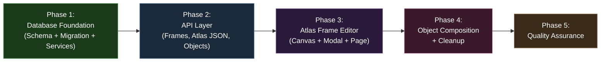
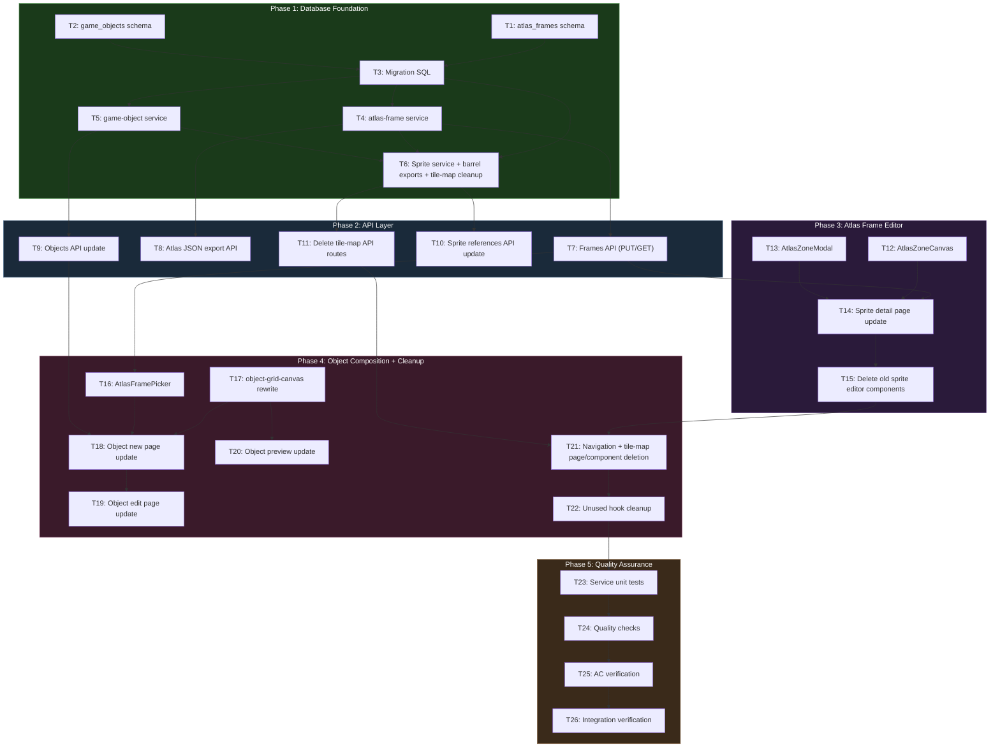

# Work Plan: Texture Atlas Refactor Implementation

Created Date: 2026-02-18
Completed Date: 2026-02-19
Status: COMPLETED
Type: refactor
Estimated Duration: 5-7 days
Estimated Impact: ~40 files (8 new, 12 modified, ~20 deleted)
Related Issue/PR: Design-009 / ADR-0007

## Related Documents

- Design Doc: [docs/design/design-009-texture-atlas-refactor.md](../design/design-009-texture-atlas-refactor.md)
- ADR: [docs/adr/ADR-0007-sprite-management-storage-and-schema.md](../adr/ADR-0007-sprite-management-storage-and-schema.md)
- Previous Plan (superseded): [docs/plans/sprite-management-plan.md](../plans/sprite-management-plan.md)

## Objective

Refactor the genmap sprite editor from tile-grid workflow to Phaser 3 Texture Atlas workflow. Replace fixed-size tile selection with free-form rectangular zone drawing, introduce the `atlas_frames` table with full Phaser 3 atlas properties, drop the `tile_maps` and `tile_map_groups` tables, and rebuild `game_objects` to compose objects from atlas frame layers with pixel-offset positioning.

## Background

The current tile-grid workflow forces sprite regions into fixed-size grid cells (e.g., 16x16, 32x32). This cannot represent arbitrarily-sized sprite frames needed for Phaser 3 texture atlases, where frames have variable dimensions, pivot points, trim data, and custom metadata. The tile-map concept is an intermediate step that does not map to Phaser's atlas format. This is a clean destructive refactor -- no data preservation is needed.

## Phase Structure Diagram

## Task Dependency Diagram

## Risks and Countermeasures

### Technical Risks

- **Risk**: Destructive migration cannot be rolled back -- all tile map and game object data lost
  - **Impact**: Low (no valuable data exists yet -- internal tool in early development)
  - **Detection**: Migration runs at Phase 1 start
  - **Countermeasure**: Explicitly confirmed: no data preservation needed. Backup database before migration if desired.

- **Risk**: Free-form rectangle drawing introduces pixel-precision coordinate math vs tile-snapped
  - **Impact**: Medium -- may require iteration on canvas UX for overlapping zones
  - **Detection**: Manual testing during Phase 3 (T12, T14)
  - **Countermeasure**: Start with simple single-rectangle draw; use smallest-area selection for overlapping zones. Iterate on UX based on usage.

- **Risk**: Object composition complexity increases (pixel offsets vs tile grid)
  - **Impact**: Medium -- layer dragging and z-ordering are new interaction patterns
  - **Detection**: Manual testing during Phase 4 (T17, T18)
  - **Countermeasure**: Keep layer interaction simple (click to select, drag to reposition). Use layerOrder integer for z-index.

- **Risk**: Batch save with 100+ frames may cause slow transactions
  - **Impact**: Low -- internal single-user tool
  - **Detection**: Manual testing with large frame counts during Phase 3
  - **Countermeasure**: Use single transaction with bulk insert. Delete-then-insert pattern keeps query plan simple.

### Schedule Risks

- **Risk**: Canvas component rewrite (AtlasZoneCanvas) more complex than estimated
  - **Impact**: Medium -- delays Phase 3
  - **Countermeasure**: Adapt coordinate handling patterns from existing `sprite-grid-canvas.tsx` (468 lines). Core change is pixel vs grid coordinates.

- **Risk**: Stale frame references in game_objects.layers JSONB after frame deletion
  - **Impact**: Low -- same pattern as existing stale sprite references
  - **Countermeasure**: Application-level handling (same approach as current codebase). Object preview shows placeholder for missing frames.

## Implementation Phases

### Phase 1: Database Foundation (Estimated commits: 3-4)

**Purpose**: Establish all database infrastructure: new `atlas_frames` table, recreated `game_objects` table, migration SQL, CRUD services, and updated barrel exports. After this phase, all API routes have their data layer ready.

#### Tasks

- [ ] **T1: Create atlas_frames schema file** (`packages/db/src/schema/atlas-frames.ts`)
  - **Description**: Define `atlasFrames` pgTable with all Phaser 3 atlas frame columns as typed fields: `id` (UUID PK), `spriteId` (UUID FK to sprites, cascade delete), `filename` (varchar 255), `frameX/Y/W/H` (integer), `rotated` (boolean), `trimmed` (boolean), `spriteSourceSizeX/Y/W/H` (integer), `sourceSizeW/H` (integer), `pivotX/Y` (real), `customData` (jsonb), `createdAt/updatedAt` (timestamp). Add composite unique constraint on `(spriteId, filename)`. Define `atlasFramesRelations` for sprite relation. Export `AtlasFrame` and `NewAtlasFrame` inferred types.
  - **Files**: Create `packages/db/src/schema/atlas-frames.ts`
  - **Dependencies**: None
  - **Complexity**: Medium -- 17 columns, FK constraint, composite unique constraint, relations
  - **AC**: FR2 (frame properties stored), FR3 (customData JSONB), FR4 (filename uniqueness per sprite)
  - **Pattern reference**: Follow existing `packages/db/src/schema/sprites.ts` for pgTable, UUID PK, timestamp patterns. Schema code provided in Design Doc Section "Database Schema Design".

- [x] **T2: Rewrite game_objects schema file** (`packages/db/src/schema/game-objects.ts`)
  - **Description**: Replace existing game_objects schema with new structure: `id` (UUID PK), `name` (varchar 255), `description` (text, nullable), `layers` (jsonb, not null -- GameObjectLayer[]), `tags` (jsonb, nullable), `metadata` (jsonb, nullable), `createdAt/updatedAt` (timestamp). Remove `widthTiles`, `heightTiles`, and `tiles` columns. Export `GameObject` and `NewGameObject` types.
  - **Files**: Rewrite `packages/db/src/schema/game-objects.ts`
  - **Dependencies**: None
  - **Complexity**: Simple -- fewer columns than current schema
  - **AC**: FR8 (layers JSONB with frameId, spriteId, xOffset, yOffset, layerOrder)
  - **Pattern reference**: Schema code provided in Design Doc Section "Database Schema Design".

- [ ] **T3: Create migration SQL and update schema barrel exports** (`packages/db/src/migrations/`, `packages/db/src/schema/index.ts`)
  - **Description**: (a) Write migration SQL `0004_texture_atlas_refactor.sql`: DROP TABLE `tile_maps` CASCADE, DROP TABLE `tile_map_groups` CASCADE, DROP TABLE `game_objects` CASCADE; CREATE TABLE `atlas_frames` with all columns and constraints; CREATE TABLE `game_objects` with new structure. (b) Update `packages/db/src/schema/index.ts`: remove exports for `tile-maps` and `tile-map-groups`, add export for `atlas-frames`, keep `game-objects` export. (c) Delete schema files: `packages/db/src/schema/tile-maps.ts`, `packages/db/src/schema/tile-map-groups.ts`. (d) Run `pnpm drizzle-kit generate` or manually apply migration.
  - **Files**: Create `packages/db/src/migrations/0004_texture_atlas_refactor.sql`; Modify `packages/db/src/schema/index.ts`; Delete `packages/db/src/schema/tile-maps.ts`, `packages/db/src/schema/tile-map-groups.ts`
  - **Dependencies**: T1, T2
  - **Complexity**: Medium -- destructive migration, must verify correct SQL
  - **AC**: FR10 (tile_maps and tile_map_groups tables dropped), FR2/FR8 (new tables created)

- [ ] **T4: Create atlas-frame service** (`packages/db/src/services/atlas-frame.ts`)
  - **Description**: Implement service functions following DrizzleClient-first-param convention: `batchSaveFrames(db, spriteId, frames[])` -- delete existing frames for sprite then bulk insert within a transaction; `getFramesBySprite(db, spriteId)` -- return all frames ordered by filename; `countFramesBySprite(db, spriteId)` -- return count; `deleteFramesBySprite(db, spriteId)` -- delete all frames for sprite. Export type interfaces.
  - **Files**: Create `packages/db/src/services/atlas-frame.ts`
  - **Dependencies**: T3 (migration applied, schema available)
  - **Complexity**: Medium -- transaction handling for batch save, bulk insert
  - **AC**: FR5 (batch save atomically), FR4 (uniqueness enforced via DB constraint)
  - **Pattern reference**: Follow `packages/db/src/services/sprite.ts` for service function patterns.

- [ ] **T5: Rewrite game-object service** (`packages/db/src/services/game-object.ts`)
  - **Description**: Rewrite for new layer schema. Update `createGameObject(db, data)` and `updateGameObject(db, id, data)` to accept `layers: GameObjectLayer[]` instead of `tiles`. Replace `validateTileReferences(db, tiles)` with `validateFrameReferences(db, layers)` -- extract unique frameIds from layers array, query `atlas_frames` table, return any IDs that do not exist. Update `findGameObjectsReferencingSprite(db, spriteId)` to query new layers JSONB structure (search for `spriteId` within layers array). Keep `getGameObject`, `listGameObjects`, `deleteGameObject` with minimal changes.
  - **Files**: Rewrite `packages/db/src/services/game-object.ts`
  - **Dependencies**: T3 (migration applied)
  - **Complexity**: Medium -- JSONB query changes, new validation logic
  - **AC**: FR8 (layers saved correctly), FR8 (frame reference validation)
  - **Pattern reference**: Interface definitions in Design Doc Section "Contract Definitions".

- [ ] **T6: Update sprite service, delete tile-map service, update DB barrel exports**
  - **Description**: (a) Modify `packages/db/src/services/sprite.ts`: replace `countTileMapsBySprite` with `countFramesBySprite` (query `atlasFrames` instead of `tileMaps`); update `findGameObjectsReferencingSprite` to query new layers JSONB structure. (b) Delete `packages/db/src/services/tile-map.ts` entirely. (c) Delete `packages/db/src/services/tile-map.spec.ts` entirely. (d) Update `packages/db/src/index.ts`: remove all tile-map service exports, add atlas-frame service exports (`batchSaveFrames`, `getFramesBySprite`, `countFramesBySprite`, `deleteFramesBySprite`), update game-object service exports (`validateFrameReferences` replaces `validateTileReferences`, update type exports).
  - **Files**: Modify `packages/db/src/services/sprite.ts`; Delete `packages/db/src/services/tile-map.ts`, `packages/db/src/services/tile-map.spec.ts`; Modify `packages/db/src/index.ts`
  - **Dependencies**: T4, T5
  - **Complexity**: Medium -- multiple file changes, must ensure all imports resolve
  - **AC**: FR10 (tile-map service removed)

- [ ] Quality check: `pnpm nx typecheck db` passes
- [ ] Quality check: `pnpm nx lint db` passes

#### Phase Completion Criteria

- [ ] `atlas_frames` schema created with 17 columns, FK to sprites (cascade), composite unique on (spriteId, filename)
- [ ] `game_objects` schema rewritten with layers JSONB instead of tiles, no widthTiles/heightTiles
- [ ] Migration SQL drops `tile_maps`, `tile_map_groups`, old `game_objects`; creates `atlas_frames` and new `game_objects`
- [ ] `tile-maps.ts` and `tile-map-groups.ts` schema files deleted
- [ ] `atlas-frame` service created with batchSaveFrames, getFramesBySprite, countFramesBySprite, deleteFramesBySprite
- [ ] `game-object` service rewritten with validateFrameReferences, layers JSONB handling
- [ ] `sprite` service updated (countFramesBySprite, updated JSONB queries)
- [ ] `tile-map` service and spec files deleted
- [ ] `packages/db/src/index.ts` exports updated (no tile-map references, atlas-frame exports added)
- [ ] `pnpm nx typecheck db` passes
- [ ] `pnpm nx lint db` passes

#### Operational Verification Procedures

1. Run `pnpm nx typecheck db` -- verify zero type errors
2. Run `pnpm nx lint db` -- verify zero lint errors
3. Verify migration applies: run migration SQL, confirm `atlas_frames` and `game_objects` tables exist, confirm `tile_maps` and `tile_map_groups` tables are gone
4. Verify FK cascade: delete a sprite row -- associated `atlas_frames` rows should be removed (Integration Point 4 from Design Doc)
5. Verify unique constraint: attempt to insert two `atlas_frames` rows with same `(sprite_id, filename)` -- should fail
6. Verify imports: `import { batchSaveFrames, getFramesBySprite, validateFrameReferences } from '@nookstead/db'` resolves
7. Verify no dead imports: `import { createTileMap } from '@nookstead/db'` should cause compilation error

---

### Phase 2: API Layer (Estimated commits: 3-4)

**Purpose**: Create new API routes for atlas frame management and atlas JSON export, update object API routes for the new layer schema, and remove all tile-map API routes. After this phase, the full REST API surface is functional for the new workflow.

#### Tasks

- [x] **T7: Create frames API route (PUT/GET)** (`apps/genmap/src/app/api/sprites/[id]/frames/route.ts`)
  - **Description**: Implement PUT handler: validate sprite exists, validate frames array (non-empty filenames, unique filenames within request, frame rect within sprite dimensions, pivot values 0-1), populate defaults for optional fields (rotated, trimmed, spriteSourceSize, sourceSize, pivot), call `batchSaveFrames(db, spriteId, normalizedFrames)`, return saved frames. Implement GET handler: validate sprite exists, call `getFramesBySprite(db, spriteId)`, return frames array. Empty frames array for PUT clears all frames.
  - **Files**: Create `apps/genmap/src/app/api/sprites/[id]/frames/route.ts`
  - **Dependencies**: T4 (atlas-frame service)
  - **Complexity**: Medium -- input validation, default population, error handling
  - **AC**: FR1 (zone creation persisted), FR4 (duplicate filename rejection), FR5 (batch save atomic)
  - **Pattern reference**: Full API implementation in Design Doc Section "API Design".

- [x] **T8: Create atlas JSON export route (GET)** (`apps/genmap/src/app/api/sprites/[id]/atlas.json/route.ts`)
  - **Description**: Implement GET handler: validate sprite exists, get signed sprite URL via `withSignedUrl`, get frames via `getFramesBySprite`, transform to Phaser 3 JSON Array format with `frames` array and `meta` section. Return JSON response. Empty frames array returns valid JSON with empty frames.
  - **Files**: Create `apps/genmap/src/app/api/sprites/[id]/atlas.json/route.ts`
  - **Dependencies**: T4 (atlas-frame service)
  - **Complexity**: Simple -- data transformation
  - **AC**: FR7 (valid Phaser 3 JSON Array format, meta section with image URL and size)
  - **Pattern reference**: Full implementation in Design Doc Section "API Design".

- [ ] **T9: Update objects API routes for new layer schema** (`apps/genmap/src/app/api/objects/route.ts`, `apps/genmap/src/app/api/objects/[id]/route.ts`)
  - **Description**: Update POST /api/objects handler: accept `{name, description?, layers, tags?, metadata?}` instead of tiles/widthTiles/heightTiles. Validate layers array. Call `validateFrameReferences(db, layers)` if layers non-empty. Call `createGameObject(db, data)` with new data shape. Update PATCH /api/objects/:id handler similarly: accept layers instead of tiles. Remove dimension-related validation. Keep GET and DELETE handlers with minimal changes.
  - **Files**: Modify `apps/genmap/src/app/api/objects/route.ts`, `apps/genmap/src/app/api/objects/[id]/route.ts`
  - **Dependencies**: T5 (game-object service with new layer schema)
  - **Complexity**: Medium -- interface changes across two route files
  - **AC**: FR8 (objects composed from frame layers, pixel offsets stored)

- [ ] **T10: Update sprite references API route** (`apps/genmap/src/app/api/sprites/[id]/references/route.ts`)
  - **Description**: Update GET handler to return `{frameCount, affectedObjects}` instead of `{tileMapCount, affectedObjects}`. Call `countFramesBySprite` (replacing `countTileMapsBySprite`). Keep `findGameObjectsReferencingSprite` call (already updated in T6).
  - **Files**: Modify `apps/genmap/src/app/api/sprites/[id]/references/route.ts`
  - **Dependencies**: T6 (sprite service updated)
  - **Complexity**: Simple -- function name and response key changes

- [ ] **T11: Delete all tile-map and tile-map-group API routes**
  - **Description**: Delete entire API route directories and files: `apps/genmap/src/app/api/tile-maps/route.ts`, `apps/genmap/src/app/api/tile-maps/[id]/route.ts`, `apps/genmap/src/app/api/tile-map-groups/route.ts`, `apps/genmap/src/app/api/tile-map-groups/[id]/route.ts`, `apps/genmap/src/app/api/sprites/[id]/tile-maps/route.ts`. Remove the directory structure for `tile-maps/` and `tile-map-groups/` under the API path.
  - **Files**: Delete `apps/genmap/src/app/api/tile-maps/` (directory), `apps/genmap/src/app/api/tile-map-groups/` (directory), `apps/genmap/src/app/api/sprites/[id]/tile-maps/` (directory)
  - **Dependencies**: T6 (tile-map service already deleted)
  - **Complexity**: Simple -- file deletion
  - **AC**: FR10 (no tile-map API routes exist)

- [ ] Quality check: `pnpm nx typecheck genmap` passes
- [ ] Quality check: `pnpm nx lint genmap` passes

#### Phase Completion Criteria

- [ ] PUT /api/sprites/[id]/frames saves frames atomically, returns saved frames
- [ ] GET /api/sprites/[id]/frames returns all frames for a sprite
- [ ] PUT with empty array clears all frames for a sprite
- [ ] PUT with duplicate filenames returns 400 error
- [ ] PUT with frame extending beyond sprite returns 400 error
- [ ] GET /api/sprites/[id]/atlas.json returns valid Phaser 3 JSON Array format
- [ ] POST /api/objects accepts layers instead of tiles
- [ ] POST /api/objects with invalid frameIds returns 400 error
- [ ] GET /api/sprites/[id]/references returns frameCount instead of tileMapCount
- [ ] All tile-map and tile-map-group API routes deleted
- [ ] `pnpm nx typecheck genmap` passes
- [ ] `pnpm nx lint genmap` passes

#### Operational Verification Procedures

1. **Integration Point 1 (API portion)**: PUT frames for a sprite, then GET frames -- verify data round-trip matches
2. **Integration Point 2**: PUT frames, then GET atlas.json -- verify valid Phaser 3 JSON with correct frame data and meta section
3. PUT frames with duplicate filenames -- verify 400 error "Frame filenames must be unique within a sprite"
4. PUT frames where frame rect extends beyond sprite bounds -- verify 400 error
5. PUT empty frames array -- verify GET returns empty array
6. POST /api/objects with invalid frameIds -- verify 400 with invalidFrameIds list
7. GET /api/sprites/[id]/references -- verify frameCount returned
8. Verify all tile-map URLs return 404: GET /api/tile-maps, GET /api/tile-map-groups

---

### Phase 3: Atlas Frame Editor UI (Estimated commits: 3-4)

**Purpose**: Replace the tile-grid sprite editor with the new atlas zone editor. Users can draw free-form rectangular zones on sprite images, edit frame properties via a floating modal, and batch-save all frames. After this phase, the atlas frame creation workflow is fully functional.

#### Tasks

- [x] **T12: Create AtlasZoneCanvas component** (`apps/genmap/src/components/atlas-zone-canvas.tsx`)
  - **Description**: Create an HTML5 Canvas component that renders a sprite image with zone overlays and supports free-form rectangle drawing. Props: `imageUrl`, `zones[]`, `onZoneCreate(rect)`, `onZoneClick(index)`, `background`. Rendering layers: (1) background (checkerboard/solid via canvas-utils), (2) sprite image via `drawImage()`, (3) existing zone overlays as colored rectangles with filename labels, (4) active drag rectangle (dashed outline during creation), (5) hover highlight on zones. Use pixel coordinates (not grid-snapped). Click detection: when zones overlap, select the zone with smallest area at click point. Escape cancels active drag. Uses `requestAnimationFrame` for rendering loop. Mark component with `'use client'` directive.
  - **Files**: Create `apps/genmap/src/components/atlas-zone-canvas.tsx`
  - **Dependencies**: None (can build against mock data)
  - **Complexity**: Complex -- Canvas 2D API, pixel coordinate math, zone overlap handling, event handling
  - **AC**: FR1 (draw rectangles, cancel with Escape, display zone overlays), FR6 (click zone opens modal)
  - **Pattern reference**: Adapt rendering loop pattern from existing `sprite-grid-canvas.tsx` (468 lines).

- [x] **T13: Create AtlasZoneModal component** (`apps/genmap/src/components/atlas-zone-modal.tsx`)
  - **Description**: Create a floating card/popover that displays editable frame properties. Props: `frame`, `onUpdate(frame)`, `onDelete()`, `onClose()`, `position: {x, y}`. Fields: filename (text input), frame rect (read-only x, y, w, h), rotated (checkbox), trimmed (checkbox), spriteSourceSize (4 integer inputs), sourceSize (2 integer inputs), pivot (2 decimal inputs, 0-1 range), passable (checkbox -> customData.passable), collisionRect (4 integer inputs -> customData.collisionRect), additional customData key-value pairs. Delete button removes the zone. Mark with `'use client'` directive. Use shadcn/ui Card or similar components.
  - **Files**: Create `apps/genmap/src/components/atlas-zone-modal.tsx`
  - **Dependencies**: None (standalone component)
  - **Complexity**: Medium -- many form fields, customData serialization
  - **AC**: FR2 (editable frame properties), FR3 (passable checkbox, collisionRect inputs), FR6 (modal with delete)

- [x] **T14: Update sprite detail page for atlas editor** (`apps/genmap/src/app/sprites/[id]/page.tsx`)
  - **Description**: Replace the existing tile-map editor UI with the atlas zone editor. Remove tile size selector, tile-map overlay legend, floating save panel, tile-map save logic. Add: (1) Load existing frames via GET /api/sprites/[id]/frames on page load. (2) Integrate AtlasZoneCanvas with frames state. (3) On zone create, add new frame to local state with auto-populated defaults (frame rect from drawn coordinates, default rotated/trimmed/pivot values per Design Doc). (4) On zone click, open AtlasZoneModal. (5) "Save All Frames" button that PUTs all frames to /api/sprites/[id]/frames. (6) Display frame count. Reuse existing presigned URL pattern for sprite image loading.
  - **Files**: Rewrite `apps/genmap/src/app/sprites/[id]/page.tsx`
  - **Dependencies**: T7 (frames API), T12 (AtlasZoneCanvas), T13 (AtlasZoneModal)
  - **Complexity**: Complex -- state management for frames array, integration of multiple components, save flow
  - **AC**: FR1 (draw zones persisted), FR2 (default values auto-populated), FR5 (batch save), FR6 (click zone opens modal)

- [ ] **T15: Delete replaced sprite editor components**
  - **Description**: Delete components that are replaced by the new atlas editor: `sprite-grid-canvas.tsx` (replaced by atlas-zone-canvas.tsx), `tile-size-selector.tsx` (no longer needed -- no fixed tile sizes), `tile-map-overlay-legend.tsx` (replaced by zone overlays on canvas), `floating-save-panel.tsx` (replaced by integrated save button). Verify no remaining imports reference these deleted files.
  - **Files**: Delete `apps/genmap/src/components/sprite-grid-canvas.tsx`, `apps/genmap/src/components/tile-size-selector.tsx`, `apps/genmap/src/components/tile-map-overlay-legend.tsx`, `apps/genmap/src/components/floating-save-panel.tsx`
  - **Dependencies**: T14 (sprite detail page no longer imports old components)
  - **Complexity**: Simple -- file deletion and import verification
  - **AC**: FR10 (old tile-grid components removed)

- [ ] Quality check: `pnpm nx typecheck genmap` passes
- [ ] Quality check: `pnpm nx lint genmap` passes

#### Phase Completion Criteria

- [ ] Drawing a rectangle on the sprite image creates a new frame zone
- [ ] Zone overlays display with colored rectangles and filename labels
- [ ] Clicking a zone opens the floating modal with editable properties
- [ ] Modal allows editing filename, pivot, rotated, trimmed, customData (passable, collisionRect)
- [ ] Delete button in modal removes the zone
- [ ] Escape cancels active drag during zone creation
- [ ] "Save All Frames" sends all frames via PUT, persists atomically
- [ ] Page reload after save shows previously saved zones
- [ ] Old sprite editor components deleted (sprite-grid-canvas, tile-size-selector, overlay legend, floating save panel)
- [ ] `pnpm nx typecheck genmap` passes
- [ ] `pnpm nx lint genmap` passes

#### Operational Verification Procedures

1. **Integration Point 1 (Full round-trip)**: Navigate to sprite detail -> draw 3 zones -> set filenames -> save -> reload page -> verify all 3 zones display with correct positions and filenames
2. Click on a zone -> verify modal opens near click point with correct frame data
3. Edit filename in modal -> save -> reload -> verify filename persisted
4. Toggle passable checkbox -> save -> verify customData.passable stored correctly
5. Set collisionRect values -> save -> verify customData.collisionRect stored
6. Delete a zone via modal -> save -> verify zone removed
7. Start drawing a zone -> press Escape -> verify zone creation cancelled
8. Draw overlapping zones -> click in overlap area -> verify smallest-area zone selected
9. Save frames -> GET /api/sprites/[id]/atlas.json -> verify Phaser 3 format output

---

### Phase 4: Object Composition + Cleanup (Estimated commits: 4-5)

**Purpose**: Replace the tile-grid object editor with frame-layer composition, create the frame picker sidebar, update all object-related pages, and clean up all remaining tile-map code (pages, components, hooks). After this phase, the refactor is functionally complete.

#### Tasks

- [x] **T16: Create AtlasFramePicker component** (`apps/genmap/src/components/atlas-frame-picker.tsx`)
  - **Description**: Create a sidebar panel for the object editor that displays available atlas frames grouped by sprite. Fetches all sprites that have frames (GET /api/sprites, then GET /api/sprites/[id]/frames for expanded sprites). Expandable sprite sections showing frame thumbnails rendered via canvas (drawing the frame region from the sprite image). Clicking a thumbnail sets it as the active frame for layer placement. Props: `activeFrame`, `onFrameSelect(frame)`. Highlight active frame. Mark with `'use client'` directive.
  - **Files**: Create `apps/genmap/src/components/atlas-frame-picker.tsx`
  - **Dependencies**: T7 (frames API for fetching frame data)
  - **Complexity**: Complex -- expandable panels, sprite image loading, sub-region canvas rendering for thumbnails
  - **AC**: FR9 (sprites with frames listed, expandable, thumbnail previews, click to select)

- [x] **T17: Rewrite object-grid-canvas for frame-layer composition** (`apps/genmap/src/components/object-grid-canvas.tsx`)
  - **Description**: Replace tile-grid placement with frame-layer composition canvas. Remove grid-based interaction. Rendering layers: (1) background, (2) composited frame layers at their (xOffset, yOffset) positions with z-ordering by layerOrder, (3) selection highlight on active layer, (4) drag handles for repositioning. Interaction: click to select a layer, drag to reposition (updates xOffset/yOffset), click with active frame to add new layer at (0,0). Maintain `Map<string, HTMLImageElement>` cache for sprite images. Props: `layers[]`, `onLayerAdd(frame)`, `onLayerUpdate(index, layer)`, `onLayerSelect(index)`, `activeFrame`. Mark with `'use client'` directive.
  - **Files**: Rewrite `apps/genmap/src/components/object-grid-canvas.tsx`
  - **Dependencies**: None (standalone rewrite)
  - **Complexity**: Complex -- layer compositing, drag interaction, z-ordering, image caching
  - **AC**: FR8 (layers composited with correct offsets and z-ordering, draggable, reorderable)

- [x] **T18: Update object new page for frame-layer composition** (`apps/genmap/src/app/objects/new/page.tsx`)
  - **Description**: Replace tile-picker + tile-grid workflow with frame-picker + layer-canvas workflow. Remove dimension inputs (widthTiles, heightTiles) -- objects are now defined by their layers, not a fixed grid. Layout: AtlasFramePicker sidebar + ObjectLayerCanvas center + metadata form. Select frame from picker, add as layer on canvas, drag to position, reorder layers. Save sends `{name, description, layers, tags, metadata}` to POST /api/objects.
  - **Files**: Rewrite `apps/genmap/src/app/objects/new/page.tsx`
  - **Dependencies**: T16 (AtlasFramePicker), T17 (object-grid-canvas), T9 (objects API accepts layers)
  - **Complexity**: Medium -- component integration, state management for layers array
  - **AC**: FR8 (create objects with frame layers), FR9 (use frame picker)

- [x] **T19: Update object edit page for frame-layer composition** (`apps/genmap/src/app/objects/[id]/page.tsx`)
  - **Description**: Mirror the new page structure from T18 for the edit page. Load existing object via GET /api/objects/[id], populate layers on canvas, allow adding/removing/repositioning layers. Save sends PATCH /api/objects/[id] with updated layers. Remove dimension resize logic (no longer applicable).
  - **Files**: Rewrite `apps/genmap/src/app/objects/[id]/page.tsx`
  - **Dependencies**: T18 (new page provides reusable patterns)
  - **Complexity**: Medium -- pre-populating layers from existing data
  - **AC**: FR8 (edit objects with frame layers)

- [x] **T20: Update object preview component** (`apps/genmap/src/components/object-preview.tsx`)
  - **Description**: Update the read-only preview component to composite frame layers instead of tile grid. Load sprite images for each unique spriteId in layers, draw frame regions at their (xOffset, yOffset) positions ordered by layerOrder. Missing frames (stale references) render as colored placeholder with "missing" indicator.
  - **Files**: Modify `apps/genmap/src/components/object-preview.tsx`
  - **Dependencies**: T17 (object-grid-canvas patterns can be shared)
  - **Complexity**: Medium -- multi-sprite image compositing, placeholder rendering
  - **AC**: FR8 (preview renders composited layers)

- [ ] **T21: Update navigation and delete all tile-map UI code**
  - **Description**: (a) Update `navigation.tsx`: remove `{ href: '/tile-maps', label: 'Tile Maps' }` from navItems array. (b) Delete tile-map pages: `apps/genmap/src/app/tile-maps/page.tsx`, `apps/genmap/src/app/tile-maps/[id]/page.tsx`, and the `tile-maps/` directory. (c) Delete tile-map components: `tile-picker.tsx`, `group-selector.tsx`, `group-manager.tsx`, `tile-map-card.tsx`. (d) Verify no remaining imports reference deleted files.
  - **Files**: Modify `apps/genmap/src/components/navigation.tsx`; Delete `apps/genmap/src/app/tile-maps/` (directory), `apps/genmap/src/components/tile-picker.tsx`, `apps/genmap/src/components/group-selector.tsx`, `apps/genmap/src/components/group-manager.tsx`, `apps/genmap/src/components/tile-map-card.tsx`
  - **Dependencies**: T15 (old sprite editor components already deleted), T11 (tile-map API routes already deleted)
  - **Complexity**: Simple -- deletion and one line removal
  - **AC**: FR10 (navigation has no Tile Maps link, no tile-map UI pages exist)

- [ ] **T22: Clean up unused hooks and utilities**
  - **Description**: Review and clean up hooks that are no longer needed after the refactor: (a) `use-marquee-selection.ts` -- was grid-snapped, may be unused now. If AtlasZoneCanvas has its own rectangle drawing logic, delete this hook. (b) `use-floating-panel.ts` -- was used by `floating-save-panel.tsx` (deleted in T15). If nothing else imports it, delete. (c) Review `canvas-utils.ts` for any tile-specific helpers that should be removed or updated. (d) Verify no dead imports remain across the codebase.
  - **Files**: Potentially delete `apps/genmap/src/hooks/use-marquee-selection.ts`, `apps/genmap/src/hooks/use-floating-panel.ts`; Potentially modify `apps/genmap/src/lib/canvas-utils.ts`
  - **Dependencies**: T21 (all tile-map code deleted, can verify what is unused)
  - **Complexity**: Simple -- import analysis and deletion
  - **AC**: No dead code remains

- [ ] Quality check: `pnpm nx typecheck genmap` passes
- [ ] Quality check: `pnpm nx lint genmap` passes

#### Phase Completion Criteria

- [ ] AtlasFramePicker displays sprites with frames, expandable with frame thumbnails
- [ ] Clicking a frame in picker sets it as active for layer placement
- [ ] Object canvas composites frame layers at correct pixel offsets with z-ordering
- [ ] Layers can be dragged to reposition on the canvas
- [ ] Object new page creates objects with frame layers via POST
- [ ] Object edit page loads existing layers and allows editing via PATCH
- [x] Object preview composites layers correctly
- [ ] Navigation no longer shows "Tile Maps" link
- [ ] All tile-map pages deleted (tile-maps/page.tsx, tile-maps/[id]/page.tsx)
- [ ] All tile-map components deleted (tile-picker, group-selector, group-manager, tile-map-card)
- [ ] Unused hooks deleted (use-marquee-selection, use-floating-panel if unused)
- [ ] `pnpm nx typecheck genmap` passes
- [ ] `pnpm nx lint genmap` passes

#### Operational Verification Procedures

1. **Integration Point 3 (Object composition round-trip)**: Open object editor -> expand sprite in picker -> click frame thumbnail -> frame appears as layer on canvas -> drag to reposition -> save -> reload -> verify layers persist with correct positions
2. Frame picker: verify only sprites with at least one frame appear
3. Frame picker: expand sprite -> verify frame thumbnails render correct sprite sub-regions
4. Object canvas: add 3 layers -> reorder -> verify z-ordering renders correctly
5. Object canvas: drag layer -> verify xOffset/yOffset update
6. Object edit: load existing object -> verify layers display at saved positions
7. Object preview on list page: verify composited layer preview renders
8. Navigation: verify only "Sprites" and "Objects" links present (no "Tile Maps")
9. Navigate to `/tile-maps` -> verify 404 (page deleted)
10. Search codebase for "tileMaps", "tileMapGroups", "tile-map", "TilePicker" -- verify no references remain in production code

---

### Phase 5: Quality Assurance (Required) (Estimated commits: 1-2)

**Purpose**: Write and update unit tests for all modified services, run comprehensive quality checks, verify all Design Doc acceptance criteria, and perform final integration verification.

#### Tasks

- [ ] **T23: Write and update service unit tests**
  - **Description**: (a) Create `packages/db/src/services/atlas-frame.spec.ts` with tests for: `batchSaveFrames` creates frames atomically, `batchSaveFrames` replaces existing frames (delete + insert), `batchSaveFrames` rejects duplicate filenames (unique constraint violation), `getFramesBySprite` returns all frames ordered by filename, `countFramesBySprite` returns correct count, `deleteFramesBySprite` removes all frames. (b) Update `packages/db/src/services/game-object.spec.ts`: replace tile-based tests with layer-based tests. Test `createGameObject` saves layers JSONB correctly, `validateFrameReferences` detects invalid frame IDs, `findGameObjectsReferencingSprite` queries layers JSONB correctly. (c) Update `packages/db/src/services/sprite.spec.ts`: replace `countTileMapsBySprite` tests with `countFramesBySprite` tests.
  - **Files**: Create `packages/db/src/services/atlas-frame.spec.ts`; Update `packages/db/src/services/game-object.spec.ts`; Update `packages/db/src/services/sprite.spec.ts`
  - **Dependencies**: T22 (all implementation complete)
  - **Complexity**: Medium -- comprehensive test coverage for 3 services
  - **AC**: 80% coverage target for service functions; all tests pass; zero skipped tests

- [ ] **T24: Run quality checks (typecheck, lint, build)**
  - **Description**: Run comprehensive quality checks and fix any issues: `pnpm nx typecheck db`, `pnpm nx lint db`, `pnpm nx typecheck genmap`, `pnpm nx lint genmap`, `pnpm nx build genmap`, `pnpm nx build db`. Verify zero errors across all checks.
  - **Files**: Any files requiring fixes
  - **Dependencies**: T23 (tests written)
  - **Complexity**: Medium -- may require fixing issues found during checks
  - **AC**: All quality targets pass with zero errors

- [ ] **T25: Verify all Design Doc acceptance criteria**
  - **Description**: Systematically verify each AC from the Design Doc is satisfied. Walk through the AC checklist (FR1-FR10) and confirm each criterion is implemented and working. Document any gaps and resolve them.
  - **Dependencies**: T24 (quality checks pass)
  - **Complexity**: Simple -- verification checklist
  - **AC**: All FR1-FR10 acceptance criteria verified as implemented

- [ ] **T26: Final integration verification**
  - **Description**: Execute end-to-end workflows to verify all integration points function correctly: (1) Atlas frame round-trip: draw zones -> save -> reload -> verify persistence. (2) Atlas JSON export: save frames -> export JSON -> validate Phaser 3 format. (3) Object composition round-trip: select frames -> position layers -> save -> reload -> verify. (4) Sprite cascade: delete sprite -> verify frames deleted. (5) Navigation: verify only Sprites and Objects in nav. (6) Verify no tile-map references remain in codebase.
  - **Dependencies**: T25 (ACs verified)
  - **Complexity**: Simple -- manual walkthrough
  - **AC**: All 4 integration points from Design Doc verified

- [ ] All tests pass: `pnpm nx test db`
- [ ] Build succeeds: `pnpm nx build genmap && pnpm nx build db`
- [ ] Zero lint errors: `pnpm nx lint genmap && pnpm nx lint db`
- [ ] Zero type errors: `pnpm nx typecheck genmap && pnpm nx typecheck db`

#### Operational Verification Procedures

1. Run `pnpm nx test db` -- all service tests pass (atlas-frame, game-object, sprite)
2. Run `pnpm nx run-many -t lint typecheck build` on genmap and db -- all pass
3. **Integration Point 1**: Navigate to sprite -> draw 5 zones -> save -> reload -> all 5 zones display correctly
4. **Integration Point 2**: Save frames -> GET atlas.json -> validate JSON structure matches Phaser 3 format (frames array + meta section)
5. **Integration Point 3**: Create object with 3 frame layers -> save -> reload -> layers at correct positions
6. **Integration Point 4**: Delete sprite -> verify atlas_frames rows cascade-deleted
7. Navigation shows only Sprites and Objects
8. Search for "tileMaps", "tileMapGroups", "tile-map", "tile_maps" in production code -- zero results

---

## Quality Assurance Summary

- [ ] All staged quality checks completed (zero errors)
- [ ] All unit tests pass (atlas-frame, game-object, sprite services)
- [ ] Static analysis pass (typecheck across genmap and db packages)
- [ ] Lint pass (ESLint across genmap and db packages)
- [ ] Build success (genmap, db)
- [ ] Design Doc acceptance criteria satisfied (FR1 through FR10)

## Completion Criteria

- [ ] All phases completed (Phase 1 through Phase 5)
- [ ] Each phase's operational verification procedures executed
- [ ] Design Doc acceptance criteria satisfied (all ACs checked)
- [ ] Staged quality checks completed (zero errors)
- [ ] All tests pass
- [ ] `pnpm nx run-many -t lint typecheck build` passes for genmap and db
- [ ] No tile-map references remain in production code
- [ ] User review approval obtained

## AC-to-Task Traceability Matrix

| Acceptance Criteria | Tasks | Verification |
|---|---|---|
| FR1: Free-form rectangle zone drawing | T12, T14 | Draw rectangle on sprite -> zone created with correct coordinates |
| FR2: Phaser 3 frame properties | T1, T4, T13, T14 | Auto-populated defaults; editable via modal; stored as typed columns |
| FR3: Custom data (passable/collision) | T1, T13 | Toggle passable -> stored in customData; set collisionRect -> stored |
| FR4: Frame name uniqueness | T1, T7 | Duplicate filenames rejected at API (400) and DB (unique constraint) |
| FR5: Batch save | T4, T7, T14 | Save All Frames -> all frames persisted atomically; validation failure -> none saved |
| FR6: Zone click and modal | T12, T13, T14 | Click zone -> modal opens; edit properties; delete zone |
| FR7: Atlas JSON export | T8 | GET atlas.json -> valid Phaser 3 JSON Array; empty frames -> empty array |
| FR8: Object frame-layer composition | T2, T5, T9, T17, T18, T19 | Select frame -> add layer -> drag to position -> reorder -> save -> layers persist |
| FR9: Frame picker sidebar | T16, T18 | Sprites with frames listed; expand to see thumbnails; click to select |
| FR10: Remove tile maps | T3, T6, T11, T15, T21 | No tile-map tables, routes, services, pages, or nav links exist |

## Test Case Resolution Tracking

| Phase | Unit Tests | Integration Tests | Manual Verification |
|-------|-----------|-------------------|---------------------|
| Phase 1 | -- (services created, tested in Phase 5) | -- | Schema + migration verification (7 checks) |
| Phase 2 | -- | -- | API round-trip verification (8 checks) |
| Phase 3 | -- | -- | Atlas editor workflow (9 checks) |
| Phase 4 | -- | -- | Object composition + cleanup (10 checks) |
| Phase 5 | ~15 (atlas-frame: 6, game-object: 3, sprite: 2, existing: 4) | -- | Final integration (8 checks) |
| **Total** | **~15** | **--** | **42 manual checks** |

## Progress Tracking

### Phase 1: Database Foundation
- Start: YYYY-MM-DD HH:MM
- Complete: YYYY-MM-DD HH:MM
- Notes:

### Phase 2: API Layer
- Start: YYYY-MM-DD HH:MM
- Complete: YYYY-MM-DD HH:MM
- Notes:

### Phase 3: Atlas Frame Editor UI
- Start: YYYY-MM-DD HH:MM
- Complete: YYYY-MM-DD HH:MM
- Notes:

### Phase 4: Object Composition + Cleanup
- Start: YYYY-MM-DD HH:MM
- Complete: YYYY-MM-DD HH:MM
- Notes:

### Phase 5: Quality Assurance
- Start: YYYY-MM-DD HH:MM
- Complete: YYYY-MM-DD HH:MM
- Notes:

## Notes

- **Implementation strategy**: Vertical Slice (Feature-driven) per Design Doc. Each phase delivers the next functional layer of the atlas workflow.
- **Commit strategy**: Manual (user decides when to commit). Each task is designed as a logical 1-commit unit.
- **Test strategy**: Strategy B (Implementation-First). No test design information was provided. Unit tests for services are written in Phase 5 after implementation is complete. Canvas/UI components are verified via manual testing (Canvas testing with Jest is not practical).
- **Destructive migration**: The migration drops `tile_maps`, `tile_map_groups`, and old `game_objects` tables with no data preservation. This is irreversible by design. No existing data needs to be migrated.
- **No authentication**: Internal tool on trusted network. No login or session management needed.
- **Canvas components**: Both AtlasZoneCanvas and the rewritten object-grid-canvas use `requestAnimationFrame` rendering loops and `'use client'` directives, following existing patterns.
- **Previous plan superseded**: The sprite-management-plan.md Phase 3 (Tile Maps & Groups) and portions of Phase 4 (Object Assembly) are superseded by this refactor plan. Phases 1-2 of the previous plan are already implemented and remain valid.
