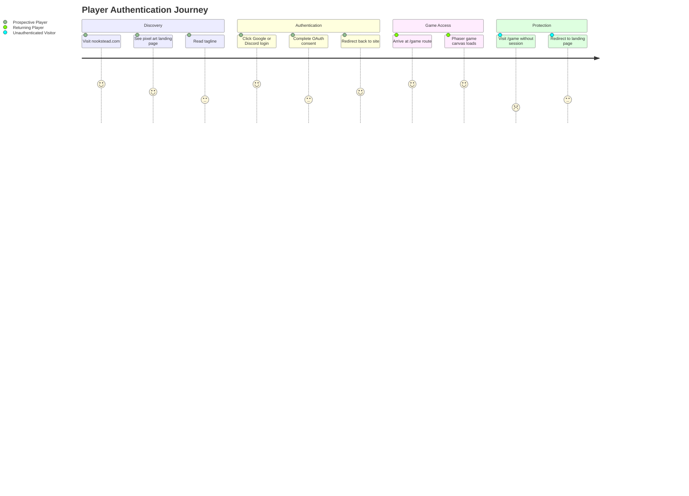
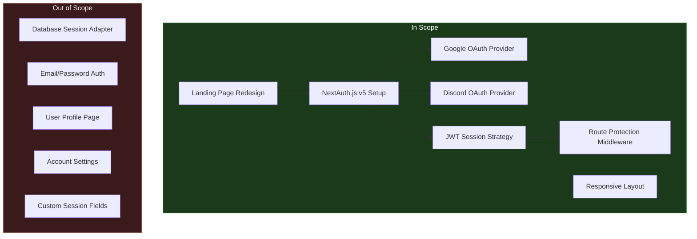

# PRD: Landing Page and Social Authentication

## Overview

### One-line Summary

Replace the default Nx welcome page with a pixel art themed landing page featuring Google and Discord OAuth login, enabling authenticated access to the game client.

### Background

Nookstead is a 2D pixel art MMO / life sim / farming RPG currently in early scaffolding. The existing landing page is the out-of-box Nx template, which provides no brand identity and no means for players to authenticate. Before gameplay features can be tested with real users, the project needs a branded entry point and an authentication layer that gates access to the `/game` route. Social login (Google and Discord) was chosen because these are the primary platforms where the target audience (indie game and MMO communities) already have accounts, reducing registration friction to a single click.

## User Stories

### Primary Users

| Persona | Description |
|---------|-------------|
| **Prospective Player** | A visitor arriving at the site for the first time who wants to learn what Nookstead is and sign in quickly. |
| **Returning Player** | A user who has previously authenticated and expects seamless re-entry to the game. |
| **Developer / Tester** | A team member who needs authenticated access to the `/game` route during development. |

### User Stories

```
As a prospective player
I want to see a visually appealing landing page that communicates the game's identity
So that I understand what Nookstead is before I commit to signing in.
```

```
As a prospective player
I want to sign in with my Google or Discord account in one click
So that I can start playing without creating a new username and password.
```

```
As a returning player
I want my session to persist across page reloads
So that I do not have to re-authenticate every visit.
```

```
As an unauthenticated visitor
I want to be redirected to the landing page if I try to access the game directly
So that I understand I need to sign in first.
```

### Use Cases

1. **First-time visit**: User lands on `/`, sees the Nookstead logo, tagline, and login buttons. They click "Sign in with Discord", complete the OAuth consent screen, and are redirected to `/game`.
2. **Return visit with active session**: User navigates to `/` or `/game`. Because a valid JWT session exists, they are taken (or can navigate) directly to `/game`.
3. **Deep link without session**: User clicks a shared link to `/game` but is not authenticated. The middleware redirects them to `/` where they see the login options.
4. **Session expiry**: A user's JWT expires. On next navigation to `/game`, they are redirected to `/` to re-authenticate.

## User Journey Diagram



## Scope Boundary Diagram



## Functional Requirements

### Must Have (MVP)

- [ ] **FR-1: Pixel art landing page at `/`**
  - CSS-based pixel art text logo displaying "NOOKSTEAD" using a pixel font (Press Start 2P or similar from Google Fonts)
  - Dark theme background consistent with the game's aesthetic
  - Short tagline below the logo conveying the game's genre
  - AC: Given a user visits `/`, when the page loads, then they see the pixel art logo, tagline, and login buttons rendered correctly on both mobile (360px+) and desktop viewports.

- [ ] **FR-2: Google OAuth login**
  - "Sign in with Google" button on the landing page
  - Clicking initiates the Google OAuth 2.0 flow via NextAuth.js v5
  - On success, user receives a JWT session and is redirected to `/game`
  - AC: Given an unauthenticated user clicks "Sign in with Google", when they complete the Google consent screen, then they are redirected to `/game` with a valid session cookie.

- [ ] **FR-3: Discord OAuth login**
  - "Sign in with Discord" button on the landing page
  - Clicking initiates the Discord OAuth flow via NextAuth.js v5
  - On success, user receives a JWT session and is redirected to `/game`
  - AC: Given an unauthenticated user clicks "Sign in with Discord", when they complete the Discord authorization, then they are redirected to `/game` with a valid session cookie.

- [ ] **FR-4: JWT-only session management**
  - NextAuth.js configured with `strategy: "jwt"` (no database adapter)
  - Session persists across page reloads via secure HTTP-only cookie
  - AC: Given an authenticated user refreshes the page, when the page reloads, then their session remains valid without re-authentication.

- [ ] **FR-5: Protected `/game` route**
  - Unauthenticated users visiting `/game` are redirected to `/`
  - Authenticated users can access `/game` without interruption
  - Must not break the existing Phaser.js dynamic import at `/game`
  - AC: Given an unauthenticated user navigates to `/game`, when the middleware evaluates the request, then the user is redirected to `/` with no errors in the console.

- [ ] **FR-6: Responsive design**
  - Landing page renders correctly on mobile devices (360px minimum width) and desktop
  - Login buttons are touch-friendly on mobile (minimum 44px tap target)
  - AC: Given a user on a 360px-wide viewport, when the landing page loads, then all elements are visible, readable, and interactive without horizontal scrolling.

### Should Have

- [ ] **FR-7: Authenticated user redirect from `/`**
  - When an already-authenticated user visits `/`, they can navigate to `/game` easily (e.g., via a "Play" button or automatic redirect)
  - AC: Given an authenticated user visits `/`, when the page loads, then a clear path to `/game` is presented.

### Could Have

- [ ] **FR-8: Sign-out functionality**
  - A sign-out option accessible from the `/game` route or navigation
  - Clears the JWT session and redirects to `/`
  - AC: Given an authenticated user clicks "Sign out", when the action completes, then the session is destroyed and the user is on `/`.

### Out of Scope

- **Database adapter / persistent sessions**: JWT-only strategy; no database storage of sessions. This simplifies infrastructure for the current stage.
- **Custom session fields beyond standard OAuth profile**: Standard `name`, `email`, `image` from the OAuth provider profile are sufficient.
- **Email/password authentication**: Social login only for MVP to reduce friction and avoid password management complexity.
- **User profile page**: No dedicated profile viewing or editing. Will be addressed in a future PRD.
- **Account settings**: No settings management (notification preferences, linked accounts, etc.).

## Non-Functional Requirements

### Performance

- **Landing page load time**: First Contentful Paint under 1.5 seconds on a 4G connection.
- **OAuth redirect latency**: Total round-trip (click to authenticated redirect) under 5 seconds, excluding time the user spends on the provider consent screen.
- **Bundle size impact**: Authentication library addition should not increase the game app JavaScript bundle by more than 50KB gzipped.

### Reliability

- **Session validity**: JWT tokens remain valid for 30 days (configurable) to minimize re-authentication.
- **Graceful degradation**: If an OAuth provider is temporarily unavailable, the login button should not crash the page; a user-friendly error message should appear.

### Security

- **HTTP-only cookies**: Session tokens stored in HTTP-only, Secure, SameSite=Lax cookies to prevent XSS and CSRF attacks.
- **CSRF protection**: NextAuth.js built-in CSRF token validation on all authentication endpoints.
- **OAuth state parameter**: NextAuth.js built-in state parameter to prevent replay and state-tampering attacks.
- **AUTH_SECRET**: A cryptographically random secret must be configured for JWT signing in production.

### Scalability

- JWT-only sessions require no database lookups for authentication checks, making horizontal scaling straightforward.
- OAuth provider configuration is externalized via environment variables, allowing provider additions without code changes.

## Success Criteria

### Quantitative Metrics

1. **Landing page renders**: Page loads without JavaScript errors on Chrome, Firefox, Safari, and Edge (latest versions).
2. **Google OAuth completes**: End-to-end login with Google succeeds and creates a valid session (verifiable in E2E tests).
3. **Discord OAuth completes**: End-to-end login with Discord succeeds and creates a valid session (verifiable in E2E tests).
4. **Route protection works**: 100% of unauthenticated requests to `/game` are redirected to `/` (verifiable in integration tests).
5. **Responsive breakpoints**: Landing page passes visual inspection at 360px, 768px, and 1440px viewports.
6. **Performance budget**: Lighthouse performance score of 90+ on the landing page.

### Qualitative Metrics

1. **Brand identity**: The landing page conveys the pixel art MMO aesthetic and feels intentionally designed rather than a placeholder.
2. **Friction-free login**: A new user can go from landing page to game in under 3 clicks (land, click provider, authorize).

## Technical Considerations

### Dependencies

- **NextAuth.js v5** (`next-auth@5.0.0-beta.30`): Only version compatible with Next.js 16 App Router. This is a beta dependency.
- **Google Cloud Console**: OAuth 2.0 client credentials must be configured (Client ID and Client Secret).
- **Discord Developer Portal**: OAuth2 application must be configured with redirect URIs.
- **Google Fonts CDN**: For loading the pixel font (Press Start 2P).

### Constraints

- **NextAuth v5 beta**: Using a beta version introduces risk of breaking changes in future updates. Pin the exact version (`5.0.0-beta.30`).
- **CSS Modules only**: Project standard is CSS Modules; Tailwind CSS and styled-components are not permitted.
- **Path alias**: `@/*` maps to `apps/game/src/*` -- all imports must follow this convention.
- **Existing `/game` route**: The current `/game` page uses a dynamic import for the Phaser game component. Authentication middleware must not interfere with this client-side loading pattern.
- **Next.js 16**: `middleware.ts` naming and behavior may differ from Next.js 14/15 conventions. Verify compatibility.

### Assumptions

- Google and Discord OAuth credentials will be provided as environment variables (`AUTH_GOOGLE_ID`, `AUTH_GOOGLE_SECRET`, `AUTH_DISCORD_ID`, `AUTH_DISCORD_SECRET`).
- `AUTH_SECRET` will be generated and configured before deployment.
- The development environment can reach Google and Discord OAuth endpoints (no corporate firewall restrictions).
- Press Start 2P font (or equivalent pixel font) is available via Google Fonts CDN.

### Risks and Mitigation

| Risk | Impact | Probability | Mitigation |
|------|--------|-------------|------------|
| NextAuth v5 beta has breaking changes in future release | Medium | Medium | Pin exact version; add version constraint to documentation; monitor release notes. |
| OAuth provider rate limits during development/testing | Low | Low | Use separate OAuth apps for development and production. |
| Next.js 16 middleware behavior differs from documented v5 examples | Medium | Medium | Test middleware configuration early; reference Next.js 16 release notes and Auth.js migration guide. |
| Pixel font fails to load (CDN issue) | Low | Low | Define a CSS fallback font stack; the logo should remain readable with system monospace fonts. |

## Appendix

### References

- [NextAuth.js v5 Migration Guide](https://authjs.dev/getting-started/migrating-to-v5)
- [Auth.js Next.js Reference](https://authjs.dev/reference/nextjs)
- [Next.js Authentication Best Practices 2025](https://getnextkit.com/blog/next-js-authentication-the-complete-2025-guide-with-code)
- [Indie Game Landing Page Best Practices](https://www.gamedeveloper.com/business/indie-game-marketing-guide-part-1---how-to-create-landing-pages)
- [Press Start 2P Font - Google Fonts](https://fonts.google.com/specimen/Press+Start+2P)

### Glossary

- **JWT**: JSON Web Token; a compact, URL-safe means of representing claims to be transferred between two parties. Used here for stateless session management.
- **OAuth 2.0**: An authorization framework that enables third-party applications to obtain limited access to a web service (Google, Discord) on behalf of a user.
- **NextAuth.js v5 / Auth.js**: An open-source authentication library for Next.js that abstracts OAuth flows, session management, and security best practices.
- **CSS Modules**: A CSS file naming convention (`.module.css`) where class names are scoped locally by default, preventing global style conflicts.
- **MVP**: Minimum Viable Product; the smallest set of features that delivers user value and validates the concept.
- **MoSCoW**: A prioritization technique categorizing requirements as Must have, Should have, Could have, and Won't have.
