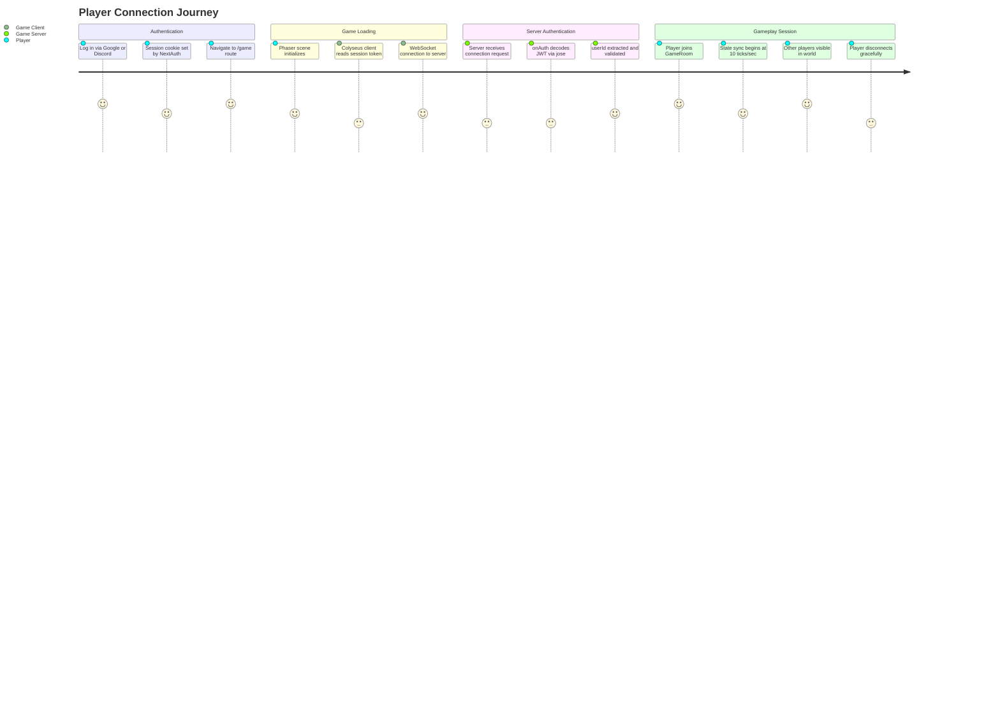
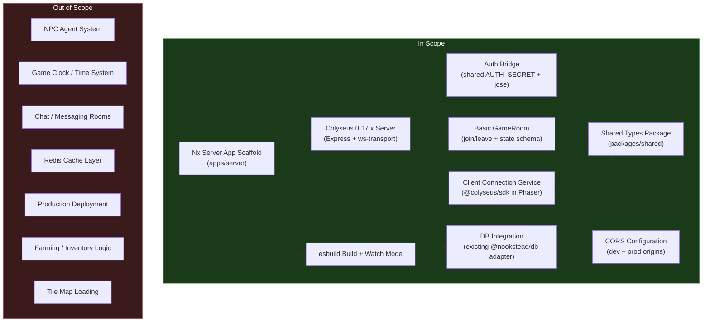

# PRD: Colyseus Game Server

## Overview

### One-line Summary

Add a Colyseus multiplayer game server to the Nx monorepo that provides authoritative real-time state synchronization, authenticates players via the existing NextAuth JWT (shared AUTH_SECRET), and enables the Phaser game client to establish WebSocket connections for multiplayer gameplay.

### Background

Nookstead is a 2D pixel art MMO / life sim / farming RPG where players build homesteads outside a living town populated by LLM-powered NPCs. The project currently has a Next.js 16 game client with Phaser.js 3 integration and social authentication (Google/Discord via NextAuth.js v5), but no game server. Without an authoritative server, no multiplayer interactions, NPC synchronization, or shared world state are possible.

Colyseus is a Node.js multiplayer game framework purpose-built for authoritative state synchronization. It provides a room-based architecture with automatic delta compression, built-in matchmaking, and schema-based state serialization -- all well-suited for a tile-based MMO with 10-50 concurrent players per zone. Colyseus 0.17.x is the current stable release used widely by indie multiplayer games and aligns with the project's Node.js/TypeScript stack.

This PRD covers the foundational server infrastructure: the Nx app scaffold, build tooling, authentication bridge, shared type definitions, database wiring, and client connection layer. It does not cover gameplay logic (NPC agents, farming, chat) which will be addressed in subsequent PRDs once the server foundation is operational.

## User Stories

### Primary Users

| Persona | Description |
|---------|-------------|
| **Player** | An authenticated user who connects to the game world via the Phaser client and expects real-time interaction with other players and the game world. |
| **Developer** | A team member who needs to run, build, and debug the game server locally with fast iteration cycles (watch mode, auto-restart). |
| **Game Client (system)** | The Phaser.js game running in the browser that must establish a WebSocket connection, authenticate, and receive authoritative state updates from the server. |

### User Stories

```
As a player
I want my game client to connect to a multiplayer server when I enter the game
So that I can see other players and interact with a shared world.
```

```
As a player
I want my existing Google/Discord login session to automatically authenticate me with the game server
So that I do not have to log in again or manage separate credentials.
```

```
As a developer
I want to start the game server with a single Nx command and have it auto-restart on code changes
So that I can iterate quickly during development without manual restarts.
```

```
As a developer
I want shared type definitions between the client and server
So that I can refactor state schemas with compile-time safety across both projects.
```

```
As a game client (system)
I want to receive authoritative state updates at a consistent tick rate
So that all connected clients display a synchronized view of the game world.
```

### Use Cases

1. **Local development session**: Developer runs `pnpm nx serve server` and `pnpm nx dev game` in parallel. The Colyseus server starts on port 2567 with watch mode. The Next.js dev server starts on port 3000. The developer authenticates via Google OAuth, enters `/game`, and the Phaser scene automatically connects to `ws://localhost:2567`. The server validates the player's JWT, creates a GameRoom, and begins state sync.

2. **Player joins game world**: A returning player visits the site, their NextAuth session cookie is still valid. They navigate to `/game`, the Phaser scene boots, and the Colyseus client SDK reads the session token and passes it during room join. The server's `onAuth()` decodes the encrypted JWT using the shared AUTH_SECRET via the jose library, extracts the userId, and permits the connection. The player's avatar appears in the world.

3. **Multiple players in same room**: Two authenticated players connect to the same GameRoom. Each receives delta-compressed state updates at 10 ticks/sec. When Player A moves, Player B sees the movement reflected within the latency target (<150ms). Join and leave events are broadcast to all connected clients.

4. **Server build for CI**: The CI pipeline runs `pnpm nx build server`, which produces a compiled JavaScript bundle via esbuild. The build succeeds alongside all other Nx targets (`lint`, `test`, `build`, `typecheck`, `e2e`) with no regressions.

## User Journey Diagram



## Scope Boundary Diagram



## Functional Requirements

### Must Have (MVP)

- [ ] **FR-1: Nx server app scaffold at `apps/server`**
  - New Node.js application using the `@nx/node` plugin with esbuild-based build
  - TypeScript strict mode, ES2022 target
  - Proper handling of ESM/CJS interop for importing `@nookstead/db` (which uses `"type": "module"`)
  - AC: Given a developer runs `pnpm nx build server`, when the build completes, then a runnable JavaScript bundle is produced in `dist/apps/server` with no TypeScript or import resolution errors.

- [ ] **FR-2: Colyseus server with Express and WebSocket transport**
  - Colyseus 0.17.x server initialized on Express HTTP server
  - `@colyseus/ws-transport` for WebSocket connections
  - `@colyseus/schema` for state serialization
  - Server listens on port 2567 (configurable via `COLYSEUS_PORT` environment variable)
  - AC: Given a developer runs `pnpm nx serve server`, when the server starts, then Colyseus logs confirm it is listening on port 2567 and accepting WebSocket connections.

- [ ] **FR-3: Authentication bridge using shared AUTH_SECRET**
  - Colyseus server decodes NextAuth encrypted JWT cookies using the jose library
  - The same `AUTH_SECRET` environment variable is used by both the Next.js app and the Colyseus server
  - JWT decryption is performed in the GameRoom `onAuth()` method
  - The `userId` (database user ID) is extracted from the decoded token payload
  - Invalid or expired tokens result in connection rejection with an appropriate error
  - AC: Given a player with a valid NextAuth session cookie connects to the Colyseus server, when `onAuth()` executes, then the userId is successfully extracted and the connection is permitted. Given an invalid or missing token, when `onAuth()` executes, then the connection is rejected.

- [ ] **FR-4: Basic GameRoom with player state schema**
  - A `GameRoom` class extending Colyseus `Room` with `@colyseus/schema`-based state
  - State includes a map of connected players (keyed by sessionId) with at minimum: userId, x position, y position, and display name
  - `onJoin()` adds the player to state; `onLeave()` removes the player from state
  - Room update loop runs at 10 ticks/sec (100ms interval via `setSimulationInterval`)
  - AC: Given two authenticated players join the same GameRoom, when state is inspected, then both players appear in the state map with their userId and default position. When one player leaves, then that player is removed from the state map.

- [ ] **FR-5: Client connection service for Phaser**
  - Colyseus client SDK (`@colyseus/sdk`) installed in `apps/game`
  - A connection service/module that Phaser game scenes can import
  - The service reads the NextAuth session token and passes it to `client.joinOrCreate()`
  - Connection URL defaults to `ws://localhost:2567` in development
  - AC: Given the Phaser game scene calls the connection service with a valid session, when the WebSocket handshake completes, then the client is connected to the GameRoom and receives the initial state snapshot.

- [ ] **FR-6: Shared types package at `packages/shared`**
  - New `@nookstead/shared` Nx library
  - Exports room state types, message type enums, and game constants (tick rate, port defaults)
  - Consumed by both `apps/game` and `apps/server` as a workspace dependency
  - AC: Given a developer imports a type from `@nookstead/shared` in either the client or server, when TypeScript compiles, then the import resolves correctly with full type information.

### Should Have

- [ ] **FR-7: Database integration via existing Colyseus adapter**
  - Import `getGameDb()` and `closeGameDb()` from `@nookstead/db/adapters/colyseus`
  - Initialize database connection pool on server startup
  - Close database connections gracefully on server shutdown (SIGTERM/SIGINT)
  - AC: Given the server starts, when initialization completes, then `getGameDb()` returns a valid database client with a connection pool of up to 20 connections. Given the server receives SIGTERM, when shutdown executes, then `closeGameDb()` is called and all connections are released.

- [ ] **FR-8: CORS configuration for development and production**
  - Development: allow requests from `http://localhost:3000` (Next.js dev server)
  - Production: configurable allowed origins via `CORS_ORIGIN` environment variable
  - WebSocket upgrade requests must also respect CORS policy
  - AC: Given the game client on `localhost:3000` attempts a WebSocket connection to the server on `localhost:2567`, when the connection is initiated, then the CORS headers permit the cross-origin request.

- [ ] **FR-9: Environment variable management**
  - `.env.example` file in `apps/server` documenting all required variables: `COLYSEUS_PORT`, `AUTH_SECRET`, `DATABASE_URL`, `CORS_ORIGIN`
  - `dotenv` loading for local development
  - AC: Given a developer copies `.env.example` to `.env` and fills in values, when the server starts, then all configuration is loaded from environment variables.

- [ ] **FR-10: Development watch mode with auto-restart**
  - `pnpm nx serve server` starts the server with file watching
  - Code changes in `apps/server/src` trigger automatic rebuild and restart
  - AC: Given a developer modifies a source file in `apps/server/src`, when the file is saved, then the server automatically restarts within 5 seconds with the new code.

### Could Have

- [ ] **FR-11: Health check HTTP endpoint**
  - `GET /health` returns HTTP 200 with server status (uptime, connected players count, room count)
  - AC: Given the server is running, when a GET request is made to `/health`, then a 200 response is returned with JSON containing at minimum `{ status: "ok", uptime: <seconds> }`.

- [ ] **FR-12: Graceful shutdown handling**
  - On SIGTERM/SIGINT, stop accepting new connections, allow existing rooms to drain (configurable timeout, default 10 seconds), close database connections, then exit
  - AC: Given 2 players are connected and SIGTERM is received, when the shutdown timeout elapses, then all rooms are disposed, database connections are closed, and the process exits with code 0.

- [ ] **FR-13: Structured logging**
  - Consistent log format (timestamp, level, component) for server events
  - Log levels: error, warn, info, debug (configurable via `LOG_LEVEL` environment variable)
  - AC: Given the server is running with `LOG_LEVEL=info`, when a player joins, then a structured log entry is emitted with timestamp, level "info", and relevant context (roomId, userId).

### Out of Scope

- **NPC agent system**: AI-powered NPC behavior, memory streams, reflection, and planning are a separate feature requiring its own PRD. The game server provides the infrastructure but not the agent logic.
- **Game clock / time system**: The 1 game hour = 1 real minute clock, day/night cycles, and seasonal systems will be layered on after the base server is operational.
- **Chat / messaging rooms**: Text communication between players requires dedicated room types and moderation logic beyond the base server scope.
- **Redis cache layer**: In-memory caching and pub/sub for horizontal scaling are deferred until player counts justify the added infrastructure.
- **Production deployment configuration**: Docker, load balancing, SSL termination, and cloud deployment are out of scope for this iteration.
- **Farming / inventory logic**: Game mechanics (planting, harvesting, crafting) require the game clock and are addressed separately.
- **Tile map loading on server**: Server-side tile map validation and collision detection are deferred to a subsequent phase.

## Non-Functional Requirements

### Performance

- **Server tick rate**: 10 ticks/sec (100ms simulation interval) as specified in the GDD. This provides smooth enough updates for a tile-based game without excessive CPU usage.
- **State sync latency**: Under 150ms from state mutation to client receipt on a local network. Under 200ms on a typical broadband connection.
- **Connection handshake**: WebSocket connection establishment plus authentication (`onAuth`) should complete within 2 seconds.
- **Memory footprint**: Server memory usage should remain under 256MB with 10 concurrent players in a single GameRoom (M0.2 milestone target).

### Reliability

- **Crash recovery**: If the server process crashes, it should be restartable without manual intervention (process manager responsibility, but the server must cleanly initialize fresh state).
- **Connection resilience**: The client connection service should handle transient disconnections and provide reconnection capability (Colyseus built-in `reconnect` within room `seatReservationTime` window).

### Security

- **JWT validation**: Every WebSocket connection must be authenticated via `onAuth()`. No unauthenticated connections are permitted to any game room.
- **AUTH_SECRET protection**: The `AUTH_SECRET` must never be logged, included in error messages, or exposed to clients. It must only be loaded from environment variables.
- **Input validation**: All client messages processed in room `onMessage()` handlers must validate payload structure before processing to prevent injection or state corruption.

### Scalability

- **Concurrent players (M0.2 target)**: Support 10 concurrent players in a single GameRoom instance. This is the initial milestone target and is well within Colyseus single-process capacity.
- **Room-based architecture**: Using Colyseus rooms enables future horizontal scaling by distributing rooms across processes or machines without architectural changes.
- **Database connection pooling**: The existing Colyseus adapter already provides connection pooling (max 20) suitable for the initial scale target.

## Success Criteria

### Quantitative Metrics

1. **Server starts**: `pnpm nx serve server` starts the Colyseus server and logs a listening message on port 2567 within 5 seconds.
2. **Build succeeds**: `pnpm nx build server` produces a runnable bundle in `dist/apps/server` with exit code 0.
3. **Watch mode restarts**: After a source file change, the server automatically restarts within 5 seconds.
4. **Authentication works**: A valid NextAuth JWT is accepted by `onAuth()` and returns the correct userId. An invalid token is rejected.
5. **State sync functions**: Two connected clients receive consistent state updates (both see each other's player entries in the state map).
6. **Tick rate maintained**: The server simulation interval runs at 10 ticks/sec (verifiable via server-side timing logs).
7. **CI passes**: All existing CI targets (`lint`, `test`, `build`, `typecheck`, `e2e`) continue to pass after adding the server app.
8. **Latency target**: State sync round-trip on localhost measures under 150ms.

### Qualitative Metrics

1. **Developer experience**: A new developer can clone the repo, set environment variables, and have both client and server running locally within 10 minutes following documentation.
2. **Code organization**: Shared types in `packages/shared` eliminate type duplication between client and server, and changes to state schemas produce compile errors in both projects if inconsistent.

## Technical Considerations

### Dependencies

- **Colyseus 0.17.x** (`colyseus`): Authoritative multiplayer game server framework. Current stable release, well-documented, active community.
- **@colyseus/ws-transport**: WebSocket transport layer for Colyseus, built on the `ws` library.
- **@colyseus/schema**: Binary serialization library for Colyseus state. Provides automatic delta compression.
- **@colyseus/sdk**: Client SDK for connecting to Colyseus from browser JavaScript. Installed in `apps/game`.
- **jose**: JavaScript implementation of JSON Object Signing and Encryption. Used to decode NextAuth encrypted JWTs. Already a transitive dependency of NextAuth in the workspace.
- **express**: HTTP server framework used as the underlying transport for Colyseus.
- **@nx/node**: Nx plugin for Node.js application scaffolding and build targets.
- **@nx/esbuild**: Nx plugin for esbuild-based bundling. Used for fast server builds.
- **@nookstead/db** (existing): Drizzle ORM + PostgreSQL with a Colyseus-specific adapter already implemented.
- **dotenv**: Environment variable loading for local development.

### Constraints

- **ESM/CJS interop**: `@nookstead/db` is configured as `"type": "module"` (ESM). The Colyseus server must handle this correctly -- either by also being ESM or by using dynamic imports. The esbuild configuration must account for this.
- **Shared AUTH_SECRET**: The NextAuth JWT encryption uses a key derived from AUTH_SECRET via the jose library. The Colyseus server must use the exact same AUTH_SECRET value and the same jose decryption approach to decode tokens. This creates a runtime coupling between the two services.
- **Port separation**: The Next.js dev server runs on port 3000 and the Colyseus server on port 2567. Both must run simultaneously during development. CORS must be configured to allow cross-origin WebSocket connections.
- **Nx plugin ecosystem**: Build and serve targets must integrate with the Nx task runner for caching, dependency tracking, and CI compatibility.
- **Colyseus schema limitations**: `@colyseus/schema` types must be defined with decorators and are not plain TypeScript interfaces. Shared types in `packages/shared` must distinguish between Colyseus schema classes (server-side) and plain type interfaces (shared).

### Assumptions

- `AUTH_SECRET` is already configured as an environment variable for the Next.js application. The same value will be made available to the Colyseus server.
- `DATABASE_URL` is already configured for the `@nookstead/db` package.
- Colyseus 0.17.x is compatible with Node.js 18+ (the project's runtime target).
- The jose library's `jwtDecrypt` function can decode NextAuth v5 encrypted JWTs when provided the correct AUTH_SECRET-derived key.
- Developers have access to run two concurrent processes during local development (game client + game server).

### Risks and Mitigation

| Risk | Impact | Probability | Mitigation |
|------|--------|-------------|------------|
| NextAuth JWT encryption format changes in future beta updates | High | Medium | Pin NextAuth version (`5.0.0-beta.30`), document the exact jose decryption method, and add integration tests for token decoding. |
| ESM/CJS interop issues with `@nookstead/db` in esbuild bundle | Medium | Medium | Test esbuild configuration early with a minimal import of `getGameDb()`. Consider `bundle: true` with `platform: 'node'` and `format: 'esm'` settings. |
| Colyseus 0.17.x reaches end-of-life before project maturity | Medium | Low | Colyseus 0.17.x is the current stable line. Monitor release announcements. The room-based architecture is similar across Colyseus versions, making migration manageable. |
| WebSocket connections blocked by corporate firewalls or proxies | Low | Low | Colyseus supports long-polling fallback. Document the requirement for WebSocket-capable network access during development. |
| AUTH_SECRET leak via logs or error messages | High | Low | Code review policy: never log AUTH_SECRET. Use environment variable validation on startup that confirms presence without printing value. |

## Appendix

### References

- [Colyseus Documentation](https://docs.colyseus.io/)
- [Colyseus Best Practices](https://docs.colyseus.io/best-practices/)
- [Colyseus Room API](https://docs.colyseus.io/server/room/)
- [Colyseus Room Authentication](https://docs.colyseus.io/auth/room)
- [Colyseus Schema State Synchronization](https://docs.colyseus.io/state/)
- [NextAuth.js v5 JWT Strategy](https://authjs.dev/getting-started/migrating-to-v5)
- [jose Library - JWT Decrypt](https://github.com/panva/jose)
- [WebSocket Authentication Best Practices 2025](https://www.videosdk.live/developer-hub/websocket/websocket-authentication)
- [Nookstead GDD](../nookstead-gdd.md)
- [PRD-001: Landing Page and Social Authentication](./prd-001-landing-page-auth.md)

### Glossary

- **Colyseus**: An open-source authoritative multiplayer game server framework for Node.js/TypeScript. It provides room-based architecture, automatic state synchronization, and built-in matchmaking.
- **Room**: A Colyseus concept representing a game session. Rooms have their own state, lifecycle hooks (`onCreate`, `onJoin`, `onLeave`, `onDispose`), and message handlers. Players connect to rooms, not directly to the server.
- **Schema**: Colyseus's binary serialization system (`@colyseus/schema`) that tracks state changes and sends only deltas (changes) to connected clients, minimizing bandwidth usage.
- **Tick rate**: The frequency at which the server updates game state. At 10 ticks/sec, the server processes game logic every 100 milliseconds.
- **AUTH_SECRET**: A cryptographically random string used by NextAuth.js to encrypt JWT session tokens. In this architecture, it is shared between the Next.js application and the Colyseus server to enable cross-service token validation.
- **jose**: A JavaScript library implementing JSON Object Signing and Encryption (JOSE) standards. Used here to decrypt NextAuth JWT tokens on the Colyseus server side.
- **onAuth()**: A Colyseus Room lifecycle method called during the connection handshake. It receives client-provided options and must return a truthy value (or resolve a promise) for the connection to be accepted.
- **Delta compression**: A technique where only the differences (deltas) between consecutive state snapshots are transmitted, reducing network bandwidth compared to sending full state on every tick.
- **WebSocket transport**: The underlying network protocol used by Colyseus for real-time bidirectional communication between server and clients.
- **esbuild**: A fast JavaScript/TypeScript bundler used for building the server application.
- **MoSCoW**: A prioritization technique categorizing requirements as Must have, Should have, Could have, and Won't have.
- **M0.2**: The second milestone in the Nookstead development roadmap, targeting 10 concurrent players with basic multiplayer functionality.
