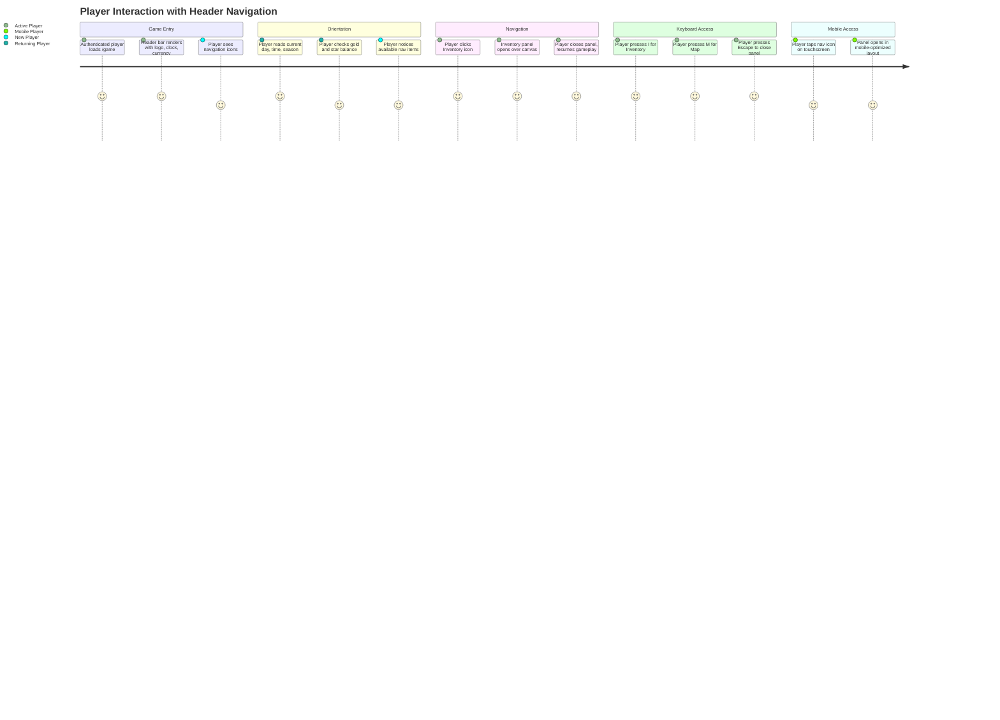
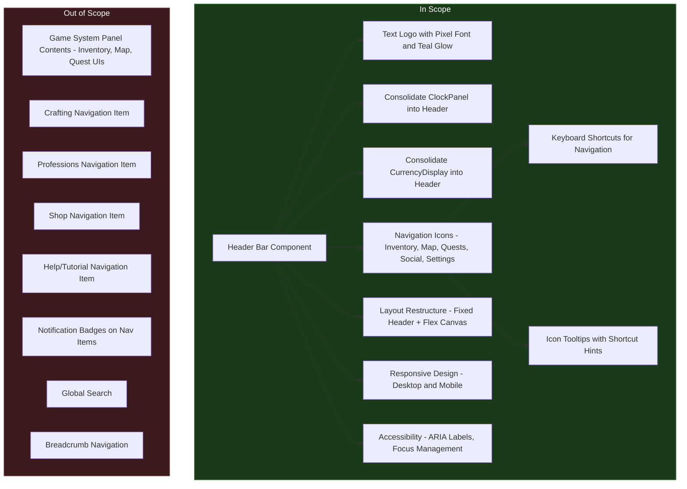

# PRD: Game Header and Navigation Bar

## Overview

### One-line Summary

Introduce a unified header bar at the top of the game screen that consolidates the existing clock/currency HUD elements, displays the Nookstead logo, and provides icon-based navigation to core game systems (Inventory, Map, Quests, Social, Settings).

### Background

The current game HUD uses absolutely positioned overlays on top of the full-viewport Phaser canvas. The ClockPanel (day, time, season) floats in the top-left corner, CurrencyDisplay (gold, stars) floats in the top-right corner, and a MenuButton sits in the bottom-right corner. This layout has several limitations:

1. **No brand presence during gameplay.** The Nookstead logo appears only on the landing and loading screens. Once in-game, players lose visual connection to the brand identity.
2. **Scattered access to game systems.** The single MenuButton in the bottom-right corner acts as the sole entry point to all game systems (inventory, map, quests, etc.), requiring multiple clicks to reach any feature.
3. **No persistent navigation.** Players cannot see at a glance which systems are available. Discoverability of features relies entirely on the player knowing to click the menu button.
4. **Overlapping HUD elements.** As more HUD components are added (quests, notifications, social indicators), absolutely positioned overlays risk colliding with each other and with the game canvas content.

Current industry trends for browser-based games in 2025-2026 favor minimalist, contextual HUD designs that reduce cognitive load while maintaining quick access to essential systems. A fixed header bar follows this pattern by consolidating information into a single, predictable location.

The header bar will restructure the game layout: the header occupies a fixed height at the top, and the Phaser game canvas fills the remaining viewport height. This creates a clean separation between React UI chrome and the game rendering surface.

## User Stories

### Primary Users

| Persona | Description |
|---------|-------------|
| **Active Player** | A player engaged in gameplay who needs quick access to inventory, map, quests, and other systems without interrupting their flow. |
| **New Player** | A first-time player who needs to discover and understand available game systems through clear visual navigation cues. |
| **Mobile Player** | A player on a touchscreen device who needs large, accessible tap targets for navigation. |
| **Returning Player** | A player who logs in daily and relies on the header to quickly orient themselves (current time, season, currency balance). |

### User Stories

```
As an active player
I want to see the Nookstead logo, current game time, season, and my currency balance in a persistent header bar
So that I always know the game state at a glance without searching for scattered HUD elements.
```

```
As an active player
I want to click navigation icons in the header to open game system panels (Inventory, Map, Quests, Social, Settings)
So that I can access any system in a single click instead of navigating through a menu hierarchy.
```

```
As a new player
I want to see labeled icons for each game system in the header
So that I can discover what features are available without reading documentation.
```

```
As a mobile player
I want the header navigation icons to be large enough to tap accurately
So that I can navigate game systems without accidentally triggering the wrong action.
```

```
As a returning player
I want to see the day, time, and season prominently in the header
So that I can immediately understand where I am in the game's seasonal cycle when I log in.
```

```
As a keyboard-oriented player
I want to use keyboard shortcuts (I for Inventory, M for Map, J for Quests, etc.)
So that I can access game systems without moving my mouse to the header.
```

### Use Cases

1. **Quick inventory check**: Player is farming and needs to check if they have seeds. They click the Inventory icon in the header (or press I). The inventory panel opens. They close it and resume farming.
2. **Finding an NPC**: Player wants to visit Marko's bakery but forgot where it is. They click the Map icon to open the town map, locate the bakery marker, and navigate there.
3. **Checking active quests**: Player returns to the game after a day away. They glance at the header to see the current season, then click Quests to review active and available tasks.
4. **Seasonal awareness**: A player notices the season indicator in the header shows "Autumn" and remembers they need to harvest their summer crops before they rot.
5. **Currency check before purchase**: Player is at the market and wants to verify their gold balance before buying seeds. The gold counter is visible in the header without opening any panel.
6. **Adjusting settings**: Player finds the background music too loud. They click the Settings gear icon in the header to access audio controls.

## User Journey Diagram



## Scope Boundary Diagram



## Functional Requirements

### Must Have (MVP)

- [ ] **FR-1: Header bar component**
  - A horizontal bar rendered as a React component at the top of the game screen, spanning the full viewport width.
  - Fixed height based on the UI sprite grid: 48px at 1x scale (one-and-a-half tile heights), scaled by `--ui-scale` to maintain pixel-perfect rendering at all viewport sizes.
  - Uses the pixel art aesthetic from the LimeZu Modern UI sprite sheet, consistent with existing HUD components (NineSlicePanel background).
  - Rendered above the Phaser canvas in the DOM stacking order (z-index higher than canvas, lower than modal overlays).
  - AC: Given the game page loads, when the header renders, then it spans the full viewport width, has a consistent height across all supported viewport sizes, and uses the LimeZu Modern UI visual style matching existing HUD components.

- [ ] **FR-2: Nookstead text logo**
  - Displays "NOOKSTEAD" in the Press Start 2P pixel font, positioned at the left side of the header.
  - Teal color (#48C7AA) with a subtle glow effect matching the landing page style (CSS `text-shadow` with rgba(72, 199, 170, ...) values).
  - Font size scales with `--ui-scale` to remain proportional to the header height.
  - The logo is not a navigation link (there is no "home" page during gameplay).
  - AC: Given the header renders, when the player views the logo, then it displays "NOOKSTEAD" in Press Start 2P font with teal (#48C7AA) color and a visible glow effect, and it matches the visual style established on the landing page.

- [ ] **FR-3: Consolidated clock and season display**
  - The existing ClockPanel information (day number, current time, current season) is displayed within the header bar, to the right of the logo.
  - Includes a season icon sprite (from the existing `SPRITES.seasonSpring/Summer/Autumn/Winter` definitions).
  - Displays day number (e.g., "Day 5"), current time (e.g., "14:30"), and season name.
  - Updates in real-time via the existing `EventBus` `hud:time` event.
  - The standalone ClockPanel component is removed from its current absolute-positioned top-left location.
  - AC: Given the game is running, when the game clock advances, then the day, time, and season information in the header updates in real-time, and the old ClockPanel no longer appears as a separate floating element.

- [ ] **FR-4: Consolidated currency display**
  - The existing CurrencyDisplay information (gold count and star count) is displayed within the header bar, positioned at the right side.
  - Includes a coin icon sprite and star icon sprite (from existing sprite definitions).
  - Displays formatted numbers (e.g., "1,234" gold, "56" stars) using locale-aware formatting.
  - Updates in real-time via the existing `EventBus` `hud:gold` event.
  - The standalone CurrencyDisplay component is removed from its current absolute-positioned top-right location.
  - AC: Given the player earns or spends currency, when the balance changes, then the gold and star values in the header update immediately, and the old CurrencyDisplay no longer appears as a separate floating element.

- [ ] **FR-5: Navigation menu icons**
  - Five icon-based navigation items displayed in the center of the header bar: **Inventory**, **Map**, **Quests**, **Social**, **Settings**.
  - Each navigation item consists of a sprite icon (from the LimeZu Modern UI sprite sheet, 16x16 base scaled by `--ui-scale`) with a text label below or beside it.
  - Menu item selection:
    - **Inventory**: Backpack icon. Opens the player's 40-slot inventory (tools, seeds, crops, materials). Central to the core gameplay loop of farming/selling.
    - **Map**: Map icon. Opens the town map showing districts, NPC positions, and points of interest. Essential for navigation in the open world.
    - **Quests**: Scroll/book icon. Opens the quest journal showing active structural quests, organic NPC-generated quests, and daily notice board tasks. Provides goal direction.
    - **Social**: People icon. Opens the social panel for player relationships, NPC relationship tiers, guild management, and chat settings. Supports the "Meaningful Connections" design pillar.
    - **Settings**: Gear icon. Opens settings for audio, video, controls, and accessibility. Required for player comfort and accessibility compliance.
  - Clicking a navigation item emits an EventBus event (e.g., `hud:open-panel:inventory`) so the game can respond by opening the corresponding panel.
  - Clicking an already-active navigation item closes the associated panel (toggle behavior).
  - Only one panel can be open at a time; clicking a different nav item closes the current panel and opens the new one.
  - AC: Given the header is rendered with five navigation icons, when the player clicks an icon, then the corresponding EventBus event fires, and the icon shows an active/selected visual state. When the player clicks the same icon again, then the panel closes and the icon returns to its default state.

- [ ] **FR-6: Layout restructure**
  - The game page layout changes from a single full-viewport container to a vertical flex layout: header (fixed height) + game canvas area (flex-grow, remaining height).
  - The Phaser game canvas container (`game-app` or equivalent) resizes to fill only the remaining viewport height below the header.
  - The Phaser scale manager must be notified of the new available dimensions so it can recalculate the canvas size (`Phaser.Scale.FIT` within the reduced container).
  - The existing HUD overlay container remains positioned over the canvas area (not the header). EnergyBar, Hotbar, and other non-header HUD elements continue to work in their current positions relative to the canvas.
  - AC: Given the game page loads, when the header and canvas render, then the header occupies a fixed height at the top, the Phaser canvas fills the remaining viewport height, and the canvas content renders correctly without cropping or overflow.

- [ ] **FR-7: Keyboard shortcuts**
  - Keyboard shortcuts for navigation items. `I` (Inventory) and `Escape` (Settings/close) follow GDD Section 15.7 conventions. `M` (Map), `J` (Quests/Journal), and `O` (Social) are new shortcuts introduced by this PRD, following common game patterns:
    - `I` -- Inventory
    - `M` -- Map
    - `J` -- Quests (Journal)
    - `O` -- Social
    - `Escape` -- Settings (consistent with GDD: `menu: ['ESC']`) or close current panel
  - Shortcuts must not fire when a text input field is focused (e.g., chat input, dialogue free-text input).
  - Shortcuts toggle the panel open/closed (same as clicking the icon).
  - AC: Given no text input is focused, when the player presses I, then the Inventory panel toggles open/closed, and the corresponding header icon shows the active state.

- [ ] **FR-8: MenuButton removal**
  - The existing MenuButton component (bottom-right corner) is removed, as its functionality is replaced by the header navigation icons.
  - The `hud:menu-toggle` EventBus event may be deprecated or repurposed.
  - AC: Given the header navigation is implemented, when the game loads, then no MenuButton appears in the bottom-right corner of the HUD.

### Should Have

- [ ] **FR-9: Hover tooltips on navigation icons**
  - On desktop, hovering over a navigation icon shows a tooltip with the system name and keyboard shortcut (e.g., "Inventory (I)", "Map (M)").
  - Tooltips use the pixel art style (NineSlicePanel or simple bordered box) consistent with the game aesthetic.
  - Tooltips appear after a short delay (300ms) and disappear immediately on mouse-out.
  - AC: Given the player hovers over the Inventory icon on desktop, when 300ms elapses, then a tooltip reading "Inventory (I)" appears near the icon.

- [ ] **FR-10: Active state indicator for navigation items**
  - When a game system panel is open, the corresponding header icon displays a visual active state (e.g., highlighted border, brighter icon, underline indicator).
  - The active state is clearly distinguishable from the default and hover states.
  - AC: Given the player opens the Inventory panel, when the panel is visible, then the Inventory icon in the header displays a visually distinct active state.

- [ ] **FR-11: Responsive header layout**
  - On narrow viewports (below 640px width), the header adapts:
    - Logo may shrink or abbreviate (e.g., show an "N" monogram or smaller font size).
    - Navigation icons remain visible but labels are hidden (icon-only mode).
    - Clock display may show a compact format (e.g., time only, with day/season accessible via tooltip or tap).
    - Currency display shows abbreviated numbers (e.g., "1.2K" instead of "1,234").
  - The header height may increase slightly on mobile to accommodate larger tap targets (minimum 44x44 CSS pixels per icon).
  - AC: Given a viewport width of 360px, when the header renders, then all five navigation icons are visible, tappable (minimum 44x44px), and no horizontal scrolling is required.

### Could Have

- [ ] **FR-12: Header animation on game entry**
  - The header slides down or fades in when the game first loads, providing a polished transition from the loading screen.
  - Animation respects `prefers-reduced-motion` media query.
  - AC: Given the game finishes loading, when the header appears, then it animates into view (unless reduced motion is preferred).

- [ ] **FR-13: Seasonal header theme**
  - The header background subtly changes with the current season (e.g., slightly warmer tones in summer, cooler in winter), reinforcing the seasonal cycle.
  - Changes are cosmetic only and do not affect readability or contrast ratios.
  - AC: Given the season changes from spring to summer, when the header re-renders, then the background tint shifts to reflect the new season.

### Out of Scope

- **Game system panel contents**: The actual UI for Inventory, Map, Quests, Social, and Settings panels is not part of this PRD. This PRD covers only the header bar and its navigation triggers. Panel implementations will be addressed in separate PRDs per system.
- **Crafting navigation item**: Crafting is accessible from within the Inventory or at crafting stations in-game. A dedicated header item is deferred until crafting system complexity warrants it (Phase 2+).
- **Professions navigation item**: Profession tracking is accessed from the player profile or a sub-panel of Social/Inventory. Deferred to the profession system PRD.
- **Shop navigation item**: The cosmetic shop is accessed in-town via NPC interaction or a dedicated button when available. Not a persistent header item at launch.
- **Help/Tutorial navigation item**: The tutorial is delivered contextually in-game during Act I (GDD Section 9.2). A help menu may be added to Settings as a sub-option in the future.
- **Notification badges**: Badge indicators on nav icons (e.g., "3 new quests") are a future enhancement requiring backend integration with quest and social systems.
- **Global search**: There is no search functionality in the header. Players use the Map to find locations and NPCs.
- **Breadcrumb navigation**: The game has a flat navigation model (header icons open/close panels), not a hierarchical one.

## Non-Functional Requirements

### Performance

- **Header render time**: The header component must render within 16ms (one frame at 60fps) to avoid jank during initial page load or resize events.
- **No impact on game FPS**: Adding the header must not reduce the Phaser canvas frame rate. The header is a static React component that re-renders only on state changes (clock tick, currency change, nav state toggle).
- **Layout recalculation**: When the browser window resizes, the header height and canvas resize must complete within 100ms to avoid visible layout jumps.
- **Sprite loading**: Navigation icons from the LimeZu sprite sheet must load from the same sprite atlas already used by existing HUD components (no additional HTTP requests).
- **Bundle size**: The header component and its CSS additions must not increase the game bundle by more than 5KB gzipped.

### Reliability

- **EventBus resilience**: If the Phaser game has not yet initialized (e.g., during loading), the header must render with default/placeholder values (Day 1, 00:00, spring, 0 gold, 0 stars) and update once the EventBus begins emitting.
- **Graceful degradation**: If a sprite fails to load, the navigation item must fall back to a text-only label so the header remains functional.

### Security

- No additional security requirements. The header displays client-side state only and does not make network requests.

### Accessibility

- **ARIA landmarks**: The header uses `<header role="banner">` or `<nav role="navigation">` as appropriate. Navigation items are within a `<nav>` element with `aria-label="Game navigation"`.
- **ARIA states**: Active navigation items use `aria-pressed="true"` or `aria-current="true"` to communicate state to screen readers.
- **Focus management**: All navigation icons are keyboard-focusable (`tabindex="0"` or native button elements). Focus order follows visual order (left to right).
- **Focus visible**: A high-contrast focus indicator (matching the existing `#ffdd57` focus ring in the HUD) is visible on all interactive elements.
- **Screen reader labels**: Each icon has an `aria-label` describing its function (e.g., `aria-label="Open inventory"`). Clock and currency displays use `role="status"` with `aria-live="polite"`.
- **Reduced motion**: All header animations respect `prefers-reduced-motion: reduce`.
- **Color contrast**: Text and icon elements maintain a minimum contrast ratio of 4.5:1 against the header background, per WCAG 2.1 AA.
- **Touch targets**: All interactive elements have a minimum touch target of 44x44 CSS pixels, per WCAG 2.5.5.

### Scalability

- The header navigation item list is implemented as a data-driven array, making it straightforward to add or remove items in future PRDs without restructuring the component.
- The layout system (fixed header + flex canvas) supports future additions such as a footer bar or side panels.

## Success Criteria

### Quantitative Metrics

1. **Header renders on game load**: 100% of authenticated game page loads display the header with logo, clock, currency, and navigation icons without JavaScript errors (verifiable in E2E tests).
2. **Layout correctness**: The Phaser canvas fills the remaining viewport height below the header at 360px, 768px, and 1440px viewports without overflow or cropping (verifiable in visual regression tests).
3. **Navigation click-through**: Clicking each of the five navigation icons emits the correct EventBus event (verifiable in unit/integration tests).
4. **Keyboard shortcuts**: All five keyboard shortcuts (I, M, J, O, Escape) trigger the correct navigation action when no text input is focused (verifiable in E2E tests).
5. **Existing HUD elements preserved**: EnergyBar and Hotbar continue to render in their correct positions relative to the canvas area (verifiable in visual tests).
6. **Performance**: Game maintains 60fps on desktop and 30fps on mobile with the header present (verifiable in performance testing).
7. **Accessibility audit**: Header passes automated accessibility checks (axe-core) with zero critical or serious violations.
8. **Touch target compliance**: All header interactive elements measure at least 44x44 CSS pixels on mobile viewports (verifiable via computed style inspection).

### Qualitative Metrics

1. **Brand presence**: Players can identify the game by its logo at all times during gameplay, reinforcing brand recall.
2. **Discoverability**: New players can identify available game systems by looking at the header without external guidance.
3. **Visual cohesion**: The header integrates seamlessly with the pixel art aesthetic of the game canvas and existing HUD components.

## Technical Considerations

### Dependencies

- **Existing HUD system**: The header integrates with the existing `EventBus` communication pattern between React components and Phaser. The `--ui-scale` system used by current HUD components must also apply to the header.
- **LimeZu Modern UI sprite sheet**: Navigation icons will be sourced from this sprite sheet, which is already loaded for NineSlicePanel, hotbar slots, and other HUD components.
- **Press Start 2P font**: Already loaded via `next/font/google` in the existing HUD component and landing page. No additional font loading required.
- **Phaser.js scale manager**: The Phaser game's `Scale.FIT` mode must be configured to respect the reduced container size after the layout restructure.

### Constraints

- **CSS-only styling**: The project uses global CSS with PostCSS (no CSS Modules, no Tailwind, no styled-components). All header styles must be added to `global.css` following the existing section pattern.
- **Path alias**: All imports must use the `@/*` alias mapping to `apps/game/src/*`.
- **Sprite grid alignment**: All dimensions must align to the 16px or 32px grid used by the LimeZu sprite assets, scaled by `--ui-scale`.
- **No SSR for game components**: The header component is a client-side React component (`'use client'` directive) since it depends on browser APIs (EventBus, window resize).
- **Existing EventBus contract**: New events (e.g., `hud:open-panel:inventory`) must follow the existing naming convention (`hud:` prefix).

### Assumptions

- The LimeZu Modern UI sprite sheet contains suitable 16x16 icons for Inventory, Map, Quests, Social, and Settings. If specific icons are not available, placeholder icons from the same sprite sheet or simple CSS-drawn icons will be used until custom assets are created.
- Game system panels (Inventory, Map, Quests, Social, Settings) will be implemented in future PRDs. The header only provides the navigation trigger; it does not render the panels themselves.
- The `--ui-scale` custom property calculation in the existing HUD component will continue to work correctly and apply to the header.
- The Phaser game canvas can be reconfigured to render within a non-full-viewport container without breaking existing scene rendering or camera systems.

### Risks and Mitigation

| Risk | Impact | Probability | Mitigation |
|------|--------|-------------|------------|
| Phaser canvas resize breaks rendering when layout changes from full-viewport to flex | High | Medium | Test canvas resize early; use Phaser `Scale.RESIZE` event to handle container size changes; implement a resize notification from the React layout to Phaser. |
| LimeZu sprite sheet lacks suitable navigation icons | Low | Medium | Use text labels as fallback; create simple 16x16 pixel art icons if needed; the sprite sheet has 1,100+ UI elements so suitable options are likely available. |
| Header height varies across scale factors, causing inconsistent canvas area | Medium | Low | Define header height as an exact function of `--ui-scale` and the 32px grid; test at all supported scale factors (2x through 6x). |
| Keyboard shortcuts conflict with Phaser input handling | Medium | Medium | Ensure Phaser input system and React keyboard handlers do not double-process the same keypress; use `e.stopPropagation()` or a shared input routing layer. |
| Mobile header takes too much vertical space, reducing gameplay visibility | Medium | Medium | Limit header height to a maximum of 10% of viewport height on mobile; test on common mobile resolutions (375x667, 390x844, 414x896). |

## Appendix

### References

- [Nookstead GDD v3.0](../nookstead-gdd-v3.md) -- Section 12 (User Interface), Section 8 (Game Systems), Section 15.3 (Phaser.js Integration)
- [PRD-001: Landing Page and Social Authentication](prd-001-landing-page-auth.md) -- Established visual identity (logo, teal glow, pixel font)
- [LimeZu Modern UI Asset Pack](https://limezu.itch.io/) -- Sprite sheet for UI elements (16x16, 32x32, 48x48)
- [Game UI Design Trends 2025-2026](https://pixune.com/blog/best-examples-mobile-game-ui-design/) -- Minimalist HUD, contextual displays
- [Game UI/UX Trends 2025](https://gamecrio.com/5-game-ui-ux-trends-in-2025-every-developer-should-follow/) -- Accessible, customizable HUD designs
- [Game UI Database](https://www.gameuidatabase.com/) -- Reference gallery for game interface patterns
- [Pixel Art HUD Assets on itch.io](https://itch.io/game-assets/tag-hud/tag-pixel-art) -- Community pixel art HUD references

### Menu Item Selection Rationale

The five navigation items (Inventory, Map, Quests, Social, Settings) were selected based on analysis of the GDD v3.0 game systems and their relevance to the core gameplay loop:

| System | Included | Rationale |
|--------|----------|-----------|
| **Inventory** | Yes | Central to the core loop (farm, gather, trade). Accessed multiple times per session. GDD specifies keyboard shortcut `I`. |
| **Map** | Yes | Essential for navigation in an open world with multiple districts and NPC locations. Frequently accessed when exploring. |
| **Quests** | Yes | Three quest types (structural, organic, notice board) need a central tracking point. Provides player direction and motivation. |
| **Social** | Yes | Supports the "Meaningful Connections" and "Shared Life" design pillars. NPC relationships are the game's USP. Guilds and chat are core multiplayer features. |
| **Settings** | Yes | Required for accessibility, audio controls, and player preferences. Standard in all games. |
| Crafting | No (deferred) | Accessible from crafting stations in the game world and potentially as a sub-view of Inventory. Not needed in the header until the crafting system is more complex (Phase 2+). |
| Professions | No (deferred) | Profession tracking is a progression feature, not a frequently accessed panel during moment-to-moment gameplay. Can be a sub-panel of Social or Inventory. |
| Shop | No (deferred) | The cosmetic shop is accessed in-town. Making it a persistent header item could feel overly monetization-focused, which conflicts with the cozy game ethos. |
| Help | No (deferred) | Tutorial is contextual (Act I, GDD Section 9.2). A help section can live inside Settings as a sub-option. |

### Header Layout Specification

```
+-----------------------------------------------------------------------+
|  NOOKSTEAD  |  [season] Day 5  14:30  |  [I] [M] [Q] [S] [G]  |  1,234g  56*  |
+-----------------------------------------------------------------------+
|                                                                       |
|                     Phaser Game Canvas                                |
|                     (fills remaining height)                          |
|                                                                       |
|  [Energy]                                                             |
|  [  Bar  ]                                                            |
|                                                                       |
|                        [Hotbar 1-0]                                   |
+-----------------------------------------------------------------------+

Legend:
  [I] = Inventory    [M] = Map    [Q] = Quests
  [S] = Social       [G] = Settings (Gear)
  [season] = Season icon sprite
  g = gold coin icon    * = star icon
```

### Color Palette Reference

| Color | Hex | Usage |
|-------|-----|-------|
| Teal (Logo) | #48C7AA | Logo text, logo glow |
| Teal Glow (shadow) | rgba(72, 199, 170, 0.4) | Logo text-shadow |
| Dark Teal (logo shadow) | #1A3A2E | Logo offset shadow |
| Parchment | #F2E2C4 | Header background tint, panel backgrounds |
| Walnut | #6B4226 | Icon borders, secondary text |
| Ink Brown | #3B2819 | Primary text, icon outlines |
| Harvest Gold | #DAA520 | Gold currency text |
| Meadow Green | #5FAD46 | Active state indicators, positive feedback |
| Deep Background | #0A0A1A | Fallback header background |
| Focus Ring | #FFDD57 | Keyboard focus indicator |

### Glossary

- **HUD**: Heads-Up Display; the persistent UI overlay shown during gameplay.
- **EventBus**: A publish/subscribe event system used to communicate between React (HUD) components and Phaser (game engine) components.
- **NineSlicePanel**: A reusable UI component that renders a 9-slice sprite frame, allowing flexible sizing while preserving pixel-perfect corners and edges.
- **LimeZu Modern UI**: A commercial pixel art asset pack providing UI sprites (buttons, panels, icons) in 16x16, 32x32, and 48x48 sizes, used as the visual foundation for all Nookstead UI.
- **`--ui-scale`**: A CSS custom property set dynamically by the HUD component based on viewport dimensions, ensuring all HUD elements scale proportionally (values range from 2 to 6).
- **MoSCoW**: A prioritization technique categorizing requirements as Must have, Should have, Could have, and Won't have.
- **MVP**: Minimum Viable Product; the smallest set of features that delivers user value.
