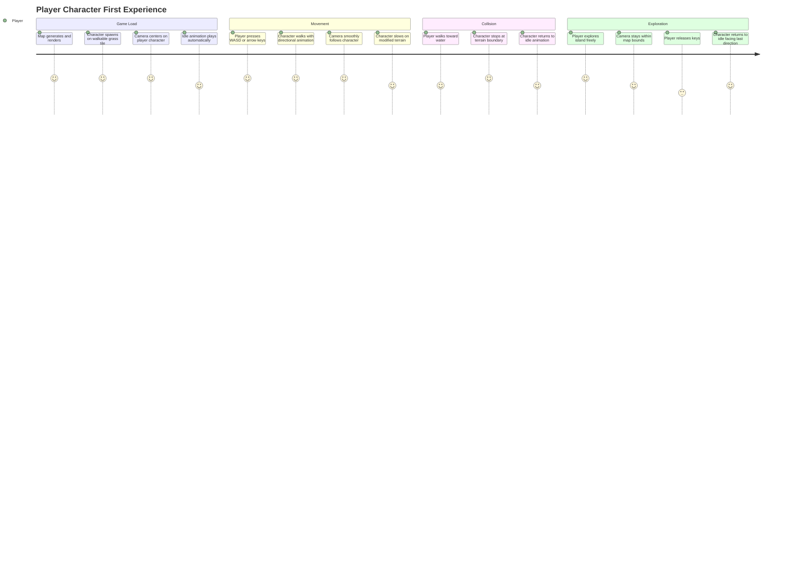
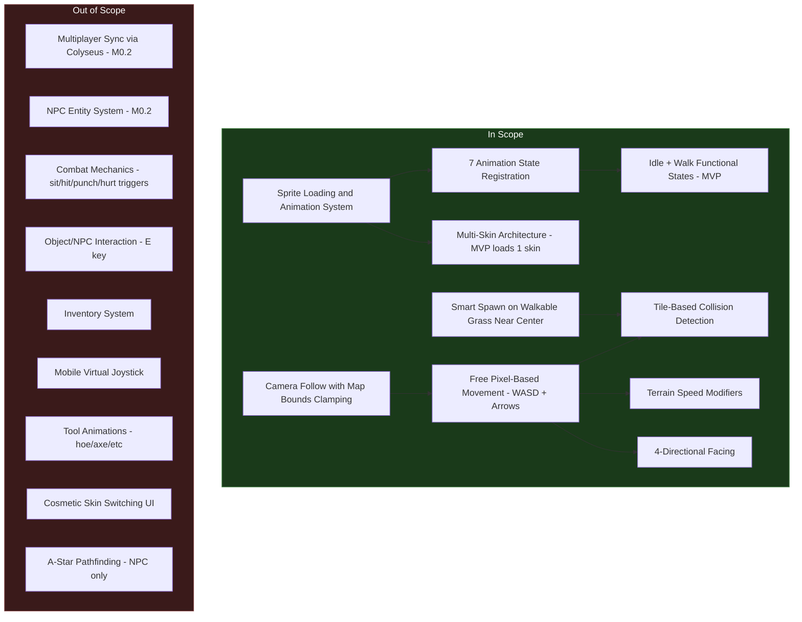

# PRD: Player Character System

## Overview

### One-line Summary

Add a player-controlled character with sprite-based animations and free pixel-movement across the procedurally generated map, enabling all future gameplay interactions (farming, NPC dialogue, multiplayer).

### Background

Nookstead is a 2D pixel art MMO / life sim / farming RPG currently in the M0.1 prototyping phase. The project has achieved procedural island map generation with a 64x64 tile grid (16px tiles), terrain classification (deep water, water, grass), a walkability grid, and terrain-based speed modifiers. However, there is no player entity on the map. The camera is currently fixed at a zoom level that fits the entire map in the viewport, with mouse drag-scroll and wheel-zoom as the only navigation.

Without a player character, no gameplay interactions are possible. The player character is the foundational entity through which all future systems operate: movement across the world, interaction with NPCs and objects, farming, crafting, combat, and multiplayer synchronization. The GDD (Section 20.1, M0.1) specifies this as Week 2 deliverable: "Player entity, movement, collisions, camera."

The character sprite system uses the LimeZu Modern Exteriors character assets at 16x32 frame size (one tile wide, two tiles tall), following the convention used by Stardew Valley and similar pixel art life sims where characters are taller than a single tile to convey more visual personality.

## User Stories

### Primary Users

| Persona | Description |
|---------|-------------|
| **Player** | A person controlling the main character to explore the map, which is the first interactive experience in the game. |
| **Developer / Tester** | A team member who needs a controllable entity on the map to verify collisions, terrain interactions, camera behavior, and future system integration. |
| **Future Multiplayer Player** | A player whose character will eventually be visible to other players via Colyseus synchronization (M0.2). This PRD establishes the local-only character; multiplayer sync is out of scope. |

### User Stories

```
As a player
I want to control a character that moves across the game map with smooth animations
So that I can explore the world and interact with its environments.
```

```
As a player
I want my character to stop when reaching water or impassable terrain
So that I understand the physical boundaries of the game world intuitively.
```

```
As a player
I want my character to face the direction I am moving and animate accordingly
So that the movement feels responsive and visually connected to my inputs.
```

```
As a player
I want my character to slow down on certain terrain types
So that the world feels physically varied and I can make strategic choices about paths.
```

```
As a player
I want the camera to follow my character as I move
So that I always see the relevant part of the map around me.
```

```
As a developer
I want the character sprite system to support multiple animation states and skins
So that the same architecture can serve NPCs, multiplayer characters, and cosmetic variations without rework.
```

### Use Cases

1. **First movement**: Player loads the game and sees their character standing on a grass tile near the center of the island. They press W or the up arrow key. The character walks upward with a smooth walk animation, and the camera follows.
2. **Terrain collision**: Player walks toward the water's edge. The character stops at the last walkable tile and cannot enter the water, while the walk animation stops and idle animation begins.
3. **Diagonal awareness**: Player holds W and D simultaneously. The character moves diagonally (up-right) at a consistent speed, facing right (the last horizontal direction pressed takes priority for facing).
4. **Terrain speed variation**: Player walks from grass onto a future terrain type with a 0.6 speed modifier. Their movement speed noticeably decreases while on that terrain, and returns to normal when they step back onto grass.
5. **Idle on spawn**: Player loads the game and does not press any keys. The character stands in place with a subtle idle animation (breathing or swaying), establishing that the character is alive and responsive.
6. **Camera tracking**: Player moves their character toward the edge of the map. The camera follows the character but is bounded by the map edges, preventing the camera from showing empty space beyond the map.

## User Journey Diagram



## Scope Boundary Diagram



## Functional Requirements

### Must Have (MVP)

- [ ] **FR-1: Character sprite loading in Preloader**
  - Load character sprite sheet(s) during the Preloader scene using Phaser's `spritesheet` loader.
  - Frame size: 16px wide x 32px tall (character is taller than one tile).
  - The reference sprite is `scout_6.png` placed in `apps/game/public/assets/characters/`.
  - All 7 animation state frame sets are extracted from the sprite sheet using a uniform layout definition (all skins share identical frame positions and counts).
  - AC: Given the Preloader scene runs, when sprite loading completes, then the character sprite sheet is available in the Phaser texture cache with correctly sized frames (16x32) and all 7 animation sets are registered as Phaser animations.

- [ ] **FR-2: Animation state registration**
  - Register all 7 animation states as Phaser animations with the correct frame counts and directions:
    1. **idle**: 6 frames per direction (down, left, right, up). Plays on loop when stationary.
    2. **waiting**: Alias of idle. Uses the same frames. Exists as a distinct state name for future game logic differentiation.
    3. **walk**: 6 frames per direction (down, left, right, up). Plays on loop while moving.
    4. **sit**: 3 frames per direction (down, left, right, up). Registered but not triggered in MVP.
    5. **hit**: 6 frames per direction (down, left, right, up). Registered but not triggered in MVP.
    6. **punch**: 6 frames per direction (down, left, right, up). Registered but not triggered in MVP.
    7. **hurt**: 4 frames per 3 directions (left, right, up -- no down variant). Registered but not triggered in MVP.
  - Animation frame rate: 8 FPS (consistent with GDD Section 7.7 NPC animation rate). Note: while the 8 FPS rate matches the GDD, the frame count per direction is determined by the actual sprite sheet layout rather than the GDD NPC specification, as player character sheets may differ from NPC sheets.
  - AC: Given all animations are registered, when the game queries any of the 7 animation state names with a direction, then a valid Phaser animation key is returned and can be played on any sprite using that skin.

- [ ] **FR-3: Player character entity creation**
  - Create a player character entity (Phaser Sprite or Container) in the Game scene after map generation.
  - The character sprite renders at the correct scale relative to the tile map (16x32 character on a 16x16 tile grid, so the character occupies one tile width and two tile heights visually).
  - The character's depth/z-order is above the map render texture but below any future overlay layers.
  - AC: Given the Game scene creates the map, when the player entity is created, then the character sprite is visible on the map at the correct size relative to tiles, with the idle animation playing.

- [ ] **FR-4: Smart spawn positioning**
  - On game start, find a walkable grass tile near the center of the map.
  - Search algorithm: start at the center tile (MAP_WIDTH/2, MAP_HEIGHT/2) and scan outward in expanding concentric squares until a tile meeting the criteria is found. Criteria: `walkable === true` and `terrain === 'grass'`.
  - Place the character so that the collision body (bottom 16x16 feet area) is centered within the chosen tile. With sprite origin at bottom-center (0.5, 1): spawnX = tileX * TILE_SIZE + TILE_SIZE / 2, spawnY = (tileY + 1) * TILE_SIZE.
  - AC: Given the map has been generated with at least one walkable grass tile, when the player spawns, then the character appears on a walkable grass tile within the closest proximity to the map center. The character's feet are correctly aligned within the tile.

- [ ] **FR-5: Free pixel-based movement with WASD and arrow keys**
  - Movement is pixel-based (not grid-snapping). The character moves smoothly in any of 4 cardinal directions.
  - Input keys: W/Up = up, S/Down = down, A/Left = left, D/Right = right (per GDD Section 15.7).
  - Simultaneous key presses allow diagonal movement. Diagonal speed is normalized so the character does not move faster diagonally than cardinally.
  - Base movement speed: 100 pixels/second (GDD Section 7.7 specifies player speed as 100 px/sec, faster than NPC 60 px/sec).
  - Movement speed is modified by the terrain speed modifier of the tile the character's feet currently occupy (from `terrain-properties.ts` `speedModifier` field).
  - The walk animation plays during movement, matching the direction of travel. When moving diagonally, the facing direction is determined by the last horizontal or vertical key pressed (horizontal takes priority for visual clarity in a top-down view).
  - When all movement keys are released, the character stops and transitions to the idle animation facing the last movement direction.
  - AC: Given the player presses WASD or arrow keys, when the key is held, then the character moves smoothly in the corresponding direction at the base speed multiplied by the current terrain's speed modifier, and the walk animation plays in the correct direction. When the key is released, the character stops and plays the idle animation facing the last movement direction.

- [ ] **FR-6: Tile-based collision detection**
  - Before each movement step, check whether the target position would place the character's collision bounds on an unwalkable tile.
  - The collision bounds represent the character's feet (the bottom portion of the sprite, approximately one tile height from the bottom), not the full 16x32 sprite. This allows the character's head to overlap into upper tile rows visually while the feet determine physical position.
  - Use the `walkable` grid from `GeneratedMap` (already computed during map generation) for fast lookups.
  - When collision is detected, the character stops in the movement direction that is blocked but can continue moving in other unblocked directions (axis-independent collision, also known as sliding along walls).
  - AC: Given the character is adjacent to an unwalkable tile, when the player moves toward that tile, then the character stops at the tile boundary and does not enter the unwalkable tile. If the player is also pressing a perpendicular direction key that leads to a walkable tile, the character continues moving in that direction (sliding).

- [ ] **FR-7: Camera follows player character**
  - The camera follows the player character smoothly, keeping the character near the center of the viewport.
  - Camera is bounded by the map edges: the camera does not scroll beyond the map boundaries, preventing empty space from appearing.
  - The existing mouse-wheel zoom feature is preserved and continues to work alongside character movement.
  - The existing drag-scroll (mouse drag to pan the map) is replaced by character-following behavior. The camera is always centered on the player.
  - AC: Given the player character is moving, when the character position changes, then the camera scrolls to keep the character centered. When the character is near a map edge, the camera clamps to the map boundary and the character moves off-center rather than the camera showing empty space.

- [ ] **FR-8: Multi-skin architecture**
  - The sprite loading and animation system is designed to support multiple character skins (different sprite sheets with the same frame layout).
  - A skin is defined by a key name and a sprite sheet file path. All skins share the same frame positions, frame counts, and animation definitions.
  - MVP loads exactly one skin (the Scout character). The architecture allows adding more skins by adding entries to a skin registry without changing animation or movement code.
  - AC: Given the skin registry contains one entry (Scout), when the game loads, then that skin's sprite sheet is loaded and its animations are registered. Adding a second skin entry to the registry results in both skins being loaded and fully animated without code changes to the animation or movement systems.

### Should Have

- [ ] **FR-9: Smooth camera lerp**
  - Instead of the camera rigidly locking to the player position, the camera uses linear interpolation (lerp) to smoothly follow the character with a slight delay, creating a polished feel.
  - Lerp factor is configurable (suggested default: 0.1 per frame at 60 FPS, adjusted for delta time).
  - AC: Given the player character changes direction suddenly, when the camera follows, then the camera movement is visibly smooth rather than snapping instantly to the new position.

- [ ] **FR-10: Tile hover highlight preserved**
  - The existing tile hover highlight (white outline on the tile under the mouse cursor) continues to work with the player character on screen.
  - The hover highlight renders above the map but below the character sprite.
  - AC: Given the player moves the mouse over the map, when the cursor is over a tile, then the tile hover highlight appears, even while the character is moving.

### Could Have

- [ ] **FR-11: Spawn animation**
  - When the character first appears on the map, play a brief spawn animation (e.g., fade-in or scale-up from 0 to 1) rather than appearing instantly.
  - AC: Given the game scene starts, when the character spawns, then a brief visual transition (under 500ms) occurs before the character is fully visible and controllable.

- [ ] **FR-12: Footstep visual feedback**
  - Small dust particle effects or footprint sprites appear briefly at the character's feet while walking, varying subtly by terrain type.
  - AC: Given the player is walking on grass, when the character moves, then subtle particle effects appear at the character's feet.

### Out of Scope

- **Multiplayer synchronization**: Character position and animation syncing via Colyseus is M0.2 scope. This PRD covers local-only character rendering and movement.
- **NPC entities**: NPC characters using the same sprite system are M0.2 scope. This PRD establishes the sprite/animation architecture that NPCs will reuse.
- **Interaction system (E key)**: Interacting with objects and NPCs is a separate system. This PRD does not add the interact key binding.
- **Mobile virtual joystick**: Touch-based movement input is deferred. This PRD covers keyboard input only.
- **Combat system triggers**: The sit, hit, punch, and hurt animation states are registered but not triggered. Combat mechanics are a future feature.
- **Tool animations**: Farming tool animations (hoe, watering can, axe, etc.) are not included. They require the tool/inventory system.
- **Cosmetic skin switching UI**: The multi-skin architecture is established, but no UI for selecting skins is included.
- **Pathfinding (A*)**: Pathfinding is for NPC autonomous movement only (M0.2). The player character uses direct input.

## Non-Functional Requirements

### Performance

- **Frame rate**: The game must maintain 60 FPS on desktop and 30 FPS on mobile with the player character rendered and animating. This is the M0.1 success criterion from GDD Section 20.1.
- **Movement responsiveness**: Input-to-visual-movement latency must be under 16ms (one frame at 60 FPS). The character should feel instantly responsive to key presses.
- **Collision checks**: Per-frame collision detection against the walkability grid must complete in under 0.1ms. The grid is a simple boolean array lookup (O(1) per tile check).
- **Sprite loading**: Character sprite sheets (one sheet per skin) must not increase total asset load time by more than 200ms on a 4G connection. A single 16x32 frame sprite sheet is typically under 50KB.

### Reliability

- **Spawn guarantee**: The spawn algorithm must always find a valid tile if the map contains at least one walkable grass tile. If no grass tile exists (degenerate map), fall back to any walkable tile.
- **No stuck states**: The collision system must never place the character in a position from which they cannot move. Axis-independent collision resolution (sliding) prevents corner-trapping.
- **Animation continuity**: Animation transitions (idle to walk, walk to idle, direction changes) must be seamless with no single-frame glitches or missing frames.

### Security

- No security requirements for this feature. All movement is local; server-authoritative movement validation will be added with Colyseus integration in M0.2.

### Scalability

- The multi-skin architecture supports adding character skins without code changes to the animation or movement systems.
- The entity creation pattern established here will be reused for NPCs and remote player characters in M0.2, so the architecture must not be tightly coupled to a single character instance.
- The collision detection approach (boolean grid lookup) scales with map size at O(1) per check regardless of entity count.

### Accessibility

- All core movement is fully keyboard-accessible using WASD and arrow keys. No mouse input is required for core gameplay (movement, collision, camera tracking). Mouse is only used for optional features such as zoom and tile hover highlight.

## Success Criteria

### Quantitative Metrics

1. **Character renders on map**: The player character sprite is visible on the map with the correct idle animation playing on game load, verified in E2E tests.
2. **Movement with WASD/arrows**: All 8 movement directions (4 cardinal + 4 diagonal) produce smooth character movement at the correct speed, verified in unit tests.
3. **Collision accuracy**: The character cannot enter any tile marked `walkable: false` in the generated map, verified by automated movement tests against known map configurations.
4. **Directional facing**: The character faces the correct direction during and after movement for all 4 cardinal directions, verified in unit tests.
5. **Idle animation plays**: When no movement keys are pressed, the idle animation plays continuously without visual glitches, verified in E2E tests.
6. **Frame rate maintained**: The game maintains 60 FPS on desktop with the character present (no more than 5% regression from current baseline), verified in performance tests.
7. **All 7 animation sets loaded**: All 7 animation states (idle, waiting, walk, sit, hit, punch, hurt) are registered in the Phaser animation manager with correct frame counts, verified in unit tests.
8. **Terrain speed modifier**: Character movement speed correctly applies terrain speed modifiers, verified in unit tests using a test fixture with a walkable terrain at speedModifier 0.6 alongside grass at 1.0.
9. **Camera follows player**: The camera centers on the player character and clamps to map boundaries, verified in E2E tests.
10. **Spawn on walkable grass**: The character spawns on a walkable grass tile near the map center, verified by checking spawn coordinates against the walkability grid in unit tests.

### Qualitative Metrics

1. **Movement feel**: Character movement feels responsive and smooth, comparable to other pixel art life sims (Stardew Valley, Eastward). No jitter, stuttering, or input lag is perceptible.
2. **Visual coherence**: The character sprite blends naturally with the map tiles in terms of scale, color palette, and pixel density. The character looks like it belongs in the world.
3. **Collision naturalness**: When the character hits a wall or water edge, the stop feels natural rather than jarring. Wall-sliding behavior prevents frustrating "stuck on corners" experiences.

## Technical Considerations

### Dependencies

- **Phaser.js 3 animation system**: Used for sprite sheet loading, animation creation, and playback. Already integrated in the project.
- **Existing map generation pipeline**: The `GeneratedMap` output provides the `walkable` boolean grid and `grid` (for terrain type lookups for speed modifiers). No changes to map generation are required.
- **`terrain-properties.ts`**: The `getSurfaceProperties()` function provides `speedModifier` per terrain type. Already implemented.
- **`constants.ts`**: Uses `TILE_SIZE` (16), `SPRITE_SIZE` (16), `FRAME_SIZE` (16), `MAP_WIDTH` (64), `MAP_HEIGHT` (64). The character frame height (32) is a new constant.
- **LimeZu Modern Exteriors character sprite sheets**: The `scout_6.png` file must be placed in `apps/game/public/assets/characters/`.
- **`EventBus`**: Used to communicate scene readiness. May be extended for character position events.

### Constraints

- **Frame size mismatch**: Character frames are 16x32, while tiles and the existing `FRAME_SIZE` constant are 16x16. The sprite sheet loader must use a different frame height for characters than for terrain tiles.
- **No server authority**: Movement is purely client-side in this phase. The collision detection is local. M0.2 will add server-authoritative movement, which may require refactoring the movement system to send inputs rather than positions.
- **Existing camera behavior replacement**: The current camera is set to fit the entire map and supports drag-scroll. This PRD replaces that with character-following. The drag-scroll functionality is intentionally removed; zoom is preserved.
- **Sprite asset required**: The `scout_6.png` sprite sheet must be obtained from the LimeZu Modern Exteriors asset pack and placed in the project. Without this asset, the feature cannot function.
- **CSS Modules / global CSS**: Any UI changes (if needed) must follow existing CSS conventions.

### Assumptions

- The LimeZu Modern Exteriors character sprite sheets follow a uniform layout where all skins have identical frame positions and counts per animation state.
- The Scout sprite sheet (`scout_6.png`) contains all 7 animation states in a single PNG file with consistent row/column layout.
- The character collision bounds can be approximated as a rectangle at the character's feet (bottom tile-sized area) without requiring per-pixel collision.
- Grass terrain (speedModifier 1.0) is the only walkable terrain type in the current map generator. Additional terrain types with different speed modifiers will be added in future updates, and the movement system must already support them.
- The 16x32 character sprite height does not require any changes to the tile rendering system; the character simply renders with its feet on one tile row while the upper body visually extends into the row above.

### Risks and Mitigation

| Risk | Impact | Probability | Mitigation |
|------|--------|-------------|------------|
| Sprite sheet layout assumptions are incorrect for the Scout asset | High | Medium | Verify frame layout by visual inspection of the PNG before implementation. Document the exact row/column mapping. If layout differs, adjust the skin definition accordingly. |
| Camera behavior change (from fit-map to follow-player) disrupts developer workflow | Medium | Low | Preserve zoom controls. Developers who need the full map view can zoom out. Consider a debug key to toggle between follow and free camera modes. |
| Diagonal movement normalization causes noticeable speed difference perception | Low | Medium | Use standard vector normalization (divide by sqrt(2) for diagonal). Test with visual comparison of cardinal vs. diagonal movement over the same distance. |
| Collision sliding feels janky on map edges or narrow passages | Medium | Medium | Implement axis-independent collision (check X and Y movement separately). Test edge cases: single-tile-wide corridors, map corners, L-shaped boundaries. |
| Future multiplayer refactoring invalidates local movement implementation | Medium | High | Design movement as input-driven (direction + speed) rather than position-driven. This aligns with GDD Section 10.3 where the client sends `move(direction)` to the server. The local implementation can be adapted to send inputs to Colyseus with minimal change. |

## Appendix

### References

- [Nookstead GDD v3.0](../nookstead-gdd-v3.md) -- Sections 7.7 (NPC Movement Engine), 10.3 (Network Architecture), 13.4 (Tile Maps), 15.4 (Colyseus State Schema), 15.7 (Input Management), 20.1 (M0.1 Roadmap)
- [PRD-001: Landing Page and Social Authentication](prd-001-landing-page-auth.md) -- Established project patterns
- [PRD-002: Game Header and Navigation Bar](prd-002-game-header-navigation.md) -- Layout context and existing HUD system
- [LimeZu Modern Exteriors Asset Pack](https://limezu.itch.io/) -- Character sprite sheets (16x32 frames)
- [Phaser.js 3 Animation Documentation](https://phaser.io/docs) -- Sprite sheet loading and animation API
- [Phaser Pixel Art Mode Examples](https://phaser.io/examples/v3.85.0/game-config/view/pixel-art-mode) -- Configuration for crisp pixel rendering
- [Creating and Animating Pixel Art in Phaser](https://medium.com/geekculture/creating-and-animating-pixel-art-in-javascript-phaser-54b18699442d) -- Practical guide for sprite animation in Phaser

### Character Sprite Layout Reference

```
Sprite Sheet: scout_6.png
Frame Size: 16x32 (width x height)

Animation States and Frame Counts:
  idle:    6 frames x 4 directions (down, left, right, up)
  waiting: same frames as idle (alias)
  walk:    6 frames x 4 directions (down, left, right, up)
  sit:     3 frames x 4 directions (down, left, right, up)
  hit:     6 frames x 4 directions (down, left, right, up)
  punch:   6 frames x 4 directions (down, left, right, up)
  hurt:    4 frames x 3 directions (left, right, up -- no down)

Total: 120 unique frames (waiting reuses idle frames)
```

### Movement Constants Reference

```
Player walk speed:     100 px/sec (GDD 7.7)
NPC walk speed:        60 px/sec  (GDD 7.7, for future reference)
Animation frame rate:  8 FPS      (GDD 7.7)
Tile size:             16x16 px   (constants.ts)
Character frame:       16x32 px
Map size:              64x64 tiles (1024x1024 px)
```

### Glossary

- **Free pixel-based movement**: Movement where the character's position is tracked as floating-point pixel coordinates, allowing smooth sub-tile positioning. Contrasted with grid-snapping where the character jumps from tile center to tile center.
- **Axis-independent collision / wall-sliding**: A collision resolution technique where movement on each axis (X, Y) is checked independently. If movement on one axis is blocked by a wall, the other axis can still progress, allowing the character to "slide" along walls rather than stopping completely.
- **Sprite sheet**: A single image file containing multiple animation frames arranged in a grid. Phaser slices the image into individual frames using a specified frame width and height.
- **Skin**: A visual variant of a character. All skins share the same animation definitions (frame counts, positions) but use different sprite sheet images, allowing characters to look different while behaving identically.
- **Collision bounds**: The rectangular area of a character sprite used for physics collision checks. For a 16x32 character, the collision bounds are typically the lower 16x16 area (feet), not the full sprite, so the upper body can visually overlap with tiles above.
- **Speed modifier**: A multiplier applied to the base movement speed when the character is on a specific terrain type. A modifier of 1.0 is normal speed; 0.6 would be 60% of normal speed.
- **Lerp (Linear Interpolation)**: A technique for smoothly transitioning a value from its current state to a target state over time. Used here for smooth camera following.
- **MVP**: Minimum Viable Product; the smallest set of features that delivers user value.
- **MoSCoW**: A prioritization technique categorizing requirements as Must have, Should have, Could have, and Won't have.
