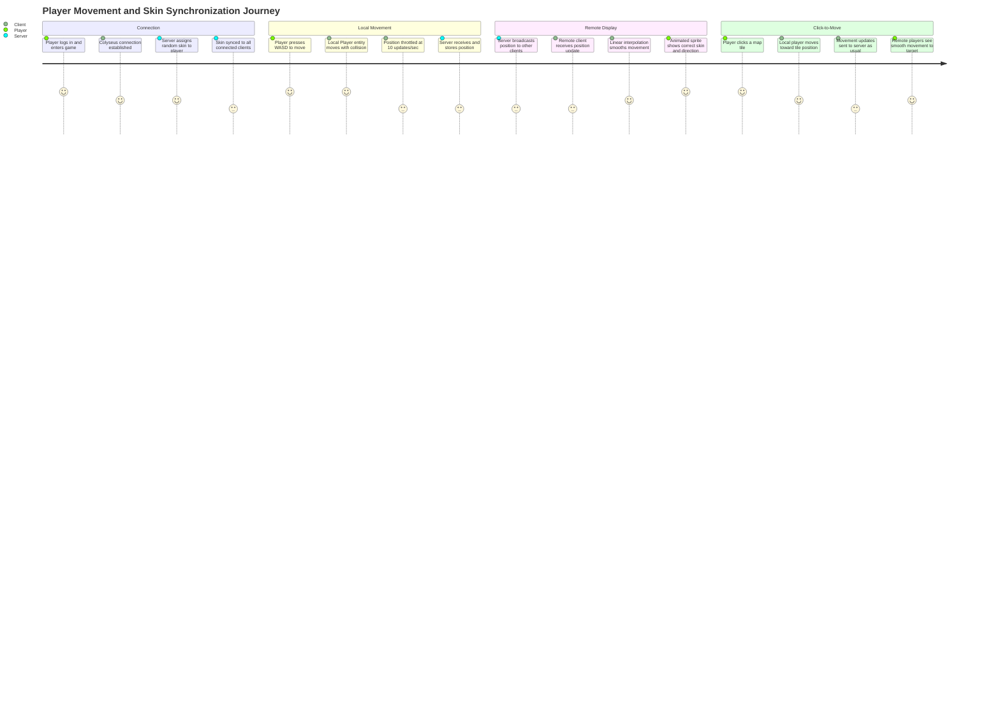
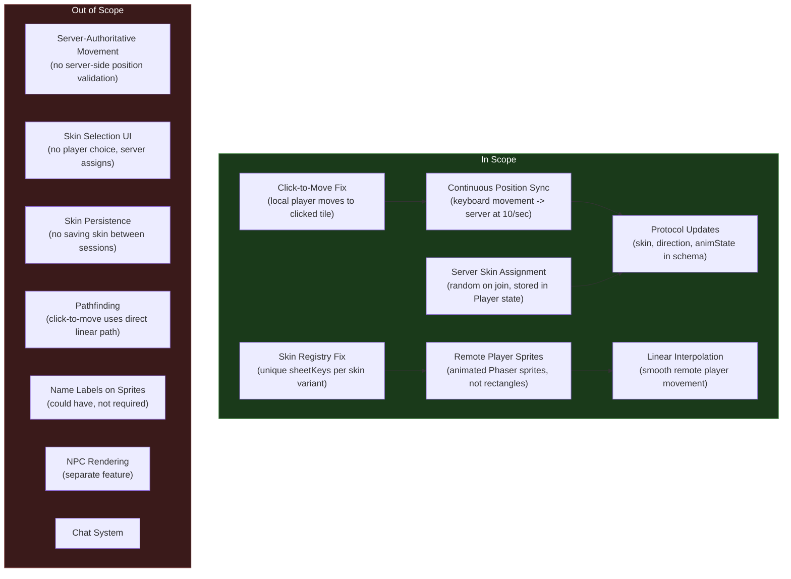

# PRD: Multiplayer Player Movement Synchronization and Skin Display

## Overview

### One-line Summary

Synchronize local player keyboard movement to the Colyseus server in real-time, replace remote player colored rectangles with animated Phaser sprites displaying server-assigned character skins, and fix the skin registry bug that prevents multiple skins from loading.

### Background

Nookstead is a 2D pixel art MMO built with Next.js, Phaser.js 3, and Colyseus. The foundational multiplayer infrastructure was delivered in PRD-002: a Colyseus game server with authentication, a basic GameRoom with player join/leave state, and a client connection service. Players can connect to the server and see each other appear in the room state.

However, the current implementation has significant gaps in the player experience:

1. **No movement synchronization**: The local player has fully functional keyboard movement (WASD/arrows) with collision detection and terrain speed modifiers, but this movement is purely local. The server never receives position updates from keyboard input. The only position updates sent to the server come from click-to-move, which sends tile coordinates rather than the pixel-level positions the movement system uses.

2. **No visual identity for remote players**: When a remote player joins, they are rendered as a colored rectangle (green for local, blue for remote) using Phaser Graphics objects. There are no character sprites, no animations, and no facing direction for remote players. This is a placeholder from the initial multiplayer wiring, not a shippable experience.

3. **Broken skin system**: The skin registry defines 6 scout character variants (`scout_1` through `scout_6`), but all entries share the same Phaser texture key (`char-scout`). When the Preloader iterates over skins and calls `this.load.spritesheet(skin.sheetKey, ...)`, each subsequent load overwrites the previous texture. Only the last-loaded skin (`scout_6`) actually works. This means even the local player cannot display different skins.

4. **Missing server-side skin and direction tracking**: The server Player schema only stores `userId`, `x`, `y`, `name`, and `connected`. There are no fields for skin assignment, facing direction, or animation state. Without these, clients cannot know which character sprite to display for remote players or which direction they are facing.

5. **Click-to-move disconnection**: The Game scene sends click-to-move coordinates to the server via `playerManager.sendMove(tileX, tileY)`, but the local Player entity does not actually move to the clicked position. There is no pathfinding or movement-to-target logic connecting the click event to the local player's state machine.

These gaps mean that while the multiplayer infrastructure works (connections, auth, state sync), the player experience is non-functional for multiplayer gameplay. Players cannot see each other move, cannot distinguish between different characters, and have no visual feedback that the game world is shared.

This PRD addresses these gaps to deliver the first visually functional multiplayer experience: players see each other as animated character sprites, moving in real-time with the correct skin and facing direction.

## User Stories

### Primary Users

| Persona | Description |
|---------|-------------|
| **Player** | An authenticated user who moves their character with keyboard or mouse clicks and expects to see other players as animated characters moving in the shared world. |
| **Remote Player (observed)** | Another authenticated user whose movements, skin, and facing direction must be accurately rendered on each client's screen with smooth interpolation between updates. |
| **Developer** | A team member who needs clear, type-safe contracts for position, skin, and animation state synchronization between client and server. |

### User Stories

```
As a player
I want my keyboard movement (WASD/arrows) to be visible to other connected players
So that I can interact with the multiplayer world by walking around and being seen.
```

```
As a player
I want to see other players as animated character sprites (not colored rectangles)
So that I can visually distinguish between different players and see what they are doing.
```

```
As a player
I want to be assigned a unique character skin when I join the game
So that my character looks different from other players.
```

```
As a player
I want other players' movement to appear smooth on my screen
So that the multiplayer experience feels fluid rather than choppy.
```

```
As a player
I want to click a tile on the map and have my character move there
So that I have an alternative to keyboard movement for navigation.
```

```
As a developer
I want skin, direction, and animation state included in the shared type contracts
So that client and server stay in sync with compile-time safety when the protocol evolves.
```

### Use Cases

1. **Keyboard movement synchronization**: Player A connects and uses WASD to walk around the island. Their local Player entity moves smoothly with collision detection. At the server tick rate (10/sec), the client sends the current pixel position, facing direction, and animation state to the server. Player B, connected in another browser, sees Player A's character sprite walking smoothly using linear interpolation between the received position updates.

2. **Skin assignment and display**: Player A connects to the GameRoom. The server assigns a random skin from the 6 available scout variants (e.g., `scout_3`) and stores it in the Player schema. This skin identifier is synced to all clients. Player B's client receives the skin value, looks up the corresponding texture key, and creates a Phaser sprite with the correct spritesheet. Both players see Player A with the `scout_3` appearance.

3. **Direction and animation sync**: Player A is walking to the right. Their client sends `direction: 'right'` and `animState: 'walk'` as part of the position update. Player B's client receives this state and plays the `walk_right` animation on Player A's remote sprite. When Player A stops, the client sends `animState: 'idle'` and Player B sees Player A switch to the idle animation facing right.

4. **Click-to-move navigation**: Player A clicks a grass tile across the map. The local Player entity begins moving toward that tile position. As the player moves, keyboard-movement-style position updates are sent to the server. Player B sees Player A's character walking toward the destination. When Player A arrives, their character switches to idle.

5. **Multiple players with different skins**: Three players connect. The server assigns `scout_1`, `scout_4`, and `scout_2` respectively. Each player sees the other two as distinct character sprites. All three see smooth movement for remote players, correct facing directions, and appropriate idle/walk animations.

## User Journey Diagram



## Scope Boundary Diagram



## Functional Requirements

### Must Have (MVP)

- [ ] **FR-1: Continuous keyboard movement position sync**
  - The client must send the local player's current pixel position to the server at a throttled rate matching the server tick rate (10 messages/sec, every 100ms).
  - Position must be in pixel coordinates (not tile coordinates), consistent with the local movement system's coordinate space.
  - The message must include `x` (number), `y` (number), `direction` (string: up/down/left/right), and `animState` (string: idle/walk).
  - Position updates must only be sent when the player is actively moving or has just stopped (one final idle update after movement ceases).
  - AC: Given Player A is connected and pressing WASD keys, when the movement state updates, then position messages are sent to the server at approximately 10/sec with pixel coordinates. Given Player B is observing, when Player B inspects the server state, then Player A's x and y values reflect the pixel position, not tile position.

- [ ] **FR-2: Skin registry fix (unique texture keys)**
  - Each skin variant in the skin registry must have a unique `sheetKey` value (e.g., `scout_1`, `scout_2`, ..., `scout_6`) instead of all sharing `char-scout`.
  - The Preloader must load each skin as a separate Phaser spritesheet with its unique key.
  - Animations must be registered per unique sheet key, producing distinct animation keys (e.g., `scout_1_idle_down`, `scout_2_walk_right`).
  - The local Player entity must use the skin's unique sheet key when playing animations.
  - AC: Given 6 skin variants are defined in the registry, when the Preloader completes, then 6 distinct textures exist in the Phaser texture manager, each with a unique key. Given a player is assigned `scout_3`, when the player's idle animation plays, then the animation uses frames from the `scout_3` spritesheet (not `scout_6`).

- [ ] **FR-3: Server-side skin assignment and state tracking**
  - When a player joins the GameRoom, the server must assign a random skin from the available skin list and store it in the Player schema.
  - The Player schema must be extended with: `skin` (string), `direction` (string), `animState` (string).
  - The skin value must be the skin key (e.g., `scout_3`) which the client can map to the corresponding sheet key.
  - The assigned skin must be synchronized to all connected clients via Colyseus state sync.
  - AC: Given a player joins the GameRoom, when `onJoin` completes, then the Player entry in the state map includes a `skin` field with a valid skin key. Given two clients are connected, when a third player joins with skin `scout_2`, then both existing clients receive the new player's skin value in the state update.

- [ ] **FR-4: Remote player sprite rendering with animations**
  - Remote players must be rendered as animated Phaser Sprite objects instead of colored rectangles.
  - The sprite must use the correct spritesheet based on the skin value from the server state.
  - The sprite must display the correct animation based on the `animState` and `direction` fields from the server state (e.g., `scout_3_walk_right`).
  - When the remote player's `animState` or `direction` changes, the sprite animation must update to match.
  - The sprite must use bottom-center anchor (origin 0.5, 1.0) consistent with the local Player entity.
  - AC: Given a remote player with skin `scout_4` is walking right, when the client renders that player, then a Phaser Sprite with the `scout_4` spritesheet is displayed playing the `scout_4_walk_right` animation. Given the remote player stops, when the `animState` changes to `idle`, then the sprite switches to `scout_4_idle_right`.

- [ ] **FR-5: Shared type and protocol updates**
  - The `PlayerState` interface in `packages/shared/src/types/room.ts` must be extended with `skin: string`, `direction: string`, and `animState: string`.
  - A new `PositionUpdatePayload` interface must be added to `packages/shared/src/types/messages.ts` with `x: number`, `y: number` (pixel coordinates), `direction: string`, and `animState: string`. A new `ClientMessage.POSITION_UPDATE` constant must be added. The existing `MovePayload` (tile coordinates) must remain unchanged for click-to-move backward compatibility.
  - A new `AVAILABLE_SKINS` constant must be added to the shared package listing all valid skin keys.
  - AC: Given a developer imports `PlayerState` from `@nookstead/shared`, when TypeScript compiles, then `skin`, `direction`, and `animState` are required string fields. Given a developer imports `PositionUpdatePayload`, then `x`, `y`, `direction`, and `animState` are required fields. The existing `MovePayload` remains unchanged with only `x` and `y` (tile coordinates).

### Should Have

- [ ] **FR-6: Click-to-move verification and fix**
  - Clicking a walkable tile must cause the local Player entity to move toward the clicked tile position using pixel-level movement.
  - The local player must use the same movement system (collision detection, terrain speed modifiers) as keyboard movement.
  - While the player is moving toward the click target, position updates must be sent to the server at the same throttled rate as keyboard movement.
  - Keyboard input must interrupt and override any active click-to-move navigation.
  - Click-to-move must coexist with keyboard movement; they are alternative input methods for the same movement system.
  - AC: Given the local player is standing at tile (10, 10) and clicks tile (15, 12), when the click is registered, then the player character begins moving toward pixel position (15 * 16 + 8, 12 * 16 + 16). Given the player presses a WASD key during click-to-move navigation, when the key is pressed, then click-to-move is cancelled and keyboard movement takes over immediately.

- [ ] **FR-7: Linear interpolation for remote player movement**
  - Remote player sprites must use linear interpolation (lerp) to smoothly transition between received position updates.
  - The interpolation must operate on pixel coordinates, moving the sprite from its current displayed position toward the latest received target position.
  - The interpolation speed must be fast enough to keep up with the 10/sec update rate without visible lag accumulation, but slow enough to eliminate choppiness.
  - If a remote player teleports (position delta exceeds a threshold, e.g., > 5 tiles), the sprite must snap to the new position instantly rather than interpolating.
  - AC: Given a remote player is at pixel (100, 200) and an update arrives placing them at (116, 200), when the client renders the next frames, then the remote sprite moves smoothly from (100, 200) to (116, 200) over approximately 100ms. Given a remote player teleports from (100, 200) to (500, 600), when the position delta exceeds 5 tiles (80 pixels), then the sprite snaps to the new position immediately.

### Could Have

- [ ] **FR-8: Name labels on player sprites**
  - Each player sprite (local and remote) could display a text label above the sprite showing the player's display name.
  - The label should use the player's `name` field from the server state.
  - The label should be positioned above the sprite and centered horizontally.
  - AC: Given a player named "alice" is rendered as a sprite, when the sprite is visible on screen, then a text label "alice" appears centered above the sprite.

### Out of Scope

- **Server-authoritative movement**: The server will accept and store client-reported positions without validation. Server-side position validation, anti-cheat, and speed-hack detection are deferred to a future security-focused PRD. The client-authoritative model is chosen for simplicity during early development where all players are trusted (friends/testers).

- **Skin selection UI**: Players cannot choose their skin. The server assigns a random skin on join. A skin selection screen or character customization UI is a separate feature for a future PRD.

- **Skin persistence**: Skin assignments are not saved to the database. Each time a player joins a room, they receive a new random skin. Persisting skin choice requires database schema changes and a settings system, both out of scope.

- **Pathfinding**: Click-to-move uses direct linear movement toward the target position with the existing collision system (wall-sliding). A* or other pathfinding algorithms that route around obstacles are deferred.

- **NPC rendering**: NPC characters are a separate system. This PRD only covers player character rendering and synchronization.

- **Chat system**: Text communication between players is a separate feature covered in a future PRD.

- **Reconnection with state restoration**: If a player disconnects and reconnects, they receive a fresh skin assignment. Preserving skin and position across reconnections is deferred.

## Non-Functional Requirements

### Performance

- **Position update rate**: 10 messages/sec from each client, matching the server tick rate. This produces smooth enough movement for a tile-based game at 100 pixel/sec player speed without excessive bandwidth.
- **Interpolation smoothness**: Remote player movement must appear smooth at 60fps client rendering. No visible stutter or teleporting between position updates under normal network conditions (< 200ms latency).
- **Bandwidth per player**: Each position update message is approximately 50-80 bytes (x, y as float64, direction and animState as short strings). At 10 messages/sec, this is approximately 500-800 bytes/sec per player, well within WebSocket capacity.
- **Sprite rendering**: Adding animated sprites for up to 10 concurrent players (M0.2 target) must not cause frame rate to drop below 30fps on mid-range hardware. Character spritesheets are 16x32 frames, which is lightweight for modern browsers.
- **Skin loading**: All 6 skin spritesheets must load during the Preloader phase. Total additional memory is approximately 6 spritesheet textures (each roughly 60KB) for 360KB total, which is negligible.

### Reliability

- **Graceful degradation**: If position update messages are temporarily lost (network hiccup), the remote player sprite holds its last known position and resumes interpolation when updates resume. No crash or state corruption occurs.
- **State consistency**: When a player joins mid-session, they receive the full current state snapshot including all connected players' positions, skins, directions, and animation states. No partial state.

### Security

- **No new security surface**: This feature does not add new authentication or authorization requirements. All WebSocket connections are already authenticated via the existing auth bridge (PRD-002). Client-authoritative movement is an intentional design choice for this phase.
- **Input validation**: The server must validate that incoming move messages contain numeric x/y values, a valid direction string, and a valid animState string. Malformed messages are logged and discarded.
- **Skin assignment authority**: Only the server assigns skins. Clients cannot request or override their skin assignment. The skin field in the Player schema is set by `onJoin` and is read-only from the client perspective.

### Scalability

- **10 concurrent players (M0.2 target)**: Position sync at 10/sec for 10 players means 100 messages/sec inbound to the server and 100 state patches/sec outbound (Colyseus delta compression reduces actual bandwidth). This is well within single-process Colyseus capacity.
- **Sprite management**: The PlayerManager creates/destroys sprites dynamically as players join/leave. No pre-allocation or pooling is needed at the 10-player scale.

## Success Criteria

### Quantitative Metrics

1. **Movement visibility**: Given 2 connected players, when Player A walks using WASD, then Player B sees Player A's sprite moving within 200ms (one server tick + one interpolation frame + network latency on localhost).
2. **Skin uniqueness**: Given 6 players connect, when each joins, then at least 2 different skin variants are assigned (random assignment from 6 options with no deduplication means collisions are acceptable, but uniform random should produce variety).
3. **Skin rendering correctness**: Given a player is assigned skin `scout_3`, when another client renders them, then the sprite uses the `scout_3` texture (verifiable by inspecting the Phaser sprite's texture key).
4. **Animation correctness**: Given a remote player is walking right, when observed by another client, then the sprite plays the `walk_right` animation. When the player stops, the sprite switches to `idle_right` within 200ms.
5. **Update rate**: Position updates from the client are sent at approximately 10/sec (verifiable by counting messages over a 10-second window; expected 95-105 messages).
6. **Interpolation smoothness**: Remote player movement appears smooth at 60fps with no visible jumps between updates on localhost (subjective but verifiable by visual inspection).
7. **Click-to-move**: Given the player clicks a walkable tile, when the click is registered, then the local player character begins moving toward that tile (verifiable by position change in subsequent frames).
8. **CI stability**: All existing CI targets (`lint`, `test`, `build`, `typecheck`, `e2e`) continue to pass after all changes.

### Qualitative Metrics

1. **Visual quality**: Remote players look like real game characters, not placeholder rectangles. The multiplayer experience feels like an actual shared game world.
2. **Movement fluidity**: Remote player movement appears natural and continuous, not robotic or choppy. Linear interpolation eliminates the "teleporting between tiles" effect.
3. **Developer ergonomics**: The shared types package provides complete type safety for the updated protocol. Adding new fields to the player state in the future follows a clear pattern (add to shared types, add to Colyseus schema, update client rendering).

## Technical Considerations

### Dependencies

- **Existing Colyseus server (`apps/server`)**: The GameRoom and GameRoomState must be modified to include new schema fields and handle updated move messages. Delivered in PRD-002.
- **Existing Player entity (`apps/game/src/game/entities/Player.ts`)**: The local player movement system (WalkState, IdleState, InputController, movement system) is already implemented. This PRD adds position reporting to the server, not new movement logic.
- **Existing skin registry (`apps/game/src/game/characters/skin-registry.ts`)**: Must be fixed (unique sheetKeys) and extended with a server-compatible skin key list.
- **Existing PlayerManager (`apps/game/src/game/multiplayer/PlayerManager.ts`)**: Must be significantly reworked to create animated sprites instead of colored rectangles, apply interpolation, and handle skin/direction/animState changes.
- **Existing Preloader (`apps/game/src/game/scenes/Preloader.ts`)**: Must load all skin spritesheets with unique keys.
- **Existing animation system (`apps/game/src/game/characters/animations.ts`, `frame-map.ts`)**: Must register animations for each unique skin sheet key.
- **`@colyseus/schema`**: Used for the server-side Player schema extensions.
- **`@nookstead/shared`**: Shared type definitions updated with new fields.
- **Phaser.js 3**: All client-side rendering, sprite management, and animation playback.

### Constraints

- **Client-authoritative movement**: The server stores whatever position the client reports. This is a deliberate simplification for early development. It means a malicious client could teleport or speed-hack. This constraint is acceptable because the current player base is trusted testers.
- **Colyseus schema field types**: `@colyseus/schema` supports primitive types (string, number, boolean) with decorators. The `skin`, `direction`, and `animState` fields are all strings. Enum-like validation must happen in application code, not schema definitions.
- **Shared spritesheet layout**: All 6 scout variants use the same spritesheet layout (same frame positions, same animation rows). The frame-map module's animation definitions work identically for all skins, differing only in the sheet key. If future skins have different layouts, the frame-map module will need per-skin configuration.
- **Pixel coordinate precision**: Phaser positions are floating-point. Colyseus `@type('number')` transmits float64. No precision loss occurs in the sync path.
- **Single room architecture**: All players are in a single GameRoom. Position updates from every player are broadcast to every other player. At 10 players, this is manageable. At higher player counts, spatial partitioning or interest management would be needed (out of scope).

### Assumptions

- The 6 scout spritesheet PNG files (`scout_1.png` through `scout_6.png`) all exist in `public/assets/characters/` and share the same frame layout (16x32 frames, same row structure as documented in `frame-map.ts`).
- The Colyseus server from PRD-002 is operational: server starts, auth works, players can join and leave the GameRoom.
- The Colyseus client SDK `Callbacks` API supports `onChange` for individual schema fields, enabling the client to react to `direction` and `animState` changes.
- Linear interpolation using Phaser's built-in math utilities (`Phaser.Math.Linear`) or manual lerp is sufficient for smooth movement at 10 updates/sec with 100 pixel/sec player speed.
- Click-to-move target position can be stored as a simple pixel coordinate pair on the local Player entity, with the WalkState checking for arrival proximity each frame.

### Risks and Mitigation

| Risk | Impact | Probability | Mitigation |
|------|--------|-------------|------------|
| Skin registry fix breaks existing local player rendering | High | Medium | Test that the local player's animations still work correctly after changing sheetKey from `char-scout` to `scout_1`. Update all references in Player.ts and animation system. |
| Interpolation produces visible jitter at varying network latency | Medium | Medium | Use a fixed interpolation duration (100ms, matching tick interval) rather than network-adaptive timing. If jitter persists, add a small position buffer (2-3 updates deep). |
| Click-to-move and keyboard movement conflict (both active simultaneously) | Medium | Low | Design rule: keyboard input always takes priority. When WASD is pressed, clear the click-to-move target. When click-to-move is active, it feeds into the same movement system as keyboard input. |
| Remote player sprites not cleaned up on disconnect, causing ghost sprites | Medium | Low | The existing PlayerManager `onRemove` callback destroys sprites. Verify this path works with the new Sprite-based rendering. Add defensive cleanup in `PlayerManager.destroy()`. |
| Position update messages flood the server when player moves continuously | Low | Low | Throttle to 10/sec using a timer. Only send updates when position has actually changed since the last sent update (dirty flag). |
| Skin randomization assigns same skin to all players in a session | Low | Medium | Use `Math.random()` seeded per-join. With 6 options and 10 players, some collisions are expected and acceptable. No deduplication is needed for MVP. |
| Colyseus schema changes require client SDK to be aware of new fields | Medium | Low | Colyseus delta sync handles schema evolution. Clients running old code ignore unknown fields. Clients running new code see default values for missing fields. Deploy server and client together. |

## Appendix

### References

- [PRD-002: Colyseus Game Server](./prd-002-colyseus-game-server.md) -- Foundation this PRD builds upon
- [Design-003: Colyseus Game Server Design](../design/design-003-colyseus-game-server.md) -- Technical design for the base server
- [Entity Interpolation (Gabriel Gambetta)](https://www.gabrielgambetta.com/entity-interpolation.html) -- Authoritative reference on entity interpolation for multiplayer games
- [Client-Side Prediction and Server Reconciliation (Gabriel Gambetta)](https://www.gabrielgambetta.com/client-side-prediction-server-reconciliation.html) -- Context for why client-authoritative is simpler but less secure
- [Colyseus Schema State Synchronization](https://docs.colyseus.io/state/schema) -- Colyseus schema decorator system and delta sync
- [Colyseus Client SDK Callbacks](https://docs.colyseus.io/sdk) -- Client-side state change observation
- [Phaser.Math.Linear](https://docs.phaser.io/api-documentation/namespace/Phaser.Math) -- Phaser linear interpolation utility
- [Nookstead GDD](../../nookstead-gdd.md) -- Game design document specifying player speed, tile size, and animation requirements

### Glossary

- **Client-authoritative movement**: A networking model where the client determines its own position and reports it to the server. The server trusts the client's reported position without validation. Simpler to implement but vulnerable to cheating.
- **Linear interpolation (lerp)**: A mathematical technique for smoothly transitioning between two values. For remote player movement, the displayed position is interpolated between the last known position and the most recently received position, producing smooth visual movement between discrete network updates.
- **Skin**: A visual appearance variant for a player character. Each skin uses a different spritesheet PNG but shares the same frame layout and animation definitions. In this project, the 6 scout variants are distinct skins.
- **sheetKey**: The Phaser texture key used to identify a loaded spritesheet in the texture manager. Must be unique per spritesheet to avoid overwrites.
- **animState**: The current animation state of a player character (e.g., `idle`, `walk`). Combined with `direction`, it determines which animation to play (e.g., `walk_right`).
- **Direction**: One of four cardinal directions (`up`, `down`, `left`, `right`) indicating which way the player character is facing. Determines which animation variant to display.
- **Position throttling**: Limiting the rate of position update messages sent from client to server. Prevents network flooding while maintaining smooth synchronization at the server's tick rate.
- **Pixel coordinates**: The continuous coordinate space used by the Phaser rendering engine, as opposed to tile coordinates (integer grid positions). Player movement operates in pixel space for sub-tile-level precision.
- **Delta compression**: Colyseus's technique of only transmitting the fields that changed since the last sync, rather than the full state. Reduces bandwidth when only x/y change but skin/name remain constant.
- **PlayerManager**: The client-side module responsible for managing all player sprites in the game scene, creating sprites when players join, updating them from server state, and destroying them when players leave.
- **MoSCoW**: A prioritization technique categorizing requirements as Must have, Should have, Could have, and Won't have.
- **M0.2**: The second milestone in the Nookstead development roadmap, targeting 10 concurrent players with basic multiplayer functionality.
