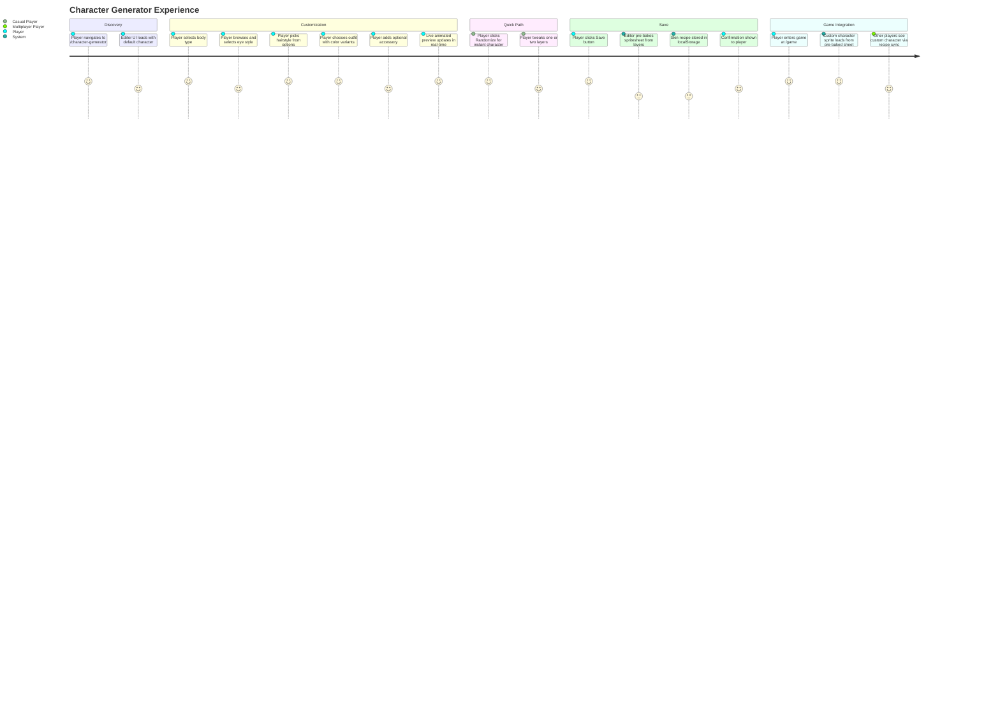
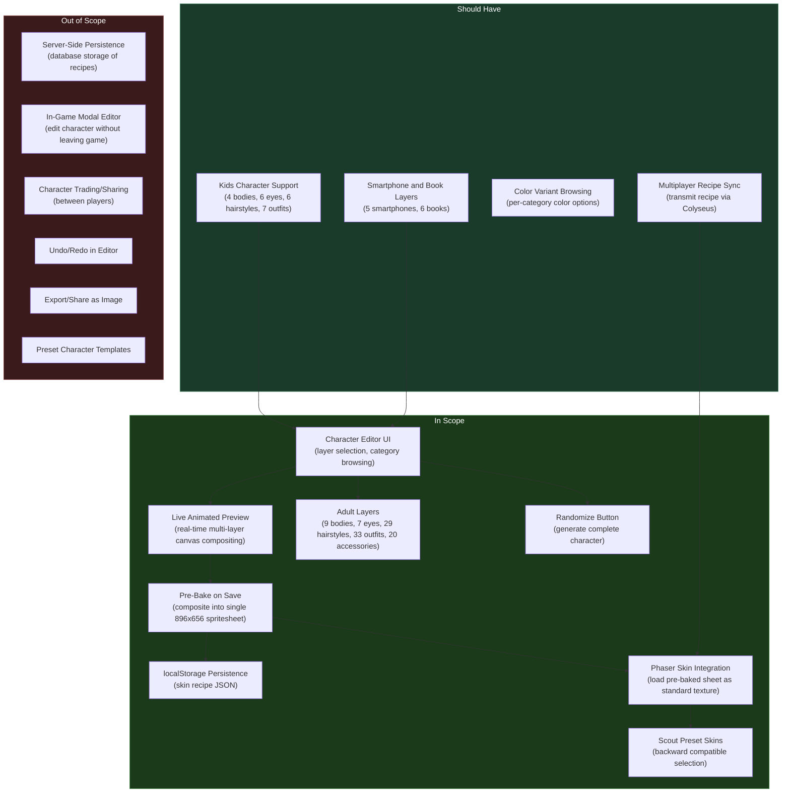

# PRD: Character Generator

## Overview

### One-line Summary

Provide a standalone Character Generator page at `/character-generator` where players composite multiple sprite layers (body, eyes, hairstyle, outfit, accessories, and more) from the LimeZu Modern Interiors Character Generator asset pack to create a unique in-game character skin.

### Background

Nookstead is a 2D pixel art MMO / life sim / farming RPG in early development. The current player character system (PRD-003) supports 6 pre-made scout skins (`scout_1` through `scout_6`) with server-random assignment (PRD-004). While functional for multiplayer testing, this approach gives players zero control over their visual identity. In pixel art MMOs, character customization is a primary driver of player engagement, retention, and self-expression. Market research shows that character customization is increasingly intertwined with player identity expression and community-building in modern indie and pixel art games, with diversity and inclusivity across body types, ages, and styles now considered a baseline expectation rather than a premium feature.

The LimeZu Modern Interiors Character Generator asset pack provides a comprehensive sprite layer system with 9 adult bodies, 4 kids bodies, 7+ eye styles, 29+ hairstyles, 33+ outfits, 20+ accessories, smartphones, and books -- all available at 16x16, 32x32, and 48x48 frame sizes. By compositing these layers in a browser-based editor with real-time preview, then pre-baking the result into a single spritesheet for game use, the feature delivers deep customization with zero runtime performance cost.

An existing Portrait Generator page at `/portrait-generator` (using 32x32 frame assets for portrait-style previews) establishes the architectural pattern: canvas compositing, layer selection UI, and image caching. The Character Generator builds on this pattern but targets the full game spritesheet format (16x16 frame extraction from 927px and 896px wide sheets) and produces a normalized spritesheet compatible with the Phaser skin system.

## User Stories

### Primary Users

| Persona | Description |
|---------|-------------|
| **Player** | A person who wants a unique character appearance in the game world, reflecting their personal style and identity. |
| **Casual Player** | A player who prefers quick character creation via randomization or presets rather than fine-tuning every layer. |
| **Multiplayer Player** | A player whose custom character must be visible to all other connected players in the shared game world. |
| **Developer / Tester** | A team member who needs to verify layer compositing, spritesheet generation, and integration with the Phaser skin system. |

### User Stories

```
As a player
I want to customize my character's body, eyes, hairstyle, outfit, and accessories
So that I have a unique appearance that represents me in the game world.
```

```
As a player
I want to see a live animated preview of my character as I make changes
So that I can evaluate how my choices look in motion before committing.
```

```
As a player
I want to switch between adult and kids character types
So that I can choose the body proportions that match my preferred character style.
```

```
As a player
I want my custom character to appear correctly in multiplayer
So that other players see my unique look when we share the game world.
```

```
As a player
I want a randomize button to generate a complete character instantly
So that I can get quick inspiration or create a character without manual selection.
```

```
As a player
I want to still use preset scout skins if I prefer them
So that I am not forced into the customization workflow to play the game.
```

```
As a player
I want to add items like smartphones and books to my character
So that I can further personalize my character with held objects.
```

### Use Cases

1. **First-time character creation**: A new player navigates to `/character-generator`, selects a body type, browses eye styles, picks a hairstyle and outfit, adds an optional accessory, and watches the live animated preview. Satisfied with the result, they click Save. The editor pre-bakes all layers into a single spritesheet, stores the skin recipe in localStorage, and shows a confirmation. When they enter the game, their custom character appears.

2. **Quick randomization**: A player who just wants to start playing clicks the Randomize button. The editor randomly selects compatible options for each layer and shows the result in the animated preview. The player clicks Save immediately or tweaks a few layers before saving.

3. **Switching to kids character**: A player toggles the "Kids" character type switch. The editor loads kids-specific variants for body, eyes, hairstyle, and outfit layers. Adult-only accessories are grayed out or hidden. The animated preview updates to show the kids body proportions.

4. **Returning to scout preset**: A player who previously created a custom character decides they prefer the scout look. They navigate to a skin selection screen (or the character generator) where preset scout skins are available alongside the custom option. They select `scout_3` and save. The game loads the pre-made scout spritesheet as before.

5. **Multiplayer skin display**: Player A creates a custom character and joins the game. Player B is already in the world using `scout_2`. When Player A appears, their client sends the skin recipe (JSON) via Colyseus. Player B's client receives the recipe, bakes the custom spritesheet locally from the layer assets, and renders Player A's custom character as an animated Phaser sprite.

6. **Editing an existing character**: A player who previously created a custom character revisits `/character-generator`. The editor loads their saved recipe from localStorage and pre-populates all layer selections. They change their hairstyle, click Save, and the spritesheet is re-baked with the updated layers.

## User Journey Diagram



## Scope Boundary Diagram



## Functional Requirements

### Must Have (MVP)

- [ ] **FR-1: Character Generator page at `/character-generator`**
  - A standalone Next.js page accessible at `/character-generator` following the same pattern as the existing `/portrait-generator`.
  - The page is accessible without authentication (consistent with the portrait generator).
  - Dark theme UI consistent with the game's pixel art aesthetic.
  - Responsive layout supporting desktop (1440px+) and tablet (768px+) viewports.
  - AC: Given a user navigates to `/character-generator`, when the page loads, then the character editor UI is displayed with a preview panel and layer selection controls, rendering correctly at 768px and 1440px viewports.

- [ ] **FR-2: Layer selection UI for all adult categories**
  - Provide category-based browsing for the following adult layers:
    - **Body**: 9 body variants
    - **Eyes**: 7 eye styles
    - **Hairstyle**: 29 hairstyle options (including color variants)
    - **Outfit**: 33 outfit options (including color variants)
    - **Accessory**: 20 accessory types
  - Each category is presented as a selectable panel or tab with thumbnail previews of available options.
  - Only one option per category is active at a time (single-select per layer).
  - Eyes, hairstyle, outfit, and accessory layers are optional (can be deselected to show "none").
  - Body layer is always required (cannot be empty).
  - AC: Given the editor is loaded, when the player opens any adult category, then all available options for that category are displayed as selectable thumbnails. When the player selects an option, then it becomes the active choice for that layer and the preview updates immediately.

- [ ] **FR-3: Live animated preview**
  - A canvas-based preview panel that composites all selected layers in real-time.
  - The preview shows the character in an animated state (idle animation cycling through frames).
  - The preview updates immediately when any layer selection changes (no save required).
  - The preview displays the character at a zoomed-in scale for clear visibility (at least 4x the native 16x16 frame size).
  - The preview shows 4 directional views (front, back, left, right) or allows toggling between directions.
  - AC: Given the player has selected a body, eyes, and hairstyle, when the preview renders, then all three layers are composited correctly with the idle animation playing. When the player changes the hairstyle, the preview updates within 100ms to show the new hairstyle composited with existing selections.

- [ ] **FR-4: Per-layer frame extraction handling column mismatch**
  - Body spritesheets are 927px wide (57 columns at 16px frame width).
  - Overlay spritesheets (eyes, outfits, hairstyles, accessories) are 896px wide (56 columns at 16px).
  - The compositing engine must extract frames per-layer using each layer's specific column count, then composite frames at matching animation positions regardless of differing source column counts.
  - AC: Given a body sheet (57 cols) and an eyes overlay (56 cols), when frame 0 of idle-down animation is composited, then the correct body frame and the correct eyes frame are aligned and composited without misalignment. The extra column in the body sheet does not cause overlay frames to shift.

- [ ] **FR-5: Pre-bake spritesheet on save**
  - When the player clicks Save, all selected layers are composited into a single normalized spritesheet (896x656, 56 columns at 16px frame width).
  - The pre-baked spritesheet is stored as a data URL or Blob in localStorage alongside the recipe.
  - The pre-baking process completes in under 2 seconds on average hardware.
  - The resulting spritesheet is pixel-identical to what would be produced by manually layering the individual PNG files in an image editor.
  - AC: Given the player has selected layers and clicks Save, when pre-baking completes, then a single 896x656 PNG spritesheet exists in localStorage. When this spritesheet is loaded as a Phaser texture with 16x16 frame dimensions, all animation states render correctly.

- [ ] **FR-6: Skin recipe persistence in localStorage**
  - The skin recipe is stored as a JSON object in localStorage with the structure:
    ```json
    {
      "type": "custom",
      "body": "Body_03",
      "eyes": "Eyes_02",
      "hairstyle": "Hairstyle_05_03",
      "outfit": "Outfit_12_02",
      "accessory": "Accessory_04_Snapback_1",
      "smartphone": null,
      "book": null,
      "isKid": false
    }
    ```
  - The pre-baked spritesheet data URL is stored alongside the recipe.
  - When the player revisits `/character-generator`, the editor loads the saved recipe and pre-populates all layer selections.
  - AC: Given the player saves a custom character, when they close and reopen `/character-generator`, then all previously selected layers are restored in the editor. When they enter the game, the pre-baked spritesheet loads from localStorage.

- [ ] **FR-7: Integration with Phaser skin system**
  - The pre-baked spritesheet is loadable as a standard Phaser texture using the same frame dimensions and animation definitions as existing scout skins.
  - The game scene checks localStorage for a custom skin on load. If present, it registers the pre-baked spritesheet as a Phaser texture and uses it for the local player character.
  - If no custom skin exists in localStorage, the game falls back to server-assigned scout skins (existing behavior preserved).
  - AC: Given a player has a custom skin saved in localStorage, when the game loads, then the local player character renders with the custom pre-baked spritesheet. All animation states (idle, walk, sit, hit, punch, hurt) play correctly. Given no custom skin exists, the game behaves identically to the current scout skin system.

- [ ] **FR-8: Scout preset skin selection**
  - The character generator (or a skin selection screen) offers the 6 scout skins as preset options alongside the custom character editor.
  - Selecting a scout preset sets the skin type to "preset" with the scout key, and the game loads the corresponding pre-made spritesheet.
  - This preserves full backward compatibility with the existing skin system.
  - AC: Given the player selects the `scout_3` preset, when they enter the game, then the `scout_3` spritesheet is used for their character exactly as in the current system. Custom skin data in localStorage is not deleted (can be restored later).

- [ ] **FR-9: Randomize button**
  - A single button that randomly selects valid options for every layer category (body, eyes, hairstyle, outfit, accessory).
  - Randomization respects compatibility constraints (kids layers only with kids body, adult layers only with adult body).
  - The animated preview updates immediately after randomization.
  - AC: Given the player clicks Randomize, when the randomization completes, then every visible layer category has a randomly selected option and the preview shows the fully composited character with idle animation.

- [ ] **FR-10: Lazy asset loading by category**
  - Asset spritesheets are loaded on-demand when the player opens a category panel, not all at once on page load.
  - The initial page load fetches only the assets needed for the default character display (one body, one eyes, one hairstyle, one outfit).
  - Category thumbnails may use lower-resolution previews or single-frame extractions to avoid loading full spritesheets for browsing.
  - AC: Given the page loads, when initial rendering completes, then fewer than 20 individual spritesheet files have been fetched. When the player opens the Hairstyle category, the hairstyle spritesheet assets begin loading with a visual loading indicator.

### Should Have

- [ ] **FR-11: Kids character support**
  - Toggle between Adult and Kids character types.
  - Kids mode loads kids-specific variants: 4 bodies, 6 eyes, 6 hairstyles, 7 outfits.
  - Switching between Adult and Kids resets incompatible layer selections.
  - The `isKid` flag is stored in the skin recipe.
  - AC: Given the player toggles to Kids mode, when the editor updates, then only kids-compatible layer options are shown. The animated preview shows kids body proportions.

- [ ] **FR-12: Smartphone and Book layers**
  - Additional optional layers for held items: 5 smartphone variants and 6 book variants.
  - Smartphones have different spritesheet dimensions (384x192) and are available only for specific animation states. The editor handles partial-sheet items gracefully.
  - Only one held item can be active at a time (smartphone or book, not both).
  - AC: Given the player selects a smartphone, when the preview renders walk animation, then the smartphone is composited into the appropriate frames. Frames where the smartphone has no data render without the smartphone layer.

- [ ] **FR-13: Color variant browsing per category**
  - Within categories that have color variants (hairstyles, outfits), provide a sub-navigation or grouping that lets players browse by base style first, then select a color variant.
  - AC: Given the player opens the Hairstyle category, when hairstyles are displayed, then variants of the same base hairstyle are visually grouped. The player can select a specific color variant.

- [ ] **FR-14: Multiplayer recipe sync**
  - When a player with a custom skin joins a multiplayer game, their skin recipe (JSON) is transmitted via the Colyseus `PlayerState` (extending the existing `skin` field from PRD-004).
  - Remote clients receive the recipe, fetch the required layer assets, and bake the custom spritesheet locally.
  - Remote player custom skin baking completes in under 1 second.
  - AC: Given Player A has a custom skin and Player B is in the game, when Player A joins, then Player B's client receives the recipe, bakes the spritesheet, and renders Player A's custom character within 1 second of join.

### Could Have

- [ ] **FR-15: Preset character templates**
  - A set of curated, pre-built character configurations (e.g., "Farmer", "Scholar", "Adventurer") that players can load as starting points and then customize further.
  - AC: Given the player clicks a template, then all layers populate with the template's configuration and the preview updates.

- [ ] **FR-16: Export/share character as image**
  - Export the current character preview as a PNG image file for sharing outside the game.
  - AC: Given the player clicks Export, then a PNG file downloads containing the character preview at a reasonable resolution.

- [ ] **FR-17: Undo/redo in editor**
  - Track layer selection history and allow undo/redo of changes within a session.
  - AC: Given the player changes their hairstyle, when they press Ctrl+Z, then the previous hairstyle is restored.

### Out of Scope

- **Server-side persistence**: Skin recipes are stored in localStorage only. Database storage of recipes, server-side rendering, and account-linked persistence are deferred until a user account system is fully established. This simplifies the MVP and avoids premature infrastructure investment.

- **In-game modal editor**: The character generator is a standalone page. Opening a character editor within the game scene (as a modal overlay on the Phaser canvas) requires significant UI architecture work and is a separate feature.

- **Character trading/sharing between players**: No mechanism for players to share, trade, or gift character configurations to other players. Social features around characters are deferred.

- **Server-side spritesheet baking**: All baking happens client-side. A server-side baking service (for CDN caching or faster multiplayer delivery) is a future optimization.

- **Animated GIF export**: The existing portrait generator supports GIF export. The character generator does not require this for MVP. Static PNG export is a Could Have.

- **Mobile-optimized editor**: The editor targets desktop and tablet viewports. A fully touch-optimized mobile layout is deferred.

## Non-Functional Requirements

### Performance

- **Pre-bake time**: Spritesheet pre-baking (compositing all layers into a single 896x656 PNG) must complete in under 2 seconds on average desktop hardware (Intel i5 / M1 equivalent, 8GB RAM, Chrome latest).
- **Preview update latency**: Live preview must update within 100ms of a layer selection change for immediate visual feedback.
- **Initial page load**: The character generator page must reach First Contentful Paint in under 2 seconds on a 4G connection. Lazy loading ensures minimal upfront asset fetching.
- **Asset loading per category**: Opening a new category panel should load its assets within 500ms on a broadband connection. Category thumbnails use optimized single-frame extractions.
- **Game integration overhead**: The pre-baked spritesheet renders identically to scout skins in the Phaser game scene. Zero additional per-frame overhead compared to existing character rendering.
- **Multiplayer baking**: Remote player custom skin baking from recipe must complete in under 1 second so characters appear promptly after joining.

### Reliability

- **localStorage availability**: If localStorage is unavailable (private browsing, storage full), the editor must still function for preview purposes and display a clear message that saving is not possible.
- **Corrupt recipe recovery**: If a stored recipe references assets that no longer exist (asset pack update), the editor falls back to default selections and notifies the player rather than crashing.
- **Spritesheet integrity**: The pre-baked spritesheet must pass validation before being stored: correct dimensions (896x656), non-empty pixel data, and valid PNG format.

### Security

- No new security requirements. The character generator is a client-side tool. No user data is transmitted to a server (localStorage only for MVP). The skin recipe transmitted in multiplayer contains only asset identifiers (string keys), not arbitrary code or user-uploaded content.

### Scalability

- **Asset pack extensibility**: The layer system must support adding new layer categories, new options within existing categories, or new frame sizes without architectural changes to the compositing engine.
- **Recipe format forward-compatibility**: The JSON recipe format includes a `type` field and can be versioned. Future recipe versions can extend the format while maintaining backward compatibility.
- **Multiplayer at scale**: Recipe sync via Colyseus uses compact JSON (under 500 bytes per recipe). Client-side baking avoids server resource scaling concerns. At 100+ concurrent players, the bandwidth impact of recipe transmission is negligible.

## Success Criteria

### Quantitative Metrics

1. **Layer compositing accuracy**: All combinations of body + eyes + hairstyle + outfit + accessory render without misalignment, verified by visual regression tests against reference composites.
2. **Animation correctness**: The pre-baked spritesheet produces correct animations for all 7 states (idle, waiting, walk, sit, hit, punch, hurt) in all 4 directions, verified by loading the sheet into the Phaser game scene and playing each animation.
3. **Pre-bake performance**: Spritesheet pre-baking completes in under 2 seconds on target hardware, measured across 50 random layer combinations.
4. **Preview responsiveness**: Layer selection changes are reflected in the animated preview within 100ms, measured via performance profiling.
5. **localStorage round-trip**: A saved recipe + spritesheet can be loaded from localStorage on page revisit with all layers correctly restored, verified in E2E tests.
6. **Game integration**: A custom character renders in the Phaser game scene with all animation states functional, verified by loading a pre-baked sheet and running the existing animation state machine.
7. **Backward compatibility**: Selecting a scout preset skin results in identical game behavior to the current system (no regression), verified by comparing rendered output.
8. **Asset lazy loading**: Initial page load fetches fewer than 20 spritesheet files (baseline character only), verified by network request count in DevTools.
9. **CI stability**: All existing CI targets (`lint`, `test`, `build`, `typecheck`, `e2e`) continue to pass.

### Qualitative Metrics

1. **Customization satisfaction**: Players can create visually distinct characters that feel personal and unique, with enough variety across categories to avoid "everyone looks the same" syndrome.
2. **Editor usability**: The layer browsing and selection workflow is intuitive without requiring instructions. A new user can create and save a character in under 2 minutes.
3. **Visual coherence**: Custom characters look visually consistent with the game world -- layers composite cleanly without visible seams, z-order artifacts, or color mismatches between layers from different categories.

## Technical Considerations

### Dependencies

- **LimeZu Modern Interiors Character Generator asset pack**: All layer spritesheets (body, eyes, hairstyle, outfit, accessory, smartphone, book) at 16x16 frame size. Assets must be placed in the game's public assets directory.
- **Existing Portrait Generator (`/portrait-generator`)**: Architectural reference for canvas compositing, layer selection UI components, and image caching patterns. Components: `PortraitGenerator`, `PortraitCanvas`, `LayerSelector`, `usePortraitState`.
- **Existing Phaser skin system**: The skin registry (`skin-registry.ts`), animation system (`animations.ts`, `frame-map.ts`), and Preloader must support loading a custom pre-baked spritesheet alongside existing scout skins.
- **Colyseus PlayerState (PRD-004)**: The `skin` field in the player state schema must be extended to support custom skin recipes (JSON string) in addition to scout skin keys.
- **HTML5 Canvas API**: Used for real-time layer compositing in the editor and for pre-baking the final spritesheet.
- **localStorage API**: Used for persisting skin recipes and pre-baked spritesheets on the client.

### Constraints

- **Column count mismatch**: Body sheets have 57 columns (927px / 16px) while overlay sheets have 56 columns (896px / 16px). The compositing engine must handle per-layer column counts when extracting frames. This is the most critical technical challenge and cannot be ignored.
- **Smartphone partial sheets**: Smartphone spritesheets (384x192) cover only specific animation states, not the full animation grid. The compositing engine must handle partial-coverage layers that contribute frames only to certain animations.
- **localStorage size limits**: Most browsers allow 5-10MB in localStorage. A single pre-baked spritesheet PNG as a data URL is approximately 100-300KB. The recipe JSON is under 1KB. Storage is not a concern for a single character but would need reevaluation if multiple saved characters were supported.
- **No server-side baking**: All compositing happens in the browser using Canvas API. Performance depends on client hardware. The 2-second target is based on average desktop hardware.
- **CSS Modules only**: Consistent with project conventions, styling must use CSS Modules (`.module.css`). No Tailwind CSS or styled-components.
- **Path alias**: `@/*` maps to `apps/game/src/*`. All imports must follow this convention.

### Assumptions

- All LimeZu Character Generator spritesheets within a category (e.g., all hairstyles) share the same frame layout, differing only in pixel content. The compositing engine can use a single frame map per category.
- The 16x16 frame extraction from 16x32 game sprites is achievable by treating the spritesheet as a 16x16 grid (since the original asset pack provides 16x16 frame size variants). The game's 16x32 frame size is achieved by combining two vertically adjacent 16x16 frames from the Character Generator sheets.
- The pre-baked spritesheet (896x656, 56 columns) is compatible with the game's animation frame extraction logic when the frame-map module accounts for the column count difference from scout skins (57 columns, 927px).
- Canvas `drawImage` compositing with default `source-over` blend mode produces correct layer stacking (body on bottom, accessories on top) without requiring custom blend modes.
- The skin recipe JSON is small enough (under 1KB) to transmit via Colyseus state sync without impacting network performance.

### Risks and Mitigation

| Risk | Impact | Probability | Mitigation |
|------|--------|-------------|------------|
| Column count mismatch between body (57 cols) and overlays (56 cols) causes animation frame misalignment | High | High | Implement per-layer frame extraction with configurable column counts. Unit test frame alignment across all animation states with body + overlay combinations. |
| Pre-baked spritesheet does not match Phaser animation frame expectations, causing visual glitches in-game | High | Medium | Normalize the pre-baked sheet to a consistent format (896x656, 56 cols). Create integration tests that load the sheet into Phaser and play all animations. Document the exact frame layout. |
| localStorage size limits exceeded with spritesheet data URLs on some browsers | Medium | Low | Measure actual data URL sizes across representative composites. If sizes approach limits, use IndexedDB as a fallback or compress the PNG before encoding to data URL. |
| Lazy loading causes visible loading delays when browsing categories, degrading editor feel | Medium | Medium | Pre-extract single-frame thumbnails at build time for fast category browsing. Load full spritesheets only when the player selects an option for detailed preview. Show loading skeleton UI while assets load. |
| Smartphone partial sheets (384x192) cause errors in the compositing engine which expects full-size sheets | Medium | Medium | Implement sheet dimension detection. For partial sheets, composite only into the animation frames covered by the partial sheet. Document which animations each partial sheet covers. |
| Multiplayer recipe sync adds latency to player join due to client-side baking of remote skins | Medium | Medium | Cache baked spritesheets by recipe hash. If a player with the same recipe was seen before, reuse the cached texture. Show a loading placeholder sprite while baking completes. |
| Custom skin frame layout incompatible with existing scout skin animation definitions | High | Medium | Verify that the normalized 56-column spritesheet can be loaded with an alternate frame-map configuration. The skin registry must support per-skin frame-map variants (56 cols for custom, 57 cols for scouts). |

## Undetermined Items

- [ ] **Frame size for game integration**: The Character Generator assets are natively 16x16 frames (single tile height), while the game uses 16x32 frames (two tile heights). Confirm whether the 16x16 assets are combined into 16x32 frames by pairing vertically adjacent rows, or whether the game animation system needs to be adapted for 16x16-native assets. This requires inspection of the actual spritesheet layout versus the scout skin layout.

- [ ] **Asset hosting for multiplayer baking**: When a remote client needs to bake a custom skin from a recipe, it must have access to the individual layer spritesheets. Confirm whether all layer assets are bundled with the game client (increasing initial download) or fetched on-demand from a CDN when a custom-skin player joins.

## Appendix

### References

- [PRD-003: Player Character System](prd-003-player-character-system.md) -- Establishes the sprite loading, animation, and skin registry architecture
- [PRD-004: Multiplayer Player Movement Synchronization and Skin Display](prd-004-multiplayer-player-sync.md) -- Defines the skin field in Colyseus PlayerState and recipe sync approach
- [LimeZu Modern Interiors Asset Pack](https://limezu.itch.io/) -- Character Generator sprite layer source assets
- [Nookstead GDD](../../nookstead-gdd.md) -- Game design document (Section 7.7: animation rates, Section 15.4: Colyseus state schema)
- [Retro Game Boom 2025: Why Pixel Art Games and Indie Gaming Trends Are Popular Again](https://www.techtimes.com/articles/313127/20251203/retro-game-boom-2025-why-pixel-art-games-indie-gaming-trends-are-popular-again.htm) -- Market context for pixel art character customization
- [Top Trends in Game Art and Animation for 2025](https://www.mellowskystudio.com/blog/top-trends-in-game-art-and-animation-for-2025) -- Character design and customization industry trends
- [HTML5 Canvas API](https://developer.mozilla.org/en-US/docs/Web/API/Canvas_API) -- Core technology for layer compositing
- [Phaser.js 3 Texture Manager](https://phaser.io/docs) -- Runtime texture registration for pre-baked spritesheets

### Skin Recipe Schema

```json
{
  "type": "custom",
  "body": "Body_03",
  "eyes": "Eyes_02",
  "hairstyle": "Hairstyle_05_03",
  "outfit": "Outfit_12_02",
  "accessory": "Accessory_04_Snapback_1",
  "smartphone": null,
  "book": null,
  "isKid": false
}
```

When `type` is `"preset"`, only the `skin` field is needed:
```json
{
  "type": "preset",
  "skin": "scout_3"
}
```

### Asset Dimensions Reference

```
Body spritesheets:     927 x 656 px  (57 cols x 41 rows at 16px frame width)
Overlay spritesheets:  896 x 656 px  (56 cols x 41 rows at 16px frame width)
Smartphone sheets:     384 x 192 px  (partial coverage, specific animations only)
Pre-baked output:      896 x 656 px  (56 cols, normalized to overlay dimensions)
Frame size (native):   16 x 16 px    (Character Generator asset pack)
Frame size (game):     16 x 32 px    (scout skins, 2 tiles tall)
```

### Layer Counts Summary

| Category | Adult Variants | Kids Variants |
|----------|---------------|---------------|
| Body | 9 | 4 |
| Eyes | 7 | 6 |
| Hairstyle | 29 | 6 |
| Outfit | 33 | 7 |
| Accessory | 20 | -- |
| Smartphone | 5 | -- |
| Book | 6 | -- |

### Glossary

- **Skin recipe**: A JSON object describing which asset variant is selected for each layer category. The recipe is the portable representation of a custom character that can be stored, transmitted, and used to re-bake the spritesheet.
- **Pre-bake**: The process of compositing multiple sprite layers into a single spritesheet image. Performed once on save, producing a self-contained spritesheet that requires no runtime compositing during gameplay.
- **Layer**: A single visual component of the character (body, eyes, hairstyle, outfit, accessory, held item). Each layer is a separate spritesheet that is composited on top of other layers in a defined z-order.
- **Spritesheet**: A single image file containing multiple animation frames arranged in a grid. Phaser slices the image into individual frames using a specified frame width and height.
- **Frame extraction**: The process of identifying and isolating individual animation frames from a spritesheet, accounting for the sheet's column count and frame dimensions.
- **Column count mismatch**: The difference in horizontal frame count between body sheets (57 columns, 927px) and overlay sheets (56 columns, 896px). Requires per-layer frame extraction logic.
- **Skin**: A visual appearance for a player character. Can be a "preset" (pre-made scout spritesheet) or "custom" (pre-baked from a recipe).
- **localStorage**: Browser-provided key-value storage (typically 5-10MB) used for client-side persistence of the skin recipe and pre-baked spritesheet.
- **Canvas compositing**: Using the HTML5 Canvas API `drawImage` method to layer multiple sprite images on top of each other, producing a combined output.
- **MoSCoW**: A prioritization technique categorizing requirements as Must have, Should have, Could have, and Won't have.
- **MVP**: Minimum Viable Product; the smallest set of features that delivers user value.
