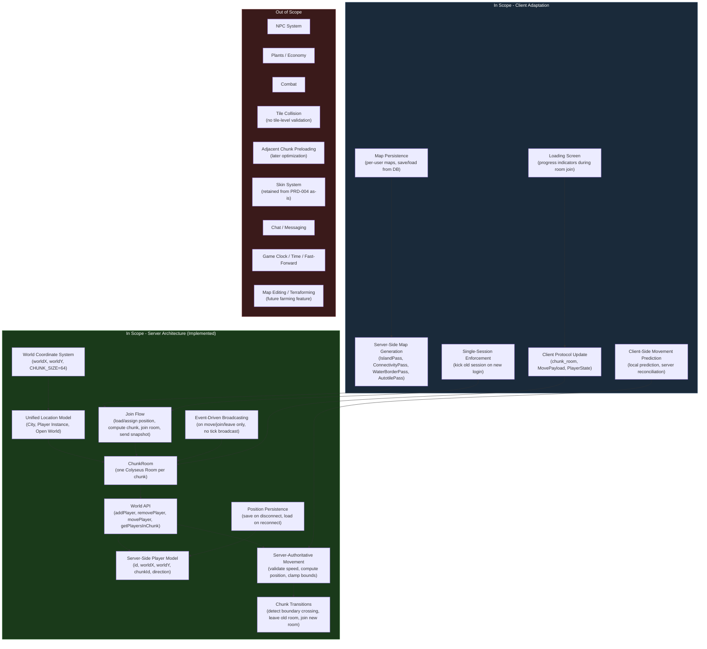

# PRD: Chunk-Based Room Architecture

**Version**: 2.0
**Last Updated**: 2026-02-17

### Change History

| Version | Date | Description |
|---------|------|-------------|
| 1.0 | 2026-02-17 | Initial PRD: Server-side chunk-based room architecture (FR-1 through FR-14) |
| 2.0 | 2026-02-17 | Phase 2: Client adaptation -- client protocol update, movement prediction, server-side map generation, map persistence, loading screen, single-session enforcement (FR-15 through FR-20) |

## Overview

### One-line Summary

Replace the single GameRoom with a chunk-based room system where one Colyseus room maps to one world chunk, with server-authoritative movement, chunk transitions, position persistence, client-side movement prediction with server reconciliation, server-side map generation and persistence, and single-session enforcement.

### Background

Nookstead is a 2D pixel art MMO / life sim / farming RPG built with Next.js, Phaser.js 3, and Colyseus 0.17. The current server architecture, delivered across PRD-002 (Colyseus Game Server) and PRD-004 (Multiplayer Player Sync), established a foundational multiplayer infrastructure: a single `GameRoom` with JWT authentication, player join/leave state, skin assignment, and client-authoritative position synchronization.

However, the single-room architecture cannot support the game's vision of a large, persistent world. All connected players occupy one room regardless of their world location, meaning the server broadcasts every player's position to every other player even when they are on opposite sides of the world. Movement is client-authoritative (the client reports its own position, the server trusts it without validation), which provides no protection against cheating and no foundation for server-driven game logic like NPC interactions or farming timers.

The Nookstead world consists of three distinct location types that each require different ownership and lifecycle semantics:

1. **City locations** -- Static, manually designed areas shared by all players (shops, NPC homes, town squares).
2. **Player instances** -- Personal zones (farms, houses) owned by individual players, activated when the owner enters and sleeping when empty.
3. **Open world** -- A large procedurally generated region shared by all players, composed of many chunks generated deterministically from a seed.

Despite these differences, all three location types share the same fundamental abstraction: they are composed of chunks, each chunk maps to one Colyseus room, and the server treats all chunks identically for movement, broadcasting, and player management.

This PRD defines the replacement of the current single-room system with a chunk-based room architecture where rooms are created and disposed dynamically as players move through the world. The server becomes the authority for player movement, computing positions from client movement inputs rather than accepting client-reported coordinates. Player positions are persisted to the database on disconnect and restored on reconnect, providing session continuity.

Phase 1 (server-side, FR-1 through FR-14) has been implemented and tested. It established the spatial foundation -- chunk-based rooms, server-authoritative movement, position persistence, and chunk transitions.

Phase 2 (client adaptation, FR-15 through FR-20) extends the architecture to the client. The game client must be updated to speak the new server protocol (dx/dy movement inputs, chunk room connections, chunk transitions). Client-side movement prediction with server reconciliation is introduced to provide responsive movement despite the server-authoritative model. Map generation moves from the client to the server, with map data persisted per-user and transmitted to clients on room join. A loading screen ensures a smooth experience during room joins. Single-session enforcement prevents duplicate logins.

No gameplay features are included -- only the structural foundation of rooms, players, movement, persistence, and the client integration layer.

## User Stories

### Primary Users

| Persona | Description |
|---------|-------------|
| **Player** | An authenticated user who connects to the game, moves through different areas of the world, and sees other players in the same chunk moving in real-time. |
| **Returning Player** | A player who disconnects and later reconnects, expecting to resume where they left off in the world. |
| **Developer** | A team member who needs a clean, testable architecture for building gameplay features on top of the chunk-based room system. |
| **Game Client (system)** | The Phaser.js game running in the browser that must join the correct chunk room, send movement inputs, receive authoritative position updates, and handle chunk transitions seamlessly. |
| **Multi-device Player** | A player who may have the game open in multiple browser tabs or devices, expecting a clear resolution (newest session wins) rather than conflicting dual sessions. |

### User Stories

```
As a player
I want to join the game and appear in a specific location in the world
So that I can begin exploring and interacting with the shared game world.
```

```
As a player
I want to see other players who are in the same area as me, but not players who are far away
So that the game feels spatially coherent and the server is not overwhelmed with irrelevant updates.
```

```
As a player
I want my movement to be validated by the server
So that the game world is fair and consistent for everyone.
```

```
As a player
I want to walk seamlessly from one chunk of the world into an adjacent chunk
So that the world feels continuous rather than divided into disconnected zones.
```

```
As a returning player
I want to appear where I last logged out when I reconnect
So that I do not lose my place in the world between sessions.
```

```
As a player
I want to visit the city, my personal farm, and the open world
So that I can experience the different areas the game offers.
```

```
As a developer
I want the server to own all player state and movement logic
So that I can build game mechanics (NPC interaction, farming, events) with confidence that the server state is authoritative.
```

```
As a developer
I want chunk rooms to be created on demand and disposed when empty
So that server resources are used efficiently and the system scales with actual player distribution.
```

```
As a player
I want my character to move instantly when I press a key, even though the server validates my movement
So that the game feels responsive and there is no visible input lag.
```

```
As a player
I want to see my homestead map load when I join the game
So that I can explore and interact with my personal world.
```

```
As a returning player
I want the game to show a loading screen while map and player data are being received
So that I am not confused by a blank or partially rendered world.
```

```
As a player
I want my map to be saved between sessions
So that any changes to my homestead persist and I see the same map when I return.
```

```
As a multi-device player
I want only one active session at a time, with the newest session taking priority
So that I do not experience desync or conflicting game states across tabs or devices.
```

```
As a developer
I want map generation to happen on the server
So that clients cannot tamper with map data and all players see a consistent world.
```

### Use Cases

1. **First-time connection**: A new player logs in, has no saved position, and is placed at a default spawn point in the city (e.g., `city:capital`). The server computes the chunk, creates or joins the corresponding ChunkRoom, and sends the player a snapshot of all other players currently in that chunk. The player's character appears in the city.

2. **Movement within a chunk**: A player presses WASD to move. The client sends a movement input message (`dx`, `dy`) to the server. The server validates the speed (clamps if too fast), computes the new world position, updates the authoritative player state, and broadcasts the position change to all other players in the same chunk room.

3. **Chunk boundary crossing**: A player walks north and crosses from chunk `world:3:5` into chunk `world:3:4`. The server detects the chunk change, removes the player from the old ChunkRoom, adds them to the new ChunkRoom (creating it if necessary), and sends the player a snapshot of all players in the new chunk. Players in the old chunk see the player disappear; players in the new chunk see the player appear.

4. **Disconnect and reconnect**: A player disconnects (browser closes, network drop). The server saves their current world position (`worldX`, `worldY`, `chunkId`) to the database. When the player reconnects later, the server loads their saved position, computes the correct chunk, and places them there. The player sees the world exactly as they left it (minus other players who have since moved).

5. **Visiting a player instance**: A player enters a portal or travel node that takes them to their personal farm (`player:{playerId}:farm`). The server transitions them from their current chunk to the farm chunk. The farm ChunkRoom is created on demand. When the player leaves their farm, the room is disposed if no other players remain.

6. **Multiple players in same open-world chunk**: Three players are exploring the open world and happen to be in the same chunk `world:7:2`. They all see each other's movements in real-time. A fourth player crosses into the chunk from the south and appears to all three. One of the original players crosses the northern boundary and disappears from the chunk.

7. **Responsive movement with prediction**: A player presses the right arrow key. The client immediately moves the character sprite to the right (predicted position) and simultaneously sends `{ dx: 3, dy: 0 }` to the server. The server responds with the authoritative position. The predicted position is within 2 pixels of the authoritative position, so the client smoothly interpolates to the server position over a few frames. The player perceives instant, fluid movement.

8. **Movement prediction with large correction**: A player's predicted position drifts significantly from the server's authoritative position (e.g., due to speed clamping or a network delay causing stale predictions). The delta exceeds the correction threshold. The client snaps the player to the authoritative position immediately rather than interpolating, preventing prolonged desync.

9. **First-time map generation**: A new player connects for the first time. The server detects no saved map for this user, generates a homestead map using the pipeline (IslandPass, ConnectivityPass, WaterBorderPass, AutotilePass) with a random seed, saves the map to the database, and sends the complete map data to the client alongside the player position. The client renders the received map without any local generation.

10. **Returning player map load**: A returning player connects. The server loads their previously saved map from the database and sends it to the client on room join. The map is identical to what the player saw in their last session.

11. **Loading screen during room join**: A player joins a chunk room. The client displays a loading screen with progress indicators: "Connecting...", "Loading map...", "Loading players...". Once map data and the player snapshot have both been received and processed, the loading screen fades out and the game scene begins.

12. **Duplicate session resolution**: A player has the game open in Tab A. They open a new tab (Tab B) and log in. The server detects that this userId already has an active session (Tab A). The server sends a "kicked" message to Tab A, which displays an error modal: "You logged in from another location." Tab A's game connection closes. Tab B proceeds normally as the sole active session.

## User Journey Diagram


## Scope Boundary Diagram



## Functional Requirements

### Must Have (MVP)

- [ ] **FR-1: World Coordinate System**
  - Player positions are expressed as world coordinates: `worldX` (number), `worldY` (number).
  - `CHUNK_SIZE` is defined as 64 logical tiles (shared constant in `@nookstead/shared`).
  - Chunk coordinates are derived from world position: `chunkX = floor(worldX / CHUNK_SIZE)`, `chunkY = floor(worldY / CHUNK_SIZE)`.
  - Chunk IDs follow three formats depending on location type:
    - Open world: `world:{chunkX}:{chunkY}`
    - City: `city:{locationName}`
    - Player instance: `player:{playerId}:{zoneName}`
  - AC: Given a player is at worldX=130, worldY=70 in the open world, when the chunk is computed, then chunkX=2 and chunkY=1, and the chunkId is `world:2:1`. Given a player is in the capital city, then the chunkId is `city:capital` regardless of their pixel position within the city.

- [ ] **FR-2: Unified Location Model**
  - All world locations are represented as a `Location` structure with `id`, `type` (one of `CITY`, `PLAYER`, `OPEN_WORLD`), and a set of associated chunks.
  - Despite differing ownership and generation semantics, all location types share the same room model, player model, and movement logic.
  - Rooms map to chunks. The World logic treats all chunk types identically for movement, broadcasting, and player management.
  - AC: Given a ChunkRoom is created for `city:capital`, when the room processes a move message, then the same movement validation and broadcasting logic executes as for a room created for `world:3:5` or `player:abc:farm`.

- [ ] **FR-3: Chunk-Based Room Model (ChunkRoom)**
  - One Colyseus Room instance exists per active chunk. The room is named `chunk:{chunkId}` (e.g., `chunk:world:3:5`, `chunk:city:capital`).
  - ChunkRoom replaces the existing GameRoom entirely. The GameRoom class and its registration are removed.
  - ChunkRoom responsibilities:
    - `onJoin`: Register the player in the World, send chunk snapshot to the joining client.
    - `onLeave`: Remove the player from the World, trigger position persistence if disconnecting.
    - `onMessage("move")`: Forward the movement input to the World API for authoritative processing.
    - Broadcast position diffs when the World notifies of player state changes.
  - ChunkRoom does NOT compute movement logic directly. It delegates to the World API.
  - ChunkRooms are created on demand when the first player enters a chunk, and disposed when the last player leaves.
  - AC: Given no players are in chunk `world:3:5`, when a player's computed chunk is `world:3:5`, then a new ChunkRoom is created for `chunk:world:3:5`. Given that player later crosses into `world:3:4` and no other players remain, then the `chunk:world:3:5` room is disposed. Given two players are in the same chunk, when one sends a move message, then the other receives a position diff broadcast.

- [ ] **FR-4: Server-Side Player Model**
  - The server maintains a `Player` structure with at minimum: `id` (string), `worldX` (number), `worldY` (number), `chunkId` (string), `direction` (string: up/down/left/right).
  - The World module owns all player states authoritatively. ChunkRooms mirror the relevant subset of player states for their chunk.
  - Player state changes originate in the World and are propagated to ChunkRooms for broadcasting.
  - AC: Given a player is registered in the World at worldX=100, worldY=200, when the ChunkRoom for that player's chunk is queried, then the room's state reflects worldX=100, worldY=200. Given the World updates the player's position to worldX=102, worldY=200, then the ChunkRoom state is updated accordingly before the next broadcast.

- [ ] **FR-5: Join Flow**
  - When a client connects and authenticates:
    1. The server checks the database for a saved position for this player (by userId).
    2. If a saved position exists, the server uses it (worldX, worldY).
    3. If no saved position exists (new player), the server assigns a default spawn position (configurable, e.g., the center of `city:capital`).
    4. The server computes the chunkId from the position.
    5. The client joins the ChunkRoom for that chunk.
    6. The World registers the player.
    7. The ChunkRoom sends a snapshot of all players currently in the chunk to the joining client.
  - The snapshot includes each player's id, worldX, worldY, and direction.
  - AC: Given a new player with no saved position connects, when onJoin completes, then the player is placed at the default spawn position and the client receives a snapshot listing all players in the spawn chunk. Given a returning player with a saved position at worldX=500, worldY=300 connects, when onJoin completes, then the player is placed at worldX=500, worldY=300 in the correct chunk.

- [ ] **FR-6: Server-Authoritative Movement**
  - The client sends movement inputs as `{ dx: number, dy: number }` representing the desired direction of movement (not the desired target position).
  - The server processes movement:
    1. Validates the movement speed: the magnitude of (dx, dy) must not exceed the maximum allowed speed. If it does, the vector is clamped (normalized to maximum magnitude).
    2. Computes the new position: `newWorldX = worldX + validatedDx`, `newWorldY = worldY + validatedDy`.
    3. Validates world bounds: the new position must be within the world boundaries. If out of bounds, clamp to the nearest valid position.
    4. Updates the player's state in the World.
    5. If the new position falls in a different chunk than the current one, triggers a chunk transition (FR-7).
    6. Marks the player as dirty for broadcasting.
  - The server does NOT perform tile-level collision detection in Phase 1. Only speed clamping and world-bounds validation are applied.
  - AC: Given a player at worldX=100, worldY=200 sends dx=3, dy=0, when the server processes the move, then the player's new position is worldX=103, worldY=200 (assuming within bounds and within speed limit). Given a player sends dx=9999, dy=0 (exceeding max speed), when the server processes the move, then the dx is clamped to the maximum allowed delta and the player moves by at most that amount.

- [ ] **FR-7: Chunk Transitions**
  - When the World detects that a player's new position falls in a different chunk than their current chunkId:
    1. The World updates the player's chunkId to the new chunk.
    2. The server sends a `CHUNK_TRANSITION` message to the client with the new chunkId.
    3. The client leaves the old ChunkRoom (other players in that room see the player leave via Colyseus onLeave).
    4. The client joins the new ChunkRoom for the new chunk (creating it on the server if it does not exist).
    5. The new ChunkRoom sends a snapshot of all players in the new chunk to the transitioning player.
  - Note: Chunk transitions are server-triggered but client-executed. The server detects the boundary crossing and notifies the client; the client performs the room leave/join sequence.
  - Chunk transitions must be seamless from the player's perspective. There should be no noticeable gap or interruption.
  - AC: Given a player is in chunk `world:3:5` and moves to a position that maps to `world:4:5`, when the move is processed, then the player is removed from the `chunk:world:3:5` room and added to the `chunk:world:4:5` room. Players in `world:3:5` receive a player-left event. Players in `world:4:5` receive a player-joined event with the player's current position.

- [ ] **FR-8: Event-Driven Broadcasting**
  - Position updates are broadcast to all clients in a ChunkRoom only when a player's state changes:
    - Player moved (position changed).
    - Player joined the chunk.
    - Player left the chunk.
  - There is NO periodic full-state broadcast at a fixed tick rate. Broadcasts are triggered by events, not by timers.
  - Broadcast payloads contain only the changed player's state (id, worldX, worldY, direction), not the full room state.
  - AC: Given a ChunkRoom contains 3 players and none are moving, when 1 second passes, then zero broadcast messages are sent. Given player A moves, when the server processes the move, then a single position-diff message is broadcast to the other 2 players in the room. Player A does not receive their own diff.

- [ ] **FR-9: Position Persistence**
  - When a player disconnects (onLeave with a disconnect reason), the server saves the player's current position (worldX, worldY, chunkId) to the database.
  - When a player reconnects, the server queries the database for their saved position and uses it as their starting position (as described in FR-5).
  - New players who have never connected before have no saved position; they receive the default spawn.
  - The database schema must include a table or columns for storing player position (associated with the user's id from the existing `users` table).
  - AC: Given a player at worldX=500, worldY=300 in chunk `world:7:4` disconnects, when the disconnect is processed, then a database record is created or updated with userId, worldX=500, worldY=300, chunkId=`world:7:4`. Given that player reconnects, when the join flow executes, then the player starts at worldX=500, worldY=300.

- [ ] **FR-10: World API**
  - The World module exposes a minimal API consumed by ChunkRooms:
    - `addPlayer(player)` -- Register a player in the world state.
    - `removePlayer(playerId)` -- Remove a player from the world state.
    - `movePlayer(playerId, dx, dy)` -- Process a movement input. Returns `{ newPosition: { worldX, worldY }, chunkChanged: boolean, oldChunkId?: string, newChunkId?: string }`.
    - `getPlayersInChunk(chunkId)` -- Return all players currently in the specified chunk.
  - ChunkRooms call these methods exclusively. They do not manipulate player state directly.
  - AC: Given 3 players exist in chunk `world:2:3`, when `getPlayersInChunk('world:2:3')` is called, then an array of 3 player objects is returned. Given `movePlayer('p1', 2, 0)` is called and the new position crosses into chunk `world:3:3`, then the return value includes `chunkChanged: true`, `oldChunkId: 'world:2:3'`, `newChunkId: 'world:3:3'`.

### Should Have

- [ ] **FR-11: Shared Constants and Types Update**
  - The `@nookstead/shared` package is updated with:
    - `CHUNK_SIZE = 64` constant.
    - Updated `ClientMessage` with a new `MOVE` message type for directional input (`{ dx, dy }`), distinct from the legacy tile-coordinate move.
    - `ChunkId` type alias and utility functions for parsing/constructing chunk IDs.
    - `LocationType` enum: `CITY`, `PLAYER`, `OPEN_WORLD`.
    - Updated `PlayerState` interface reflecting the new fields (worldX, worldY, chunkId, direction).
  - AC: Given a developer imports `CHUNK_SIZE` from `@nookstead/shared`, when TypeScript compiles, then the value 64 is available. Given a developer imports `LocationType`, then the three location type values are available as enum members.

- [ ] **FR-12: Default Spawn Configuration**
  - The default spawn position for new players is configurable via a server configuration constant (not hardcoded in the join flow).
  - The default spawn should be a position within `city:capital` (e.g., the center of the city).
  - AC: Given a new player connects with no saved position, when the join flow assigns a spawn, then the position matches the configured default spawn coordinates. Given the default spawn is changed in configuration, then new players spawn at the updated location without code changes.

### Could Have

- [ ] **FR-13: ChunkRoom Player Count Monitoring**
  - Each ChunkRoom tracks and logs its player count on join and leave events.
  - A server-level API or log output reports the total number of active ChunkRooms and the distribution of players across them.
  - AC: Given 5 ChunkRooms are active with varying player counts, when the monitoring is queried, then a summary of active rooms and their player counts is available.

- [ ] **FR-14: Graceful Chunk Transition Error Handling**
  - If a chunk transition fails (e.g., new room creation fails), the player remains in their current chunk at their previous position rather than being dropped.
  - An error is logged and the client receives an error message.
  - AC: Given a chunk transition encounters an error during new room creation, when the error occurs, then the player's position is reverted to their pre-move position, they remain in their current room, and an error event is sent to the client.

### Must Have (Client Adaptation)

- [ ] **FR-15: Client Protocol Update**
  - The game client connects to the room type `chunk_room` instead of the legacy `game_room`.
  - The client sends movement as `MovePayload { dx: number, dy: number }` instead of the legacy `PositionUpdatePayload { x, y, direction, animState }`.
  - The client reads player state from `PlayerState { worldX, worldY, chunkId }` instead of the legacy `{ x, y }` fields.
  - The client handles `ServerMessage.CHUNK_TRANSITION` messages. On receiving a chunk transition message, the client leaves the current room and joins the new chunk room specified in the message.
  - The Colyseus service module manages the room lifecycle: connect to the server, join a chunk room by chunkId, leave the current room, and join a new room on transition.
  - The multiplayer player manager creates, updates, and removes remote player sprites based on the new `PlayerState` schema (worldX, worldY, chunkId, direction).
  - Player sprites use `worldX` and `worldY` for positioning instead of the legacy `x` and `y` fields.
  - AC: Given a client connects to the server, when the connection is established, then the client joins a room of type `chunk_room` (not `game_room`). Given a player presses a movement key, when the client sends a message to the server, then the payload contains `{ dx, dy }` (not `{ x, y, direction, animState }`). Given a remote player's state changes on the server, when the client receives the update, then the player sprite is positioned at `(worldX, worldY)`. Given the server sends a `CHUNK_TRANSITION` message with a new chunkId, when the client processes it, then the client leaves the current room and joins the new chunk room.

- [ ] **FR-16: Client-Side Movement Prediction**
  - When the player presses a movement key, the client immediately applies the movement locally (predicted position) for instant visual feedback. Simultaneously, the client sends the `{ dx, dy }` input to the server.
  - The player entity tracks two positions: the predicted position (updated locally on input) and the authoritative position (updated on server response).
  - When the server responds with the authoritative position, the client reconciles the predicted position with the authoritative position:
    - If the delta between predicted and authoritative positions is below a configurable threshold (small correction), the client smoothly interpolates from the predicted position to the authoritative position over several frames.
    - If the delta exceeds the threshold (large correction), the client snaps to the authoritative position immediately to prevent prolonged desync.
  - The correction threshold is a configurable constant (e.g., 8 pixels).
  - The movement system supports a prediction mode where local input is applied immediately and server corrections are reconciled.
  - The WalkState sends `{ dx, dy }` directional input instead of absolute positions.
  - AC: Given a player presses the right arrow key, when the client processes the input, then the player sprite moves to the right immediately (within the same frame) AND a `{ dx, dy }` message is sent to the server. Given the server responds with an authoritative position that is 3 pixels from the predicted position (below threshold), when the client reconciles, then the sprite smoothly interpolates to the authoritative position over multiple frames. Given the server responds with an authoritative position that is 20 pixels from the predicted position (above threshold), when the client reconciles, then the sprite snaps to the authoritative position in a single frame.

- [ ] **FR-17: Server-Side Map Generation**
  - Map generation logic runs on the server, not the client. The server generates maps using the existing pipeline: IslandPass, ConnectivityPass, WaterBorderPass, AutotilePass.
  - When a new player connects and has no saved map, the server generates a homestead map with a random seed and sends the complete map data to the client.
  - When a returning player connects and has a saved map, the server loads the map from the database and sends it to the client.
  - The map data sent to the client includes: the tile grid (terrain types), rendered tile layers (with Phaser frame indices from AutotilePass), and walkability data.
  - The client receives the map data and renders it directly. The client does not perform any map generation.
  - The map generation pipeline is deterministic: the same seed produces the same map. Seeds are stored with the map for reproducibility.
  - Map data is sent to the client as part of the room join flow, alongside the player position and player snapshot.
  - AC: Given a new player with no saved map connects, when the join flow completes, then the server has generated a map, saved it to the database, and sent the complete map data (grid, layers, walkable) to the client. Given a returning player with a saved map connects, when the join flow completes, then the server has loaded the map from the database and sent it to the client. Given two maps are generated with the same seed, when the outputs are compared, then the grid, layers, and walkability data are identical.

- [ ] **FR-18: Map Persistence**
  - A new `maps` database table stores per-user map data with the following schema:
    - `userId` (primary key, foreign key to `users` table): the owner of the map.
    - `seed` (number): the random seed used to generate the map, stored for reproducibility.
    - `grid` (JSONB): the raw terrain grid (array of tile type identifiers).
    - `layers` (JSONB): the rendered tile layers with Phaser frame indices, ready for client rendering.
    - `walkable` (JSONB): the walkability grid (boolean array indicating which tiles are passable).
    - `updatedAt` (timestamp): the last time the map was modified.
  - Each player has exactly one homestead map. The map is created on first connection and persisted indefinitely.
  - On first connection (no map exists for userId): the server generates a map with a random seed, inserts the map record into the database, and sends the data to the client.
  - On reconnection (map exists for userId): the server queries the map by userId, loads the data, and sends it to the client.
  - The database migration for the `maps` table is additive and backward-compatible.
  - AC: Given a new player connects for the first time, when the join flow completes, then a row exists in the `maps` table with their userId, a seed, grid, layers, and walkable data. Given a returning player connects, when the server queries `maps` by userId, then the previously saved map data is returned. Given the `maps` migration runs, when the existing database is checked, then no existing tables or data are affected.

- [ ] **FR-19: Loading Screen on Room Join**
  - When the client joins a chunk room, a loading screen is displayed while the client waits for essential data from the server.
  - The loading screen displays progress indicators showing the current stage:
    - "Connecting..." -- while the WebSocket connection to the room is being established.
    - "Loading map..." -- while waiting for map data from the server.
    - "Loading players..." -- while waiting for the player list snapshot.
  - The game scene does not start rendering until all required data has been received: map data AND player snapshot.
  - Once all data is received and processed into a renderable format, the loading screen transitions to the game scene.
  - The loading screen is implemented as a Phaser scene (or an overlay within the existing scene structure) that runs before the main game scene.
  - **Failure handling**: If any required data (map data or player snapshot) fails to arrive within a configurable timeout (default: 10 seconds), the loading screen displays an error message with a "Retry" option. Clicking retry re-attempts the room join from scratch. If the WebSocket connection fails during the "Connecting..." stage, the loading screen displays "Connection failed" with a retry option. A `LOADING_TIMEOUT_MS` constant (default 10000) is defined in `@nookstead/shared`.
  - AC: Given a player joins a chunk room, when the room connection is established but map data has not yet arrived, then the loading screen is visible showing "Loading map...". Given the map data arrives but the player snapshot has not yet arrived, when the loading screen updates, then it shows "Loading players...". Given both map data and player snapshot have been received, when the client finishes processing, then the loading screen is dismissed and the game scene renders with the map and all players visible. Given the client has been waiting for map data for more than 10 seconds, when the timeout expires, then the loading screen shows an error message with a "Retry" button.

- [ ] **FR-20: Single-Session Enforcement**
  - The server tracks active sessions per userId in memory (no database persistence required for session tracking).
  - When a player connects and authenticates, the server checks if an active session already exists for that userId.
  - If an active session exists (old session), the server sends a "kicked" message to the old session's client, then forcibly disconnects the old session.
  - The new session proceeds normally and becomes the active session for that userId.
  - The old session's client receives the "kicked" message and displays an error modal to the user: "You logged in from another location."
  - The old session's game connection is closed. The player cannot interact with the game from the old tab/browser.
  - Session tracking is cleaned up on disconnect (both voluntary and involuntary). When a player disconnects, their entry is removed from the session tracker.
  - Session tracking is per-server-process (in-memory map). In a single-process deployment, this is sufficient.
  - AC: Given a player is connected in Tab A, when the same player connects in Tab B, then Tab A receives a "kicked" message and is disconnected, and Tab B proceeds normally. Given a player is connected and then disconnects, when the session tracker is checked, then no entry exists for that userId. Given a player has no active session, when they connect, then no "kicked" message is sent to any client and the connection proceeds normally.

### Out of Scope

- **NPC System**: AI-powered NPC behavior, memory, planning, and rendering are a separate feature. The chunk-based architecture provides the spatial foundation NPCs will inhabit, but no NPC logic is included.
- **Plants / Economy**: Farming mechanics, inventory, crafting, and trading systems are built on top of the chunk architecture in future phases.
- **Combat**: No combat mechanics, damage, or health systems.
- **Tile-Level Collision Detection**: The server does not validate movement against tile walkability data. Only speed clamping and world-bounds validation are performed. Tile collision is a future enhancement.
- **Adjacent Chunk Preloading**: Clients do not preload data for adjacent chunks before the player crosses a boundary. This is a future optimization to reduce transition latency.
- **Skin System Changes**: The existing skin assignment and rendering from PRD-004 is retained as-is. Skins are orthogonal to the room architecture.
- **Chat / Messaging**: No text communication system.
- **Game Clock / Time / Fast-Forward**: No in-game time progression or day/night cycles.
- **Map Editing / Terraforming**: Players cannot modify their homestead map in this scope. Map modifications (placing objects, clearing land, planting) are part of future farming features.

## Non-Functional Requirements

### Performance

- **Chunk transition latency**: A player crossing a chunk boundary should complete the room leave/join cycle in under 200ms on localhost, ensuring the transition feels seamless.
- **Movement processing throughput**: The server should handle at least 500 movement messages per second (50 concurrent players sending 10 moves/sec each) without degradation.
- **Broadcasting efficiency**: Only dirty (changed) player states are broadcast. No full-state broadcasts. With event-driven broadcasting, zero network traffic occurs when players are stationary.
- **Room lifecycle overhead**: Creating a new ChunkRoom on demand should complete in under 50ms. Disposing an empty room should complete in under 10ms.
- **Memory per chunk**: Each active ChunkRoom should consume less than 1MB of memory for its state and player references.
- **Map data transfer size**: The serialized map data (grid + layers + walkable) for a single homestead should be under 500KB when transmitted to the client. If the raw JSON exceeds this, compression (e.g., gzip over WebSocket) must be applied.
- **Map generation time**: Server-side map generation for a new homestead should complete in under 500ms, including all pipeline passes (IslandPass, ConnectivityPass, WaterBorderPass, AutotilePass).
- **Map load time from database**: Loading a saved map from the database should complete in under 50ms (single-row JSONB query by primary key).
- **Movement prediction latency**: Client-side movement prediction must apply within the same frame as the input (zero additional frames of input lag). The prediction-to-render pipeline should add no more than 1 frame of latency.
- **Loading screen total duration**: The complete room join flow (connect + receive map + receive snapshot + process) should complete in under 2 seconds on a typical broadband connection (50 Mbps+).

### Reliability

- **Position persistence guarantee**: A player's position must be saved to the database on every disconnect. If the save fails, the error is logged but the disconnect process completes (the player does not get stuck).
- **Room creation resilience**: If a ChunkRoom fails to create during a chunk transition, the player remains in their current room at their previous position (no player state is lost).
- **World state consistency**: The World module is the single source of truth for player positions. ChunkRooms are read-only mirrors. If a room is disposed and recreated, the World state is unaffected.
- **Map persistence guarantee**: A player's map must be saved to the database on generation. If the map save fails, the error is logged and the player receives a default/regenerated map rather than being disconnected.
- **Prediction recovery**: If the client's predicted position diverges from the server by more than the snap threshold, the client must recover within a single frame. The player must never remain in a permanently desynced state.
- **Session tracking cleanup**: Session tracking entries must be cleaned up on all disconnect paths (voluntary leave, network drop, server error). Stale session entries must not block future connections.

### Security

- **Authentication**: All WebSocket connections continue to be authenticated via the existing JWT auth bridge (PRD-002). No unauthenticated connections reach any ChunkRoom.
- **Input validation**: All movement inputs (`dx`, `dy`) are validated as numbers. Non-numeric or missing fields are rejected. Speed is clamped to the maximum allowed value.
- **No client-authoritative position**: Unlike PRD-004, clients cannot set their own position. The server computes all positions from movement deltas. This eliminates teleport and speed-hack vectors.
- **Server-authoritative maps**: Map generation runs exclusively on the server. Clients receive map data but cannot generate or modify it. This prevents map tampering.
- **Single-session enforcement**: Only one active session per userId is permitted. Duplicate sessions are resolved by kicking the older session, preventing state conflicts and potential exploits from running multiple clients simultaneously.

### Scalability

- **Concurrent players (target)**: Support 50 concurrent players distributed across multiple chunks. This is within Colyseus single-process capacity given the lightweight per-room state.
- **Dynamic room scaling**: Rooms are created and disposed based on player presence. An empty world has zero active rooms. A populated world has only as many rooms as there are occupied chunks.
- **Future horizontal scaling**: The chunk-based architecture enables future distribution of rooms across multiple Colyseus processes or machines, as each room is independent and communicates only through the World API.

## Success Criteria

### Quantitative Metrics

1. **Two-client connectivity**: Two browser clients can connect, authenticate, and appear in the same chunk. Both see each other's player entry in the room state.
2. **Movement visibility**: When Player A sends a move input, Player B (in the same chunk) receives the updated position within 200ms on localhost.
3. **Server-authoritative position**: The server computes all player positions. Sending a dx/dy that exceeds maximum speed results in a clamped movement, not the raw requested delta.
4. **Chunk transition works**: A player crossing from `world:3:5` to `world:3:4` is removed from the first room and added to the second. The player count in each room updates correctly.
5. **Snapshot on join**: When a player joins a chunk containing 2 other players, the joining player receives a snapshot with 2 player entries.
6. **Position saved on disconnect**: When a player disconnects, a database record is written with their worldX, worldY, and chunkId. Verifiable via database query.
7. **Position restored on reconnect**: A player who disconnects at worldX=500, worldY=300 and reconnects later starts at worldX=500, worldY=300 in the correct chunk.
8. **No desync**: After 100 consecutive move messages, the player's position as computed by the server matches the expected result of sequentially applying all deltas.
9. **Event-driven efficiency**: With 3 stationary players in a chunk, zero broadcast messages are sent over a 5-second window.
10. **CI stability**: All existing CI targets (`lint`, `test`, `build`, `typecheck`, `e2e`) pass after the changes.
11. **Client protocol compliance**: The client sends `MovePayload { dx, dy }` to a `chunk_room` room type. No references to `game_room` or `PositionUpdatePayload` remain in the client codebase.
12. **Prediction responsiveness**: When a movement key is pressed, the player sprite moves within the same frame (0ms perceived input lag). Verified by inspecting that the sprite position changes in the update loop immediately following the key press.
13. **Prediction reconciliation accuracy**: After 50 consecutive move inputs on localhost, the client's rendered position is within the correction threshold of the server's authoritative position at all times.
14. **Map generation on server**: A new player's first connection results in a map record in the `maps` database table. The client receives map data (grid, layers, walkable) without performing any local generation. Verifiable by confirming the map generation pipeline does not run in the client bundle.
15. **Map persistence round-trip**: A map generated and saved for a player is identical when loaded on reconnect. The grid, layers, and walkable arrays match byte-for-byte between generation and reload.
16. **Loading screen visibility**: When a client joins a chunk room, a loading screen is displayed for at least 100ms (minimum visible duration) and dismissed only after map data and player snapshot are both received. The game scene does not render incomplete state.
17. **Single-session enforcement**: When a user connects from a second client, the first client receives a "kicked" message and is disconnected within 1 second. The second client proceeds to join the game normally. Verifiable by opening two browser tabs and observing the first tab's disconnection.
18. **Map data size**: The serialized map data for a homestead is under 500KB. Verifiable by measuring the WebSocket message size during room join.

### Qualitative Metrics

1. **Seamless transitions**: Chunk transitions feel invisible to the player. There is no visible loading screen, stutter, or gap when crossing a chunk boundary.
2. **Spatial coherence**: Players only see other players who are in their chunk. The game world feels large and distributed, not like a single crowded room.
3. **Developer clarity**: The separation between World (authority), ChunkRoom (network layer), and Player (data model) is clean and understandable. A new developer can trace a movement input from client to broadcast in under 5 minutes of code reading.
4. **Responsive movement**: Movement feels instant to the player. There is no perceptible delay between pressing a key and seeing the character move, despite the server-authoritative model. Corrections from server reconciliation are imperceptible under normal network conditions.
5. **Smooth loading experience**: The loading screen provides clear feedback about what is happening. The player is never confused by a blank world or partially rendered map. The transition from loading to gameplay is smooth.
6. **Clear session conflict resolution**: When a player is kicked due to a duplicate session, the error message is clear and actionable. The player understands what happened and knows they can continue playing in the other tab/device.

## Technical Considerations

### Dependencies

- **Colyseus 0.17.x** (`colyseus`): Room lifecycle, state synchronization, client management. Already installed.
- **@colyseus/ws-transport**: WebSocket transport. Already installed.
- **@colyseus/schema**: State serialization for ChunkRoom state. Already installed.
- **@colyseus/sdk**: Client SDK in `apps/game`. Already installed.
- **@nookstead/db**: Drizzle ORM + PostgreSQL for position and map persistence. Already installed with Colyseus adapter.
- **@nookstead/shared**: Shared types and constants. Already installed. Must be updated with new types for map data and session messages.
- **drizzle-orm**: Schema definition for the player position and maps tables. Already a dependency of `@nookstead/db`.
- **jose**: JWT decryption for authentication. Already integrated via PRD-002.
- **alea** (or equivalent seedable PRNG): Deterministic pseudo-random number generator for server-side map generation. Required for reproducible map generation from seeds. Must produce identical output across Node.js versions.
- **Phaser.js 3**: Game engine in `apps/game`. Already installed. Used for scene management (LoadingScene), sprite rendering, and map tile rendering from server-provided data.

### Constraints

- **Clean replacement**: The existing `GameRoom` class and its registration in `main.ts` are removed entirely. This is not an additive change but a replacement. The client must be updated to join chunk rooms instead of the game room.
- **Database schema additions**: Position persistence requires the `player_positions` table (already implemented). Map persistence requires a new `maps` table. Both require Drizzle migrations. Migrations must be backward-compatible (additive only).
- **Colyseus room naming**: Colyseus uses the room name for matchmaking. The chunk room system uses dynamic room IDs (`chunk:{chunkId}`). The Colyseus `define` and `joinOrCreate` APIs must be used correctly to support dynamic room names.
- **Client-side changes required**: The game client must be updated to send movement inputs (`dx`, `dy`) instead of position updates, and to handle chunk transitions (leave old room, join new room, process snapshots). The client must also receive and render server-generated maps.
- **Map generation code relocation**: The map generation pipeline (IslandPass, ConnectivityPass, WaterBorderPass, AutotilePass) currently resides in the client at `apps/game/src/game/mapgen/`. This code must be moved to the server. The client retains only rendering logic, not generation logic.
- **Deterministic PRNG requirement**: Map generation must use a seedable PRNG (e.g., alea) to ensure determinism. The standard `Math.random()` is not seedable and must not be used for map generation on the server.
- **JSONB column size**: PostgreSQL JSONB columns have no practical size limit, but large map data should be monitored for query performance. The `maps` table grid, layers, and walkable columns may each contain arrays with thousands of elements.
- **No tile-level collision on server**: The server has access to walkability data (via the maps table) but does not use it for movement validation in this scope. Tile-level collision remains a future enhancement.

### Assumptions

- The existing authentication bridge from PRD-002 (JWT verification via shared AUTH_SECRET) continues to work unchanged for ChunkRoom connections.
- The database schema can be extended with new tables (`player_positions`, `maps`) without affecting existing tables (`users`, `accounts`).
- Colyseus 0.17.x supports creating rooms with dynamic names (room name as a parameter to `define`/`joinOrCreate`).
- A single Colyseus process can handle 50+ concurrent ChunkRoom instances without performance degradation, given that each room's state is small (a handful of player entries).
- The client can maintain a single Colyseus client connection and switch rooms within that connection for chunk transitions.
- The existing map generation pipeline (IslandPass, ConnectivityPass, WaterBorderPass, AutotilePass) can run in a Node.js server environment without modification to its core algorithms. Only I/O and rendering concerns need adaptation.
- AutotilePass produces Phaser frame indices that are directly usable by the client for tile rendering. The server generates these indices; the client only needs to map them to sprite sheet frames.
- A seedable PRNG library (e.g., alea) is available as an npm package and produces consistent output across Node.js versions and platforms.
- Map data for a single homestead (64x64 grid with layers and walkability) serializes to under 500KB as JSON, making WebSocket transmission feasible without custom binary encoding.
- Single-process session tracking (in-memory Map) is sufficient for the current deployment model. Multi-process session tracking (e.g., via Redis) is not needed until horizontal scaling is implemented.

### Risks and Mitigation

| Risk | Impact | Probability | Mitigation |
|------|--------|-------------|------------|
| Chunk transition causes brief player invisibility (removed from old room before added to new) | Medium | Medium | Ensure the leave/join sequence is atomic from the World's perspective. The World updates the chunkId before the room transition begins, so the player is never in an undefined state. |
| Position persistence write fails on disconnect | Medium | Low | Wrap the database write in a try/catch. Log the error but complete the disconnect. The player will spawn at default position on next connect, which is acceptable as a fallback. |
| Dynamic room creation/disposal causes memory leaks | Medium | Low | Implement proper cleanup in `onDispose`. Use Colyseus built-in room disposal (rooms auto-dispose when empty via `autoDispose: true` default). Monitor active room count during testing. |
| Client movement input desync (server computes different position than client expects) | High | Medium | Client-side prediction with server reconciliation (FR-16). The client predicts locally and reconciles with the server's authoritative position. Small corrections are interpolated smoothly; large corrections snap immediately. |
| Colyseus `joinOrCreate` overhead for dynamic room names | Low | Low | Profile room creation time. If slow, consider pre-creating rooms for known static chunks (city locations). Open-world chunks remain on-demand. |
| Database position table adds latency to join flow | Medium | Low | Use an indexed query on userId. The position lookup is a single-row SELECT by primary/unique key, expected to complete in under 5ms. |
| Map data size exceeds WebSocket message limits | High | Low | Monitor serialized map size. If a 64x64 homestead exceeds 500KB, apply compression (gzip) or switch to a binary encoding. Alternatively, split map data into chunks and stream incrementally. |
| Map generation pipeline fails on server (Node.js environment differences) | Medium | Medium | The map generation code was originally written for the browser. Test thoroughly in Node.js. Remove any browser-specific APIs (e.g., Canvas, DOM). Ensure AutotilePass frame index computation does not depend on Phaser runtime. |
| Movement prediction causes visual jitter on high-latency connections | Medium | Medium | Tune the correction threshold and interpolation speed. Use smooth interpolation for small corrections to avoid visible snapping. On very high latency (>200ms), consider increasing the threshold to reduce correction frequency. |
| Map generation time blocks room join for new players | Medium | Low | Map generation should complete in under 500ms. If generation time becomes a concern, consider generating maps asynchronously and sending a "generating..." status to the loading screen while the player waits. |
| Stale session tracking entries prevent reconnection | High | Low | Ensure session cleanup runs on all disconnect paths. Add a safety timeout: if a session entry is older than 5 minutes without any heartbeat, consider it stale and allow a new connection. |
| JSONB query performance degrades with large map data | Low | Low | Maps are queried by primary key (userId), so index performance is O(1). Monitor query times as map complexity grows. Consider moving to a dedicated storage solution if maps grow beyond JSONB's practical limits. |

## Undetermined Items

- [ ] **World bounds definition**: What are the exact world boundaries for the open world? The brief mentions CHUNK_SIZE=64 but does not define the total world size. This affects the bounds validation in FR-6. A reasonable default (e.g., 16x16 chunks = 1024x1024 tiles) should be chosen and made configurable.
- [ ] **City chunk dimensions**: Is `city:capital` a single chunk (64x64 tiles) or a multi-chunk area? The brief says "usually a single dedicated chunk or a small fixed set." The PRD assumes a single chunk for Phase 1.
- [ ] **Player instance activation**: When a player enters their farm (`player:{playerId}:farm`), how does the client know to request that specific chunkId? Is there a travel/portal mechanism, or does the client request it directly? Phase 1 needs at minimum a mechanism for the client to request joining a specific named chunk.
- [ ] **Movement prediction correction threshold value**: The correction threshold (FR-16) is described as configurable (e.g., 8 pixels). The optimal value depends on typical network latency and game feel. This should be tuned during playtesting and may require experimentation.
- [ ] **Homestead map dimensions**: The map generation pipeline currently produces maps of a certain size. The exact dimensions for a homestead map (e.g., 64x64 tiles matching CHUNK_SIZE, or a different size) need to be confirmed. This affects map data size and storage requirements.

## Appendix

### References

- [Phase 1 Brief: Rooms + Players + Movement](../briefs/mmo_phase_1_rooms_players_movement.md) -- Source brief for this PRD
- [PRD-002: Colyseus Game Server](./prd-002-colyseus-game-server.md) -- Server foundation this PRD replaces
- [PRD-004: Multiplayer Player Sync](./prd-004-multiplayer-player-sync.md) -- Movement sync system this PRD supersedes
- [PRD-003: Player Character System](./prd-003-player-character-system.md) -- Client-side player entity (retained, movement input changes)
- [Colyseus Room API](https://docs.colyseus.io/server/room/) -- Room lifecycle and dynamic room creation
- [Colyseus Matchmaking](https://docs.colyseus.io/server/matchmaker/) -- Dynamic room joining with `joinOrCreate`
- [Spatial Partitioning for MMO Servers](https://www.gamedev.net/forums/topic/687829-space-partitioning-for-top-down-mmo-game-on-the-server/) -- Community discussion on chunk-based spatial partitioning
- [Colyseus Framework](https://github.com/colyseus/colyseus) -- Multiplayer framework for Node.js
- [Nookstead GDD](../nookstead-gdd.md) -- Full game design document
- [Client-Side Prediction and Server Reconciliation](https://www.gabrielgambetta.com/client-side-prediction-server-reconciliation.html) -- Gabriel Gambetta's authoritative guide on prediction and reconciliation patterns
- [Client-Side Prediction Live Demo](https://www.gabrielgambetta.com/client-side-prediction-live-demo.html) -- Interactive demonstration of prediction and reconciliation

### Relationship to Existing PRDs

This PRD **supersedes** the room architecture aspects of PRD-002 (Colyseus Game Server) and the movement synchronization approach of PRD-004 (Multiplayer Player Sync):

| Aspect | PRD-002 / PRD-004 (Current) | PRD-005 (This PRD) |
|--------|----------------------------|---------------------|
| Room model | Single GameRoom for all players | One ChunkRoom per chunk, dynamic lifecycle |
| Room naming | `game_room` (static) | `chunk:{chunkId}` (dynamic) |
| Movement authority | Client-authoritative (client reports position) | Server-authoritative (client sends dx/dy, server computes position) |
| Movement feel | Instant (client sets position) | Instant via client-side prediction with server reconciliation |
| Position persistence | None | Save on disconnect, load on reconnect |
| Broadcasting | Every position update broadcast to all players | Event-driven, only to players in the same chunk |
| Player model | x, y (pixel coords), skin, direction, animState | worldX, worldY, chunkId, direction |
| Location types | Single room, no location concept | City, Player Instance, Open World |
| Map generation | Client-side (browser) | Server-side with DB persistence, client renders only |
| Session management | No duplicate detection | Single-session enforcement (newest wins) |
| Loading experience | Immediate scene start | Loading screen with progress indicators |

Components **retained unchanged** from earlier PRDs:
- Authentication bridge (PRD-002): JWT verification via shared AUTH_SECRET
- Skin system (PRD-004): Random skin assignment on join
- Client sprite rendering (PRD-004): Animated Phaser sprites for remote players
- Build tooling (PRD-002): esbuild-based build, watch mode, Nx integration

### Glossary

- **Chunk**: A fixed-size region of the game world (64x64 logical tiles). The fundamental spatial unit for room assignment. All players within the same chunk share one Colyseus room.
- **ChunkRoom**: A Colyseus Room instance that manages the network state for one chunk. Created on demand when a player enters the chunk, disposed when the last player leaves.
- **World**: The server-side module that owns all player state authoritatively. ChunkRooms delegate to the World for movement processing and state queries.
- **Chunk transition**: The process of a player moving from one chunk to another. Involves leaving the old ChunkRoom and joining the new one, with snapshot delivery.
- **Server-authoritative movement**: A networking model where the server computes all player positions from client movement inputs. The client sends desired movement direction (dx/dy), and the server determines the resulting position after validation.
- **Movement input (dx/dy)**: A pair of numbers sent by the client representing the desired direction and magnitude of movement for one frame. The server validates and applies these deltas to compute the new position.
- **Snapshot**: A complete list of all players in a chunk, sent to a player when they join that chunk. Ensures the joining player has full awareness of their surroundings.
- **Event-driven broadcasting**: A broadcasting strategy where network messages are sent only when player state changes (movement, join, leave), not at fixed intervals.
- **Position persistence**: Saving a player's world position to the database on disconnect and restoring it on reconnect, providing session continuity.
- **Location**: A high-level concept representing a region of the game world. Locations have a type (City, Player Instance, Open World) and are composed of one or more chunks.
- **World coordinates**: The global coordinate system (worldX, worldY) used to position all entities. Chunk assignment is derived from world coordinates.
- **CHUNK_SIZE**: The number of logical tiles per chunk edge (64). A chunk spans 64x64 tiles.
- **Default spawn**: The position assigned to new players who have no saved position in the database.
- **Dirty flag**: A marker indicating that a player's state has changed and needs to be broadcast to other players in the chunk.
- **MoSCoW**: A prioritization technique categorizing requirements as Must have, Should have, Could have, and Won't have.
- **Client-side prediction**: A networking technique where the client immediately applies player inputs locally (predicting the outcome) while simultaneously sending the input to the server. When the server responds with the authoritative result, the client reconciles any difference.
- **Server reconciliation**: The process of correcting the client's predicted position to match the server's authoritative position. Small differences are smoothly interpolated; large differences trigger an immediate snap.
- **Correction threshold**: A configurable distance (in pixels) that determines whether a prediction error is corrected via smooth interpolation (below threshold) or immediate snap (above threshold).
- **Homestead map**: A per-player map representing the player's personal farm/home area. Generated by the server on first connection and persisted in the database.
- **Map generation pipeline**: The sequence of passes (IslandPass, ConnectivityPass, WaterBorderPass, AutotilePass) that transforms a random seed into a complete tile map with terrain, connectivity, water borders, and tile frame indices.
- **Seedable PRNG**: A pseudo-random number generator that can be initialized with a seed value, producing the same sequence of numbers for the same seed. Used for deterministic map generation.
- **Loading screen**: A transitional UI displayed while the client waits for essential data (map, player snapshot) from the server during room join. Prevents the player from seeing an incomplete world.
- **Single-session enforcement**: A server-side mechanism that ensures only one active game session exists per user. When a new session is detected, the old session is kicked.
