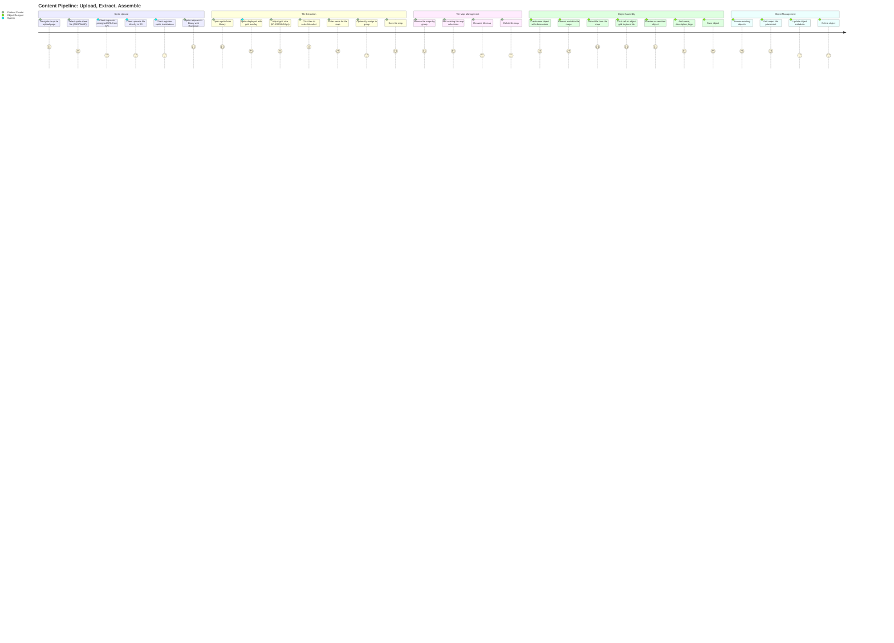
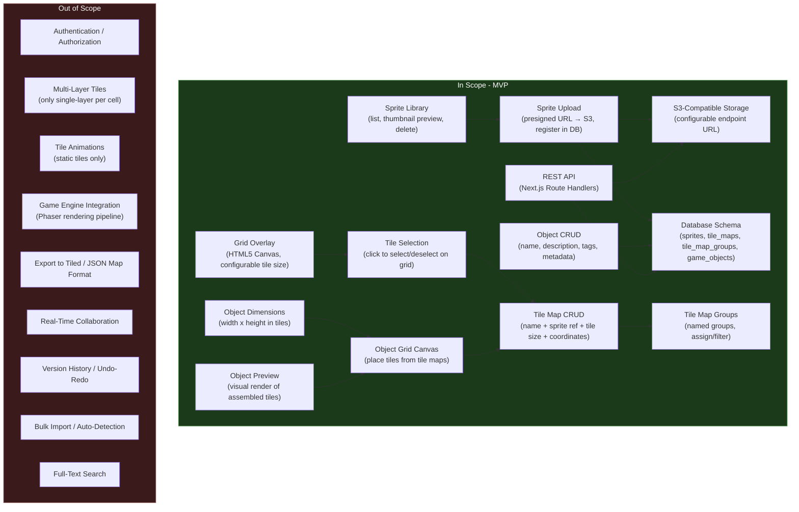
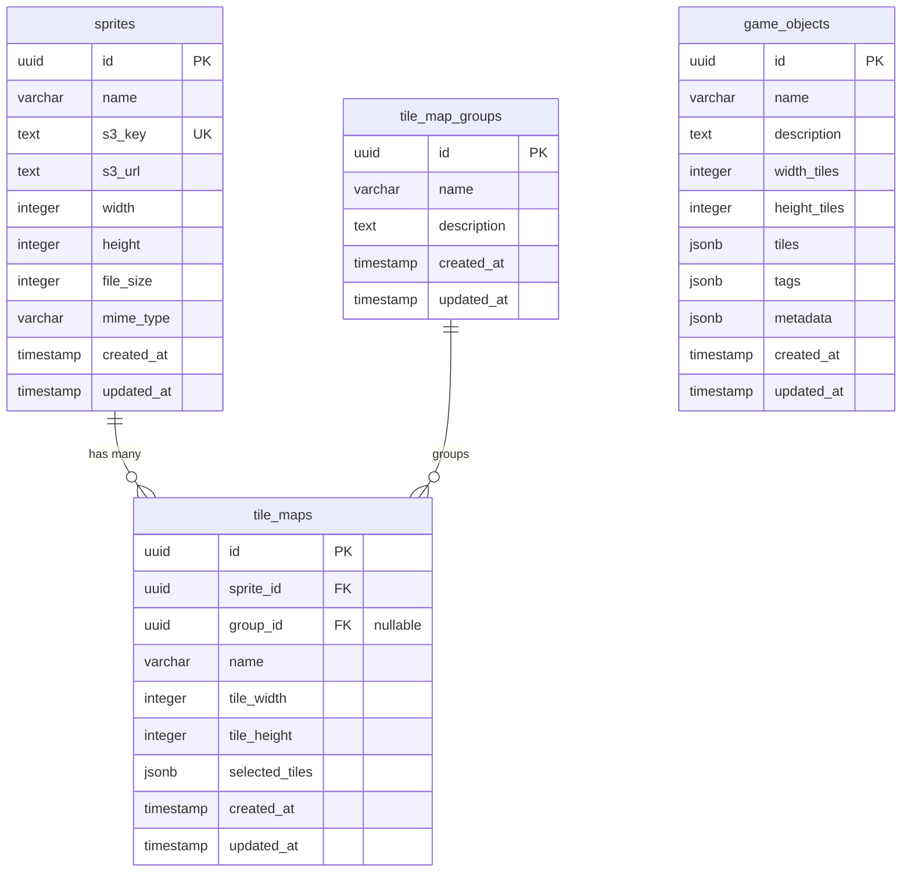

# PRD: Sprite Management and Object Assembly

**Version**: 1.0
**Last Updated**: 2026-02-17

### Change History

| Version | Date | Description |
|---------|------|-------------|
| 1.0 | 2026-02-17 | Initial PRD: Sprite upload, tile extraction, tile map management, and object assembly |

## Overview

### One-line Summary

An internal tool for uploading sprite sheets, extracting tile selections via interactive grid overlay, organizing tiles into named maps and groups, and assembling tiles into game objects on a visual canvas.

### Background

Nookstead is a 2D pixel art MMO built with Next.js, Phaser.js 3, and Colyseus. The game world is rendered from tile maps composed of individual sprite tiles. As the game grows, the team needs a structured way to manage the pipeline from raw sprite sheet artwork to usable game objects -- the individual buildings, furniture, terrain features, and decorations that populate the world.

Currently, there is no tooling for this workflow. Artists produce sprite sheets (PNG/WebP images containing grids of tiles), and the process of cataloging which tiles exist, selecting subsets for specific purposes, and composing multi-tile objects is handled manually or ad-hoc. This creates friction in the content pipeline and introduces errors when tile coordinates are transcribed by hand.

The Sprite Management and Object Assembly tool addresses this by providing a visual, browser-based interface where team members can:

1. **Upload sprite sheets** to S3-compatible cloud storage and register them in the database with metadata (dimensions, file size, format).
2. **Overlay a configurable grid** on the sprite sheet canvas, click individual tiles to select them, and save those selections as named "tile maps" -- lightweight metadata records that reference the original sprite and store selected tile coordinates.
3. **Organize tile maps into groups** for logical categorization (e.g., "terrain", "buildings", "furniture").
4. **Assemble game objects** by placing tile references from tile maps onto a defined grid, creating multi-tile compositions that represent in-game entities.

The tool is an internal application with no authentication requirement. It runs as a separate Next.js app at `apps/genmap/` within the Nx monorepo, using shadcn/ui for the interface, PostgreSQL via Drizzle ORM in `packages/db/` for persistence, and S3-compatible storage (configurable endpoint URL supporting AWS S3, Cloudflare R2, MinIO) for sprite sheet file storage.

This PRD covers both sections of the tool as a single MVP: Section 1 (Sprite Upload and Tile Extraction) and Section 2 (Object Assembly). Both are required for the content pipeline to be functional end-to-end.

## User Stories

### Primary Users

| Persona | Description |
|---------|-------------|
| **Content Creator** | A team member (artist, designer, or developer) who uploads sprite sheet artwork and defines which tiles exist within each sheet. |
| **Object Designer** | A team member who selects tiles from existing tile maps and composes them into multi-tile game objects (buildings, furniture, terrain features). |
| **Developer** | A team member who consumes the output of this tool -- sprite references, tile map data, and object definitions -- to render content in the game engine. |

### User Stories

```
As a content creator
I want to upload a sprite sheet and see it displayed with a grid overlay
So that I can visually identify and select individual tiles from the sheet.
```

```
As a content creator
I want to click tiles on the grid to select them and save my selection as a named tile map
So that I can create reusable sets of tiles for specific purposes (e.g., "grass terrain tiles", "house wall tiles").
```

```
As a content creator
I want to organize my tile maps into named groups
So that I can categorize and find tile sets efficiently as the library grows.
```

```
As a content creator
I want to browse all uploaded sprites with thumbnail previews
So that I can quickly find the sprite sheet I need to work with.
```

```
As a content creator
I want to delete a sprite I no longer need
So that storage is not wasted on obsolete assets and the library stays clean.
```

```
As an object designer
I want to place tiles from my tile maps onto a grid canvas to assemble a multi-tile object
So that I can visually compose game objects like buildings, trees, and furniture from individual tiles.
```

```
As an object designer
I want to define the dimensions of my object (width x height in tiles) before placing tiles
So that the object has a precise, known size for rendering in the game.
```

```
As an object designer
I want to save my assembled object with a name, description, and tags
So that objects are cataloged and searchable for use in the game.
```

```
As an object designer
I want to browse, edit, and delete existing objects
So that I can iterate on object designs and remove outdated ones.
```

```
As a developer
I want tile maps to store only metadata (grid coordinates referencing the original sprite) rather than cropped tile images
So that storage is efficient and the original sprite sheet remains the single source of truth.
```

### Use Cases

1. **Upload a new sprite sheet**: A content creator navigates to the sprite upload page, selects a PNG file (under 10MB), and uploads it. The client requests a presigned URL from the API, uploads the file directly to S3, then registers the sprite in the database with its S3 key, dimensions, and file size. The sprite appears in the sprite library with a thumbnail.

2. **Create a tile map from a sprite**: A content creator opens a sprite from the library. The sprite is displayed on an HTML5 Canvas with a configurable grid overlay (e.g., 16x16 pixel tiles). The creator clicks individual cells to select tiles (highlighted visually). They enter a name for the selection (e.g., "grass variations"), optionally assign it to a group, and save. The tile map record stores the sprite reference, tile size, and an array of selected grid coordinates.

3. **Edit a tile map**: A content creator opens an existing tile map. The sprite is displayed with the previously selected tiles highlighted. They click to add or remove tiles from the selection, optionally rename the tile map, and save the changes.

4. **Organize tile maps into groups**: A content creator creates a group called "Terrain" and assigns several tile maps to it. When browsing tile maps, they can filter by group to find related sets quickly.

5. **Assemble an object**: An object designer creates a new object, setting dimensions to 3 tiles wide by 2 tiles tall. They browse available tile maps, select a tile, and click a cell on the object grid to place it. Each cell holds one tile reference. They fill out the grid, add a name ("Small House"), description, and tags ("building", "residential"), and save the object.

6. **Preview an assembled object**: An object designer opens an existing object. The object grid is rendered with tiles drawn from their source sprite sheets. The designer can see exactly how the object will look when composed of its tiles.

7. **Delete a sprite**: A content creator deletes a sprite that is no longer needed. If tile maps reference the sprite, a confirmation warning lists the affected tile maps. On confirmation, the system removes the file from S3, cascade-deletes associated tile maps, and deletes the sprite database record. If game objects reference tiles from the sprite, the warning also lists affected objects; their tile references become stale (rendered as placeholders in the object preview).

## User Journey Diagram



## Scope Boundary Diagram



## Functional Requirements

### Must Have (MVP) -- Section 1: Sprite Upload and Tile Extraction

- [ ] **FR-1: Sprite Upload via Presigned URL**
  - The client requests a presigned upload URL from the API by sending the intended file name and MIME type.
  - The API generates a presigned PUT URL for the configured S3-compatible storage (endpoint URL, bucket, and credentials from environment variables).
  - The client uploads the file directly to S3 using the presigned URL (no file data passes through the API server).
  - After successful upload, the client calls a registration endpoint to create the sprite record in the database with the S3 key, original file name, MIME type, and file dimensions.
  - Supported formats: PNG (primary), WebP, JPEG.
  - Maximum file size: 10MB. The presigned URL is generated with a content-length condition enforcing this limit. The client also validates file size before requesting the URL.
  - AC: Given a content creator selects a 5MB PNG file, when they upload it, then the client obtains a presigned URL, uploads directly to S3, and registers the sprite in the database. The sprite appears in the library with correct metadata (name, dimensions, file size, MIME type). Given a content creator selects a 15MB file, when the client validates the size, then the upload is rejected with an error message before any network request is made.

- [ ] **FR-2: Sprite Registration with Metadata**
  - After a successful S3 upload, the client sends a POST request to register the sprite with:
    - `name` (string, derived from file name, editable)
    - `s3Key` (string, the object key in S3)
    - `s3Url` (string, the full URL to the stored file)
    - `width` (integer, image width in pixels, extracted client-side)
    - `height` (integer, image height in pixels, extracted client-side)
    - `fileSize` (integer, file size in bytes)
    - `mimeType` (string, one of `image/png`, `image/webp`, `image/jpeg`)
  - The API validates all required fields and creates a record in the `sprites` table.
  - The sprite `id` is returned in the response for subsequent operations.
  - AC: Given a client sends a registration request with all required fields, when the API processes it, then a new row exists in the `sprites` table with matching values and a generated UUID `id`. Given a required field is missing, when the API validates the request, then a 400 error is returned with a description of the missing field.

- [ ] **FR-3: Sprite Library with Thumbnail Preview**
  - The sprite library page displays all uploaded sprites in a grid or list layout.
  - Each sprite entry shows: thumbnail image (loaded from S3 URL), name, dimensions (WxH px), file size (human-readable), upload date.
  - Sprites are sorted by upload date (newest first) by default.
  - Clicking a sprite navigates to its detail/editing view.
  - AC: Given 5 sprites have been uploaded, when the content creator opens the sprite library, then all 5 sprites are listed with thumbnails, names, and metadata. Given a new sprite is uploaded, when the library is refreshed, then the new sprite appears first in the list.

- [ ] **FR-4: Sprite Deletion**
  - A content creator can delete a sprite from the library.
  - Deletion removes the file from S3 storage and the database record.
  - If tile maps reference the sprite, the user receives a confirmation warning listing the affected tile maps. On confirmation, associated tile maps are cascade-deleted.
  - AC: Given a sprite with no associated tile maps exists, when the content creator deletes it, then the S3 object is removed and the database record is deleted. Given a sprite with 3 associated tile maps exists, when the content creator initiates deletion, then a confirmation dialog warns about 3 affected tile maps. On confirmation, the sprite and all 3 tile maps are deleted.

- [ ] **FR-5: Grid Overlay on Canvas**
  - When viewing a sprite, it is rendered on an HTML5 Canvas element.
  - A grid overlay is drawn on top of the sprite image, dividing it into cells based on the configured tile size.
  - The tile size is selectable from a set of standard values: 8, 16, 32, 48, 64 pixels.
  - The grid automatically adjusts when the tile size changes.
  - The grid lines are visually distinct (semi-transparent color) so they are visible over any sprite artwork without obscuring the tile content.
  - AC: Given a 128x128 pixel sprite is displayed, when the tile size is set to 16px, then the canvas shows an 8x8 grid (64 cells) overlaid on the sprite. Given the tile size is changed to 32px, then the canvas updates to show a 4x4 grid (16 cells). Given the sprite dimensions are not evenly divisible by the tile size (e.g., 100x100 with 32px tiles), then partial cells at the edges are displayed but not selectable.

- [ ] **FR-6: Tile Selection on Grid**
  - Clicking a grid cell toggles its selection state (selected/deselected).
  - Selected cells are visually highlighted (e.g., colored overlay, border highlight).
  - Multiple cells can be selected to form a tile map.
  - The selection state is tracked as an array of grid coordinates `[{col, row}, ...]` where `col` and `row` are zero-indexed grid positions.
  - AC: Given a grid is displayed, when the content creator clicks cell (2, 3), then that cell is highlighted as selected and the coordinate `{col: 2, row: 3}` is added to the selection. Given cell (2, 3) is already selected, when it is clicked again, then it is deselected and removed from the selection. Given 10 cells are selected, when the selection is inspected, then an array of 10 coordinate objects is present.

- [ ] **FR-7: Tile Map Save**
  - The content creator enters a name for the tile selection and saves it.
  - The tile map record stores: name, sprite ID (foreign key), tile width, tile height, and the selected tile coordinates as a JSONB array.
  - Optionally, the tile map can be assigned to a tile map group (nullable foreign key).
  - AC: Given 8 tiles are selected on a sprite with 16px tile size, when the content creator enters the name "Grass Tiles" and saves, then a new `tile_maps` record is created with `name="Grass Tiles"`, `sprite_id` referencing the sprite, `tile_width=16`, `tile_height=16`, and `selected_tiles` containing the 8 coordinate pairs. The API returns the created tile map with its generated `id`.

- [ ] **FR-8: Tile Map Edit**
  - The content creator can open an existing tile map for editing.
  - The associated sprite is displayed with the grid overlay, and previously selected tiles are pre-highlighted.
  - The content creator can add or remove tiles from the selection.
  - The tile map name can be changed.
  - The group assignment can be changed.
  - Saving updates the existing record (PATCH).
  - AC: Given a tile map "Grass Tiles" with 8 selected tiles exists, when the content creator opens it for editing, then the sprite is shown with those 8 tiles highlighted. Given the creator selects 2 more tiles and renames it to "Grass + Flowers", when they save, then the record is updated with 10 tiles and the new name. The `id` remains the same.

- [ ] **FR-9: Tile Map Groups**
  - The content creator can create named groups (e.g., "Terrain", "Buildings", "Furniture").
  - Groups have a name and optional description.
  - Tile maps can be assigned to a group (one group per tile map, nullable).
  - The tile map listing can be filtered by group.
  - Groups can be renamed, have their description updated, or be deleted.
  - Deleting a group does not delete its tile maps; their `group_id` is set to null.
  - AC: Given no groups exist, when the content creator creates a group named "Terrain" with description "Ground and floor tiles", then a `tile_map_groups` record is created. Given a tile map is assigned to the "Terrain" group, when the tile map list is filtered by "Terrain", then only tile maps in that group are shown. Given the "Terrain" group is deleted, when the tile maps that belonged to it are checked, then their `group_id` is null and they still appear in the unfiltered list.

- [ ] **FR-10: Tile Map Listing and Browsing**
  - A page lists all tile maps with: name, associated sprite name (with thumbnail), tile size, number of selected tiles, group name (if assigned).
  - Filtering by group is supported.
  - Clicking a tile map opens it for editing (FR-8).
  - Tile maps can be deleted individually.
  - AC: Given 10 tile maps exist across 3 groups, when the tile map list is opened with no filter, then all 10 are displayed. Given the "Terrain" filter is applied, then only tile maps assigned to the "Terrain" group are shown. Given a tile map is deleted, then it is removed from the list and the database record is deleted.

### Must Have (MVP) -- Section 2: Object Assembly

- [ ] **FR-11: Object Grid Canvas**
  - The object designer creates a new object by specifying dimensions: width (in tiles) and height (in tiles).
  - An empty grid canvas is rendered at the specified dimensions.
  - Each cell in the grid can hold one tile reference (sprite ID + grid coordinate from a tile map).
  - Tiles are placed by selecting a tile from a tile map (displayed in a side panel or picker) and clicking a cell on the object grid.
  - Placing a tile on an occupied cell replaces the existing tile.
  - Cells can be cleared (emptied) individually.
  - AC: Given an object designer specifies a 3x2 object, then a 3-wide by 2-tall empty grid is rendered. Given the designer selects a tile from a tile map and clicks cell (1, 0), then that cell displays the tile image and stores the tile reference. Given the designer clicks the same cell with a different tile selected, then the cell updates to the new tile. Given the designer clears cell (1, 0), then the cell becomes empty.

- [ ] **FR-12: Tile Picker from Tile Maps**
  - While editing an object, a panel displays available tile maps.
  - The designer can expand a tile map to see its individual tiles rendered as small previews (each tile cropped from the source sprite based on its grid coordinates and tile size).
  - Clicking a tile in the picker selects it as the "active tile" for placement on the object grid.
  - The active tile is visually indicated in the picker.
  - AC: Given 3 tile maps exist, when the object editor is open, then the tile picker panel lists all 3 tile maps. Given a tile map "Grass Tiles" with 8 tiles is expanded, then 8 tile previews are rendered from the source sprite. Given the designer clicks tile (2, 1) from the picker, then it becomes the active tile and is visually highlighted.

- [ ] **FR-13: Object Save**
  - The object designer saves the assembled object with:
    - `name` (string, required)
    - `description` (string, optional)
    - `width_tiles` (integer, the grid width)
    - `height_tiles` (integer, the grid height)
    - `tiles` (JSONB, a flat array of tile references indexed by position. Each entry is an object `{x, y, spriteId, col, row, tileWidth, tileHeight}` where `x`/`y` are the cell coordinates in the object grid. Empty cells have no entry in the array.)
    - `tags` (JSONB array of strings, optional)
    - `metadata` (JSONB object, optional, for future extensibility)
  - The API validates all required fields and creates a record in the `game_objects` table.
  - AC: Given a 3x2 object with 4 tiles placed and 2 empty cells, when the designer enters name "Small House" with tags ["building", "residential"] and saves, then a `game_objects` record is created with the correct dimensions, tile data (4 references + 2 nulls), tags, and name.

- [ ] **FR-14: Object Listing and Browsing**
  - A page lists all objects with: name, dimensions (WxH tiles), number of tiles placed, tags, creation date.
  - Each entry shows a thumbnail preview of the assembled object.
  - Clicking an object opens it for editing.
  - Objects can be deleted individually.
  - AC: Given 5 objects exist, when the object list is opened, then all 5 are displayed with thumbnails and metadata. Given an object is deleted, then it is removed from the list, the database record is deleted, and the object no longer appears in the browser.

- [ ] **FR-15: Object Edit**
  - The object designer can open an existing object for editing.
  - The object grid is rendered with all previously placed tiles.
  - The designer can add, replace, or clear tiles.
  - The object name, description, tags, and metadata can be updated.
  - Object dimensions can be changed (expanding adds empty cells; shrinking removes tiles from truncated cells with a confirmation warning).
  - Saving updates the existing record (PATCH).
  - AC: Given an object "Small House" (3x2) with 4 tiles exists, when the designer opens it, then the grid shows the 4 tiles in their correct positions. Given the designer resizes to 4x2, then a new column of empty cells is added. Given the designer resizes to 2x2, then a confirmation dialog warns about tile loss in the truncated column. On confirmation, the rightmost column is removed.

- [ ] **FR-16: Object Preview**
  - The object editor includes a preview rendering that composites all placed tiles from their source sprites into a single visual.
  - The preview updates live as tiles are placed or removed.
  - The preview shows the object at actual pixel size (tile size multiplied by grid dimensions).
  - AC: Given a 3x2 object with 16px tiles has all 6 cells filled, when the preview is rendered, then a 48x32 pixel composite image is displayed showing the tiles arranged in their grid positions. Given a tile is removed from cell (1, 0), when the preview updates, then that cell position is empty (transparent or placeholder) in the preview.

### Must Have -- API Endpoints

- [ ] **FR-17: Sprite API**
  - `POST /api/sprites/presign` -- Request a presigned S3 upload URL. Accepts `{fileName, mimeType, fileSize}`. Returns `{uploadUrl, s3Key}`. Validates file size (max 10MB) and MIME type.
  - `POST /api/sprites` -- Register a sprite after upload. Accepts the fields defined in FR-2. Returns the created sprite record.
  - `GET /api/sprites` -- List all sprites. Returns array of sprite records sorted by `createdAt` descending. Supports optional pagination (`?limit=N&offset=N`).
  - `GET /api/sprites/:id` -- Get a single sprite by ID. Returns the sprite record or 404.
  - `DELETE /api/sprites/:id` -- Delete a sprite. Removes from S3 and database. Returns 204 on success.
  - AC: Given a valid presign request for a 5MB PNG, when the API processes it, then a presigned URL and S3 key are returned. Given the MIME type is `text/plain`, when the API validates it, then a 400 error is returned. Given `GET /api/sprites` is called with 20 sprites in the database and `?limit=10&offset=0`, then the first 10 sprites are returned.

- [ ] **FR-18: Tile Map API**
  - `POST /api/tile-maps` -- Create a tile map. Accepts `{name, spriteId, groupId?, tileWidth, tileHeight, selectedTiles}`. Returns created record.
  - `GET /api/tile-maps` -- List tile maps. Supports optional `?groupId=X` filter. Returns array of tile map records.
  - `GET /api/tile-maps/:id` -- Get a single tile map. Returns the record or 404.
  - `PATCH /api/tile-maps/:id` -- Update a tile map (name, groupId, selectedTiles). Returns updated record.
  - `DELETE /api/tile-maps/:id` -- Delete a tile map. Returns 204.
  - AC: Given a valid create request with spriteId referencing an existing sprite, when the API processes it, then a tile map record is created. Given a create request with a non-existent spriteId, then a 400 error is returned. Given `GET /api/tile-maps?groupId=abc`, then only tile maps with that groupId are returned.

- [ ] **FR-19: Tile Map Group API**
  - `POST /api/tile-map-groups` -- Create a group. Accepts `{name, description?}`. Returns created record.
  - `GET /api/tile-map-groups` -- List all groups. Returns array of group records.
  - `PATCH /api/tile-map-groups/:id` -- Update a group (name, description). Returns updated record.
  - `DELETE /api/tile-map-groups/:id` -- Delete a group. Sets `group_id` to null on all associated tile maps. Returns 204.
  - AC: Given a group "Terrain" is created, when `GET /api/tile-map-groups` is called, then "Terrain" appears in the list. Given "Terrain" is deleted and 3 tile maps referenced it, then those 3 tile maps have `group_id` set to null.

- [ ] **FR-20: Game Object API**
  - `POST /api/objects` -- Create an object. Accepts `{name, description?, widthTiles, heightTiles, tiles, tags?, metadata?}`. Returns created record.
  - `GET /api/objects` -- List all objects. Returns array of object records. Supports optional pagination.
  - `GET /api/objects/:id` -- Get a single object. Returns the record or 404.
  - `PATCH /api/objects/:id` -- Update an object. Returns updated record.
  - `DELETE /api/objects/:id` -- Delete an object. Returns 204.
  - AC: Given a valid create request with tiles referencing existing sprites, when the API processes it, then an object record is created. Given a create/update request with tiles referencing a non-existent spriteId, when the API validates it, then a 400 error is returned listing the invalid sprite references. Given `GET /api/objects` is called, then all objects are returned with their full tile data.

### Must Have -- Database Schema

- [ ] **FR-21: Database Tables**
  - Four new tables are added to `packages/db/` via Drizzle ORM schema definitions and migrations:
  - **`sprites`**: `id` (UUID, PK, auto-generated), `name` (varchar 255, not null), `s3_key` (text, not null, unique), `s3_url` (text, not null), `width` (integer, not null), `height` (integer, not null), `file_size` (integer, not null), `mime_type` (varchar 50, not null), `created_at` (timestamp with timezone, default now, not null), `updated_at` (timestamp with timezone, default now, not null).
  - **`tile_maps`**: `id` (UUID, PK, auto-generated), `sprite_id` (UUID, FK to sprites.id, not null, cascade delete), `group_id` (UUID, FK to tile_map_groups.id, nullable, set null on delete), `name` (varchar 255, not null), `tile_width` (integer, not null), `tile_height` (integer, not null), `selected_tiles` (JSONB, not null), `created_at` (timestamp with timezone, default now, not null), `updated_at` (timestamp with timezone, default now, not null).
  - **`tile_map_groups`**: `id` (UUID, PK, auto-generated), `name` (varchar 255, not null), `description` (text, nullable), `created_at` (timestamp with timezone, default now, not null), `updated_at` (timestamp with timezone, default now, not null).
  - **`game_objects`**: `id` (UUID, PK, auto-generated), `name` (varchar 255, not null), `description` (text, nullable), `width_tiles` (integer, not null), `height_tiles` (integer, not null), `tiles` (JSONB, not null), `tags` (JSONB, nullable), `metadata` (JSONB, nullable), `created_at` (timestamp with timezone, default now, not null), `updated_at` (timestamp with timezone, default now, not null).
  - All migrations are additive and backward-compatible with existing tables (`users`, `accounts`, `player_positions`, `maps`).
  - AC: Given the migration runs, when the database is inspected, then all four new tables exist with the correct columns, types, and constraints. Given the `sprites` table contains a record, when a `tile_maps` record is created referencing that sprite, then the foreign key constraint is satisfied. Given a sprite is deleted, then all associated tile maps are cascade-deleted.

### Should Have

- [ ] **FR-22: Drag-to-Select Tiles**
  - In addition to click-to-select (FR-6), the content creator can click and drag across multiple cells to select a rectangular region in a single gesture.
  - The drag selection toggles all cells in the rectangle to the selected state (if any are unselected) or deselects all (if all are already selected).
  - AC: Given a grid is displayed, when the content creator clicks at cell (0, 0) and drags to cell (3, 3), then all 16 cells in the 4x4 rectangle are selected. Given all 16 cells are already selected and the same drag is performed, then all 16 are deselected.

- [ ] **FR-23: Keyboard Shortcuts**
  - Common actions have keyboard shortcuts for efficiency:
    - `Ctrl+S` / `Cmd+S`: Save current tile map or object.
    - `Escape`: Cancel current selection or close modal.
    - `Delete` / `Backspace`: Clear selected cell on object grid.
  - AC: Given the tile map editor is open with unsaved changes, when the user presses `Ctrl+S`, then the tile map is saved.

### Could Have

- [ ] **FR-24: Sprite Sheet Auto-Detection of Tile Size**
  - The system analyzes the uploaded sprite sheet to suggest the most likely tile size based on visual patterns (uniform grid spacing, color boundaries).
  - The suggestion is presented alongside the manual tile size selector; the user can accept or override it.
  - AC: Given a sprite sheet with clearly defined 16x16 tile boundaries is uploaded, when auto-detection runs, then 16px is suggested as the tile size.

- [ ] **FR-25: Object Tagging and Filtering**
  - The object list can be filtered by tags.
  - Tags are displayed as chips/badges on each object card.
  - Clicking a tag filters the list to objects with that tag.
  - AC: Given 3 objects are tagged "building" and 2 are tagged "terrain", when the "building" tag filter is applied, then only the 3 building objects are shown.

### Out of Scope

- **Authentication / Authorization**: This is an internal tool. No login, roles, or permissions are required. The tool is accessible to anyone on the network.
- **Multi-layer tiles**: Each grid cell in an object holds exactly one tile reference. Layered tile composition (e.g., ground + decoration overlay) is not supported in this version.
- **Tile animations**: All tiles are static. Animated tiles (frame sequences) are not supported.
- **Game engine integration**: This tool produces data (sprite references, tile maps, objects) but does not integrate with the Phaser.js rendering pipeline. The game client will consume the data separately.
- **Export to Tiled / JSON map format**: The tool does not export to standard tile map editor formats (Tiled TMX, JSON map). Data is consumed via the API/database.
- **Real-time collaboration**: Only one user operates the tool at a time. There is no multi-user editing or conflict resolution.
- **Version history / Undo-redo**: Changes are saved directly. There is no undo stack or version history for tile map selections or object edits.
- **Bulk import / Auto-detection of tiles**: Sprites are uploaded one at a time. There is no batch upload or automatic tile boundary detection (except as a Could Have in FR-24).
- **Full-text search**: Browsing is by list with optional group/tag filtering. There is no full-text search across names, descriptions, or tags.

## Non-Functional Requirements

### Performance

- **Sprite upload**: Presigned URL generation should complete in under 200ms. The client-to-S3 upload speed depends on the user's connection and file size (up to 10MB).
- **Canvas rendering**: The grid overlay on a sprite sheet up to 2048x2048 pixels should render within 100ms on a modern browser. Grid interactions (click, hover highlight) should respond within 16ms (60fps).
- **Tile map operations**: CRUD operations on tile maps should complete in under 100ms (single-row database operations).
- **Object preview rendering**: Compositing a 10x10 tile object from source sprites should render within 200ms.
- **API response times**: All API endpoints should return within 200ms for typical payloads (excluding S3 upload itself).
- **Page load**: The sprite library and object list pages should render within 1 second on a modern browser (excluding image loading).

### Reliability

- **S3 upload failure handling**: If the S3 upload fails (network error, permission denied), the client displays a clear error message. No database record is created for failed uploads.
- **Orphan prevention**: The presign-then-register flow could leave orphan files in S3 if the registration step fails. This is accepted for MVP. A future cleanup job can reconcile S3 contents with database records.
- **Data integrity**: Foreign key constraints ensure referential integrity between sprites, tile maps, and tile map groups. Cascade delete on sprite removal prevents orphan tile maps. Game objects store sprite references in JSONB without FK enforcement; deleting a sprite may leave stale tile references in game objects. The sprite deletion flow warns about affected game objects (via a reference-check query), and the object preview renders placeholder tiles for stale references.
- **S3 deletion failure**: If S3 object deletion fails during sprite delete, the database record is still removed and the error is logged. Orphan S3 objects are accepted for MVP (reconciliation via future cleanup).

### Security

- **No authentication required**: Internal tool, trusted network only.
- **Input validation**: All API inputs are validated for type, length, and format. MIME types are restricted to `image/png`, `image/webp`, `image/jpeg`. File sizes are capped at 10MB.
- **S3 credentials**: S3 access keys, secret keys, and endpoint URLs are stored in environment variables, not in code or client-accessible configuration.
- **Presigned URL expiry**: Presigned upload URLs expire after a short duration (default: 5 minutes) to prevent reuse.
- **Content-type enforcement**: Presigned URLs are generated with content-type conditions to prevent uploading non-image files.

### Scalability

- **Sprite count**: The system should handle up to 1,000 sprites without performance degradation in listing operations.
- **Tile map count**: Up to 5,000 tile maps should be browsable with group filtering.
- **Object count**: Up to 1,000 objects should be listable and browsable.
- **S3 storage**: Storage scales with the S3-compatible provider. No local file storage is used.

## Success Criteria

### Quantitative Metrics

1. **Sprite upload end-to-end**: A content creator can upload a 5MB PNG sprite sheet and see it in the library within 10 seconds (including upload time).
2. **Tile map creation**: A content creator can select 20 tiles and save a tile map in under 30 seconds of active interaction.
3. **Object assembly**: An object designer can assemble a 4x4 tile object in under 2 minutes of active interaction.
4. **Data accuracy**: Tile map coordinates exactly match the visual grid positions on the canvas. A tile at grid position (3, 2) with 16px tile size corresponds to the pixel region starting at (48, 32) in the source sprite.
5. **CRUD completeness**: All entities (sprites, tile maps, groups, objects) support create, read, update, and delete operations through both the UI and API.
6. **Database integrity**: Deleting a sprite cascades to its tile maps. Deleting a group nullifies tile map group references. All foreign keys are enforced.
7. **S3 cleanup**: Deleting a sprite removes the corresponding S3 object (best effort; failures logged).
8. **API validation**: Invalid requests (missing fields, wrong types, oversized files, unsupported MIME types) return appropriate 400-level errors with descriptive messages.

### Qualitative Metrics

1. **Intuitive grid interaction**: The grid overlay and tile selection feel natural and responsive. A new team member can understand the selection workflow without instruction.
2. **Visual clarity**: Selected tiles are clearly distinguishable from unselected tiles. The grid lines are visible but do not obscure sprite artwork.
3. **Efficient workflow**: The tool supports a smooth pipeline from sprite upload through tile extraction to object assembly without requiring the user to leave the application.
4. **Object preview accuracy**: The object preview faithfully represents how tiles will appear when composed, giving the designer confidence in their assembly.

## Technical Considerations

### Dependencies

- **Next.js 16** (`next`): Application framework for the genmap tool. Already installed in `apps/genmap/`.
- **React 19** (`react`, `react-dom`): UI framework. Already installed.
- **shadcn/ui**: Component library (New York style, Tailwind CSS). Already configured in `apps/genmap/components.json`.
- **Tailwind CSS 4** (`tailwindcss`): Utility-first CSS. Already installed.
- **Lucide React** (`lucide-react`): Icon library. Already installed.
- **@nookstead/db** (`packages/db/`): Drizzle ORM, PostgreSQL schema, migrations. Already exists. Must be extended with new tables.
- **drizzle-orm / drizzle-kit**: Schema definition and migration tooling. Already a dependency of `packages/db/`.
- **S3-compatible SDK**: An AWS S3 client library (e.g., `@aws-sdk/client-s3`, `@aws-sdk/s3-request-presigner`) is needed for presigned URL generation and object deletion. Must be added.
- **HTML5 Canvas API**: Native browser API for sprite rendering and grid overlay. No additional library required.

### Constraints

- **S3 endpoint configurability**: The S3 client must accept a configurable endpoint URL to support AWS S3, Cloudflare R2, and MinIO. This is configured via environment variables (`S3_ENDPOINT`, `S3_BUCKET`, `S3_ACCESS_KEY_ID`, `S3_SECRET_ACCESS_KEY`, `S3_REGION`).
- **No image processing on server**: Sprite sheets are stored as-is. The server does not crop, resize, or transform images. All tile extraction is metadata-only (grid coordinates referencing the original sprite).
- **Metadata-only tile maps**: Tile maps store coordinate references, not cropped images. The client renders tiles by drawing sub-regions of the source sprite on canvas.
- **Single-layer objects**: Each cell in a game object holds at most one tile reference. Multi-layer composition is out of scope.
- **Database shared with game server**: The `packages/db/` schema is shared across the genmap tool and the game server. New tables must not conflict with or affect existing tables.
- **No real-time features**: This is a CRUD application with no WebSocket, real-time updates, or collaboration features.

### Assumptions

- The genmap app (`apps/genmap/`) is served on a trusted internal network. No authentication is needed.
- S3-compatible storage is available and accessible with the configured credentials.
- PostgreSQL is accessible from the genmap app with the same `DATABASE_URL` used by the game server.
- The genmap app can import and use schemas/services from `packages/db/` within the Nx monorepo.
- Sprite sheets are well-formed image files. The tool does not need to handle corrupt or truncated images (standard browser image loading behavior is sufficient).
- Users have modern browsers with HTML5 Canvas support (Chrome, Firefox, Safari, Edge -- all current versions).

### Risks and Mitigation

| Risk | Impact | Probability | Mitigation |
|------|--------|-------------|------------|
| S3 presigned URL flow adds complexity compared to server-side upload | Medium | Medium | The presigned URL pattern is well-established. Use the AWS SDK's `@aws-sdk/s3-request-presigner` which handles the signing. Keep the flow simple: presign, upload, register. |
| Orphan S3 objects from failed registration after upload | Low | Medium | Accept for MVP. Log registration failures. Plan a reconciliation script or S3 lifecycle rule to clean up orphans in a future iteration. |
| Large sprite sheets (2048x2048+) cause canvas performance issues | Medium | Low | Test with large sprites during development. If performance is poor, downsample the display image for the grid overlay while keeping the original for tile coordinate accuracy. |
| JSONB fields (tiles, selected_tiles, tags, metadata) grow large | Low | Low | Game objects and tile maps are small data structures. A 10x10 object grid is 100 entries. Monitor JSONB query performance but this is unlikely to be an issue at the expected scale. |
| Database migration conflicts with game server schema | Medium | Low | New tables have distinct names (`sprites`, `tile_maps`, `tile_map_groups`, `game_objects`) with no foreign keys to game-server tables. Migrations are additive only. |
| S3-compatible storage behavioral differences (R2 vs S3 vs MinIO) | Medium | Medium | Use only standard S3 API operations (PutObject presigned URL, DeleteObject). Avoid provider-specific features. Test with at least two providers (MinIO for local dev, target provider for staging). |
| Canvas rendering inconsistencies across browsers | Low | Low | Use standard Canvas 2D API operations (`drawImage`, `strokeRect`). Avoid advanced features. Test on Chrome and Firefox. |
| Sprite deletion breaks game object tile references | Medium | Medium | Game objects store sprite references in JSONB without FK enforcement. Mitigation: show warning listing affected game objects before sprite deletion; render placeholder for missing tiles in object preview. |

## Undetermined Items

None. All major decisions have been made:
- No authentication (internal tool)
- Metadata-only for tile maps (no cropped images)
- S3-compatible storage with configurable endpoint
- Both sections in MVP
- HTML5 Canvas for grid and rendering
- Drizzle ORM in `packages/db/` for database

## Appendix

### References

- [AWS S3 Presigned URLs](https://docs.aws.amazon.com/AmazonS3/latest/userguide/using-presigned-url.html) -- Presigned URL generation pattern for direct client uploads
- [Cloudflare R2 S3 Compatibility](https://developers.cloudflare.com/r2/api/s3/) -- R2 S3 API compatibility documentation
- [Drizzle ORM Documentation](https://orm.drizzle.team/docs/overview) -- ORM used for database schema and migrations
- [shadcn/ui Documentation](https://ui.shadcn.com/) -- Component library used in the genmap app
- [HTML5 Canvas API (MDN)](https://developer.mozilla.org/en-US/docs/Web/API/Canvas_API) -- Canvas rendering for grid overlay and tile composition
- [MinIO S3 Compatibility](https://min.io/docs/minio/linux/integrations/aws-s3-compatible-api.html) -- Local development S3-compatible storage

### Relationship to Existing PRDs

This PRD is **independent** of the game client PRDs (PRD-001 through PRD-005). The genmap tool is a separate internal application that produces asset data consumed by the game:

| Aspect | Game PRDs (001-005) | PRD-006 (This PRD) |
|--------|---------------------|---------------------|
| Application | `apps/game` (Next.js + Phaser) | `apps/genmap` (Next.js + shadcn/ui) |
| Purpose | Player-facing game client | Internal content authoring tool |
| Authentication | NextAuth with JWT | None (internal tool) |
| Real-time | Colyseus WebSocket rooms | None (CRUD application) |
| Database | `users`, `accounts`, `player_positions`, `maps` | `sprites`, `tile_maps`, `tile_map_groups`, `game_objects` |
| Storage | N/A | S3-compatible object storage |
| Shared dependency | `packages/db/` (schema, migrations) | `packages/db/` (schema, migrations) |

The genmap tool shares the `packages/db/` package with the game server. New database tables are added alongside existing tables with no cross-references or conflicts.

### Data Entity Diagram



### API Endpoint Summary

| Method | Endpoint | Description |
|--------|----------|-------------|
| POST | `/api/sprites/presign` | Request presigned S3 upload URL |
| POST | `/api/sprites` | Register uploaded sprite |
| GET | `/api/sprites` | List all sprites |
| GET | `/api/sprites/:id` | Get sprite detail |
| DELETE | `/api/sprites/:id` | Delete sprite (S3 + DB) |
| POST | `/api/tile-maps` | Create tile map |
| GET | `/api/tile-maps` | List tile maps (filter by group) |
| GET | `/api/tile-maps/:id` | Get tile map detail |
| PATCH | `/api/tile-maps/:id` | Update tile map |
| DELETE | `/api/tile-maps/:id` | Delete tile map |
| POST | `/api/tile-map-groups` | Create group |
| GET | `/api/tile-map-groups` | List groups |
| PATCH | `/api/tile-map-groups/:id` | Update group |
| DELETE | `/api/tile-map-groups/:id` | Delete group (nullify refs) |
| POST | `/api/objects` | Create object |
| GET | `/api/objects` | List objects |
| GET | `/api/objects/:id` | Get object detail |
| PATCH | `/api/objects/:id` | Update object |
| DELETE | `/api/objects/:id` | Delete object |

### Glossary

- **Sprite sheet**: A single image file containing multiple tiles arranged in a grid. Common sizes include 128x128, 256x256, 512x512, and 1024x1024 pixels.
- **Tile**: A small, fixed-size square region within a sprite sheet (e.g., 16x16 pixels) that represents a single visual unit in the game world.
- **Tile map**: A named selection of tiles from a single sprite sheet. Stores the sprite reference, tile size, and an array of grid coordinates identifying the selected tiles. Does not contain cropped image data.
- **Tile map group**: A named category for organizing related tile maps (e.g., "Terrain", "Buildings").
- **Game object**: A multi-tile composition assembled on a grid canvas. Represents an in-game entity (building, furniture, terrain feature) defined by placing tile references in a grid.
- **Presigned URL**: A time-limited URL that grants temporary permission to upload a file directly to S3-compatible storage without exposing permanent credentials.
- **S3-compatible storage**: Object storage that implements the Amazon S3 API. Includes AWS S3, Cloudflare R2, MinIO, and other providers.
- **Grid overlay**: A visual grid drawn on the HTML5 Canvas over a sprite sheet, dividing it into selectable tile cells based on the configured tile size.
- **Grid coordinate**: A zero-indexed `{col, row}` pair identifying a cell in the grid overlay. `col` is the horizontal index (0 = leftmost), `row` is the vertical index (0 = topmost).
- **Tile reference**: A pointer to a specific tile within a sprite sheet, consisting of the sprite ID and the grid coordinate `{col, row}`, plus the tile dimensions.
- **CRUD**: Create, Read, Update, Delete -- the four basic data operations.
- **MoSCoW**: A prioritization technique categorizing requirements as Must have, Should have, Could have, and Won't have.
