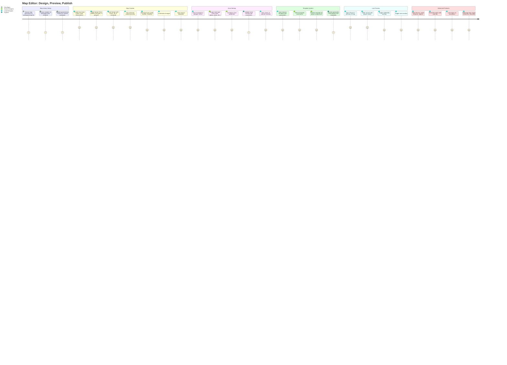
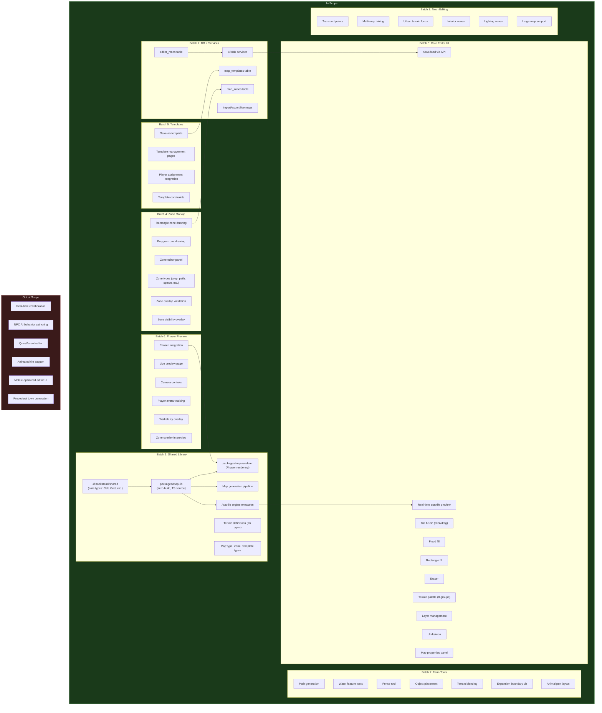
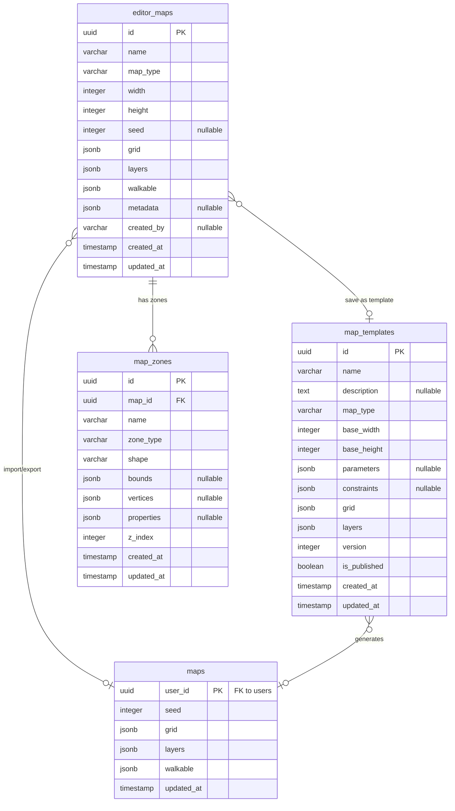

# PRD: Map Editor

**Version**: 1.1
**Last Updated**: 2026-02-19

### Change History

| Version | Date | Description |
|---------|------|-------------|
| 1.0 | 2026-02-19 | Initial PRD: Map editor for player homesteads and town districts with shared map library, zone markup, template system, Phaser preview, and advanced tools |
| 1.1 | 2026-02-19 | Renumber to PRD-007; fix game_objects entity diagram to match schema; clarify shared types vs map-lib extraction; sequential FR numbering; fix terrain naming to match terrain.ts; add @nookstead/shared dependency; document import/export transformation rules |

## Overview

### One-line Summary

A visual map editor integrated into the genmap admin tool for creating, editing, and managing player homestead maps and town district maps using the full 26-terrain tileset with autotile, zone markup, templates, and live Phaser 3 preview.

### Background

Nookstead's world consists of two zone types: private player homesteads (32x32 tiles, expandable to 64x64) and the public town of Quiet Haven (multiple districts). The current map system uses procedural island generation with simplex noise, producing maps with only 3 terrain types (deep_water, water, grass). This is sufficient for initial prototyping but inadequate for the rich, designed environments that the GDD envisions -- farm plots, town districts with roads and buildings, distinct biomes, and hand-crafted points of interest.

The map generation pipeline (`MapGenerator` in `apps/server/src/mapgen/`) is duplicated between the server and game client, with coupled Phaser rendering logic. The 26 available tilesets (grassland, water, sand, forest, stone, road, props, misc) defined in `apps/game/src/game/terrain.ts` are not exposed in the generation pipeline, which only uses 3 of the 26 terrain types.

Core map types (`TerrainCellType`, `Cell`, `Grid`, `LayerData`, `GeneratedMap`, `GenerationPass`, `LayerPass`) already live in `packages/shared/src/types/map.ts` and are consumed by both `apps/server` and `apps/game`. These types will remain in `@nookstead/shared` and will NOT be duplicated into the new map-lib package.

The Map Editor addresses the remaining gaps by providing:

1. **A shared map library** (`packages/map-lib`) that extracts the **generation logic** (MapGenerator, passes, simplex noise pipeline) and the **autotile engine** (blob-47 algorithm, neighbor masks, frame lookup) into a single zero-build package consumed by both server and game client, eliminating duplication. The map-lib package imports core types from `@nookstead/shared` and re-exports them alongside its own generation and autotile code.
2. **A shared map renderer** (`packages/map-renderer`) that encapsulates Phaser 3 tilemap rendering, shared between the game client and the genmap editor for consistent visual output.
3. **Database-backed map persistence** for editor-authored maps (templates, hand-edited maps) alongside the existing player map system.
4. **A visual tile editor** in the genmap app where designers paint terrain using all 26 tilesets with real-time autotile preview.
5. **Zone markup** for designating functional areas (crop fields, spawn points, NPC locations, paths, transitions).
6. **A template system** for creating reusable map blueprints that can be assigned to new players with different seeds.
7. **Live Phaser 3 preview** showing the map exactly as players will see it, with walkability and zone overlays.
8. **Advanced tools** for farm layout (fences, water features, object placement) and town editing (transport points, multi-map linking, large maps).

The tool is built within the existing genmap app (`apps/genmap/`), extending it from sprite/object management into full map authoring. Both player homesteads and town maps are equally prioritized.

## User Stories

### Primary Users

| Persona | Description |
|---------|-------------|
| **Level Designer** | A team member who creates and iterates on player homestead templates and town district layouts using the visual map editor. |
| **Game Designer** | A team member who defines zone purposes, template parameters, and map constraints to ensure maps support gameplay mechanics (farming, NPC routing, transitions). |
| **Developer** | A team member who consumes map data from the shared library and database, integrating map rendering and zone logic into the game client and server. |

### User Stories

```
As a level designer
I want to paint terrain tiles on a grid canvas with real-time autotile preview
So that I can visually compose maps using all 26 terrain types without manually calculating autotile frames.
```

```
As a level designer
I want to draw zones on my map to mark functional areas (crop fields, paths, spawn points)
So that the game engine knows where gameplay mechanics apply.
```

```
As a level designer
I want to save a finished map as a reusable template with parameters
So that the system can generate unique homesteads for each new player from the same base design.
```

```
As a level designer
I want to preview my map in Phaser 3 with a walking player avatar
So that I can verify the map looks correct and feels right in the actual game engine.
```

```
As a level designer
I want to import a live player map, edit it, and export it back
So that I can fix issues or enhance existing player homesteads.
```

```
As a game designer
I want to define template constraints (e.g., "must have at least one crop zone", "spawn point required")
So that templates always produce valid, playable maps.
```

```
As a game designer
I want to create town district maps with transport points and transitions to other districts
So that the town of Quiet Haven is a connected network of designed spaces.
```

```
As a developer
I want map generation and autotile logic in a single shared package
So that the server and game client use identical algorithms without code duplication.
```

### Use Cases

1. **Create a new homestead template**: A level designer opens the map editor, creates a new 32x32 map of type "player_homestead". They paint grass as the base, add a dirt path from the house zone to the dock, place crop field zones, mark a spawn point, and save the map. They then use "Save as Template" to create a reusable template with a "seed" parameter for terrain variation.

2. **Edit a town district**: A level designer opens the "Central Square" map (128x128). They add gray_cobble paths, place transition zones connecting to Market Street and Residential Quarter, mark NPC locations for Mayor Victor, and place bus stop transport points. They preview in Phaser to verify the layout.

3. **Fix a player's homestead**: A developer notices a player's map has an unreachable area. They import the player's live map into the editor, fix the terrain to add a walkable path, verify with the walkability overlay, and export the corrected map back to the player's record.

4. **Batch homestead generation for new players**: The system uses a published homestead template to generate a unique map for each new player by applying the template with a random seed, ensuring every homestead is distinct but adheres to the template's zone layout and constraints.

## User Journey Diagram



## Scope Boundary Diagram



## Functional Requirements

### Must Have (MVP) -- Batch 1: Shared Map Library + Extended Type System

- [ ] **FR-1.1: Create packages/map-lib**
  - A new zero-build TypeScript package at `packages/map-lib/` following the `@nookstead/db` pattern (direct TS source exports, no build step, consumed via workspace package references).
  - Exports map generation logic, autotile engine, and terrain definitions. Imports core map types (`TerrainCellType`, `Cell`, `Grid`, `LayerData`, `GeneratedMap`, `GenerationPass`, `LayerPass`) from `@nookstead/shared` and re-exports them for convenience, so downstream consumers can import everything map-related from a single package.
  - AC: Given the package exists at `packages/map-lib/`, when another package adds `@nookstead/map-lib` as a dependency, then it can import types and functions directly from TypeScript source without a build step. Given `pnpm nx lint game` and `pnpm nx lint server` are run, then no import errors exist. Given `@nookstead/shared` is listed as a dependency of `@nookstead/map-lib`, then core types are re-exported.

- [ ] **FR-1.2: Extract autotile engine**
  - Move the autotile engine (blob-47 algorithm, neighbor masks, frame lookup) from `apps/game/src/game/autotile.ts` and `apps/server/src/mapgen/autotile.ts` to `packages/map-lib/src/core/autotile.ts`.
  - The extracted module must have zero Phaser or browser dependencies.
  - The autotile engine imports `Grid` and `Cell` types from `@nookstead/shared` (via the map-lib package dependency).
  - AC: Given the autotile engine is at `packages/map-lib/src/core/autotile.ts`, when `getFrame(mask)` is called with a valid 8-bit neighbor mask, then the correct frame index (0-47) is returned. Given both server and game import from `@nookstead/map-lib`, then existing autotile behavior is unchanged.

- [ ] **FR-1.3: Extract terrain definitions**
  - Move terrain type definitions, surface properties, and tileset metadata from `apps/game/src/game/terrain.ts` and `apps/server/src/mapgen/terrain-properties.ts` to `packages/map-lib/src/core/`.
  - Include all 26 terrain types organized into 8 groups (grassland, water, sand, forest, stone, road, props, misc).
  - Terrain identifier names follow the `TERRAIN_NAMES` array in `apps/game/src/game/terrain.ts` exactly (e.g., terrain-21 is `'gray_cobble'`, not `'cobblestone'`).
  - AC: Given `TERRAINS` is imported from `@nookstead/map-lib`, then all 26 entries are present with correct keys (`terrain-01` through `terrain-26`), names matching `TERRAIN_NAMES`, and relationships. Given `TILESETS` is imported, then all 8 groups are accessible with their member terrains.

- [ ] **FR-1.4: Extract map generation pipeline**
  - Move `MapGenerator`, `IslandPass`, `ConnectivityPass`, `WaterBorderPass`, `AutotilePass`, and `createMapGenerator` from `apps/server/src/mapgen/` to `packages/map-lib/src/generation/`.
  - All dependencies (`alea`, `simplex-noise`) move with the extraction.
  - Generation passes implement the `GenerationPass` and `LayerPass` interfaces from `@nookstead/shared` and operate on `Grid`/`Cell` types from `@nookstead/shared`.
  - AC: Given `createMapGenerator(64, 64)` is called from `@nookstead/map-lib` and `.generate(12345)` is invoked, then the output `GeneratedMap` is identical to the current server output for the same seed. Given `MapGenerator` is imported from the new package, then custom passes can be added as before.

- [ ] **FR-1.5: Update imports**
  - Update all imports in `apps/server/` and `apps/game/` to use `@nookstead/map-lib` for generation logic and autotile engine.
  - Core types (`TerrainCellType`, `Cell`, `Grid`, `LayerData`, `GeneratedMap`) can continue to be imported from `@nookstead/shared` directly, or from `@nookstead/map-lib` which re-exports them.
  - Remove the duplicated local generation and autotile code after verification.
  - AC: Given `pnpm nx run-many -t lint test build typecheck` passes for both `game` and `server`, then no broken imports or type errors exist. Given the local `apps/server/src/mapgen/` and `apps/game/src/game/mapgen/` directories are removed (or reduced to re-exports), then no duplicate logic remains.

- [ ] **FR-1.6: Extend TerrainCellType**
  - Extend `TerrainCellType` in `packages/shared/src/types/map.ts` from 3 types (`deep_water | water | grass`) to include all 26 terrain types defined in the tileset system, using the canonical names from the `TERRAIN_NAMES` array in `terrain.ts`.
  - Maintain backward compatibility: existing maps with 3 types continue to work.
  - AC: Given `TerrainCellType` is a union of all 26 terrain identifiers, when a cell's terrain is set to `'gray_cobble'` (terrain-21), then the type system accepts it. Given an existing map with `'grass'` cells is loaded, then it parses without error.

- [ ] **FR-1.7: Add MapType enum**
  - Define a `MapType` discriminated type: `'player_homestead' | 'town_district' | 'template'`.
  - Include dimension constraints per type: homesteads 32x32 to 64x64, town districts up to 256x256, templates inherit from their target type.
  - AC: Given a map is created with `mapType: 'player_homestead'` and `width: 32, height: 32`, then it is valid. Given a homestead map with `width: 128` is attempted, then a validation error indicates the maximum is 64. Given a town district with `width: 256, height: 256`, then it is valid.

- [ ] **FR-1.8: Add Zone types**
  - Define `ZoneType`: `'crop_field' | 'path' | 'water_feature' | 'decoration' | 'spawn_point' | 'transition' | 'npc_location' | 'animal_pen' | 'building_footprint' | 'transport_point' | 'lighting'`.
  - Define `ZoneShape`: `'rectangle' | 'polygon'`.
  - Define `ZoneData` interface with `id`, `name`, `zoneType`, `shape`, `bounds/vertices`, `properties`, `zIndex`.
  - AC: Given a `ZoneData` object with `zoneType: 'crop_field'` and `shape: 'rectangle'` and `bounds: {x: 5, y: 5, width: 10, height: 8}`, then it represents a valid crop zone. Given all 11 zone types are defined, then each can be instantiated with appropriate properties.

- [ ] **FR-1.9: Add Template types**
  - Define `MapTemplate` interface: `id`, `name`, `description`, `mapType`, `baseWidth`, `baseHeight`, `parameters` (array of `TemplateParameter`), `constraints` (array of `TemplateConstraint`), `grid`, `layers`, `version`, `isPublished`.
  - `TemplateParameter`: `name`, `type` (string/number/boolean), `default`, `description`.
  - `TemplateConstraint`: `type` (e.g., `'zone_required'`, `'min_zone_count'`), `target`, `value`, `message`.
  - AC: Given a `MapTemplate` with `constraints: [{type: 'zone_required', target: 'spawn_point', value: 1, message: 'Template must have at least one spawn point'}]`, when a map without a spawn_point zone is validated against it, then the constraint fails with the specified message.

- [ ] **FR-1.10: Create packages/map-renderer**
  - A new package at `packages/map-renderer/` that depends on `@nookstead/map-lib` and `phaser`.
  - Provides rendering components that both the game client and genmap editor consume for consistent visual output.
  - AC: Given the package is created, when it is imported by `apps/game` and `apps/genmap`, then both can render maps using the same renderer. Given the package has a peer dependency on `phaser`, then the consuming app provides the Phaser instance.

- [ ] **FR-1.11: MapRenderer class**
  - A class that takes a Phaser scene, map data (`GeneratedMap` or editor map format), and tileset configuration, then creates and manages Phaser tilemaps with the correct layers.
  - Supports dynamic updates: when a cell changes, the affected tiles and autotile neighbors are recalculated and re-rendered without a full map reload.
  - AC: Given a `MapRenderer` is instantiated with a 32x32 map and all 26 tilesets loaded, when `render()` is called, then 3+ Phaser tilemap layers are created and populated with correct autotile frames. Given a cell at (10, 10) changes from `grass` to `gray_cobble`, when `updateCell(10, 10, 'gray_cobble')` is called, then cell (10, 10) and its 8 neighbors are re-rendered with updated autotile frames within 16ms.

- [ ] **FR-1.12: Camera utilities**
  - Utility functions for Phaser camera operations: pan to coordinates, zoom in/out (with min/max bounds), fit map to viewport, and constrain camera to map bounds.
  - AC: Given a Phaser scene with a 64x64 tile map (1024x1024 pixels) in a 800x600 viewport, when `fitToViewport()` is called, then the camera zoom and position adjust so the entire map is visible. Given `zoomIn()` is called, then the zoom level increases by one step (e.g., 0.25x). Given the camera is at maximum zoom, when `zoomIn()` is called, then the zoom does not change.

### Must Have (MVP) -- Batch 2: DB Schema + Services

- [ ] **FR-2.1: editor_maps table**
  - New database table in `packages/db/` via Drizzle ORM:
    - `id` (UUID, PK, auto-generated)
    - `name` (varchar 255, not null)
    - `map_type` (varchar 50, not null) -- values from MapType enum
    - `width` (integer, not null)
    - `height` (integer, not null)
    - `seed` (integer, nullable) -- for procedurally influenced maps
    - `grid` (JSONB, not null) -- Cell[][] data
    - `layers` (JSONB, not null) -- LayerData[]
    - `walkable` (JSONB, not null) -- boolean[][]
    - `metadata` (JSONB, nullable) -- extensible properties
    - `created_by` (varchar 255, nullable) -- editor user identifier
    - `created_at` (timestamp with timezone, default now, not null)
    - `updated_at` (timestamp with timezone, default now, not null)
  - AC: Given the migration runs, when the database is inspected, then the `editor_maps` table exists with all columns and correct types. Given a record is inserted with `map_type: 'player_homestead'`, `width: 32`, `height: 32`, and valid grid/layers/walkable JSONB, then the insert succeeds and the record is retrievable by ID.

- [ ] **FR-2.2: map_templates table**
  - New database table:
    - `id` (UUID, PK, auto-generated)
    - `name` (varchar 255, not null)
    - `description` (text, nullable)
    - `map_type` (varchar 50, not null)
    - `base_width` (integer, not null)
    - `base_height` (integer, not null)
    - `parameters` (JSONB, nullable) -- TemplateParameter[]
    - `constraints` (JSONB, nullable) -- TemplateConstraint[]
    - `grid` (JSONB, not null)
    - `layers` (JSONB, not null)
    - `version` (integer, not null, default 1)
    - `is_published` (boolean, not null, default false)
    - `created_at` (timestamp with timezone, default now, not null)
    - `updated_at` (timestamp with timezone, default now, not null)
  - AC: Given the migration runs, then the `map_templates` table exists. Given a template is created with `is_published: false`, when it is later updated to `is_published: true`, then the template is available for player assignment queries (filtered by `is_published = true`).

- [ ] **FR-2.3: map_zones table**
  - New database table:
    - `id` (UUID, PK, auto-generated)
    - `map_id` (UUID, FK to editor_maps.id, not null, cascade delete)
    - `name` (varchar 255, not null)
    - `zone_type` (varchar 50, not null) -- values from ZoneType
    - `shape` (varchar 20, not null) -- 'rectangle' or 'polygon'
    - `bounds` (JSONB, nullable) -- {x, y, width, height} for rectangles
    - `vertices` (JSONB, nullable) -- [{x, y}, ...] for polygons
    - `properties` (JSONB, nullable) -- zone-type-specific configuration
    - `z_index` (integer, not null, default 0)
    - `created_at` (timestamp with timezone, default now, not null)
    - `updated_at` (timestamp with timezone, default now, not null)
  - AC: Given the migration runs, then the `map_zones` table exists with a foreign key to `editor_maps`. Given a zone is created with `map_id` referencing an existing editor map, then the insert succeeds. Given the editor map is deleted, then all associated zones are cascade-deleted.

- [ ] **FR-2.4: Editor map CRUD service**
  - Service functions in `packages/db/src/services/editor-map.ts`:
    - `createEditorMap(db, data)`: Insert a new editor map record. Returns created record.
    - `getEditorMap(db, id)`: Fetch by ID. Returns record or null.
    - `listEditorMaps(db, filters?)`: List maps with optional filters (mapType, createdBy). Returns array. Supports pagination (limit/offset).
    - `updateEditorMap(db, id, data)`: Partial update. Returns updated record.
    - `deleteEditorMap(db, id)`: Delete by ID. Returns void. Cascade deletes zones.
  - AC: Given `createEditorMap` is called with valid data, then a new UUID is generated and the record is stored. Given `listEditorMaps(db, {mapType: 'town_district'})` is called, then only town district maps are returned. Given `deleteEditorMap` is called, then the map and all its zones are removed.

- [ ] **FR-2.5: Map template CRUD service**
  - Service functions in `packages/db/src/services/map-template.ts`:
    - `createMapTemplate(db, data)`: Insert a new template. Returns created record.
    - `getMapTemplate(db, id)`: Fetch by ID. Returns record or null.
    - `listMapTemplates(db, filters?)`: List templates. Supports `isPublished` and `mapType` filters.
    - `updateMapTemplate(db, id, data)`: Partial update. Increments `version` on grid/layer changes.
    - `deleteMapTemplate(db, id)`: Delete by ID. Returns void.
    - `getPublishedTemplates(db, mapType)`: Return all published templates for a given map type.
  - AC: Given a template is created and then updated with new grid data, then the `version` field increments from 1 to 2. Given `getPublishedTemplates(db, 'player_homestead')` is called, then only published homestead templates are returned.

- [ ] **FR-2.6: Map zone CRUD service**
  - Service functions in `packages/db/src/services/map-zone.ts`:
    - `createMapZone(db, data)`: Insert a new zone. Validates that `map_id` references an existing editor map. Returns created record.
    - `getZonesForMap(db, mapId)`: Fetch all zones for a map, ordered by z_index. Returns array.
    - `updateMapZone(db, id, data)`: Partial update. Returns updated record.
    - `deleteMapZone(db, id)`: Delete by ID. Returns void.
    - `validateZones(db, mapId)`: Check all zones for a map against constraints (no invalid overlaps, required types present). Returns validation result.
  - AC: Given `createMapZone` is called with a non-existent `map_id`, then an error is returned. Given `getZonesForMap` is called for a map with 5 zones at z_index 0, 1, 2, 3, 4, then they are returned in z_index order.

- [ ] **FR-2.7: Import/export live player maps**
  - Service functions for bridging editor maps and live player maps:
    - `importPlayerMap(db, userId)`: Read the player's map from the `maps` table, create an `editor_maps` record with the same grid/layers/walkable data. Transformation rules on import:
      - `name`: Set to `"Imported: [userId]"` (e.g., `"Imported: abc123"`).
      - `map_type`: Set to `'player_homestead'`.
      - `metadata`: Populated from the `maps` table record (seed, updated_at from source, original user_id).
      - `grid`, `layers`, `walkable`: Copied verbatim from the `maps` table.
      - `width`, `height`: Derived from the grid dimensions.
      - Returns the new editor map ID.
    - `exportToPlayerMap(db, editorMapId, userId)`: Read the editor map, write **only** `seed`, `grid`, `layers`, and `walkable` fields to the player's `maps` record (upsert). Other editor_maps fields (name, metadata, created_by, etc.) are not written to the maps table. Returns void.
    - `editPlayerMapDirect(db, userId, updateFn)`: Load the player map, apply an update function, save back. For simple in-place edits without creating an editor map record.
  - AC: Given a player with user ID `abc` has a saved map, when `importPlayerMap(db, 'abc')` is called, then a new editor_maps record is created with `name: 'Imported: abc'`, `map_type: 'player_homestead'`, and identical grid, layers, and walkable data. Given an editor map is modified and `exportToPlayerMap(db, editorMapId, 'abc')` is called, then the player's map record is updated with only seed, grid, layers, and walkable from the edited data. Given the player has no existing map, then `importPlayerMap` returns an error indicating no map found.

### Must Have (MVP) -- Batch 3: Core Map Editor UI

- [ ] **FR-3.1: Single tile brush**
  - A brush tool that paints a single terrain type onto cells by clicking or click-dragging.
  - Clicking a cell sets its terrain to the selected type. Click-dragging paints continuously along the mouse path.
  - The brush paints on the currently selected layer.
  - AC: Given the brush tool is active with terrain type `grass` selected, when the user clicks cell (5, 3), then that cell's terrain is set to `grass`. Given the user clicks and drags from (5, 3) to (8, 3), then all cells along the path are painted with `grass`. Given the layer "ground" is selected, then only the ground layer is affected.

- [ ] **FR-3.2: Fill bucket (flood fill)**
  - A flood fill tool that replaces contiguous cells of the same terrain type with the selected type.
  - Uses 4-directional connectivity (not diagonal).
  - AC: Given a 10x10 area of `water` cells surrounded by `grass`, when the fill tool is clicked on any water cell with `sand_alpha` selected, then all contiguous water cells are replaced with `sand_alpha` and surrounding grass cells are unchanged. Given the filled area is 100 cells, then the operation completes within 100ms.

- [ ] **FR-3.3: Rectangle select-and-fill**
  - A rectangle tool that fills a rectangular region with the selected terrain.
  - The user clicks to set one corner, drags to the opposite corner (with a visual rectangle preview), and releases to fill.
  - AC: Given the rectangle tool is active with `gray_cobble` selected, when the user drags from (2, 2) to (6, 4), then a 5x3 rectangle of cells is filled with `gray_cobble`. Given the rectangle preview is shown during the drag, then the affected area is visually highlighted before release.

- [ ] **FR-3.4: Eraser**
  - An eraser tool that removes terrain from cells, setting them to the default/empty state.
  - Supports click and click-drag, same as the brush.
  - AC: Given a cell at (3, 3) has terrain `grass`, when the eraser is applied, then the cell reverts to the default terrain (e.g., `deep_water` or configurable empty type). Given the eraser is dragged across 5 cells, then all 5 are cleared.

- [ ] **FR-3.5: Terrain palette**
  - A panel displaying all 26 terrain types organized into 8 groups: grassland (5), water (3), sand (4), forest (3), stone (7), road (2), props (1), misc (1).
  - Each terrain entry shows its name, visual preview (tileset sample), and terrain key.
  - Terrain names follow the `TERRAIN_NAMES` array in `terrain.ts` exactly.
  - Groups are collapsible. Clicking a terrain selects it as the active paint terrain.
  - AC: Given the terrain palette is open, then all 26 terrains are listed in their groups. Given the "stone" group is expanded, then 7 terrains are visible (ice_blue, light_stone, warm_stone, gray_cobble, slate, dark_brick, steel_floor). Given `gray_cobble` is clicked, then it becomes the active terrain and the brush/fill/rectangle tools paint with `gray_cobble`.

- [ ] **FR-3.6: Layer management**
  - A panel listing all map layers with controls to:
    - Add a new layer (name, terrain key).
    - Remove a layer (with confirmation if it contains data).
    - Reorder layers by drag-and-drop.
    - Toggle layer visibility (eye icon).
    - Adjust layer opacity (0-100% slider).
  - Only the currently selected layer receives paint operations.
  - AC: Given a map has 3 layers (base, water, grass), when the user adds a new layer "roads", then it appears in the layer list. Given the user hides the "water" layer, then water terrain is not rendered on the canvas but the data is preserved. Given the user sets "grass" opacity to 50%, then grass terrain renders semi-transparently.

- [ ] **FR-3.7: Real-time autotile preview**
  - While painting terrain, the autotile engine runs in real-time to show correct tile frames.
  - When a cell's terrain changes, the cell and its 8 neighbors are recalculated for autotile and the visual updates immediately.
  - AC: Given the user paints a single grass cell surrounded by water, then the grass cell displays the correct isolated-tile autotile frame (all neighbors different). Given the user paints a second grass cell adjacent to the first, then both cells update their frames to show the correct edge/corner transitions. Given 50 cells are painted in a drag operation, then all autotile updates complete within 100ms total.

- [ ] **FR-3.8: Undo/redo**
  - A command history stack supporting Ctrl+Z (undo) and Ctrl+Y / Ctrl+Shift+Z (redo).
  - Each paint operation, fill, rectangle, or zone change is a single undoable command.
  - The history stack holds at least 50 commands.
  - AC: Given the user paints 3 cells, when Ctrl+Z is pressed, then the last painted cell reverts. Given Ctrl+Z is pressed again, then the second cell reverts. Given Ctrl+Y is pressed, then the second cell is repainted. Given 60 operations are performed, then the first 10 are no longer undoable (stack limit reached).

- [ ] **FR-3.9: Map properties panel**
  - A panel displaying and editing map metadata: name, map type, width, height, seed.
  - Name and seed are editable inline.
  - Width and height show current values; resizing is a separate operation with confirmation (expanding adds empty cells; shrinking truncates with warning).
  - Map type is displayed but not changeable after creation (to prevent invalid state).
  - AC: Given a map named "Farm Template A" with dimensions 32x32, when the name is changed to "Farm Template B" and saved, then the name updates in the database. Given the user clicks "Resize" and enters 48x48, then a confirmation dialog explains that the map will be expanded by 16 cells on each axis, and on confirmation the map grid is resized.

- [ ] **FR-3.10: Save/load via API**
  - The editor auto-saves on explicit save action (Ctrl+S or Save button). No auto-save to prevent accidental data loss.
  - Load retrieves the full map with grid, layers, walkable data, and associated zones.
  - The API endpoints follow the genmap pattern (Next.js Route Handlers):
    - `POST /api/editor-maps` -- Create new map.
    - `GET /api/editor-maps` -- List maps (with filters).
    - `GET /api/editor-maps/:id` -- Get full map data.
    - `PATCH /api/editor-maps/:id` -- Update map.
    - `DELETE /api/editor-maps/:id` -- Delete map.
  - AC: Given a map is being edited, when the user presses Ctrl+S, then the map data (grid, layers, walkable, zones) is sent to the API and persisted. Given the API returns success, then a confirmation indicator appears. Given the API returns an error, then an error message is displayed and the local state is preserved.

- [ ] **FR-3.11: Maps list page**
  - A page at `/maps` listing all editor maps with: name, map type, dimensions, last modified date, thumbnail preview (rendered from layer data).
  - Filtering by map type (homestead, town, template).
  - Sorting by name or modified date.
  - Create new map button (opens dialog for name, type, dimensions).
  - Click to open map in editor.
  - Delete with confirmation.
  - AC: Given 10 editor maps exist (5 homesteads, 3 town districts, 2 templates), when the list page is opened with no filter, then all 10 are displayed. Given the "player_homestead" filter is applied, then only 5 maps are shown. Given a map is clicked, then the editor opens with that map loaded.

### Must Have (MVP) -- Batch 4: Zone Markup Tools

- [ ] **FR-4.1: Rectangle zone drawing**
  - A zone tool mode where the user draws rectangular zones by clicking and dragging on the map grid.
  - The rectangle snaps to tile boundaries.
  - On release, a zone creation dialog appears with name and type fields.
  - AC: Given the zone tool is active in rectangle mode, when the user drags from tile (3, 3) to tile (8, 6), then a rectangle zone is created spanning tiles (3,3) to (8,6) with bounds `{x: 3, y: 3, width: 6, height: 4}`. Given the zone is saved, then it appears in the zone list and is stored in the database.

- [ ] **FR-4.2: Polygon zone drawing**
  - A zone tool mode where the user draws free-form polygon zones by clicking vertices on the map grid.
  - Each click adds a vertex (snapped to tile corners).
  - Double-click or pressing Enter closes the polygon.
  - The polygon is displayed as a filled semi-transparent overlay during drawing.
  - AC: Given the zone tool is in polygon mode, when the user clicks at tiles (2,2), (8,2), (8,6), (5,8), (2,6), then a 5-vertex polygon zone is created. Given the polygon is closed, then a zone creation dialog appears. Given the polygon has fewer than 3 vertices when closed, then a warning is shown and the polygon is discarded.

- [ ] **FR-4.3: Zone editor panel**
  - A panel displaying:
    - Zone type selector (dropdown with all ZoneType values).
    - List of all zones on the current map (name, type, visual indicator).
    - Zone properties editor (type-specific fields, e.g., crop_field has soil quality; transition has target_map_id and target_coordinates).
    - Select a zone from the list to highlight it on the map and edit its properties.
    - Delete zone button.
  - AC: Given a map has 4 zones, when the zone panel is opened, then all 4 are listed with names and types. Given a crop_field zone is selected, then its properties (including soil quality) are editable. Given a transition zone is selected, then target_map_id and target_coordinates fields are available.

- [ ] **FR-4.4: Crop field zone type**
  - A zone type specifically for farm crop areas.
  - Properties: `soilQuality` (1-5), `irrigated` (boolean), `maxCropSlots` (derived from zone area).
  - Visual: Displayed as a brown overlay on the map.
  - AC: Given a rectangle zone of 4x3 tiles is created with type `crop_field`, then `maxCropSlots` is calculated as 12. Given `irrigated` is set to `true`, then the visual overlay changes to indicate irrigation. Given a crop_field zone overlaps a water_feature zone, then validation warns about the overlap.

- [ ] **FR-4.5: General zone types**
  - Zone types for common functional areas:
    - `path`: Walking paths (properties: surface type, width).
    - `water_feature`: Ponds, rivers, irrigation (properties: water type, depth).
    - `decoration`: Aesthetic areas (properties: theme).
    - `spawn_point`: Player spawn location (properties: direction, priority).
    - `transition`: Map-to-map link (properties: target_map_id, target_x, target_y, transition_type).
    - `npc_location`: Where an NPC can be found (properties: npc_id, schedule_time, behavior).
  - AC: Given each zone type is instantiated with its properties, then they are valid `ZoneData` objects. Given a `spawn_point` zone is created, then it stores direction and priority. Given a `transition` zone is created, then it stores target_map_id and coordinates.

- [ ] **FR-4.6: Zone overlap detection + validation**
  - The editor detects when zones overlap and displays warnings.
  - Configurable rules per zone type pair: some overlaps are allowed (e.g., decoration over path), some are errors (e.g., crop_field over water_feature).
  - Validation runs on save and can be triggered manually.
  - AC: Given a crop_field zone and a water_feature zone overlap by 3 tiles, when validation runs, then an error is reported listing the overlapping tiles and zone names. Given a decoration zone overlaps a path zone, when validation runs, then no error is reported (allowed overlap). Given the user clicks "Validate", then all zone rules are checked and a report is displayed.

- [ ] **FR-4.7: Zone visibility layer**
  - A toggleable overlay that renders zones as colored semi-transparent rectangles/polygons on the map.
  - Each zone type has a distinct color (e.g., crop_field = brown, spawn_point = green, transition = blue, npc_location = yellow).
  - Zone names are displayed as labels within each zone area.
  - AC: Given zone visibility is toggled on, then all zones are rendered with their type-specific colors. Given 3 crop_field zones exist, then all 3 are brown with their names visible. Given zone visibility is toggled off, then the overlay is hidden and only terrain is visible.

- [ ] **FR-4.8: Zone save/load via API**
  - Zone data is persisted alongside the map via the map zones API:
    - `POST /api/editor-maps/:mapId/zones` -- Create zone.
    - `GET /api/editor-maps/:mapId/zones` -- List zones for a map.
    - `PATCH /api/editor-maps/:mapId/zones/:zoneId` -- Update zone.
    - `DELETE /api/editor-maps/:mapId/zones/:zoneId` -- Delete zone.
  - Zones are loaded automatically when a map is opened in the editor.
  - AC: Given a map is opened, then all associated zones are fetched and rendered on the overlay. Given a new zone is drawn and saved, then it is persisted via POST and retrievable via GET. Given a zone is deleted, then it is removed from the database and the overlay.

### Should Have -- Batch 5: Template System

- [ ] **FR-5.1: Save-as-template workflow**
  - A "Save as Template" action on any editor map that:
    - Opens a dialog for template name, description, and parameter definitions.
    - Copies the map's grid, layers, and zone layout into a new `map_templates` record.
    - The source editor map is not modified.
  - AC: Given a map "Homestead Draft" is open, when "Save as Template" is clicked and the user enters name "Starter Farm" with description "Basic 32x32 farm layout", then a new template record is created with the map's grid and layers. The original "Homestead Draft" editor map remains unchanged.

- [ ] **FR-5.2: Templates management page**
  - Pages at `/templates` (list) and `/templates/[id]` (detail/edit).
  - List page shows: name, map type, dimensions, version, published status.
  - Detail page shows template preview, parameters, constraints, and allows editing metadata and publishing.
  - AC: Given 5 templates exist (3 published, 2 drafts), when the templates list is opened, then all 5 are displayed with their publish status. Given a template detail page is opened, then the map preview renders the template grid. Given the "Publish" button is clicked on an unpublished template, then `is_published` is set to true.

- [ ] **FR-5.3: Player assignment integration**
  - A service function that generates a new player homestead from a random published template:
    - `assignTemplateToPlayer(db, userId, seed?)`: Select a random published homestead template, apply the seed to generate variation, save the result to the player's `maps` record.
  - The seed introduces terrain variation while preserving zone layout and constraints.
  - AC: Given 3 published homestead templates exist, when `assignTemplateToPlayer(db, 'newUser123')` is called, then one template is randomly selected, a seed is generated, the map is created, and it is saved to the player's map record. Given the same template is assigned to two different users with different seeds, then the maps have identical zone layouts but different terrain details.

- [ ] **FR-5.4: Template constraints**
  - Constraint rules that validate a template before publishing:
    - `zone_required`: Template must have at least N zones of a given type.
    - `min_zone_area`: A zone type must cover at least N tiles total.
    - `max_zone_overlap`: Maximum allowed overlap percentage between zone types.
    - `dimension_match`: Template dimensions must match the target map type constraints.
  - Constraints are evaluated on publish and block publishing if any fail.
  - AC: Given a homestead template has a constraint `{type: 'zone_required', target: 'spawn_point', value: 1}` and the template has no spawn_point zone, when publish is attempted, then it fails with the message "Template must have at least one spawn_point zone." Given the constraint is satisfied, then publish succeeds.

### Should Have -- Batch 6: Phaser 3 Live Preview

- [ ] **FR-6.1: Phaser integration in packages/map-renderer**
  - The `MapRenderer` class from packages/map-renderer is used in the genmap app to render maps in Phaser 3.
  - A Phaser game instance is embedded in a React component with proper lifecycle management (create on mount, destroy on unmount).
  - AC: Given the preview component is mounted, then a Phaser game canvas appears within the React component. Given the component unmounts, then the Phaser instance is destroyed and resources are freed. Given the same MapRenderer is used in apps/game, then the visual output is identical.

- [ ] **FR-6.2: Live preview page**
  - A page at `/maps/[id]/preview` that renders the map in a full Phaser 3 scene.
  - The preview loads the map from the API, creates all tilemap layers, and renders them identically to the game client.
  - AC: Given a map with 3 terrain layers is loaded, when the preview page opens, then the Phaser scene renders all 3 layers correctly. Given the map was edited and saved, when the preview is refreshed, then the latest data is displayed.

- [ ] **FR-6.3: Camera controls**
  - Pan: Click and drag (middle mouse button or right mouse button) or WASD keys.
  - Zoom: Mouse scroll wheel. Zoom levels from 0.25x to 4x.
  - Reset: Button or Home key to reset to default view (fit map to viewport).
  - AC: Given the preview is open, when the user scrolls up, then the map zooms in. Given the user presses 'W', then the camera pans up. Given the user clicks "Reset", then the camera returns to showing the full map.

- [ ] **FR-6.4: Player avatar placement + walking**
  - A player avatar sprite is placed at the spawn_point zone (or center of map if no spawn point).
  - Arrow keys or WASD move the avatar, respecting walkability.
  - The avatar cannot walk on non-walkable tiles.
  - AC: Given a map has a spawn_point at tile (10, 10), when the preview opens, then the avatar is placed at pixel position (160, 160) (10 * 16). Given the user presses the right arrow, then the avatar moves right if the target tile is walkable. Given the target tile is non-walkable (e.g., deep_water), then the avatar does not move.

- [ ] **FR-6.5: Walkability overlay**
  - A toggleable overlay showing walkable tiles (green tint) and non-walkable tiles (red tint) over the Phaser map.
  - AC: Given walkability overlay is enabled, then all grass tiles show a green tint and all water/deep_water tiles show a red tint. Given the overlay is toggled off, then the map renders normally without tints.

- [ ] **FR-6.6: Zone overlay in preview**
  - A toggleable overlay rendering zones as colored semi-transparent shapes in the Phaser scene.
  - Uses the same color scheme as the editor zone visibility layer (FR-4.7).
  - AC: Given the zone overlay is enabled in preview, then all zones are rendered with their type-specific colors. Given a transition zone exists, then it is rendered in blue with its name label.

### Could Have -- Batch 7: Advanced Farm Features

- [ ] **FR-7.1: Path generation with auto-tile**
  - A path tool that paints connected paths using road tilesets (terrain-25, terrain-26) or stone tilesets (terrain-19, terrain-20, terrain-21).
  - Paths auto-connect: painting a new path segment near an existing one creates smooth junctions.
  - AC: Given the path tool is active with `asphalt_white_line` selected, when the user draws from (5, 5) to (5, 10), then a vertical road path is created with correct autotile frames (straight segments, no dead ends). Given a branch is drawn from (5, 7) to (8, 7), then the junction at (5, 7) shows a T-intersection frame.

- [ ] **FR-7.2: Water feature tools**
  - Specialized tools for placing water features:
    - Pond stamp: Predefined oval/circular water areas (small 3x3, medium 5x5, large 7x7).
    - Irrigation channel: A narrow (1 tile wide) water path tool.
    - Well: A single-tile water source object.
  - AC: Given the pond stamp tool is active with "medium" selected, when the user clicks at (10, 10), then a 5x5 oval water area is placed centered at (10, 10) with correct autotile transitions to surrounding terrain. Given the irrigation tool is used, then a 1-tile-wide water channel is drawn with correct autotile frames.

- [ ] **FR-7.3: Fence tool**
  - A specialized tool using the alpha_props_fence tileset (terrain-17) to draw fences.
  - Fences auto-tile: corners, T-junctions, and straight segments are handled automatically.
  - A "gate" variant leaves a 1-tile gap in the fence.
  - AC: Given the fence tool is active, when the user draws a rectangle from (2, 2) to (8, 6), then a fence perimeter is drawn with correct corner and edge autotile frames. Given the user holds Shift while clicking a fence segment, then a gate (gap) is placed at that position.

- [ ] **FR-7.4: Object placement**
  - Integration with the existing genmap game objects system (PRD-006).
  - The user selects a game object from the object browser and places it on the map.
  - Object placement uses the object's `layers` (array of `GameObjectLayer` with sprite/frame references and offsets) and `collisionZones` (array of `CollisionZone` with shape and dimensions) from the `game_objects` table. The `category` and `objectType` fields are used for filtering in the object browser.
  - Objects are stored in the map's metadata as an array of placed object references.
  - AC: Given a game object "Small House" with collision zones defining a 3x2 tile footprint is selected, when the user clicks tile (5, 5), then the object is placed at that position using its layer offsets. Given the walkability grid is updated, then the object's collision zones are applied to mark appropriate tiles as non-walkable.

- [ ] **FR-7.5: Terrain blending**
  - Smooth terrain transitions around farm zones using inverse tilesets.
  - When a zone boundary is created, the editor automatically applies the appropriate transition tileset (e.g., grass_water where a crop zone meets a water zone).
  - AC: Given a crop_field zone on grass meets a pond on water, then the boundary cells use the `grass_water` (terrain-15) tileset for smooth visual transitions rather than hard pixel edges.

- [ ] **FR-7.6: Expansion boundary visualization**
  - A visual indicator showing the starting 32x32 boundary and the maximum 64x64 expansion boundary on homestead maps.
  - The 32x32 core area is outlined with a solid line. The expansion area (32x32 to 64x64) is outlined with a dashed line.
  - AC: Given a 64x64 homestead map is open, then the inner 32x32 area has a solid border and the outer expansion ring has a dashed border. Given a 32x32 homestead map is open, then only the solid border is shown. Given the visualization is toggled off, then no borders are drawn.

- [ ] **FR-7.7: Animal pen layout**
  - A compound tool that creates an animal pen:
    - Auto-generates a fenced rectangle with a gate.
    - Sets the interior zone type to `animal_pen`.
    - Properties: animal type (chicken/cow/pig/sheep), capacity (derived from area).
  - AC: Given the animal pen tool is used to draw a 6x6 area, then a fence perimeter is created with one gate, the interior is set as an `animal_pen` zone, and capacity is calculated. Given `animal_type: 'chicken'` is set, then the zone properties store the chicken type and appropriate capacity.

### Could Have -- Batch 8: Town Map Editing

- [ ] **FR-8.1: Transport point placement**
  - A tool for placing transport-related points on town maps:
    - Bus stops: Markers where the city bus stops. Properties: route name, schedule.
    - Ferry dock: Transition point to other regions. Properties: destination, travel time.
    - District exits: Transition zones connecting adjacent districts.
  - AC: Given the transport tool is active, when the user places a bus stop at (20, 15), then a `transport_point` zone is created at that location with configurable route and schedule properties.

- [ ] **FR-8.2: Multi-map linking**
  - Transition zones can reference other editor maps by ID.
  - A visual link indicator shows connected maps.
  - A "linked maps" panel lists all maps connected to the current one.
  - Navigation: clicking a linked map opens it in a new editor tab.
  - AC: Given map "Central Square" has a transition zone targeting map "Market Street", then the transition zone's properties store the target map ID and spawn coordinates. Given the "linked maps" panel is opened, then "Market Street" appears in the list. Given "Market Street" is clicked, then it opens in the editor.

- [ ] **FR-8.3: Urban terrain focus**
  - Pre-configured terrain groups optimized for town editing:
    - Roads: terrain-25 (asphalt_white_line), terrain-26 (asphalt_yellow_line)
    - Cobblestone: terrain-21 (gray_cobble)
    - Brick: terrain-23 (dark_brick)
    - Steel floor: terrain-24 (steel_floor)
  - A "Town" mode in the terrain palette that surfaces these terrains first.
  - AC: Given the editor is in "Town" mode, then road, gray_cobble, dark_brick, and steel_floor terrains appear at the top of the palette. Given a town district map is opened, then "Town" mode is automatically activated.

- [ ] **FR-8.4: Interior zones**
  - Support for building interior maps as separate map instances.
  - A building footprint zone on the exterior map links to an interior map.
  - The interior map has its own grid, layers, and zones.
  - AC: Given a `building_footprint` zone is drawn on a town map, then a "Create Interior" button appears in the zone panel. Given the button is clicked, then a new editor map is created with the interior dimensions and a bidirectional link is established (exterior transition zone references interior map, interior map has an exit transition zone).

- [ ] **FR-8.5: Lighting zones**
  - Zone type for lighting areas relevant to the day/night cycle:
    - Streetlights: Point light sources with configurable radius and intensity.
    - Ambient lighting: Area-based light zones with time-of-day activation rules.
  - Properties: `lightType` (point/ambient), `radius`, `intensity`, `color`, `activeFrom` (game hour), `activeTo` (game hour).
  - AC: Given a lighting zone with `lightType: 'point'`, `radius: 3`, `activeFrom: 19`, `activeTo: 5` is created, then it represents a streetlight active from 7 PM to 5 AM. Given the zone overlay is active, then lighting zones are rendered as yellow circles with their radius.

- [ ] **FR-8.6: Large map support**
  - Support for town district maps up to 128x128 and 256x256 tiles.
  - Performance optimizations: viewport culling (only render visible tiles), chunked grid operations (edit operations work on visible chunks), progressive loading.
  - AC: Given a 256x256 map (65,536 cells) is opened, then the editor renders within 2 seconds and paint operations respond within 32ms. Given the user pans the viewport, then tiles are dynamically loaded/unloaded. Given the map is saved, then all 65,536 cells persist correctly.

### Out of Scope

- **Real-time collaboration**: The editor is single-user. No multi-user editing or conflict resolution.
- **NPC AI behavior authoring**: The editor places NPC location zones but does not configure NPC agent behavior, memory, or dialogue. That is the NPC Service domain.
- **Quest/event editor**: Placing quest triggers or scripting events is not part of the map editor. Quests are authored separately.
- **Animated tile support**: All tiles are static. Animated tiles (frame sequences for water shimmer, blowing grass) are a future enhancement.
- **Mobile-optimized editor UI**: The editor is designed for desktop browsers with mouse/keyboard input. Touch input for mobile/tablet is not supported.
- **Procedural town generation**: The editor is for hand-authored maps. Procedural generation of town layouts is not included (though templates with seeds provide constrained variation for homesteads).
- **Terrain height maps / elevation editing**: The existing `elevation` field in cells is preserved but not visually editable. Elevation-based rendering (hills, cliffs) is a future feature.
- **Sound zone authoring**: Audio regions for ambient sounds are not part of this editor scope.

## Non-Functional Requirements

### Performance

- **Canvas rendering**: The editor canvas for a 64x64 map (4,096 cells) must render within 200ms. Paint operations must update in under 16ms (60fps).
- **Autotile recalculation**: Painting a single cell must recalculate and render the cell plus its 8 neighbors within 16ms.
- **Flood fill**: Flood fill on a 64x64 map (worst case: entire map) must complete within 200ms.
- **Undo/redo**: Each undo/redo operation must complete within 50ms.
- **API response times**: CRUD operations on editor maps (excluding grid data transfer) must respond within 200ms. Full map load (including grid JSONB) must respond within 500ms for 64x64 maps.
- **Phaser preview**: Initial render of a 64x64 map in Phaser must complete within 1 second. Camera operations (pan, zoom) must maintain 60fps.
- **Large maps (256x256)**: Initial render within 3 seconds. Paint operations within 32ms. Viewport culling must limit render scope to visible tiles only.

### Reliability

- **Data integrity**: Foreign key constraints between editor_maps and map_zones ensure referential integrity. Cascade delete on map removal prevents orphan zones.
- **Save reliability**: Save operations are atomic (single database transaction). If any part of the save fails (map data or zones), the entire save is rolled back.
- **Import/export safety**: Importing a player map creates a copy; the original is not modified until explicit export. Export requires confirmation.
- **Undo stack persistence**: The undo stack exists only in client memory. Closing the editor or refreshing the page clears it. Only saved state is persisted.

### Security

- **No authentication required**: Internal tool, same as genmap (PRD-006).
- **Input validation**: All API inputs validated for type, length, and format. Grid dimensions validated against map type constraints. Zone coordinates validated against map bounds.
- **JSONB size limits**: Grid data for a 256x256 map with full cell data should not exceed 50MB. API rejects payloads exceeding this limit.

### Scalability

- **Map count**: The system should handle up to 10,000 editor maps without list page degradation (pagination required).
- **Zone count per map**: Up to 500 zones per map without editor performance degradation.
- **Template count**: Up to 100 published templates for efficient random selection.
- **Concurrent users**: Single-user tool with no concurrency requirements.

## Success Criteria

### Quantitative Metrics

1. **Map creation speed**: A level designer can create a basic 32x32 homestead with terrain, 3 zones, and a spawn point in under 15 minutes.
2. **Paint responsiveness**: All brush/fill/rectangle operations respond within 16ms on a 64x64 canvas.
3. **Autotile accuracy**: 100% of autotile frame computations match the game client output for the same terrain configuration.
4. **Template generation**: Generating a player map from a template completes within 500ms.
5. **Round-trip fidelity**: Importing a player map, making no changes, and exporting produces a byte-identical map record.
6. **Zone validation**: All zone constraints are evaluated within 100ms for maps with up to 100 zones.
7. **Preview accuracy**: The Phaser preview renders identically to the game client for any map produced by the editor.
8. **Large map support**: A 256x256 town map saves and loads without timeout or data truncation.

### Qualitative Metrics

1. **Intuitive tools**: A new team member can paint terrain and place zones without documentation, guided by the visual palette and tool icons.
2. **Visual consistency**: Maps created in the editor look identical in the Phaser preview and in the live game.
3. **Reliable autotile**: Terrain transitions look correct at all boundaries -- no visual glitches, missing frames, or incorrect corners.
4. **Efficient workflow**: The tool supports the full map authoring pipeline (create, paint, zone, template, preview) without leaving the application.

## Technical Considerations

### Dependencies

- **@nookstead/shared** (`packages/shared/`): Existing shared types package. Contains core map types (`TerrainCellType`, `Cell`, `Grid`, `LayerData`, `GeneratedMap`, `GenerationPass`, `LayerPass`) in `packages/shared/src/types/map.ts`. The map-lib package depends on `@nookstead/shared` for these types and re-exports them alongside its own generation/autotile code, so downstream consumers can import all map-related types and logic from `@nookstead/map-lib` as a single entry point.
- **@nookstead/map-lib** (`packages/map-lib/`): New shared package for map generation logic, autotile engine, and terrain definitions. Zero-build, direct TS source. Imports core types from `@nookstead/shared`; exports generation pipeline, autotile engine, terrain definitions, and re-exports shared types.
- **@nookstead/map-renderer** (`packages/map-renderer/`): New shared package for Phaser 3 map rendering. Depends on map-lib and Phaser.
- **@nookstead/db** (`packages/db/`): Existing database package. Extended with new tables (editor_maps, map_templates, map_zones) and services.
- **Phaser 3** (`phaser`): Game engine for live preview rendering and the map-renderer package.
- **Next.js 16** (`next`): Application framework for the genmap tool.
- **shadcn/ui**: Component library for editor UI panels, dialogs, and controls.
- **alea** / **simplex-noise**: RNG and noise libraries for map generation (moved to map-lib).
- **drizzle-orm** / **drizzle-kit**: Schema definition and migrations.

### Constraints

- **Zero-build for map-lib**: The map-lib package must use direct TypeScript source exports, matching the @nookstead/db pattern. No compilation step.
- **Phaser peer dependency**: packages/map-renderer declares Phaser as a peer dependency. Consuming apps provide the Phaser instance.
- **Backward compatibility**: Existing player maps with 3 terrain types (`deep_water`, `water`, `grass`) must continue to load and render correctly after TerrainCellType is extended.
- **Database shared with game server**: New tables must not conflict with existing tables. Migrations are additive only.
- **No browser dependencies in map-lib**: The map-lib package must run in both Node.js (server) and browser environments. No DOM, Canvas, or Phaser imports.
- **Autotile algorithm consistency**: The extracted autotile engine must produce identical frame indices for the same input across server, game client, and editor.
- **Map data format stability**: The grid/layers/walkable JSONB format must remain compatible with the existing `maps` table used by the game server. The same TypeScript types (`Grid`, `LayerData`) from `@nookstead/shared` are used for both.

### Assumptions

- The genmap app (`apps/genmap/`) is served on a trusted internal network. No authentication is needed.
- PostgreSQL is accessible with the same `DATABASE_URL` used by the game server.
- Phaser 3 can be embedded in a React component within the Next.js app (via dynamic import with SSR disabled).
- The 26 tileset PNG files are available as static assets accessible by both the game client and the genmap app.
- The existing blob-47 autotile algorithm is sufficient for all 26 terrain types (all use the same 47-frame layout).
- A single undo stack of 50 commands is sufficient for editor workflows. Persistent undo history is not needed.

### Risks and Mitigation

| Risk | Impact | Probability | Mitigation |
|------|--------|-------------|------------|
| Large map JSONB payloads degrade API performance (256x256 = 65K cells) | High | Medium | Implement pagination/chunking for large maps. Use database JSONB compression. Set payload size limits. Profile and optimize serialization. |
| Autotile frame inconsistency between extracted library and existing game/server code | High | Low | Comprehensive unit tests comparing frame output for all terrain configurations. Run identical test suites against old and new code before removing old code. |
| Phaser 3 memory leaks in React component lifecycle | Medium | Medium | Implement strict lifecycle management: create Phaser game on mount, destroy on unmount. Use React refs for Phaser instance. Test with repeated mount/unmount cycles. |
| Extended TerrainCellType breaks existing map deserialization | High | Low | All 26 terrain types are additive. Existing maps only use 3 types. Deserialization should handle unknown types gracefully (fall back to default rendering). Add migration tests with existing map data. |
| Zone validation complexity grows with zone type count | Medium | Medium | Keep validation rules simple and configurable. Start with basic overlap detection. Add constraint complexity incrementally per batch. |
| Template seed variation produces invalid maps (e.g., unreachable areas) | Medium | Medium | Template constraints validate structural requirements (spawn point reachable, no isolated walkable areas). Run connectivity check as a constraint. |
| packages/map-renderer couples game and editor to same Phaser version | Medium | Low | Phaser is a peer dependency, so both apps can pin the same version. Major Phaser upgrades would require coordinated updates. Lock to a specific Phaser 3.x range. |
| Map data format changes break backward compatibility with player maps | High | Low | Version the map data format. Include a `format_version` field in map metadata. Write migration utilities for format upgrades. Never modify the existing `maps` table schema -- only add to it. |

## Undetermined Items

- [ ] **Seed influence on template maps**: How much variation does the seed introduce? Does it affect only terrain noise patterns within zones, or also zone boundary positions? Needs design decision before Batch 5.
- [ ] **Maximum zones per map**: Is 500 zones per map sufficient, or do large town maps need more? Needs profiling with real content.
- [ ] **Map versioning for player maps**: When a template is updated and republished, do existing player maps generated from the old version get updated? Or are they frozen at generation time?

*Discuss with user until this section is empty, then delete after confirmation*

## Appendix

### References

- [Nookstead GDD v3](../nookstead-gdd-v3.md) -- Full game design document with world structure, zone architecture, and farm system details
- [PRD-006: Sprite Management](prd-006-sprite-management.md) -- Genmap app for sprite and object management (existing, same app)
- [Phaser 3 Tilemap API](https://newdocs.phaser.io/docs/3.80.0/Phaser.Tilemaps.Tilemap) -- Tilemap rendering used by map-renderer
- [Blob-47 Autotile](https://web.archive.org/web/2023/https://www.boristhebrave.com/2013/07/14/autotiling/) -- Autotile algorithm reference
- [Drizzle ORM Documentation](https://orm.drizzle.team/docs/overview) -- ORM used for database schema and migrations

### Relationship to Existing PRDs

| Aspect | Game PRDs (001-004) | PRD-005/006 (Chunks/Sprites) | This PRD (PRD-007: Map Editor) |
|--------|---------------------|--------------------|-----------------------|
| Application | `apps/game` | `apps/genmap` | `apps/genmap` |
| Purpose | Player-facing game | Internal sprite/object tool | Internal map authoring tool |
| Shared packages | `packages/db`, `packages/shared` | `packages/db` | `packages/db`, `packages/shared`, `packages/map-lib`, `packages/map-renderer` |
| Database tables | users, accounts, player_positions, maps | sprites, atlas_frames, game_objects | editor_maps, map_templates, map_zones |
| Phaser dependency | Yes (game client) | No | Yes (preview + map-renderer) |
| Integrates with PRD-006 | Consumes objects | Produces objects | Batch 7: Object placement on maps |

### Data Entity Diagram



### API Endpoint Summary

| Method | Endpoint | Batch | Description |
|--------|----------|-------|-------------|
| POST | `/api/editor-maps` | 3 | Create new editor map |
| GET | `/api/editor-maps` | 3 | List editor maps (filter by type) |
| GET | `/api/editor-maps/:id` | 3 | Get full map data |
| PATCH | `/api/editor-maps/:id` | 3 | Update map data |
| DELETE | `/api/editor-maps/:id` | 3 | Delete map (cascade zones) |
| POST | `/api/editor-maps/:mapId/zones` | 4 | Create zone on map |
| GET | `/api/editor-maps/:mapId/zones` | 4 | List zones for map |
| PATCH | `/api/editor-maps/:mapId/zones/:zoneId` | 4 | Update zone |
| DELETE | `/api/editor-maps/:mapId/zones/:zoneId` | 4 | Delete zone |
| POST | `/api/editor-maps/:id/validate-zones` | 4 | Run zone validation |
| POST | `/api/templates` | 5 | Create template |
| GET | `/api/templates` | 5 | List templates |
| GET | `/api/templates/:id` | 5 | Get template detail |
| PATCH | `/api/templates/:id` | 5 | Update template |
| DELETE | `/api/templates/:id` | 5 | Delete template |
| POST | `/api/templates/:id/publish` | 5 | Publish template |
| POST | `/api/player-maps/import/:userId` | 2 | Import player map to editor |
| POST | `/api/player-maps/export/:userId` | 2 | Export editor map to player |

### Glossary

- **Autotile (Blob-47)**: An algorithm that automatically selects the correct tile frame from a 47-frame tileset based on the 8 neighboring cells' terrain types. Produces smooth transitions between different terrains.
- **Editor map**: A map record stored in the `editor_maps` table, created and edited within the map editor tool. Distinct from live player maps in the `maps` table.
- **GeneratedMap**: The TypeScript type (defined in `@nookstead/shared`) representing a complete map with grid, layers, and walkability data. Output of the map generation pipeline.
- **Grid**: A 2D array of `Cell` objects (`Cell[][]`, row-major: `grid[y][x]`). Each cell contains terrain type, elevation, and metadata. Defined in `@nookstead/shared`.
- **Layer**: A rendering layer with autotile frame data (`LayerData`). Maps have multiple layers stacked bottom-to-top (e.g., base water, deep water, grass).
- **Map type**: Classification of a map: `player_homestead` (private player area, 32x32-64x64), `town_district` (shared public area, up to 256x256), or `template` (reusable blueprint).
- **Template**: A reusable map blueprint stored in `map_templates`. Can be published and used to generate unique player homesteads with different seeds.
- **Terrain type**: One of 26 tile classifications. Identifier names follow the `TERRAIN_NAMES` array in `terrain.ts` (e.g., `gray_cobble` for terrain-21, `asphalt_white_line` for terrain-25). Each maps to a tileset PNG with 47 autotile frames.
- **Tileset**: A PNG image containing 47 autotile frames for a terrain type. Named `terrain-01.png` through `terrain-26.png`.
- **Zone**: A marked functional area on a map (e.g., crop field, spawn point, transition). Stored as `map_zones` records with shape, position, and type-specific properties.
- **Zero-build package**: A TypeScript package that exports source `.ts` files directly, consumed by other packages via workspace references without a separate compilation step. The `@nookstead/db` pattern.
