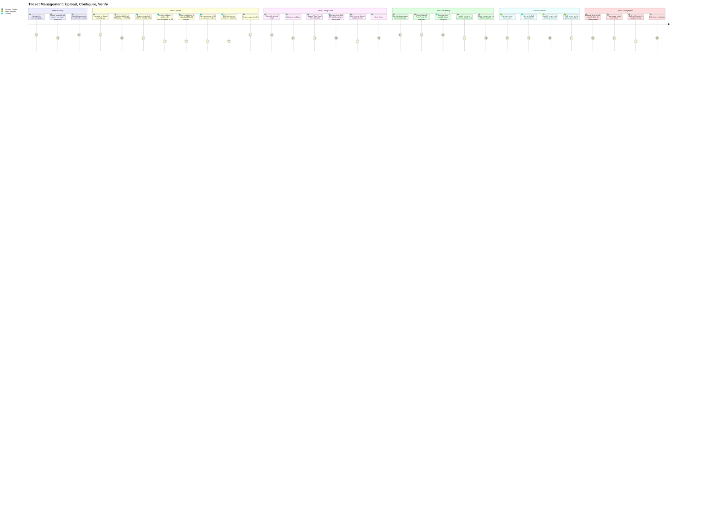
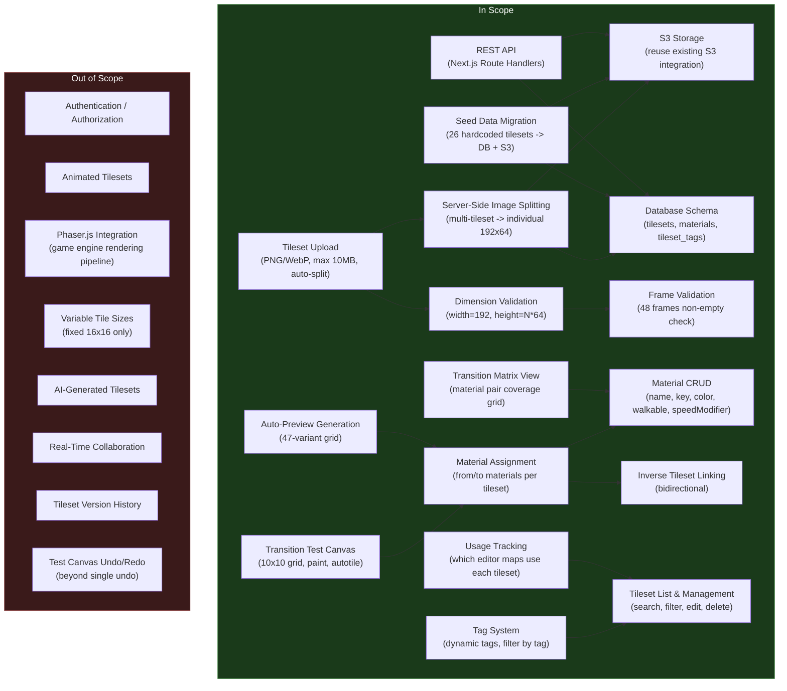
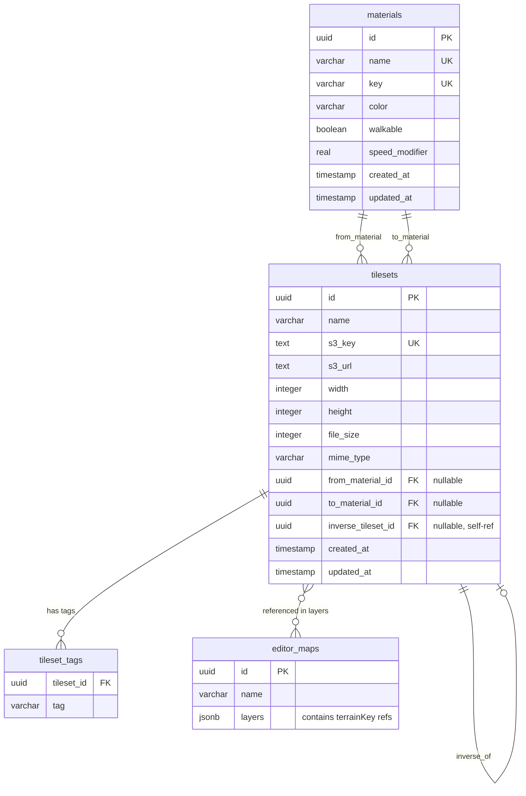

# PRD: Tileset Management

**Version**: 1.0
**Last Updated**: 2026-02-20

### Change History

| Version | Date | Description |
|---------|------|-------------|
| 1.0 | 2026-02-20 | Initial PRD: Tileset upload with auto-split, material CRUD, transition test canvas, autotile preview, transition matrix, seed migration |

## Overview

### One-line Summary

A tileset and material management system for the genmap map editor that replaces the hardcoded 26-terrain tileset definitions with a database-driven registry, supporting upload with auto-split, material-based transition relationships, interactive autotile testing, and a transition matrix overview.

### Background

Nookstead's map editor (`apps/genmap/`) uses a Blob-47 autotile engine where each terrain tileset is a 192x64 pixel spritesheet (12 columns x 4 rows of 16x16 tiles = 48 frames). Currently, all 26 tilesets are hardcoded in `packages/map-lib/src/core/terrain.ts` as a static array (`TERRAINS`) with terrain names, file keys, and inter-tileset relationships (from/to material pairs, inverse tileset links). The tileset images are loaded from static PNGs in `public/tilesets/`. The terrain palette in the map editor reads these hardcoded definitions to populate its list of available terrains.

This approach has several limitations:

1. **No extensibility**: Adding a new tileset requires code changes to `terrain.ts`, rebuilding `map-lib`, and manually placing the PNG in `public/tilesets/`.
2. **No metadata management**: Material properties (walkability, movement speed modifiers) are not tracked. The relationship system (from/to materials, inverse tilesets) is defined by manual function calls in `terrain.ts` and is error-prone.
3. **No validation or preview**: There is no way to visually test whether a tileset's 48 frames produce correct autotile transitions before using it on a map.
4. **No usage tracking**: Deleting or modifying a tileset provides no feedback about which editor maps depend on it.

The Tileset Management feature replaces the hardcoded system with a full database-driven registry. Materials become first-class entities with surface properties. Tilesets are uploaded via the existing S3 pipeline (reusing the sprite upload pattern), with server-side auto-splitting of multi-tileset images. Each tileset is linked to a "from" and "to" material defining the transition it represents. An interactive test canvas lets content creators paint with two materials and see autotile behavior in real time. A transition matrix view shows the complete coverage of material-pair tilesets at a glance.

A seed data migration script imports the existing 26 hardcoded tilesets into the database and uploads their PNGs to S3, after which the hardcoded definitions in `terrain.ts` are removed. This is a one-way migration: once complete, the system is fully database-driven.

## User Stories

### Primary Users

| Persona | Description |
|---------|-------------|
| **Content Creator** | A team member (artist or designer) who creates tileset artwork and uploads it to the system, assigning material transitions and tags. |
| **Map Designer** | A team member who uses the map editor to paint terrain. They select tilesets from the terrain palette, which is now populated from the database. The transition matrix helps them identify missing material-pair coverage. |
| **Developer** | A team member who consumes tileset and material data from the database to render terrain in the game engine. They benefit from structured, queryable data instead of hardcoded arrays. |

### User Stories

```
As a content creator
I want to upload a multi-tileset image and have it automatically split into individual tilesets
So that I can prepare multiple tilesets in a single artwork file and import them efficiently.
```

```
As a content creator
I want to assign "from" and "to" materials to each tileset
So that the system knows which terrain transition the tileset represents (e.g., water-to-grass).
```

```
As a content creator
I want to test a tileset on an interactive canvas with autotile rendering
So that I can verify the 48 frames produce correct transitions before using the tileset on real maps.
```

```
As a content creator
I want to create and manage materials with surface properties (walkable, speed modifier, color)
So that terrain behavior is defined once and applied consistently across all tilesets.
```

```
As a content creator
I want to tag tilesets with arbitrary labels and filter by tag
So that I can organize tilesets by theme (grassland, water, stone, etc.) without being limited to hardcoded groups.
```

```
As a content creator
I want to link a tileset to its inverse (e.g., water_grass <-> grass_water)
So that bidirectional transitions are explicitly tracked and easy to find.
```

```
As a map designer
I want to see a transition matrix showing all material pairs and their tileset coverage
So that I can identify which transitions have tilesets and which are missing.
```

```
As a map designer
I want to see how many maps use each tileset
So that I understand the impact before modifying or deleting a tileset.
```

```
As a developer
I want the existing 26 hardcoded tilesets migrated to the database as seed data
So that I can remove the static terrain definitions and have a single source of truth.
```

### Use Cases

1. **Upload a multi-tileset strip**: A content creator has a 192x256 PNG containing 4 tilesets stacked vertically (each 192x64). They navigate to the tileset upload page, select the file, and the system detects 4 tilesets (256 / 64 = 4). Each is split server-side into a separate 192x64 image, uploaded to S3, and registered in the database. The creator then assigns names, materials, and tags to each.

2. **Create a new material**: A content creator navigates to the materials page and creates a "shallow_water" material with color #4a90d9, walkable=true, speedModifier=0.6. The material becomes available in tileset material assignment dropdowns.

3. **Assign materials and test a tileset**: A content creator opens a newly uploaded tileset and assigns "water" as the "from" material and "grass" as the "to" material. They open the transition test canvas, which shows a 10x10 grid. They paint "water" cells surrounded by "grass" cells and see the autotile engine select the correct frames in real time. They verify corner cases (isolated water cell, water corridor, L-shaped water).

4. **Link inverse tilesets**: After uploading both a "water_grass" and a "grass_water" tileset, the content creator opens "water_grass" and selects "grass_water" as its inverse. The system bidirectionally links them: opening "grass_water" now shows "water_grass" as its inverse.

5. **Review the transition matrix**: A map designer opens the transition matrix view. Materials are listed on both axes. Cells with assigned tilesets show a count and thumbnail. Empty cells represent missing transitions. The designer clicks an empty cell (e.g., "sand" to "stone") and is taken to the upload page pre-configured with those materials.

6. **Check tileset usage before deletion**: A content creator wants to delete an outdated tileset. The system shows that 3 editor maps reference it. The creator either chooses to proceed (with a confirmation warning) or decides to replace the tileset in those maps first.

7. **Seed data migration**: A developer runs the migration script. It reads the 26 terrain definitions from `terrain.ts`, reads the corresponding PNG files from `public/tilesets/`, uploads them to S3, creates material records from the relationship data, and creates tileset records in the database. After verification, the hardcoded `TERRAINS` array and related functions are removed from `terrain.ts`.

## User Journey Diagram



## Scope Boundary Diagram



## Functional Requirements

### Must Have (MVP) -- Tileset Upload and Validation

- [ ] **FR-1: Tileset Upload with Auto-Split**
  - Upload tileset images (PNG/WebP) via a form similar to the existing sprite upload (`apps/genmap/src/app/api/sprites/route.ts`).
  - Maximum file size: 10MB. Client validates before upload; server rejects oversized files.
  - Server-side validation: width must be exactly 192 pixels (12 columns x 16px). Height must be a positive multiple of 64 pixels (4 rows x 16px per tileset).
  - Auto-detect the number of tilesets in the image: `count = height / 64`.
  - For multi-tileset images (count > 1), split the image into individual 192x64 images on the server using buffer slicing (PNG re-encoding).
  - Store each split tileset as a separate S3 object with its own database record.
  - Reuse the existing S3 integration pattern from `apps/genmap/src/lib/s3.ts` (uploadToS3, generatePresignedGetUrl, deleteS3Object).
  - Parse image dimensions from the buffer using the existing `parseImageDimensions` pattern from the sprites route.
  - AC: Given a content creator uploads a 192x256 PNG (4 tilesets), when the server processes it, then 4 separate 192x64 images are created in S3 and 4 tileset records are created in the database. Given a content creator uploads a 192x64 PNG (1 tileset), then 1 S3 object and 1 database record are created. Given the uploaded image has width 200, then the server returns a 400 error specifying that width must be 192. Given the image height is 100 (not a multiple of 64), then the server returns a 400 error.

- [ ] **FR-2: Tileset Registration with Metadata**
  - After splitting and S3 upload, each tileset record is created in the database with:
    - `name` (string, default: derived from upload filename + index, e.g., "terrain_upload_1", "terrain_upload_2")
    - `s3Key` (string, the S3 object key for this individual tileset image)
    - `s3Url` (string, full URL to the stored 192x64 image)
    - `width` (integer, always 192)
    - `height` (integer, always 64)
    - `fileSize` (integer, size of the individual split image in bytes)
    - `mimeType` (string, image/png or image/webp)
    - `fromMaterialId` (UUID, FK to materials, nullable -- assigned after upload)
    - `toMaterialId` (UUID, FK to materials, nullable -- assigned after upload)
    - `inverseTilesetId` (UUID, FK to tilesets, nullable -- self-referencing)
  - The API returns the created tileset records with generated UUIDs.
  - AC: Given a successful upload of 3 tilesets, when the API responds, then the response contains an array of 3 tileset records, each with a unique `id`, correct `s3Key`, `width=192`, `height=64`, and null material assignments. Given a single tileset upload, then the response contains a single tileset record.

- [ ] **FR-3: Tileset Dimension Validation**
  - On upload, validate that the image dimensions conform to the Blob-47 specification:
    - Width must be exactly 192 pixels (12 columns x 16px tile width).
    - Height must be a positive multiple of 64 pixels (4 rows x 16px tile height).
  - Return descriptive error messages specifying what is wrong and what is expected.
  - AC: Given an image of 192x128, when validated, then it passes (2 tilesets). Given an image of 192x63, then validation fails with "Height must be a multiple of 64 (4 rows of 16px tiles). Got: 63". Given an image of 160x64, then validation fails with "Width must be exactly 192 (12 columns of 16px tiles). Got: 160".

- [ ] **FR-4: Frame Content Validation**
  - After splitting, validate that each of the 48 frames (12 cols x 4 rows of 16x16 pixels) in a tileset contains at least one non-fully-transparent pixel.
  - Report validation results per-frame: each frame is "valid" (has visible content) or "empty" (fully transparent).
  - This is a warning, not a blocking error. The tileset can still be saved if some frames are empty.
  - AC: Given a tileset where all 48 frames contain visible pixels, then validation reports all 48 as valid. Given a tileset where frames 0 and 47 are fully transparent, then validation reports those 2 frames as empty and the remaining 46 as valid. The tileset is still created.

### Must Have (MVP) -- Material Management

- [ ] **FR-5: Material CRUD**
  - Create, read, update, and delete materials.
  - Each material has:
    - `name` (string, unique, max 100 characters, e.g., "Deep Water")
    - `key` (string, unique slug, max 50 characters, lowercase alphanumeric + underscores, e.g., "deep_water")
    - `color` (string, hex color code with # prefix, e.g., "#1a6baa")
    - `walkable` (boolean, default true)
    - `speedModifier` (float, default 1.0, range 0.0-2.0)
  - The key is auto-generated from the name on creation (lowercase, spaces to underscores, special chars removed) but can be manually overridden.
  - AC: Given a content creator creates a material with name "Shallow Water", when they save, then a record is created with key "shallow_water" (auto-generated), color, walkable, and speedModifier values. Given a material named "Water" already exists, when another material with name "Water" is created, then a 409 conflict error is returned. Given a material is updated to change walkable from true to false, then the record is updated and all tilesets referencing this material reflect the new walkability.

- [ ] **FR-6: Material List Page**
  - A page lists all materials in a grid or list layout.
  - Each material entry shows: color swatch (filled rectangle in the material's hex color), name, key, walkable badge (green/red), speed modifier value.
  - Materials are sorted alphabetically by name.
  - Clicking a material navigates to its edit page.
  - AC: Given 8 materials exist, when the materials page is opened, then all 8 are listed with color swatches, names, and property badges. Given a material's color is "#ff5500", then the swatch displays that exact color.

- [ ] **FR-7: Material Deletion with Dependency Check**
  - When deleting a material, check if any tilesets reference it as their "from" or "to" material.
  - If tilesets reference the material, show a confirmation warning listing the affected tilesets.
  - On confirmation, the material is deleted and the referencing tilesets' `fromMaterialId` or `toMaterialId` is set to null.
  - AC: Given material "grass" is referenced by 5 tilesets (as either from or to), when deletion is initiated, then a warning dialog lists the 5 affected tilesets. On confirmation, the material is deleted and those 5 tilesets have their respective material FK set to null. Given material "unused_test" is referenced by 0 tilesets, then deletion proceeds without a warning.

### Must Have (MVP) -- Tileset Configuration

- [ ] **FR-8: Material Assignment on Tilesets**
  - Each tileset has a "from" material and a "to" material, defining the terrain transition it represents (e.g., from=water, to=grass means "water drawn over grass").
  - The tileset edit page shows two material selector dropdowns ("From Material" and "To Material") populated from the materials list.
  - Both are nullable (unassigned by default after upload).
  - The "from" and "to" materials must be different (validation error if same material selected for both).
  - AC: Given a tileset with no materials assigned, when the content creator selects "water" as "from" and "grass" as "to" and saves, then the tileset record is updated with the correct material foreign keys. Given the creator selects "water" for both, then a validation error prevents saving.

- [ ] **FR-9: Inverse Tileset Linking**
  - A tileset can be linked to its inverse (e.g., "water_grass" is the inverse of "grass_water").
  - Setting A's inverse to B also sets B's inverse to A (bidirectional).
  - Clearing A's inverse also clears B's inverse reference back to A.
  - The inverse tileset is displayed on the tileset edit page with a link to navigate to it.
  - A tileset cannot be its own inverse (validation error).
  - AC: Given tileset A (water_grass) and tileset B (grass_water) exist with no inverse links, when A's inverse is set to B, then both A.inverseTilesetId=B.id and B.inverseTilesetId=A.id. Given A's inverse is then cleared, then both A and B have null inverseTilesetId. Given a user attempts to set A's inverse to A, then a validation error is returned.

- [ ] **FR-10: Tagging System**
  - Tilesets can have multiple tags (e.g., "grassland", "water", "stone", "road").
  - Tags are free-form strings, max 50 characters, stored in a join table (tileset_tags).
  - Tags are managed on the tileset edit page: add by typing a new tag, remove by clicking the X on a tag chip.
  - The tileset list page supports filtering by tag.
  - Existing hardcoded groups (grassland, water, sand, forest, stone, road, props, misc) become seed tags.
  - AC: Given a tileset has tags ["water", "transition"], when the tag "coastal" is added, then the tileset now has 3 tags. Given the tileset list is filtered by tag "water", then only tilesets with that tag are shown. Given tag "transition" is removed from the tileset, then it has 2 remaining tags.

- [ ] **FR-11: Tileset List and Management**
  - A page lists all tilesets with: thumbnail (auto-preview or solid frame), name, from/to material pair (with color swatches), tags, usage count.
  - Search by name (partial match, case-insensitive).
  - Filter by material (from or to), tag, or both.
  - Clicking a tileset navigates to its edit page.
  - Delete tileset with usage check (FR-15).
  - Edit tileset metadata: name, tags, material assignment, inverse link.
  - AC: Given 30 tilesets exist, when the list page is opened, then all 30 are displayed with thumbnails and metadata. Given the search term "water" is entered, then only tilesets whose name contains "water" are shown. Given the material filter "grass" is selected, then only tilesets with "grass" as their from or to material are shown.

### Must Have (MVP) -- Testing and Preview

- [ ] **FR-12: Transition Test Canvas**
  - A 10x10 tile grid displayed on the tileset edit page.
  - Requires a tileset with both "from" and "to" materials assigned.
  - The grid starts filled with the "to" material (background).
  - Clicking a cell paints it with the "from" material (or toggles it back to "to").
  - After each paint action, the autotile algorithm (Blob-47 `getFrame()`) recalculates frame indices for all affected cells and their neighbors.
  - Tiles are rendered from the tileset's 192x64 spritesheet image, extracting the correct 16x16 frame based on the frame index.
  - "Clear canvas" button resets all cells to the "to" material.
  - Single-step undo support (undo last paint action).
  - AC: Given a tileset with from=water and to=grass, when the test canvas loads, then all 100 cells show the "to" material (grass, which is the absence of this tileset's terrain = frame 0/empty). Given a user clicks cell (5, 5), then that cell is painted with "water" and the autotile algorithm selects the "isolated" frame (frame 47). Given cells (4,5), (5,4), (5,5), (5,6), (6,5) are painted, then cell (5,5) shows the "cross" frame (frame 16, all 4 cardinals present, no corners). Given "Clear canvas" is clicked, then all cells reset to the "to" material.

- [ ] **FR-13: Auto-Preview Generation**
  - After material assignment, automatically render a compact grid image showing all 47 autotile variants (frames 1-47) plus the empty frame (frame 0).
  - Display format: 12x4 grid matching the tileset spritesheet layout, with each frame labeled by its index.
  - This preview is shown as the tileset thumbnail on the list page and on the edit page.
  - Regenerated when the tileset image or materials change.
  - AC: Given a tileset with both materials assigned, when the auto-preview is generated, then a 192x64 image (or canvas rendering) is displayed showing all 48 frames in the 12x4 grid. Given the tileset image is re-uploaded, then the preview is regenerated.

### Must Have (MVP) -- Usage and Migration

- [ ] **FR-14: Tileset Usage Tracking**
  - Track which editor maps reference each tileset by scanning the `layers` JSONB field of `editor_maps` for `terrainKey` values that match tileset keys.
  - Display usage count on the tileset list page and edit page.
  - On tileset deletion, if usage count > 0, show a confirmation warning listing the affected maps.
  - Prevent accidental deletion: require explicit confirmation for tilesets used by maps.
  - AC: Given tileset "terrain-03" is used in 3 editor maps (referenced in their layers' terrainKey fields), when the tileset detail page is opened, then "Used in 3 maps" is displayed. Given deletion is initiated, then a warning names the 3 maps. On confirmation, the tileset is deleted. Given a tileset is not used in any maps, then "Not used in any maps" is displayed and deletion proceeds without a warning.

- [ ] **FR-15: Transition Matrix View**
  - A grid view with materials on both axes (rows = "from" material, columns = "to" material).
  - Each cell shows the number of tilesets assigned to that material pair, or is empty.
  - Non-empty cells display a small thumbnail and count. Clicking navigates to the tileset list filtered by that pair.
  - Empty cells are visually distinct (dashed border or grayed out). Clicking an empty cell navigates to the upload page with the "from" and "to" materials pre-selected.
  - Diagonal cells (same material for from and to) are disabled/grayed as they are invalid.
  - AC: Given 3 materials (water, grass, sand) and 2 tilesets (water-to-grass, grass-to-water), then the matrix shows a 3x3 grid. The cell at (water, grass) shows "1", the cell at (grass, water) shows "1", and all other off-diagonal cells are empty. Given a user clicks the empty cell at (sand, grass), then they are navigated to the upload page with from=sand and to=grass pre-selected.

- [ ] **FR-16: Seed Data Migration**
  - A migration script that imports the existing 26 hardcoded tilesets into the database:
    1. Read the 26 terrain definitions from `TERRAINS` in `terrain.ts`.
    2. Extract unique material names from the `relationship.from` and `relationship.to` fields. Create material records for each unique material (e.g., water, grass, dirt, deep_water, etc.) with default properties (walkable=true, speedModifier=1.0) and auto-generated colors.
    3. Read each PNG file from `public/tilesets/terrain-XX.png` (or the project's asset directory).
    4. Upload each PNG to S3 as a tileset object.
    5. Create tileset database records with the correct name, S3 reference, and material assignments.
    6. Set inverse tileset links based on `relationship.inverseOf` fields.
    7. Apply tags based on the existing `TILESETS` group assignments (grassland, water, sand, forest, stone, road, props, misc).
  - After migration is verified, remove the hardcoded `TERRAINS` array, `TERRAIN_NAMES`, `TILESETS` export, and related utility functions from `terrain.ts`.
  - Update `terrain-palette.tsx` and `use-tileset-images.ts` to load tilesets from the database API instead of the static imports.
  - AC: Given the migration script runs, when the database is inspected, then 26 tileset records exist with correct names, S3 keys, and material assignments. Material records exist for each unique terrain type (water, grass, dirt, etc.). Inverse links match the hardcoded `inverseOf` relationships. Tags match the group assignments. Given the map editor is opened after migration, then the terrain palette displays the same 26 tilesets loaded from the API.

### Must Have (MVP) -- API Endpoints

- [ ] **FR-17: Tileset API**
  - `POST /api/tilesets` -- Upload tileset image (multipart form: file + optional name). Validates dimensions, splits if multi-tileset, uploads to S3, creates records. Returns array of created tileset records.
  - `GET /api/tilesets` -- List all tilesets. Supports query params: `?tag=X` (filter by tag), `?materialId=X` (filter by from or to material), `?search=X` (name search), `?limit=N&offset=N` (pagination).
  - `GET /api/tilesets/:id` -- Get a single tileset by ID. Includes material details, tags, inverse tileset info, and usage count.
  - `PATCH /api/tilesets/:id` -- Update tileset metadata (name, fromMaterialId, toMaterialId, inverseTilesetId).
  - `DELETE /api/tilesets/:id` -- Delete a tileset. Removes S3 object, clears inverse link on paired tileset, deletes tag associations, deletes database record. Returns 204.
  - AC: Given a valid 192x128 PNG is uploaded, then 2 tileset records and 2 S3 objects are created and the response contains both records. Given `GET /api/tilesets?tag=water&search=grass`, then only tilesets tagged "water" whose name contains "grass" are returned. Given `DELETE /api/tilesets/:id` is called on a tileset that is the inverse of another, then the paired tileset's `inverseTilesetId` is set to null.

- [ ] **FR-18: Material API**
  - `POST /api/materials` -- Create a material. Accepts `{name, key?, color, walkable?, speedModifier?}`. Auto-generates key from name if not provided. Returns created record.
  - `GET /api/materials` -- List all materials. Returns array sorted by name.
  - `GET /api/materials/:id` -- Get a single material by ID.
  - `PATCH /api/materials/:id` -- Update a material (name, key, color, walkable, speedModifier).
  - `DELETE /api/materials/:id` -- Delete a material. Sets referencing tilesets' material FKs to null. Returns 204.
  - AC: Given a valid create request with name "Lava", then a material is created with key "lava" (auto-generated). Given a create request with key "deep-water" (contains hyphen), then a 400 error is returned specifying key format rules. Given `GET /api/materials` is called, then all materials are returned sorted alphabetically by name.

- [ ] **FR-19: Tileset Tag API**
  - `POST /api/tilesets/:id/tags` -- Add a tag to a tileset. Accepts `{tag: string}`. Returns updated tag list.
  - `DELETE /api/tilesets/:id/tags/:tag` -- Remove a tag from a tileset. Returns 204.
  - `GET /api/tilesets/tags` -- List all unique tags across all tilesets. Returns `{tag: string, count: number}[]`.
  - AC: Given a tileset has no tags, when tag "grassland" is added, then the tileset has 1 tag. Given the same tag is added again, then no duplicate is created. Given `GET /api/tilesets/tags` is called with 3 tilesets tagged "water" and 2 tagged "road", then `[{tag: "road", count: 2}, {tag: "water", count: 3}]` is returned (sorted alphabetically).

- [ ] **FR-20: Transition Matrix API**
  - `GET /api/tilesets/matrix` -- Returns the transition matrix data: for each material pair (from, to), the count of tilesets assigned and a representative tileset ID (if any).
  - Response format: `{materials: Material[], cells: {fromId: string, toId: string, count: number, representativeId?: string}[]}`.
  - AC: Given 3 materials and 2 tilesets (one from A to B, one from B to A), then the matrix response contains 3 materials and 2 non-zero cells.

- [ ] **FR-21: Tileset Usage API**
  - `GET /api/tilesets/:id/usage` -- Returns a list of editor maps that reference this tileset's key in their layers.
  - Response format: `{maps: {id: string, name: string}[], count: number}`.
  - AC: Given tileset with key "terrain-03" is referenced in 2 editor maps' layers, then the usage endpoint returns count=2 and the 2 map names.

### Must Have (MVP) -- Database Schema

- [ ] **FR-22: Database Tables**
  - Three new tables and one modified pattern are added to `packages/db/` via Drizzle ORM schema definitions and migrations:
  - **`materials`**: `id` (UUID, PK, auto-generated), `name` (varchar 100, not null, unique), `key` (varchar 50, not null, unique), `color` (varchar 7, not null, e.g., "#ff5500"), `walkable` (boolean, not null, default true), `speed_modifier` (real, not null, default 1.0), `created_at` (timestamp with timezone, default now, not null), `updated_at` (timestamp with timezone, default now, not null).
  - **`tilesets`**: `id` (UUID, PK, auto-generated), `name` (varchar 255, not null), `s3_key` (text, not null, unique), `s3_url` (text, not null), `width` (integer, not null), `height` (integer, not null), `file_size` (integer, not null), `mime_type` (varchar 50, not null), `from_material_id` (UUID, FK to materials.id, nullable, set null on delete), `to_material_id` (UUID, FK to materials.id, nullable, set null on delete), `inverse_tileset_id` (UUID, FK to tilesets.id, nullable, set null on delete), `created_at` (timestamp with timezone, default now, not null), `updated_at` (timestamp with timezone, default now, not null).
  - **`tileset_tags`**: `tileset_id` (UUID, FK to tilesets.id, cascade delete), `tag` (varchar 50, not null). Composite primary key on (tileset_id, tag).
  - All migrations are additive and backward-compatible with existing tables.
  - The `tilesets` table follows the same structural pattern as `sprites` (same column types for S3 fields, same timestamp pattern) for consistency.
  - AC: Given the migration runs, when the database is inspected, then the `materials`, `tilesets`, and `tileset_tags` tables exist with correct columns, types, and constraints. Given a material is deleted, then referencing tilesets have their `from_material_id` or `to_material_id` set to null. Given a tileset is deleted, then its `tileset_tags` rows are cascade-deleted and any tileset referencing it as `inverse_tileset_id` has that FK set to null.

### Should Have

- [ ] **FR-23: Bulk Upload Wizard**
  - A step-by-step wizard flow for multi-tileset uploads:
    1. Upload image and see the detected tilesets listed.
    2. For each tileset, assign a name and "from"/"to" materials via dropdowns.
    3. Optionally add tags (same tags applied to all, or per-tileset).
    4. Review and confirm.
    5. All tilesets created in a single batch.
  - AC: Given a 192x192 image (3 tilesets) is uploaded via the wizard, when the user assigns materials to each and confirms, then 3 tilesets are created with their respective material assignments in a single flow.

- [ ] **FR-24: Tileset Comparison View**
  - Side-by-side comparison of 2-4 tilesets with the same material pair.
  - Display the test canvas with each tileset applied to the same painted pattern.
  - Useful for choosing between alternative tileset artwork.
  - AC: Given 3 tilesets exist for the "water to grass" pair, when comparison view is opened, then all 3 are shown side-by-side with the same test pattern applied to each.

- [ ] **FR-25: Batch Tag Operations**
  - Select multiple tilesets from the list and apply/remove tags in bulk.
  - Multi-select via checkboxes. Bulk action dropdown: "Add Tag", "Remove Tag".
  - AC: Given 5 tilesets are selected and tag "coastal" is added, then all 5 tilesets receive the "coastal" tag.

### Could Have

- [ ] **FR-26: Material Palette**
  - A quick-access visual palette for material selection showing all materials as color swatches in a compact grid.
  - Click a swatch to select the material in any material dropdown.
  - AC: Given 10 materials exist, when the palette is opened, then 10 color swatches are displayed in a compact grid. Clicking a swatch selects that material.

- [ ] **FR-27: Tileset Export/Import**
  - Export: download a JSON bundle containing tileset metadata, material definitions, tags, and relationships (excludes actual image data, which remains in S3).
  - Import: upload a JSON bundle to recreate tileset and material records (images must already exist in S3 at the specified keys).
  - Useful for backup and sharing configurations between environments.
  - AC: Given an export is triggered for all tilesets, then a JSON file is downloaded containing all tileset records, material records, and tag associations. Given the JSON is imported into a fresh database, then all records are recreated.

- [ ] **FR-28: Tileset Versioning**
  - Upload a new version of a tileset image while keeping the old version available for existing maps.
  - Version history shows previous images and when they were active.
  - Maps can be updated to use the new version or remain on the old one.
  - AC: Given tileset "water_grass" has version 1, when a new image is uploaded as version 2, then both versions exist. Maps using version 1 continue to reference it. The tileset detail page shows the version history.

### Out of Scope

- **Authentication / Authorization**: This is an internal tool. No login, roles, or permissions are required.
- **Variable tile sizes**: All tilesets use the fixed Blob-47 specification of 16x16 pixel tiles in a 12x4 grid (192x64). Custom tile sizes are not supported.
- **Animated tilesets**: All tileset frames are static. Frame-based animation sequences are not supported.
- **AI-generated tilesets**: Automatic generation of tileset artwork from material descriptions is not included.
- **Game engine integration**: This tool manages tileset data in the database and S3. Integration with the Phaser.js rendering pipeline is separate.
- **Real-time collaboration**: Only one user operates the tool at a time. No multi-user editing or conflict resolution.
- **Tileset version history** (beyond Could Have FR-28): Full versioning with rollback is not in scope for v1.
- **Advanced test canvas features**: The test canvas supports single-step undo but not full undo/redo stacks, layers, or save/load of test patterns.
- **Automatic material property inference**: Materials properties (walkable, speed) are manually set. No inference from tileset artwork.

## Non-Functional Requirements

### Performance

- **Tileset upload (single)**: Server-side split + S3 upload of a single 192x64 tileset should complete within 2 seconds.
- **Multi-tileset split**: A 192x640 image (10 tilesets) should be split and uploaded within 10 seconds.
- **Test canvas rendering**: The 10x10 grid with autotile recalculation should respond within 16ms per paint action (60fps). The Blob-47 `getFrame()` lookup is O(1) per cell.
- **Tileset list page**: Loading and rendering 100 tilesets with thumbnails should complete within 1 second (excluding image loading).
- **Transition matrix**: Computing and rendering the matrix for up to 50 materials (2,500 cells) should complete within 500ms.
- **API response times**: All CRUD endpoints should return within 200ms for typical payloads.
- **Material operations**: CRUD operations on materials should complete within 100ms.

### Reliability

- **S3 upload failure handling**: If S3 upload fails during multi-tileset split, none of the tilesets in the batch are committed to the database. Previously uploaded S3 objects from the batch are cleaned up (best effort; failures logged).
- **Image splitting integrity**: The server-side image splitting must produce pixel-perfect 192x64 images. No interpolation, scaling, or color space conversion. Byte-level accuracy validated in tests.
- **Inverse link consistency**: Bidirectional inverse links are always maintained atomically. If setting A's inverse to B, both A and B are updated in a single database transaction.
- **Data integrity**: Foreign key constraints with appropriate ON DELETE behavior (SET NULL for material references, CASCADE for tags). No orphan records.
- **Seed migration idempotency**: The migration script is idempotent. Running it multiple times does not create duplicate records (checks for existing records by key before inserting).

### Security

- **No authentication required**: Internal tool, trusted network only.
- **Input validation**: Material names, keys, and tags are validated for length and format. File uploads are validated for MIME type and size.
- **S3 credentials**: Stored in environment variables, not in code or client-accessible configuration. Same pattern as existing sprite upload.
- **Image processing safety**: Server-side image splitting uses buffer operations, not shell commands. No external process execution.

### Scalability

- **Tileset count**: The system should handle up to 500 tilesets without performance degradation in listing and matrix operations.
- **Material count**: Up to 100 materials should be manageable. The transition matrix remains usable up to approximately 50 materials (50x50 grid).
- **Tag count**: Up to 1,000 unique tags across all tilesets. Tag filtering uses indexed queries.
- **S3 storage**: Each tileset is 192x64 pixels. Even as PNG, individual files are typically 5-20KB. 500 tilesets would use under 10MB of S3 storage.

## Success Criteria

### Quantitative Metrics

1. **Upload end-to-end**: A content creator can upload a 4-tileset image, have it split, and see all 4 tilesets in the list within 5 seconds.
2. **Material creation**: Creating a material with all properties takes under 10 seconds of active interaction.
3. **Tileset configuration**: Assigning materials, linking an inverse, and adding tags to a tileset takes under 30 seconds.
4. **Test canvas feedback**: Painting a cell on the test canvas and seeing the autotile update takes under 50ms (perceived instant).
5. **Transition matrix completeness**: The matrix view correctly reflects all tileset-to-material assignments. Zero false positives or false negatives.
6. **Seed migration accuracy**: All 26 hardcoded tilesets are migrated with correct names, material assignments, inverse links, and tags. The map editor displays the same terrain palette from DB data.
7. **CRUD completeness**: All entities (tilesets, materials, tags) support full CRUD through both UI and API.
8. **Database integrity**: Deleting a material sets referencing tileset FKs to null. Deleting a tileset cascade-deletes its tags and clears its inverse pair's reference.

### Qualitative Metrics

1. **Intuitive material management**: A new team member can create a material, upload a tileset, assign materials, and verify the transition on the test canvas without instruction.
2. **Transition matrix clarity**: The matrix view provides immediate visual understanding of which material transitions have tileset coverage and which are gaps.
3. **Test canvas confidence**: Content creators trust the test canvas output and feel confident that a tileset will work correctly before using it on real maps.
4. **Smooth migration**: After seed data migration, the map editor terrain palette looks and behaves identically to the pre-migration version, with no visual or functional regression.

## Technical Considerations

### Dependencies

- **Next.js 16** (`next`): Application framework for the genmap tool. Already installed in `apps/genmap/`.
- **React 19** (`react`, `react-dom`): UI framework. Already installed.
- **shadcn/ui**: Component library (New York style, Tailwind CSS). Already configured in `apps/genmap/components.json`.
- **Tailwind CSS 4** (`tailwindcss`): Utility-first CSS. Already installed.
- **Lucide React** (`lucide-react`): Icon library. Already installed.
- **@nookstead/db** (`packages/db/`): Drizzle ORM, PostgreSQL schema, migrations. Already exists. Must be extended with `materials`, `tilesets`, and `tileset_tags` tables.
- **@nookstead/map-lib** (`packages/map-lib/`): Contains the Blob-47 autotile engine (`autotile.ts`) and current hardcoded terrain definitions (`terrain.ts`). The autotile engine is reused by the test canvas. The terrain definitions are replaced by DB records after migration.
- **@aws-sdk/client-s3**: S3 client for uploads and deletions. Already a dependency via `apps/genmap/src/lib/s3.ts`.
- **sharp** (new dependency, or custom PNG encoder): Required for server-side image splitting (slicing a multi-tileset PNG into individual 192x64 PNGs). Alternatively, use a lightweight PNG encoder that works with raw pixel buffers. Must evaluate: `sharp` is a common choice with good performance, but adds a native binary dependency.
- **HTML5 Canvas API**: Native browser API for test canvas rendering and auto-preview generation. No additional library required.

### Constraints

- **Fixed tileset dimensions**: All tilesets must be exactly 192x64 pixels (12 cols x 4 rows of 16x16 tiles). This is dictated by the Blob-47 autotile engine specification.
- **Server-side image splitting required**: Multi-tileset images must be split on the server, not the client, because individual S3 objects are needed for each tileset. This means the file data passes through the API server (unlike sprite upload which uses presigned URLs for direct client-to-S3 upload).
- **S3 endpoint configurability**: Same as sprite upload. Supports AWS S3, Cloudflare R2, MinIO via environment variables.
- **Database shared with game server**: New tables must not conflict with existing tables. The `tilesets` table name does not conflict with any existing table.
- **Backward compatibility during migration**: The map editor must continue to work during the transition period. Editor maps store terrain keys (e.g., "terrain-03") in their layers. After migration, the same keys must resolve to the correct tileset from the database.
- **Autotile engine unchanged**: The Blob-47 `getFrame()` function and frame table are not modified. The test canvas uses the existing algorithm.

### Assumptions

- The genmap app (`apps/genmap/`) is served on a trusted internal network. No authentication needed.
- S3-compatible storage is available and accessible with the configured credentials.
- The existing 26 tileset PNG files are available at `public/tilesets/terrain-01.png` through `terrain-26.png` (or at an equivalent path accessible during migration).
- Server-side image processing (splitting PNGs) is feasible with available Node.js libraries. The chosen library (e.g., `sharp`) can be installed in the monorepo without conflicts.
- Content creators produce tileset artwork conforming to the 192x64 specification (12 cols x 4 rows of 16x16 tiles).

### Risks and Mitigation

| Risk | Impact | Probability | Mitigation |
|------|--------|-------------|------------|
| Server-side image splitting adds complexity and a native dependency (sharp) | Medium | Medium | Evaluate lightweight alternatives (pngjs, custom buffer slicing for uncompressed data). If sharp is used, ensure it works across development and production environments. Pin the version. |
| Seed migration breaks existing editor maps that reference hardcoded terrain keys | High | Medium | Ensure migration preserves exact terrain keys (e.g., "terrain-03"). Verify by loading all existing editor maps after migration and checking that layers render correctly. |
| Transition matrix becomes unusable with many materials (50+) | Low | Low | Implement virtual scrolling or pagination for the matrix. At expected scale (20-30 materials), the matrix fits on screen. |
| File upload through the API server (not presigned) increases server memory usage | Medium | Low | Stream the file data rather than buffering the entire file. Set a 10MB limit. For a single-user internal tool, memory usage is not a practical concern. |
| Inverse tileset linking creates complex bidirectional update logic | Low | Medium | Implement in a single database transaction. Write thorough tests for all edge cases (set, clear, change, self-reference). |
| Tag proliferation (too many tags) makes filtering ineffective | Low | Low | Display tag usage counts. Suggest existing tags via autocomplete when adding tags. No technical mitigation needed for v1. |
| Test canvas autotile rendering differs from game engine rendering | Medium | Low | Both use the same `getFrame()` function from `@nookstead/map-lib`. The frame-to-pixel mapping is deterministic (frame index -> source rect in spritesheet). Visual parity is guaranteed if the same algorithm is used. |
| Map editor terrain palette regression after migration from static to API-loaded data | High | Medium | Implement the API-loaded palette behind a feature flag during development. Compare output visually with the static version. Only remove static definitions after full verification. |

## Undetermined Items

None. All major decisions have been confirmed:
- Full DB migration (not parallel/opt-in)
- Rich materials with surface properties
- Split on upload (server-side, not client-side)
- All extra features (test canvas, transition matrix, preview generation, usage tracking) included in v1
- Fixed 16x16 tile size (no variable support)
- Tags replace hardcoded groups
- S3 storage via existing integration pattern

## Appendix

### References

- [Blob-47 Autotile Algorithm](https://www.boristhebrave.com/2013/07/14/tileset-roundup/) -- Background on the Blob-47 autotile technique used by the engine
- [AWS S3 Presigned URLs](https://docs.aws.amazon.com/AmazonS3/latest/userguide/using-presigned-url.html) -- Presigned URL pattern (reused from sprite upload)
- [Drizzle ORM Documentation](https://orm.drizzle.team/docs/overview) -- ORM used for database schema and migrations
- [shadcn/ui Documentation](https://ui.shadcn.com/) -- Component library used in the genmap app
- [HTML5 Canvas API (MDN)](https://developer.mozilla.org/en-US/docs/Web/API/Canvas_API) -- Canvas rendering for test canvas and preview generation
- [sharp Documentation](https://sharp.pixelplumbing.com/) -- Potential image processing library for server-side tileset splitting

### Relationship to Existing PRDs

This PRD depends on and extends work from:

| Aspect | PRD-006 (Sprite Management) | PRD-008 (This PRD) |
|--------|----------------------------|---------------------|
| Upload pattern | Sprite upload via presigned URL (client-direct-to-S3) | Tileset upload via server (file passes through API for splitting) |
| Image processing | None (metadata-only) | Server-side splitting of multi-tileset images |
| Storage | S3 for sprite sheets | S3 for individual tileset images (192x64 each) |
| Database | `sprites` table | `tilesets`, `materials`, `tileset_tags` tables |
| S3 integration | `apps/genmap/src/lib/s3.ts` | Reuses same S3 module |
| Data model | Sprite -> Tile Map -> Game Object | Material -> Tileset (with transitions, inverses, tags) |
| Shared concern | `packages/db/` schema | `packages/db/` schema (additive tables) |

This PRD also modifies code covered by PRD-007 (Map Editor):

| Aspect | Impact |
|--------|--------|
| Terrain palette | Changes from static `TERRAINS` import to API-loaded tilesets |
| Tileset image loading | Changes from static `/tilesets/` path to S3 presigned URLs |
| Layer terrain keys | Preserved across migration (same string keys) |
| Autotile engine | Unchanged (reused by test canvas) |

### Data Entity Diagram



### API Endpoint Summary

| Method | Endpoint | Description |
|--------|----------|-------------|
| POST | `/api/tilesets` | Upload tileset image (split + store) |
| GET | `/api/tilesets` | List tilesets (filter by tag, material, search) |
| GET | `/api/tilesets/:id` | Get tileset detail |
| PATCH | `/api/tilesets/:id` | Update tileset metadata |
| DELETE | `/api/tilesets/:id` | Delete tileset (S3 + DB) |
| POST | `/api/tilesets/:id/tags` | Add tag to tileset |
| DELETE | `/api/tilesets/:id/tags/:tag` | Remove tag from tileset |
| GET | `/api/tilesets/tags` | List all unique tags with counts |
| GET | `/api/tilesets/:id/usage` | Get tileset usage in editor maps |
| GET | `/api/tilesets/matrix` | Get transition matrix data |
| POST | `/api/materials` | Create material |
| GET | `/api/materials` | List all materials |
| GET | `/api/materials/:id` | Get material detail |
| PATCH | `/api/materials/:id` | Update material |
| DELETE | `/api/materials/:id` | Delete material (nullify tileset refs) |

### Glossary

- **Tileset**: A 192x64 pixel spritesheet containing 48 autotile frames (12 columns x 4 rows of 16x16 pixel tiles) used by the Blob-47 autotile engine. Each tileset represents a transition between two materials.
- **Material**: A named terrain surface type (e.g., "grass", "water", "stone") with associated properties: a display color, walkability flag, and movement speed modifier. Materials are the "what" that tilesets visually represent.
- **Transition**: The visual relationship defined by a tileset: one material (from/subject) drawn over another (to/background). A "water-to-grass" tileset draws water terrain edges over a grass background.
- **Inverse tileset**: Two tilesets that represent the same transition in opposite directions. If tileset A is "water over grass", its inverse B is "grass over water". They are linked bidirectionally.
- **Blob-47**: An autotile algorithm that uses 8-neighbor bitmasks with diagonal gating to produce 47 valid tile configurations (plus 1 empty frame = 48 total). Standard technique for seamless terrain transitions in 2D tile-based games.
- **Frame**: A single 16x16 pixel tile within a tileset spritesheet. Frame indices 0-47 map to specific neighbor configurations via the Blob-47 algorithm. Frame 0 = empty, Frame 1 = solid (all neighbors), Frame 47 = isolated (no neighbors).
- **Transition matrix**: A grid view where materials appear on both axes. Each cell represents a from-to material pair and shows whether tilesets exist for that transition. Used to identify coverage gaps.
- **Seed data migration**: The one-time process of importing the existing 26 hardcoded terrain definitions into the database, including uploading their PNG files to S3, creating material and tileset records, and removing the static code.
- **Auto-split**: Server-side process of dividing a multi-tileset image (height > 64px) into individual 192x64 tileset images, each stored as a separate S3 object.
- **Tag**: A free-form label attached to a tileset for categorization and filtering (e.g., "grassland", "water", "road"). Tags replace the hardcoded tileset groups from the static system.
- **Test canvas**: An interactive 10x10 tile grid on the tileset edit page where content creators can paint with two materials and see the Blob-47 autotile algorithm select the correct frames in real time.
- **Auto-preview**: An automatically generated visualization showing all 48 frames of a tileset in a 12x4 grid, used as a thumbnail for quick identification.
