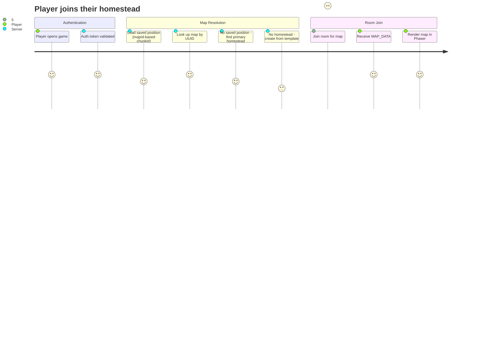

# PRD: Map Entity Model Refactor

**Version**: 1.2
**Last Updated**: 2026-03-02

### Change History

| Version | Date | Description |
|---------|------|-------------|
| 1.0 | 2026-03-01 | Initial PRD: Refactor maps table from user-keyed extension to independent entity with UUID, type, and optional owner |
| 1.1 | 2026-03-02 | Review revision: Add export route to FR-10 and affected files; add city:capital alias technical decision and update FR-7; standardize map_type values (FR-1a); elevate player_positions migration to FR-2b; correct file count to 21; add missing files (barrel exports, test files, player-positions schema, export route); remove name overlap from FR-12; add seed nullability to FR-1; fix GDD reference path; replace idempotency claim with conditional guards; add concurrent first-login race condition risk |
| 1.2 | 2026-03-02 | Single-chunk simplification: Homesteads and cities are each one chunk (one map = one room). Unified chunkId convention to `map:{mapId}` for all single-chunk maps instead of type-prefixed `homestead:{mapId}` / `city:{mapId}`. ChunkRoom stays as the single room type for all map types -- no room architecture split needed. Reframed PRD as primarily a data model refactor (maps table identity), not a room architecture overhaul. |

## Overview

### One-line Summary

Refactor the `maps` table from a user-keyed 1:1 extension into an independent entity with its own UUID identity, a map type discriminator (homestead, city, open_world), and an optional owner -- enabling multiple maps per user and unified `map:{mapId}` room-routing for single-chunk maps.

### Background

Nookstead's world consists of three location types defined in the GDD: player homesteads (private farms), the shared town/city, and the open world (a large spatial region with chunk-based partitioning). The chunk-based room architecture (PRD-005) established the server-side foundation for routing players into Colyseus rooms by `chunkId`, with conventions like `player:{userId}` for homesteads, `city:capital` for town areas, and `world:{x}:{y}` for open-world chunks.

However, the underlying `maps` table uses `userId` as its primary key:

```sql
-- Current schema (packages/db/src/schema/maps.ts)
maps (
  user_id UUID PRIMARY KEY REFERENCES users(id),  -- PK is the user
  seed    INTEGER,
  width   INTEGER,
  height  INTEGER,
  grid    JSONB,
  layers  JSONB,
  walkable JSONB,
  updated_at TIMESTAMPTZ
)
```

This design treats a map as a 1:1 extension of a user rather than an independent entity. It creates several fundamental problems:

1. **No independent identity**: Maps cannot be referenced by their own ID. The chunkId convention `player:{userId}` ties map identity to user identity, making it impossible to distinguish between a player's homestead and a house interior they also own.

2. **No type discriminator**: The table has no `type` or `map_type` column. All maps are implicitly "player homesteads" because the PK is a userId. City maps and open-world regions cannot be stored in this table at all.

3. **Single map per user**: The userId PK enforces exactly one map per user. The GDD envisions players placing buildings whose interiors are separate maps -- a second homestead-type map owned by the same player. This is impossible with the current schema.

4. **Inconsistency with sibling tables**: Both `editor_maps` and `map_templates` already follow the correct pattern -- UUID `id` as PK with a `map_type` varchar column. Only `maps` deviates.

5. **Cascading tight coupling**: The userId-as-PK assumption propagates through 21 files across 12 layers: database services look up maps by userId, ChunkRoom loads maps by userId, the import/export service keys on userId, the GenMap API routes pass userId as the map identifier, and shared types use `chunkId` strings that encode user identity.

A key architectural insight simplifies the room-routing model: **homesteads and cities are each a single chunk**. The entire homestead map loads as one unit into one room; the same is true for a city map. Only the open world uses multi-chunk spatial partitioning (`world:{x}:{y}`). This means ChunkRoom already handles all three map types without needing to be split into separate room classes. The refactor is therefore **primarily a data model change** -- giving maps their own UUID identity and type discriminator -- not a room architecture overhaul.

This refactor corrects the data model so that a map is a first-class entity: it has its own UUID, it declares its type, it optionally references an owner, and the room-routing layer uses `map:{mapId}` to address any single-chunk map (homestead or city) rather than encoding user identity in the chunk ID.

## User Stories

### Primary Users

| Persona | Description |
|---------|-------------|
| **Player** | An authenticated user who owns one or more maps (starting with a homestead) and enters them during gameplay. Their experience should be unaffected by the data model change -- they join a room and see their map. |
| **Returning Player** | A player who reconnects and is routed to the correct map room based on their saved position, which now references a mapId instead of a userId-derived chunkId. |
| **Map Designer** | A team member using the genmap editor who imports/exports maps between the editor and the live `maps` table. The import/export flow must work with mapId-based addressing. |
| **Developer** | A team member building features on top of the map system (house placement, NPC town maps, open-world generation) who needs a clean entity model that supports multiple maps per user and distinct map types. |
| **Game Server (system)** | The Colyseus server that creates rooms per map and loads map data by mapId, with different routing logic per map type (direct access for homesteads/cities, spatial chunking for open world). |

### User Stories

```
As a player
I want to enter my homestead and see the map I have been building
So that my farm persists between sessions and feels like my own space.
```

```
As a player
I want to place a house on my homestead that has its own interior map
So that I can furnish and customize the inside of my buildings.
```

```
As a player
I want to visit the shared town and see the same layout as everyone else
So that the town feels like a consistent, communal space.
```

```
As a returning player
I want to reconnect and appear in the exact map and position where I left off
So that my session feels continuous even after disconnecting.
```

```
As a developer
I want each map to have its own UUID and type
So that I can build features like house interiors, town districts, and open-world regions without special-casing the data model.
```

```
As a map designer
I want to export an editor map directly to a specific mapId
So that I can update a player's homestead or a town district map without ambiguity.
```

```
As a developer
I want the room-routing layer to use mapId instead of userId
So that the same player can own multiple maps and the server routes to the correct one.
```

### Use Cases

1. **New player first login**: Server creates a default homestead map (UUID, type=homestead, owner=userId), assigns a published template, and routes the player to the room for that mapId.

2. **Returning player reconnect**: Server reads the player's saved position (which now contains `map:{mapId}` instead of `player:{userId}`), loads the map by its UUID, and routes to the correct room.

3. **House placement** (future, enabled by this refactor): Player places a house object on their homestead. The server creates a new map (UUID, type=homestead, owner=same userId) for the house interior. The player can enter the house and transition to the interior map room.

4. **Town map management**: A developer or designer creates a city-type map in the editor and exports it to the `maps` table with type=city and no owner. The server loads it by mapId when a player enters the town.

5. **GenMap import/export**: A map designer imports a live player map into the editor by mapId (not userId), edits it, and exports it back to the same mapId.

6. **Open-world chunk loading** (future, enabled by this refactor): The server generates or loads open-world map chunks by spatial coordinates, stored as individual map rows with type=open_world.

## Functional Requirements

### Must Have (MVP)

- [ ] **FR-1: New `maps` table schema with UUID PK and type column**
  Replace the current `maps` table with a new schema that uses a UUID `id` as primary key, adds a `map_type` column (varchar, values: 'homestead', 'city', 'open_world'), and retains `user_id` as an optional foreign key (nullable for city/open-world maps). Include `name` (varchar), `seed` (integer, nullable -- city and open_world maps may not use seeds), `width`, `height`, `grid` (JSONB), `layers` (JSONB), `walkable` (JSONB), `created_at`, and `updated_at` columns. The schema must align with the pattern established by `editor_maps` and `map_templates`.
  - **FR-1a: Standardize map_type values across all tables.** The `map_templates` and `editor_maps` tables currently use `'player_homestead'` as a map_type value. This must be renamed to `'homestead'` via migration so that all three tables use the same canonical set: `'homestead'`, `'city'`, `'open_world'`. ChunkRoom.ts queries templates by map_type and must use the standardized value.
  - AC: Given the new schema is applied, when querying `maps`, then each row has a UUID `id` PK, a `map_type` value from the allowed set, and an optional `user_id` FK. Given the map_type migration runs, when querying `map_templates` or `editor_maps`, then no rows contain `'player_homestead'` -- all use `'homestead'`.

- [ ] **FR-2: Database migration from old schema to new schema**
  Create a migration that: (a) renames the existing `maps` table, (b) creates the new `maps` table with the new schema, (c) migrates existing rows by generating a UUID `id` for each, setting `map_type` to 'homestead', copying all data columns, and mapping the old `userId` to the new `user_id` FK, (d) drops the old table.
  - AC: Given existing map rows keyed by userId, when the migration runs, then all rows exist in the new table with UUID ids, type='homestead', and the original data intact. Zero data loss.

- [ ] **FR-2b: Migrate `player_positions.chunkId` to new format**
  Create a data migration that converts existing `player_positions` rows with `chunkId` values in the old `player:{userId}` format to the new `map:{mapId}` format. Use the user-to-map mapping produced by the FR-2 maps migration to resolve each userId to its corresponding homestead mapId. Rows with `city:capital` or `world:{x}:{y}` chunkIds remain unchanged.
  - AC: Given existing `player_positions` rows with `chunkId = 'player:{userId}'`, when the migration runs, then each is updated to `chunkId = 'map:{mapId}'` where mapId is the UUID of that user's homestead map. Zero rows retain the `player:{userId}` format after migration. Rows with other chunkId formats are not modified.

- [ ] **FR-3: Default homestead creation on first login**
  When a new player joins for the first time and has no map, the server creates a homestead map record (UUID id, type='homestead', owner=userId) from a random published template and persists it. The player's saved position references the new mapId.
  - AC: Given a new player with no maps, when they join, then a new row exists in `maps` with a UUID id, map_type='homestead', user_id=their userId, and valid map data from a published template.

- [ ] **FR-4: Map lookup by mapId instead of userId**
  All database service functions (`saveMap`, `loadMap`, `listPlayerMaps`, `importPlayerMap`, `exportToPlayerMap`, `editPlayerMapDirect`, `savePlayerMapDirect`) must use `mapId` (UUID) as the primary identifier instead of `userId`. Functions that list maps for a user must filter by `user_id` FK, not use it as a PK lookup.
  - AC: Given a map with id='abc-123' owned by userId='user-456', when `loadMap(db, 'abc-123')` is called, then the map data is returned. When `loadMap(db, 'user-456')` is called (old pattern), then the function signature rejects it (type mismatch or removed parameter).

- [ ] **FR-5: Room routing by mapId**
  Replace the `player:{userId}` chunkId convention with a unified `map:{mapId}` convention for all single-chunk maps (homesteads and cities). Because homesteads and cities are each a single chunk (one map = one room), ChunkRoom handles all map types without needing to be split into separate room classes. ChunkRoom parses the `map:{mapId}` prefix, loads the map by its UUID, and serves its data. Open-world chunks retain the `world:{x}:{y}` convention. The well-known alias `city:capital` is resolved by ChunkRoom to the actual city map UUID at runtime.
  - AC: Given a player whose saved position has chunkId='map:abc-123', when they join, then ChunkRoom loads the map with id='abc-123' and serves its data. The old `player:{userId}` convention is no longer generated or accepted. Given a player whose chunkId='city:capital', when they join, then ChunkRoom resolves the alias to the city's UUID and loads that map.

- [ ] **FR-6: Player position persistence with mapId-based chunkId**
  The `player_positions` table's `chunkId` field must store the new mapId-based convention (`map:{mapId}` for single-chunk maps, `world:{x}:{y}` for open-world chunks). On disconnect, the server saves the player's position with the new-format chunkId. On reconnect, the server reads the chunkId and routes to the correct room.
  - AC: Given a player in homestead map 'abc-123' who disconnects, when position is saved, then `chunkId` = 'map:abc-123'. When the player reconnects, they are routed to the room for map 'abc-123'.

- [ ] **FR-7: Updated shared types and constants**
  Update `LocationType` enum, `ChunkRoomState`, `PlayerState`, and related shared types to reflect the unified `map:{mapId}` convention. Add a `MapType` type ('homestead' | 'city' | 'open_world') to `@nookstead/shared`. The `LocationType` enum should distinguish `MAP` (single-chunk maps addressed by `map:{mapId}`) from `WORLD` (spatial chunks addressed by `world:{x}:{y}`). Retain `DEFAULT_SPAWN` with `chunkId: 'city:capital'` as a well-known alias. The routing layer (ChunkRoom) resolves `city:capital` to the actual city mapId at runtime by querying for the city-type map. This avoids embedding a runtime UUID in a compile-time constant.
  - AC: Given the shared types package, when a developer imports `MapType`, then the type is available. The `LocationType` enum values reflect the two chunkId conventions: `map:` for single-chunk maps and `world:` for spatial chunks. Given `DEFAULT_SPAWN` uses `chunkId: 'city:capital'`, when a player spawns with this default, then ChunkRoom resolves `capital` to the actual city map UUID and loads the correct map.

- [ ] **FR-8: World movement logic update**
  Update `World.ts` to recognize the new chunkId prefixes. The `isPositionalChunk` check must correctly identify open-world chunks (`world:{x}:{y}`) for spatial chunk transitions while treating `map:{mapId}` chunks as non-positional (no spatial chunk boundary transitions). Since all single-chunk maps share the `map:` prefix, the logic simplifies: only the `world:` prefix triggers spatial transitions.
  - AC: Given a player in a `map:{mapId}` room (homestead or city), when they move, then no chunk transition is triggered regardless of position. Given a player in an open-world room, when they cross a chunk boundary, then a chunk transition is triggered using the `world:{x}:{y}` convention.

- [ ] **FR-9: Client-side chunkId convention update**
  Update the game client (`colyseus.ts`, `Game.ts`) to use the new chunkId format. The client must correctly handle `map:{mapId}` and `world:{x}:{y}` chunk IDs when joining rooms and processing chunk transitions.
  - AC: Given the client receives a CHUNK_TRANSITION with newChunkId='map:abc-123', when it transitions, then it joins the room with chunkId='map:abc-123' and renders the map data received from that room.

- [ ] **FR-10: GenMap API routes update**
  Update the GenMap player-maps API routes (`/api/player-maps/` and `/api/player-maps/import/`) to work with mapId-based addressing. The list endpoint returns maps with their UUIDs. The import endpoint accepts a mapId instead of (or in addition to) a userId. The editor-maps export endpoint (`/api/editor-maps/[id]/export/`) calls `exportToPlayerMap` and must be updated to pass the new mapId-based parameters when the function signature changes.
  - AC: Given the list endpoint is called, when maps exist, then the response includes each map's UUID `id`, `map_type`, and optional `user_id`. Given the import endpoint receives a mapId, when the map exists, then it is imported into the editor by that mapId. Given the export endpoint is called for an editor map, when it exports to a player map, then it uses the mapId-based `exportToPlayerMap` signature.

### Should Have

- [ ] **FR-11: Query maps by user and type**
  Provide a database service function to list all maps owned by a given userId filtered by map_type. This supports the future scenario of showing "your homesteads" or "your buildings" in a UI.
  - AC: Given a user owns 3 homestead maps, when `listMapsByUserAndType(db, userId, 'homestead')` is called, then 3 maps are returned.

- [ ] **FR-12: Map metadata**
  Each map should have a `metadata` JSONB column for extensible properties (e.g., template origin, creation context). This aligns with the `editor_maps` pattern. (The `name` field is already specified in FR-1 as part of the core schema.)
  - AC: Given a map is created with metadata=`{"templateId": "abc"}`, when it is loaded, then the metadata column returns that JSON object.

### Could Have

- [ ] **FR-13: City map seeding**
  Provide a mechanism (migration script or admin API) to create the initial city map(s) in the `maps` table with type='city', no owner, and map data from a published template or editor export.
  - AC: Given a published city template exists, when the seeding mechanism runs, then a city map row exists in `maps` with type='city', user_id=null, and the template's map data.

- [ ] **FR-14: Lookup helper for user's primary homestead**
  Provide a convenience function to find a user's "primary" homestead (the first one created, or one marked as primary). This supports the common case of routing a new player to their main farm.
  - AC: Given a user has 2 homestead maps, when `getPrimaryHomestead(db, userId)` is called, then the earliest-created homestead map is returned.

### Out of Scope

- **Open-world map generation and storage**: The procedural generation of open-world chunks and their persistence is a separate feature. This PRD only ensures the schema supports the `open_world` map type.
- **House placement and interior creation**: The gameplay mechanic of placing a house and creating its interior map is a future feature. This PRD provides the data model that enables it (multiple maps per user) but does not implement the placement logic.
- **Map permissions and access control**: Controlling who can enter which map (e.g., private homesteads, locked buildings) is a future feature beyond this data model refactor.
- **NPC-owned maps**: NPCs owning maps (e.g., NPC homes in the town) may be needed in the future but is not part of this refactor.
- **Map versioning or history**: No undo/redo or version history for map data is included.

## Non-Functional Requirements

### Performance

- **Migration speed**: The data migration must complete in under 30 seconds for up to 10,000 existing map rows.
- **Map load latency**: Loading a map by UUID must be equivalent to or faster than the current userId-based lookup (single index scan). Target: < 50ms at p99 for a single map load.
- **Room join latency**: The end-to-end time from client join request to MAP_DATA received must not regress from current performance (< 500ms at p95).

### Reliability

- **Zero data loss migration**: The schema migration must preserve 100% of existing map data. A rollback path must exist if the migration fails.
- **Backward-compatible position recovery**: Players with saved positions using the old `player:{userId}` chunkId format must be gracefully handled during a transition period (mapped to their homestead `map:{mapId}`).

### Security

- Map data is served only to authenticated players who are members of the room. The existing JWT authentication in ChunkRoom is unchanged.
- A player should only be routed to maps they own (homesteads) or that are public (city, open_world). Enforcement is handled by room-join logic, not by this PRD's schema changes.

### Scalability

- The new schema supports an unbounded number of maps per user, but the initial expectation is 1-5 maps per user (primary homestead plus building interiors).
- The UUID PK with B-tree index supports efficient lookups regardless of table size.
- The `user_id` FK column must be indexed for efficient "list maps by owner" queries.

## Success Criteria

### Quantitative Metrics

1. **100% data migration**: All existing map rows are migrated to the new schema with UUID ids, type='homestead', and no data loss. Verified by row count comparison and spot-check of 10 randomly sampled rows.
2. **Zero regression in map load latency**: p99 map load time remains < 50ms after the migration.
3. **Zero regression in room join time**: p95 end-to-end join time remains < 500ms.
4. **All existing tests pass**: The full test suite (`pnpm nx run-many -t lint test build typecheck`) passes with zero failures after the refactor.
5. **21 files updated**: All 21 identified affected files are updated to use the new mapId-based model.

### Qualitative Metrics

1. **Developer confidence**: The new schema is consistent with `editor_maps` and `map_templates`, reducing cognitive overhead when working across map-related tables.
2. **Extensibility validated**: A developer can explain how to add a second homestead map for a user using only the new schema, without code changes to the data model.

## Technical Considerations

### Dependencies

- **PRD-005 (Chunk-Based Room Architecture)**: This refactor modifies the chunkId conventions established by PRD-005 but preserves the room architecture. The `player:{userId}` convention from PRD-005 is replaced with `map:{mapId}` for single-chunk maps. ChunkRoom continues to serve all map types.
- **PRD-007 (Map Editor)**: The GenMap import/export flows must be updated. The editor already uses UUID-based map identifiers internally (`editor_maps.id`), so the alignment is natural.
- **Drizzle ORM**: Schema changes use Drizzle's schema definition and migration tools.
- **PostgreSQL**: The migration runs against the PostgreSQL database. UUID generation uses `gen_random_uuid()`.

### Technical Decisions

- **Unified `map:{mapId}` convention for single-chunk maps**: Homesteads and cities are each a single chunk -- the entire map loads as one unit into one ChunkRoom. Rather than type-prefixed chunkIds (`homestead:{mapId}`, `city:{mapId}`), all single-chunk maps use the unified `map:{mapId}` convention. The `map_type` column in the database distinguishes map purpose; the chunkId is type-agnostic for routing. This simplifies the routing layer: ChunkRoom parses `map:{mapId}` to load any single-chunk map, regardless of whether it is a homestead or city. Only open-world chunks use a different convention (`world:{x}:{y}`) because they require spatial partitioning.

- **ChunkRoom stays as the single room type**: Because all maps (homesteads, cities, open-world chunks) are served by ChunkRoom, there is no need to split it into separate room classes (e.g., MapRoom + ChunkRoom). The existing room architecture from PRD-005 is fundamentally sound. This refactor changes the identity model (maps table PK and chunkId convention), not the room architecture.

- **`city:capital` as a well-known alias**: The `DEFAULT_SPAWN` constant at `packages/shared/src/constants.ts` uses `chunkId: 'city:capital'`. Because a mapId is a runtime UUID, it cannot be embedded in a compile-time constant. The decision is to retain `city:capital` as a well-known alias that the routing layer resolves to the actual city mapId at runtime. The `player_positions` schema default also uses `'city:capital'`. This is the lowest-risk approach: no schema default needs changing, and the alias resolution is a single DB query in ChunkRoom (look up the map where `map_type = 'city'` and `name = 'capital'` or equivalent convention).

### Constraints

- **Single migration**: The schema change and data migration must be atomic (single transaction) to avoid inconsistent states.
- **No downtime for development**: Since Nookstead is in early development with no production users, the migration does not require zero-downtime deployment. The migration should include conditional guards (e.g., check if the old table exists before renaming) where practical, but full idempotency is not required for a destructive schema migration.
- **ChunkId format stability**: The new chunkId format (`map:{mapId}` for single-chunk maps, `world:{x}:{y}` for open-world chunks, plus the `city:capital` alias) becomes a contract between client and server. It must be well-documented and not change again without a new PRD.

### Assumptions

- The existing `editor_maps` and `map_templates` table schemas are not structurally modified by this refactor. However, their `map_type` data values are standardized (FR-1a: `'player_homestead'` renamed to `'homestead'`).
- There are no production users with saved positions in the old `player:{userId}` format that cannot be migrated. (Development-only data.)
- The `player_positions` table stores `chunkId` as a text field that accepts any string format (no validation constraint on the column).

### Risks and Mitigation

| Risk | Impact | Probability | Mitigation |
|------|--------|-------------|------------|
| Data migration corrupts existing map data | High | Low | Write migration with transaction rollback. Verify row counts and sample data before/after. |
| Old `player:{userId}` chunkIds in saved positions cause routing failures after deploy | Medium | Medium | Addressed by FR-2b: formal migration of `player_positions.chunkId` values from `player:{userId}` to `map:{mapId}`. |
| 21-file refactor introduces subtle bugs in room join flow | High | Medium | Comprehensive integration testing: new player join, returning player reconnect, chunk transition, map load, map save. |
| ChunkId format change breaks client-server protocol | High | Low | Update client and server atomically. The shared constants package ensures both sides use the same format. |
| Import/export flows in GenMap break due to API contract change | Medium | Medium | Update GenMap API routes and test with manual import/export cycle. |
| Concurrent first-login requests create duplicate homestead maps | Medium | Low | If a player's first two join requests race, both may see "no homestead" and each create one. Mitigate with a unique constraint on `(user_id, map_type)` where `map_type = 'homestead'` and the player has no existing homestead, or use an upsert/advisory-lock pattern in the creation path. |

## Diagrams

### User Journey: Player Joining a Map Room



### Scope Boundary: What This PRD Covers

```mermaid
graph TB
    subgraph "In Scope (PRD-009)"
        A[New maps schema<br/>UUID PK + map_type + optional user_id]
        B[Data migration<br/>userId PK to UUID PK]
        C[DB service functions<br/>mapId-based CRUD]
        D[ChunkRoom routing<br/>map:{mapId} for single-chunk maps]
        E[Shared types update<br/>MapType, LocationType, chunkId format]
        F[World movement logic<br/>updated prefix recognition]
        G[Client chunkId update<br/>colyseus.ts, Game.ts]
        H[GenMap API routes<br/>mapId-based import/export]
        I[Position persistence<br/>mapId-based chunkId in player_positions]
    end

    subgraph "Out of Scope"
        J[Open-world generation]
        K[House placement mechanics]
        L[Map permissions / ACL]
        M[NPC-owned maps]
        N[Map versioning / history]
    end

    A --> C
    A --> B
    C --> D
    C --> H
    D --> E
    D --> F
    D --> G
    D --> I

    style A fill:#4a9,stroke:#333,color:#000
    style B fill:#4a9,stroke:#333,color:#000
    style C fill:#4a9,stroke:#333,color:#000
    style D fill:#4a9,stroke:#333,color:#000
    style E fill:#4a9,stroke:#333,color:#000
    style F fill:#4a9,stroke:#333,color:#000
    style G fill:#4a9,stroke:#333,color:#000
    style H fill:#4a9,stroke:#333,color:#000
    style I fill:#4a9,stroke:#333,color:#000
    style J fill:#ddd,stroke:#999,color:#666
    style K fill:#ddd,stroke:#999,color:#666
    style L fill:#ddd,stroke:#999,color:#666
    style M fill:#ddd,stroke:#999,color:#666
    style N fill:#ddd,stroke:#999,color:#666
```

### Affected File Map

```mermaid
graph LR
    subgraph "Database Layer"
        S1[packages/db/src/schema/maps.ts]
        S1b[packages/db/src/schema/player-positions.ts]
        S1c[packages/db/src/index.ts]
        S2[packages/db/src/services/map.ts]
        S2t[packages/db/src/services/map.spec.ts]
        S3[packages/db/src/services/map-import-export.ts]
        S3t[packages/db/src/services/map-import-export.spec.ts]
    end

    subgraph "Server Layer"
        S4[apps/server/src/rooms/ChunkRoom.ts]
        S4t[apps/server/src/rooms/ChunkRoom.spec.ts]
        S5[apps/server/src/world/World.ts]
        S6[apps/server/src/models/Player.ts]
    end

    subgraph "Shared Types"
        S7[packages/shared/src/types/map.ts]
        S8[packages/shared/src/types/room.ts]
        S9[packages/shared/src/constants.ts]
    end

    subgraph "Game Client"
        S10[apps/game/src/services/colyseus.ts]
        S11[apps/game/src/game/scenes/Game.ts]
    end

    subgraph "GenMap"
        S12[apps/genmap/.../player-maps/route.ts]
        S13[apps/genmap/.../player-maps/import/route.ts]
        S14[apps/genmap/.../editor-maps/[id]/export/route.ts]
    end

    S1 --> S2
    S1 --> S3
    S1 --> S1c
    S2 --> S2t
    S2 --> S4
    S3 --> S3t
    S3 --> S12
    S3 --> S13
    S3 --> S14
    S9 --> S4
    S9 --> S5
    S8 --> S4
    S8 --> S6
    S4 --> S4t
    S4 --> S10
    S7 --> S11
```

## Undetermined Items

None -- all key decisions have been confirmed by the user:

1. Multiple maps per user per type: confirmed YES
2. Map types in first iteration: confirmed ALL THREE (homestead, city, open_world)
3. Chunk semantics: homesteads and cities are each a single chunk (`map:{mapId}`); only open world uses spatial multi-chunk partitioning (`world:{x}:{y}`)
4. GenMap API routes: confirmed to be included in this refactor
5. Room architecture: ChunkRoom stays as the single room type for all map types -- no split needed
6. This is primarily a data model refactor (maps table identity), not a room architecture overhaul

## Appendix

### References

- [PRD-005: Chunk-Based Room Architecture](./prd-005-chunk-based-room-architecture.md) -- Establishes the chunkId room-routing system this PRD modifies
- [PRD-007: Map Editor](./prd-007-map-editor.md) -- Defines the editor_maps and map_templates schemas that serve as the reference pattern
- [Nookstead GDD](../nookstead-gdd.md) -- Game design document defining the three location types

### Glossary

- **mapId**: UUID primary key identifying a map in the new `maps` table.
- **chunkId**: A string identifier that routes players to Colyseus rooms. Format: `map:{mapId}` for single-chunk maps (homesteads, cities), `world:{x}:{y}` for open-world spatial chunks, or the alias `city:capital` for the default city.
- **MapType**: The discriminator for map purpose: 'homestead' (player-owned farm/building), 'city' (shared town area), 'open_world' (spatial chunk region).
- **homestead**: A player-owned map. Each player starts with one; additional homesteads are created when placing buildings with interiors.
- **ChunkRoom**: The Colyseus Room subclass that manages a single map/chunk. One room per active map.
- **editor_maps**: The existing table used by the GenMap editor for work-in-progress map designs. UUID PK, map_type column. Serves as the reference pattern for the new `maps` schema.
- **map_templates**: The existing table for published map templates that seed new player maps. UUID PK, map_type column.

### Current vs. New Schema Comparison

| Aspect | Current `maps` | New `maps` |
|--------|---------------|------------|
| Primary Key | `user_id` (UUID FK) | `id` (UUID, auto-generated) |
| Owner | Implicit (PK = userId) | `user_id` FK (nullable) |
| Map Type | None (implicit homestead) | `map_type` varchar: homestead, city, open_world |
| Maps per User | Exactly 1 | Unlimited |
| Name | None | `name` varchar (optional) |
| Metadata | None | `metadata` JSONB (optional) |
| ChunkId Convention | `player:{userId}` | `map:{mapId}` (single-chunk), `world:{x}:{y}` (open-world), `city:capital` (alias) |
| Consistency with editor_maps | Divergent | Aligned |

### Affected Files Summary (21 files, 12 layers)

| Layer | Files | Change Summary |
|-------|-------|----------------|
| DB Schema | `packages/db/src/schema/maps.ts` | New table definition with UUID PK, map_type, optional user_id |
| DB Schema | `packages/db/src/schema/player-positions.ts` | Default chunkId value references `city:capital` alias; verify compatibility |
| DB Barrel | `packages/db/src/index.ts` | Update barrel exports for new/changed schema and service modules |
| DB Services | `packages/db/src/services/map.ts` | Functions take mapId instead of userId |
| DB Services | `packages/db/src/services/map-import-export.ts` | All functions use mapId; list functions filter by user_id FK |
| DB Tests | `packages/db/src/services/map.spec.ts` | Update test fixtures and assertions to use mapId-based signatures |
| DB Tests | `packages/db/src/services/map-import-export.spec.ts` | Update import/export test cases for mapId-based flow |
| DB Migration | New migration file | Schema migration + data migration |
| Server Rooms | `apps/server/src/rooms/ChunkRoom.ts` | Load maps by mapId; create homestead on first join; parse `map:{mapId}` convention; resolve `city:capital` alias |
| Server Tests | `apps/server/src/rooms/ChunkRoom.spec.ts` | Update test fixtures for mapId-based room creation and routing |
| Server World | `apps/server/src/world/World.ts` | Simplified prefix recognition: `map:` = non-positional, `world:` = spatial transitions |
| Server Models | `apps/server/src/models/Player.ts` | ChunkId field stores `map:{mapId}` or `world:{x}:{y}` values |
| Shared Types | `packages/shared/src/types/map.ts` | Add MapType type |
| Shared Types | `packages/shared/src/types/room.ts` | Update PlayerState, Location types for `map:` / `world:` convention |
| Shared Constants | `packages/shared/src/constants.ts` | Update LocationType enum to MAP/WORLD; DEFAULT_SPAWN retains `city:capital` alias |
| Game Client | `apps/game/src/services/colyseus.ts` | Handle `map:{mapId}` and `world:{x}:{y}` chunkId formats in room joins |
| Game Client | `apps/game/src/game/scenes/Game.ts` | No map-loading changes (receives MapDataPayload as before) |
| GenMap API | `apps/genmap/.../player-maps/route.ts` | Return mapId in list response |
| GenMap API | `apps/genmap/.../player-maps/import/route.ts` | Accept mapId parameter |
| GenMap API | `apps/genmap/.../editor-maps/[id]/export/route.ts` | Update `exportToPlayerMap` call to use new mapId-based signature |
| E2E Tests | `apps/game-e2e/` | Update test fixtures for `map:{mapId}` chunkId format |
