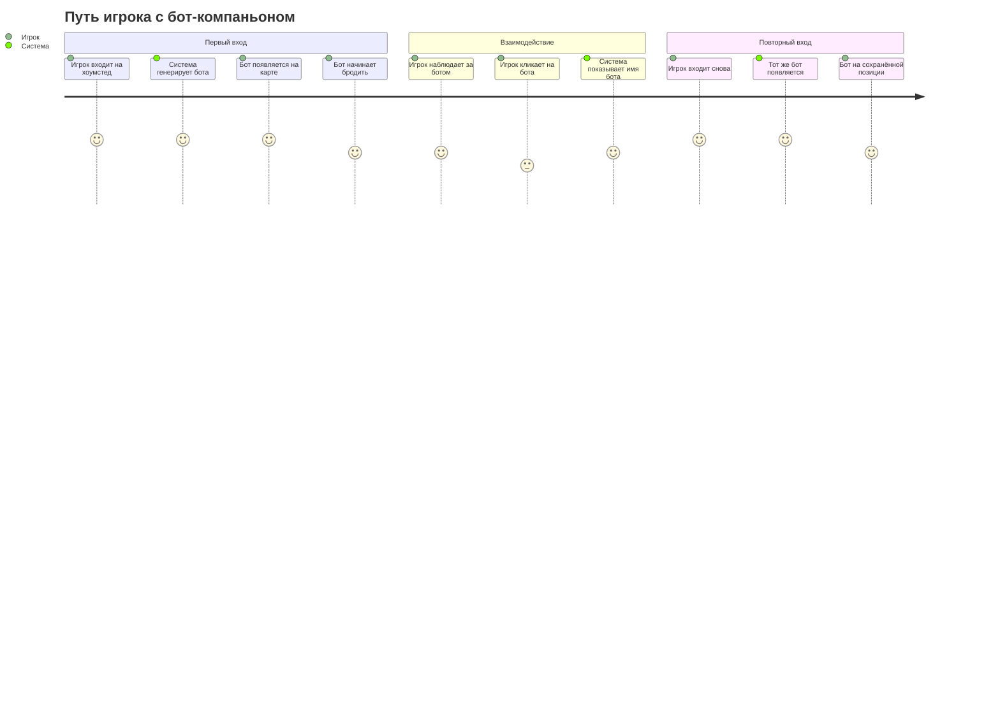
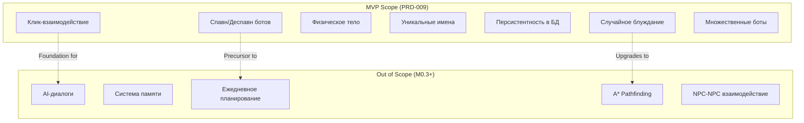

# PRD-009: NPC Bot-Companion System

## Обзор

### Краткое описание
Серверно-управляемая система бот-компаньонов на хоумстедах игроков: персистентные NPC с случайным блужданием, столкновениями и интерактивностью, подготовленные к интеграции с будущей системой диалогов (M0.3).

### Предпосылки
Хоумстеды игроков в Nookstead сейчас пусты и безжизненны. Чтобы создать ощущение обитаемого мира ещё до внедрения AI-диалогов (M0.3) и системы памяти (M0.4), необходимо добавить видимых персонажей, которые оживят пространство хоумстеда. Бот-компаньоны станут техническим фундаментом для полноценной NPC-системы, описанной в `npc-service.md`.

## Пользовательские истории

### Целевые пользователи
Все игроки Nookstead, владеющие хоумстедом (каждый игрок получает хоумстед при первом входе).

### Истории

```
Как игрок,
Я хочу видеть персонажей-компаньонов на своём хоумстеде,
Чтобы мой хоумстед ощущался живым и обитаемым.
```

```
Как игрок,
Я хочу, чтобы мои компаньоны свободно бродили по хоумстеду,
Чтобы они выглядели как самостоятельные существа, а не статичные объекты.
```

```
Как игрок,
Я хочу, чтобы компаньоны сохранялись между сессиями,
Чтобы я каждый раз встречал одних и тех же знакомых персонажей.
```

```
Как игрок,
Я хочу иметь возможность кликнуть на компаньона,
Чтобы в будущем вступать с ним в диалог (M0.3).
```

```
Как игрок,
Я хочу, чтобы компаньоны выглядели как полноценные персонажи с именами,
Чтобы они воспринимались как настоящие жители, а не заглушки.
```

### Сценарии использования

1. **Первый вход на хоумстед**: Игрок входит на хоумстед впервые. Система генерирует карту из шаблона, сохраняет её в БД, затем генерирует N бот-компаньонов (по умолчанию 1) со случайными именами и скинами, привязывает их к карте (mapId), сохраняет в БД, отображает в игровом мире.
2. **Повторный вход**: Игрок возвращается на хоумстед. Система загружает карту из БД, затем загружает привязанных к этой карте ботов по mapId. Боты появляются на сохранённых позициях.
3. **Наблюдение за блужданием**: Игрок видит, как компаньон неспешно перемещается между различными точками хоумстеда, меняя направление и анимации.
4. **Столкновение с ботом**: Игрок пытается пройти через бота, но бот блокирует движение как физический объект.
5. **Клик по боту**: Игрок кликает на бота, видит его имя/реакцию. Событие готово к обработке системой диалогов M0.3.
6. **Выход всех игроков**: Когда последний игрок покидает комнату хоумстеда, позиции ботов сохраняются в БД, боты деспавнятся.

## Функциональные требования

### Must Have (MVP)

- [ ] **FR-1: Спавн ботов при входе на хоумстед**
  - AC: Когда игрок присоединяется к комнате хоумстеда (chunkId начинается с `player:`), система загружает ботов по mapId карты из БД или генерирует новых (привязанных к mapId карты) после сохранения карты, если это первый вход.
- [ ] **FR-2: Случайное блуждание**
  - AC: Бот выбирает случайную проходимую клетку в заданном радиусе и перемещается к ней со скоростью 60 пикселей/сек. По достижении цели или блокировке выбирает новую цель.
- [ ] **FR-3: Физическое тело (solid body collision)**
  - AC: Бот занимает пространство на карте и блокирует перемещение игрока через свою позицию, аналогично объектам окружения.
- [ ] **FR-4: Уникальные имена из предопределённого списка**
  - AC: Каждому боту при создании присваивается уникальное имя из предопределённого массива. Имя отображается над спрайтом бота.
- [ ] **FR-5: Персистентность**
  - AC: Данные бота (id, имя, скин, позиция, mapId карты) сохраняются в PostgreSQL. При повторном входе боты восстанавливаются по mapId карты.
- [ ] **FR-6: Деспавн при пустой комнате**
  - AC: Когда последний игрок покидает комнату хоумстеда, позиции всех ботов сохраняются в БД, записи ботов удаляются из Colyseus-состояния.
- [ ] **FR-7: Интерактивность (клик)**
  - AC: Игрок может кликнуть на бота, сервер валидирует расстояние и возвращает данные бота. EventBus эмитит событие, готовое для UI-обработки.
- [ ] **FR-8: Множественные боты**
  - AC: На одном хоумстеде может быть несколько ботов (количество конфигурируется, по умолчанию 1, максимум настраивается через `MAX_BOTS_PER_HOMESTEAD`).
- [ ] **FR-9: Плавное отображение на клиенте**
  - AC: Клиент получает обновления позиций ботов через Colyseus-синхронизацию и отображает плавную интерполяцию движения, аналогичную удалённым игрокам.
- [ ] **FR-10: Использование существующих спрайтов**
  - AC: Боты используют те же скины (scout_1..scout_6) и анимации, что и игроки.

### Nice to Have

- [ ] **FR-11: Настройка количества ботов через API/конфиг**
  - Возможность изменять количество ботов без переразвёртывания.
- [ ] **FR-12: Разнообразие поведения блуждания**
  - Вариативность скорости, паузы между перемещениями, предпочтения зон.

### Out of Scope

- **AI-диалоги**: Речевые взаимодействия на основе LLM (запланировано на M0.3 — DialogueEngine).
- **Система памяти**: Запоминание прошлых взаимодействий (запланировано на M0.4 — MemoryStream).
- **Ежедневное планирование**: Генерация расписания NPC через LLM (запланировано на M0.3 — DailyPlanner).
- **A\* Pathfinding**: Полноценный поиск пути. Бот использует прямое движение с проверкой проходимости.
- **NPC-NPC взаимодействие**: Боты не взаимодействуют друг с другом.
- **Посещение чужих хоумстедов**: Боты привязаны к карте хоумстеда, не появляются на чужих картах.
- **Тир-система NPC**: FULL/NEARBY/BACKGROUND — не требуется для ботов хоумстеда.
- **Рефлексия и эмоции NPC**: Высокоуровневые AI-функции.

## Нефункциональные требования

### Производительность
- Обновление позиции бота: < 1 мс на бота за тик (100 мс интервал).
- Максимум 10 ботов на хоумстед без заметного влияния на производительность.
- Тик-обработка всех ботов комнаты: < 2 мс суммарно.

### Надёжность
- Ошибка загрузки бота из БД не должна блокировать вход игрока в комнату.
- Ошибка сохранения позиции бота при выходе логируется, но не бросает исключение.

### Безопасность
- Клиент не может напрямую управлять перемещением ботов. Вся логика серверная.
- Сообщение NPC_INTERACT валидирует близость игрока к боту (максимум 3 тайла).

### Масштабируемость
- Архитектура позволяет расширение до полноценной NPC-системы (npc-service) без рефакторинга основного контракта.
- Таблица `npc_bots` (привязка через mapId к карте) может быть расширена дополнительными полями (persona, schedule) в будущем.

## Критерии успеха

### Количественные метрики
1. Бот спавнится на хоумстеде за < 200 мс после входа игрока в комнату.
2. Бот совершает не менее 1 перемещения за 10 секунд (не стоит неподвижно дольше).
3. 100% ботов восстанавливаются при повторном входе (0 потерянных ботов).
4. Тик-обработка ботов не увеличивает серверный тик > 2 мс.

### Качественные метрики
1. Бот выглядит как «живой» персонаж: плавно перемещается, анимация корректна.
2. Хоумстед ощущается обитаемым, а не пустым.

## Технические зависимости

### Зависимости от существующих систем
- **ChunkRoom**: Точка интеграции для спавна/деспавна ботов.
- **ChunkRoomState / Colyseus Schema**: Синхронизация состояния ботов на клиенты.
- **PlayerSprite / PlayerManager**: Переиспользование для рендеринга ботов на клиенте.
- **Walkability Grid**: `mapWalkable` из ChunkRoom для навигации ботов.
- **@nookstead/db (Drizzle ORM)**: Для таблицы `npc_bots` (FK `mapId` на `maps.userId`) и сервисов работы с данными.
- **@nookstead/shared**: Для общих типов и констант.
- **findSpawnTile()**: Для нахождения проходимых тайлов при спавне ботов.

### Ограничения
- Нет A*-pathfinding — используется прямое движение с проверкой проходимости по клеткам.
- Бот привязан к карте хоумстеда (mapId = maps.userId, PK таблицы maps). Одна карта может иметь несколько ботов.
- Боты существуют только в комнатах хоумстедов (chunkId с префиксом `player:`).

### Допущения
- Карта хоумстеда всегда имеет достаточное количество проходимых тайлов для блуждания ботов.
- Существующие скины (scout_1..scout_6) достаточны для визуального разнообразия ботов.
- Colyseus MapSchema поддерживает добавление второй коллекции `bots` без проблем совместимости.

### Риски и их снижение

| Риск | Влияние | Вероятность | Снижение |
|------|---------|-------------|----------|
| Бот застревает в непроходимых зонах | Средний | Средняя | Stuck-detection: если бот не двигался 5 секунд, выбрать новую случайную цель |
| Рост нагрузки при большом количестве ботов | Средний | Низкая | `MAX_BOTS_PER_HOMESTEAD` лимит (по умолчанию 5) |
| Конфликт с будущей NPC-системой | Высокий | Низкая | Размещение кода в `npc-service/lifecycle/`, алигнмент с архитектурой из npc-service.md |
| Состояние гонки при спавне (два игрока одновременно входят) | Низкий | Низкая | Боты спавнятся один раз при создании комнаты, не при каждом onJoin |

## Диаграммы

### Пользовательский путь (User Journey)



### Границы скоупа (Scope Boundary)



## Приложение

### Ссылки
- [NPC Service Specification](../documentation/design/systems/npc-service.md) — полная архитектура NPC-системы
- [PRD-002: Colyseus Game Server](prd-002-colyseus-game-server.md) — серверная архитектура
- [PRD-004: Multiplayer Player Sync](prd-004-multiplayer-player-sync.md) — синхронизация игроков
- [ADR-0006: Chunk-Based Room Architecture](../adr/ADR-0006-chunk-based-room-architecture.md) — архитектура комнат

### Глоссарий
- **Бот-компаньон (Bot)**: Серверно-управляемая сущность, привязанная к карте хоумстеда (через mapId), с автономным поведением блуждания.
- **Хоумстед (Homestead)**: Персональная зона игрока, определяемая chunkId с префиксом `player:{userId}`. Карта хоумстеда хранится в таблице `maps` (PK = userId).
- **NPC Service**: Планируемая подсистема для полноценных NPC с AI (npc-service.md).
- **Solid Body Collision**: Физическое тело бота блокирует проход игрока.
- **Wander**: Поведение случайного блуждания — периодический выбор случайной проходимой клетки и движение к ней.
