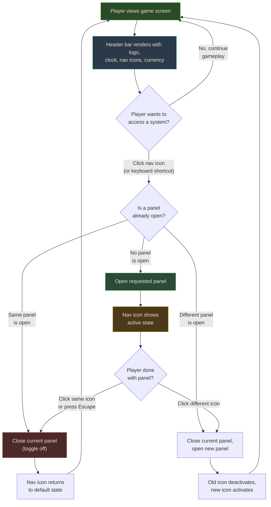
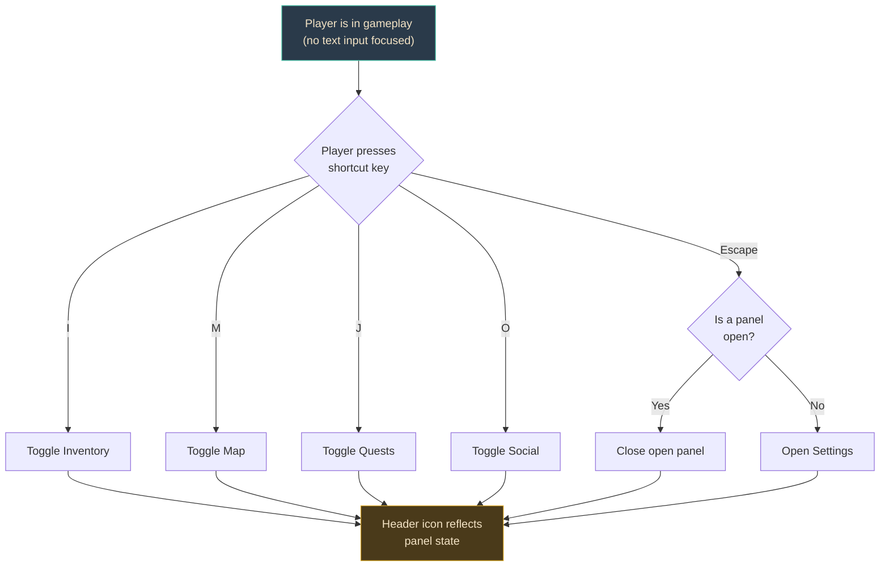
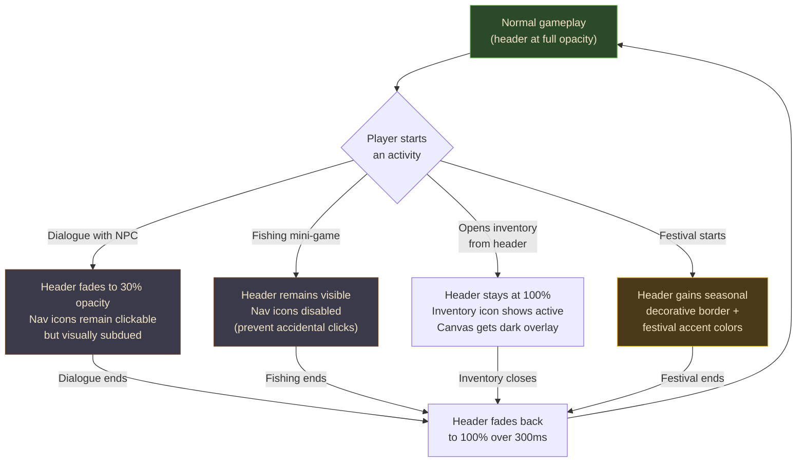

# UXRD-001: Game Header and Navigation Bar

**Version:** 1.0
**Date:** February 15, 2026
**Status:** Draft
**Author:** UI/UX Designer Agent

---

## Overview

### One-line Summary

A persistent pixel-art header bar that consolidates clock, season, currency, brand logo, and icon-based navigation into a single unified strip at the top of the game screen, with seasonal theming, day/night ambient lighting, and satisfying micro-interactions.

### Background

The current Nookstead HUD scatters game-state information across isolated, absolutely positioned overlays: ClockPanel floats top-left, CurrencyDisplay floats top-right, and a single MenuButton hides in the bottom-right corner. This layout creates three user experience problems:

1. **No brand presence during gameplay.** The "NOOKSTEAD" identity disappears once the player enters the game world. There is no persistent visual anchor tying the experience together.
2. **Poor discoverability.** New players have no visible indication that Inventory, Map, Quests, Social, and Settings exist. Everything hides behind one ambiguous Menu button requiring multiple clicks.
3. **Cognitive scatter.** Players must mentally track information spread across three separate screen corners. A single consolidated location reduces visual search time and cognitive load.

The header bar resolves all three issues by consolidating status, navigation, and brand into one predictable horizontal strip that lives above the game canvas. The layout restructure (fixed header + flex canvas) also creates a clean DOM separation between React UI chrome and the Phaser rendering surface, eliminating z-index collision risks as the HUD grows.

### Related Documents

- **PRD:** `docs/prd/prd-002-game-header-navigation.md`
- **GDD:** `docs/nookstead-gdd-v3.md` (Sections 12, 15.3, 15.7)
- **HUD Design Spec:** `docs/documentation/design/systems/hud-design-spec.md`
- **HUD Behavior & Feedback:** `docs/documentation/design/systems/hud-behavior-and-feedback.md`
- **Design Doc:** To be created after UXRD approval

---

## User Flows

### Primary User Flow: Header Navigation

The primary interaction is opening and closing game system panels via the header.



### Alternative Flow: Keyboard-First Navigation



### Context-Sensitive Flow: Header Behavior During Activities



### Error Flow: Graceful Degradation

- **Sprite load failure:** Navigation items fall back to text-only labels ("Inv", "Map", "Quest", "Social", "Gear"). The header remains fully functional.
- **EventBus not connected:** Header renders with placeholder values (Day 1, 00:00, Spring, 0 Gold, 0 Stars). Values update once the Phaser game emits events.
- **Font load failure:** Falls back to system monospace font. Layout dimensions are preserved via fixed container sizing.

---

## Wireframes / Layout

### Desktop Layout (Default: --ui-scale 3-4)

```
 Full viewport width
+===========================================================================+
|  4px padding                                                    4px padding|
|  +-------+  +-------------------------+  +---+---+---+---+---+  +-------+ |
|  |NOOK-  |  | [leaf] Day 5  14:30     |  | I | M | Q | S | G |  |[c]1234| |
|  |STEAD  |  |        Spring           |  |inv|map|qst|soc|set|  |[s]  56| |
|  +-------+  +-------------------------+  +---+---+---+---+---+  +-------+ |
|  Logo Zone   Clock/Season Zone          Navigation Zone       Currency Zone|
+===========================================================================+
|                                                                           |
|                                                                           |
|                        Phaser Game Canvas                                 |
|                     (flex-grow: fills remaining                           |
|                      viewport height)                                     |
|                                                                           |
|  [Energy Bar]                                                             |
|                                                                           |
|                         [Hotbar 1-0]                                      |
+===========================================================================+
```

**Header Height:** 48px at 1x base scale (1.5 tile heights on the 32px grid). Actual rendered height = `48px * (--ui-scale / 3)`, ensuring pixel-perfect alignment at all scale tiers.

**Zone Distribution (flexbox):**

| Zone | Alignment | Width Behavior | Content |
|------|-----------|----------------|---------|
| Logo | Left | Fixed (content-width + padding) | "NOOKSTEAD" text with glow |
| Clock/Season | Center-left | Fixed (content-width) | Season icon, day, time |
| Navigation | Center | Fixed (5 icons + gaps) | 5 icon buttons with labels |
| Currency | Right | Fixed (content-width + padding) | Gold + Stars with icons |

**Spacing Rules:**
- Header outer padding: 4px base (scaled by --ui-scale)
- Zone-to-zone gap: 8px base minimum
- Within zones: 4px base between elements
- Icon-to-label gap: 2px base

### Mobile Layout (Viewport < 640px)

```
 Full viewport width (compact)
+=====================================================+
|  +--+  +--------+  +---+---+---+---+---+  +------+ |
|  |N |  | 14:30  |  | I | M | Q | S | G |  |1.2K g| |
|  +--+  | [leaf] |  +---+---+---+---+---+  +------+ |
+=====================================================+
|                                                     |
|               Phaser Game Canvas                    |
|            (remaining viewport height)              |
|                                                     |
+=====================================================+
```

**Mobile Adaptations:**
- Logo abbreviates to "N" monogram (teal glow preserved)
- Clock shows time + season icon only. Day counter hidden. Tap to expand.
- Nav icons: labels hidden, icon-only mode. Touch targets enlarged to 44x44px minimum.
- Currency: shows gold abbreviated ("1.2K"), stars hidden behind a small indicator badge. Tap to expand.
- Header height increases to accommodate 44px minimum touch targets.

### Responsive Scaling Tiers

| --ui-scale | Viewport Range | Header Height | Icon Size | Logo Size | Notes |
|------------|----------------|---------------|-----------|-----------|-------|
| 2 | 960x540 | 32px | 24x24px | 10px font | Small laptops |
| 3 | 1440x810 | 48px | 36x36px | 14px font | Default |
| 4 | 1920x1080 | 64px | 48x48px | 18px font | Full HD |
| 5 | 2560x1440 | 80px | 60x60px | 22px font | QHD |
| 6 | 3840x2160 | 96px | 72x72px | 26px font | 4K |

**Scaling formula** (header height): `calc(16px * var(--ui-scale))`
**Maximum header height constraint**: Never exceeds 10% of viewport height on any device.

---

## Component Behavior Specifications

### Component 1: Logo ("NOOKSTEAD")

The logo is a decorative text element -- it is not a link or a button. It provides persistent brand presence during gameplay.

**Visual Treatment:**
- Text: "NOOKSTEAD" in Press Start 2P pixel font
- Color: Teal #48C7AA
- Glow effect: Animated `text-shadow` that pulses between two states:
  - State A: `0 0 4px rgba(72, 199, 170, 0.6), 0 0 8px rgba(72, 199, 170, 0.3)`
  - State B: `0 0 6px rgba(72, 199, 170, 0.8), 0 0 12px rgba(72, 199, 170, 0.4)`
  - Cycle: 3-second loop, ease-in-out
- Drop shadow: `1px 1px 0 #1A3A2E` (pixel-art depth shadow, scaled with --ui-scale)
- Font size: `calc(5px * var(--ui-scale))` matching the HUD text scale system

**Seasonal Logo Variation:**
The glow color subtly shifts to match the current season accent:

| Season | Glow Base Color | Glow RGBA |
|--------|----------------|-----------|
| Spring | Teal (default) | rgba(72, 199, 170, ...) |
| Summer | Warm Teal-Gold | rgba(120, 199, 140, ...) |
| Autumn | Warm Amber-Teal | rgba(170, 160, 100, ...) |
| Winter | Cool Ice-Teal | rgba(72, 170, 210, ...) |

**States:**

| State | Visual | Behavior |
|-------|--------|----------|
| Default | Teal text with pulsing glow | Static, decorative only |
| Night | Glow intensity increases by 30% | Brighter glow compensates for dark overlay |
| Dialogue | Fades to 30% opacity with rest of header | Follows context-sensitive rules |
| Reduced Motion | Static glow (no pulse animation) | Glow remains at State A, no animation |

### Component 2: Clock and Season Display

Consolidates the existing standalone ClockPanel into the header. Displays the current game day, time, season, and weather information.

**Layout (inside a NineSlicePanel frame):**

```
+------------------------------------------+
| [Season Icon] Day 5  |  14:30  [Weather] |
+------------------------------------------+
```

- **Season Icon:** 16x16 sprite from hud_32.png, left-aligned
- **Day Counter:** "Day X" in Ink Brown #3B2819
- **Pipe Separator:** "|" with 4px padding each side
- **Time:** "HH:MM" in 24-hour format, Ink Brown #3B2819
- **Weather Icon:** 16x16 sprite, right-aligned (animated per weather type)

**States:**

| State | Visual | Behavior |
|-------|--------|----------|
| Default (Day) | Neutral NineSlicePanel background | Updates every game-minute via EventBus `hud:time` |
| Dawn (05:00-06:59) | Warm orange tint `rgba(255, 183, 77, 0.25)` on panel | 2000ms background-color transition |
| Dusk (17:00-18:59) | Purple-amber tint blend on panel | 2000ms background-color transition |
| Night (19:00-04:59) | Dark blue tint `rgba(21, 47, 80, 0.4)` on panel | 2000ms background-color transition |
| Mobile (< 640px) | Condensed: time + season icon only | Tap to expand full info dropdown |

**Season Transition Animation:**
When the season changes, the season icon performs a 500ms flip animation (old icon flips out via rotateY, new icon flips in). Accompanied by a toast notification (per existing HUD behavior spec section 4.6.4).

**Season Accent Border:**
The NineSlicePanel frame gains a 1px colored inner border matching the season:

| Season | Border Accent | Icon |
|--------|--------------|------|
| Spring | `#81C784` soft green | Green leaf / blossom |
| Summer | `#FFD54F` warm yellow | Yellow sun |
| Autumn | `#FF8A65` burnt orange | Orange maple leaf |
| Winter | `#B3E5FC` ice blue | White snowflake |

### Component 3: Navigation Icons

Five icon buttons displayed in the center of the header. Each triggers the opening/closing of a game system panel.

**Navigation Items:**

| Position | Label | Icon Source | Shortcut | EventBus Event |
|----------|-------|------------|----------|----------------|
| 1 | Inventory | Backpack sprite (hud_32.png) | I | `hud:open-panel:inventory` |
| 2 | Map | Map sprite (hud_32.png) | M | `hud:open-panel:map` |
| 3 | Quests | Scroll sprite (hud_32.png) | J | `hud:open-panel:quests` |
| 4 | Social | People sprite (hud_32.png) | O | `hud:open-panel:social` |
| 5 | Settings | Gear sprite (hud_32.png) | Esc | `hud:open-panel:settings` |

**Icon Layout:**
- Icon size: 16x16 base sprite, rendered via `spriteCSSStyle()` scaling with --ui-scale
- Label: Below icon, pixel font, `calc(3px * var(--ui-scale))` height, 50% opacity
- Container: 32x32 base clickable area (scaled by --ui-scale)
- Gap between icons: 4px base (scaled)

**States:**

| State | Visual | Behavior |
|-------|--------|----------|
| Default | Icon at 100% opacity, label at 50% opacity | Ready for interaction |
| Hover (desktop) | Warm White #FFF8EC overlay at 20% opacity on icon. Icon shifts up 1px (bounce tease). Label brightens to 80% opacity | Tooltip appears after 300ms delay showing "Label (Shortcut)" |
| Active/Pressed | Icon shifts down 1px and right 1px (pixel-art press). Brief 50ms white flash on release | Emits EventBus event to toggle panel |
| Panel Open (selected) | Golden NineSlicePanel frame (SLOT_SELECTED) around icon. Icon at 100% brightness. Label at 100% opacity with Harvest Gold #DAA520 color | Clicking again closes the panel |
| Focus (keyboard) | #FFDD57 focus ring, 2px wide, 2px offset | Visible on Tab navigation |
| Disabled (during fishing/cutscene) | Icon at 30% opacity, label hidden | Click/tap does nothing. Keyboard shortcut blocked |
| Dialogue Context | Icon at 30% opacity (follows header fade) but remains clickable | Allows player to exit dialogue by opening a panel |

**Toggle Behavior:**
- Clicking a nav icon when no panel is open: opens the corresponding panel, icon enters "Panel Open" state.
- Clicking a nav icon when its panel is already open: closes the panel, icon returns to "Default" state.
- Clicking a different nav icon when a panel is open: closes the current panel, opens the new panel. Old icon deactivates, new icon activates.
- Only one panel can be open at a time.

**Tooltip (Desktop Only):**

```
+-----------------------+
|  Inventory (I)        |
+-----------------------+
```

- Appears 300ms after hover begins
- Disappears immediately on mouse-out
- Uses NineSlicePanel or simple bordered box (pixel art style)
- Background: Parchment #F2E2C4
- Border: Walnut #6B4226
- Text: Ink Brown #3B2819, pixel font
- Position: Below the icon, centered
- Contains: System name + keyboard shortcut in parentheses

### Component 4: Currency Display

Consolidates the existing standalone CurrencyDisplay into the header. Shows gold and star balances.

**Layout (inside a NineSlicePanel frame):**

```
+-------------------+
| [Coin] 1,250      |
| [Star]    56      |
+-------------------+
```

- **Coin Icon:** 16x16 golden coin sprite from hud_32.png
- **Star Icon:** 16x16 blue-purple star sprite from hud_32.png
- **Amount Text:** Right-aligned, pixel font, Harvest Gold #DAA520 color for gold, Sky Blue #5DADE2 for stars
- **Number Format:** Locale-aware comma separators (e.g., "1,250")

**States:**

| State | Visual | Behavior |
|-------|--------|----------|
| Default | Static numbers, NineSlicePanel frame | Updates via EventBus `hud:gold` |
| Earning (gaining) | Number turns green #4CAF50 for 800ms, bounces up 4px, "+{amount}" floater drifts up and fades | Coin icon spins 360 degrees for amounts >= 50 |
| Spending (losing) | Number turns red #F44336 for 800ms, shakes horizontally +/- 2px, "-{amount}" floater drifts down and fades | Descending two-note chime |
| Insufficient Funds | Amount flashes red 3 times (600ms), shakes +/- 3px, "Not enough coins!" tooltip below for 2 seconds | Error buzzer sound |
| Mobile (< 640px) | Gold only, abbreviated ("1.2K"). Star count behind "+" badge if > 0 | Tap to expand full display for 3 seconds |
| Shopping Context | Panel border pulses with golden brightness (20% increase, 2-second cycle) | Draws attention to balance |
| Night | Dark blue tint overlay on panel | Matches global night tinting |

### Component 5: Header Container

The header itself is a component that manages its own background, borders, and atmospheric effects.

**Background:**
- Primary: NineSlicePanel using SLOT_NORMAL 9-slice set, stretching across full width
- The NineSlicePanel center tile provides the warm Parchment #F2E2C4 background
- Drop shadow: `1px 1px 0 rgba(44, 26, 14, 0.5)` below the header (pixel shadow, scaled)

**Time-of-Day Tinting:**
The header container applies a CSS overlay filter that shifts with the game clock, creating ambient lighting:

| Time Period | Overlay | Transition |
|-------------|---------|------------|
| Dawn (05:00-06:59) | `rgba(255, 183, 77, 0.12)` warm orange | 2000ms ease-in-out |
| Day (07:00-16:59) | None (neutral) | 2000ms ease-in-out |
| Dusk (17:00-18:59) | `rgba(171, 71, 188, 0.08)` + `rgba(255, 152, 0, 0.06)` | 2000ms ease-in-out |
| Night (19:00-04:59) | `rgba(21, 47, 80, 0.15)` dark blue | 2000ms ease-in-out |

**Seasonal Decorative Particles:**
Small animated pixel-art sprites drift across the header background. These are purely decorative and do not interact with any UI elements.

| Season | Particle | Count | Speed | Behavior |
|--------|----------|-------|-------|----------|
| Spring | Cherry blossom petals (4x4px, pink) | 3-5 | 30px/sec horizontal drift, gentle sine wave vertical | Float left-to-right with soft swaying |
| Summer | Fireflies (2x2px, warm yellow, 60% opacity) | 4-6 | 15px/sec random wander | Pulse opacity 40%-80%, random direction changes |
| Autumn | Falling leaves (4x4px, orange/red variants) | 3-5 | 20px/sec downward, 10px/sec horizontal | Tumble animation (rotate while falling) |
| Winter | Snowflakes (3x3px, white, 70% opacity) | 4-6 | 15px/sec downward, sine wave horizontal sway | Gentle drift with amplitude 8px, period 2s |

**Festival Decorative Border:**
During active festivals or events, a decorative golden border (LimeZu ornate frame, 2px thick) appears around the header. A slow shimmer effect (traveling highlight moving left-to-right, 6-second loop) adds visual polish.

---

## Visual Design Specifications

### Color Palette (Header-Specific)

| Name | Hex | Usage |
|------|-----|-------|
| Parchment | `#F2E2C4` | Header background (NineSlicePanel center fill) |
| Walnut | `#6B4226` | Header border (NineSlicePanel edges), icon outlines |
| Ink Brown | `#3B2819` | Primary text, labels, separators |
| Teal | `#48C7AA` | Logo text color, logo glow |
| Dark Teal | `#1A3A2E` | Logo drop shadow |
| Harvest Gold | `#DAA520` | Active icon highlight, gold currency text, selected state |
| Meadow Green | `#5FAD46` | Positive feedback (currency gain) |
| Warm White | `#FFF8EC` | Hover highlights, bright text accents |
| Shadow Brown | `#2C1A0E` | Panel drop shadows (50% opacity) |
| Focus Ring | `#FFDD57` | Keyboard focus indicator |
| Sky Blue | `#5DADE2` | Star currency text |
| Sunset Red | `#C0392B` | Negative feedback (currency loss, errors) |
| Deep Background | `#0A0A1A` | Fallback if NineSlicePanel fails to render |

### Seasonal Accent Colors

Used for active-state highlights, border accents, and decorative details:

| Season | Primary Accent | Secondary Accent | Particle Tint |
|--------|---------------|-----------------|---------------|
| Spring | `#81C784` soft green | `#C8E6C9` light green | `#F8BBD0` pink petals |
| Summer | `#FFD54F` warm yellow | `#FFF9C4` pale yellow | `#FFF176` warm glow |
| Autumn | `#FF8A65` burnt orange | `#FFCCBC` peach | `#FF7043` red-orange |
| Winter | `#B3E5FC` ice blue | `#E1F5FE` pale ice | `#FFFFFF` white snow |

### Typography

| Element | Font | Size (base) | Color | Weight |
|---------|------|-------------|-------|--------|
| Logo | Press Start 2P | 5px (scaled via --ui-scale) | #48C7AA | 400 |
| Day/Time | Press Start 2P | 5px (scaled via --ui-scale) | #3B2819 | 400 |
| Nav Label | Press Start 2P | 3px (scaled via --ui-scale) | #3B2819 at 50% opacity | 400 |
| Currency Amount | Press Start 2P | 5px (scaled via --ui-scale) | #DAA520 (gold), #5DADE2 (stars) | 400 |
| Tooltip Text | Press Start 2P | 3px (scaled via --ui-scale) | #3B2819 | 400 |

### Sprite Usage

All sprites sourced from `hud_32.png` (1952x1376px, 32px grid). Rendered using the existing `sprite.ts` utility functions:

| Element | Rendering Method | Scale | Notes |
|---------|-----------------|-------|-------|
| NineSlicePanel (header bg) | `spriteNativeStyle` (corners) + `spriteStretchStyle` (edges/center) | Native 1:1 corners, stretched edges | SLOT_NORMAL 9-slice set |
| Active nav icon frame | Same NineSlicePanel approach | Native 1:1 | SLOT_SELECTED 9-slice set |
| Season icons | `spriteCSSStyle` | Via --ui-scale | 16x16 base sprites |
| Weather icons | `spriteCSSStyle` | Via --ui-scale | 16x16 base sprites |
| Currency icons | `spriteCSSStyle` | Via --ui-scale | 16x16 base sprites |
| Nav icons | `spriteCSSStyle` | Via --ui-scale | 16x16 base sprites |

### Borders and Shadows

| Element | Border | Shadow |
|---------|--------|--------|
| Header container | NineSlicePanel provides border via 9-slice sprites | `drop-shadow(1px 1px 0 rgba(44, 26, 14, 0.5))` scaled |
| Clock/Season panel | NineSlicePanel with season accent inner border (1px) | Inherits header shadow |
| Currency panel | NineSlicePanel | Inherits header shadow |
| Active nav frame | SLOT_SELECTED NineSlicePanel (golden border) | `box-shadow: 0 0 4px rgba(218, 165, 32, 0.3)` |
| Tooltip | 1px solid Walnut #6B4226 | `1px 1px 0 rgba(44, 26, 14, 0.3)` |

---

## Animation and Transitions

### Logo Glow Animation

| Property | Value |
|----------|-------|
| Type | CSS `text-shadow` keyframe animation |
| Duration | 3000ms loop |
| Easing | ease-in-out |
| Keyframes | 0%: subtle glow (4px blur, 0.6 opacity) -> 50%: bright glow (6px blur, 0.8 opacity) -> 100%: subtle glow |
| Reduced Motion | Static glow at 50% keyframe (no animation) |

### Nav Icon Hover Effect

| Property | Value |
|----------|-------|
| Trigger | Mouse hover (desktop only) |
| Effect | Icon shifts up 1px, brightness overlay appears |
| Duration | 100ms |
| Easing | ease-out |
| Exit | Icon returns to original position, overlay fades |
| Reduced Motion | No movement, overlay appears instantly |

### Nav Icon Click/Press Effect

| Property | Value |
|----------|-------|
| Trigger | Click or tap |
| Effect | Icon shifts down 1px and right 1px (pixel-art press), then 50ms white flash on release |
| Duration | 80ms press + 50ms flash |
| Easing | step-start (instant for pixel precision) |
| Reduced Motion | No movement, instant state change |

### Nav Icon Active State Transition

| Property | Value |
|----------|-------|
| Trigger | Panel opens/closes |
| Effect | Golden NineSlicePanel frame appears/disappears around icon |
| Duration | 150ms |
| Easing | ease-out |
| Reduced Motion | Instant appear/disappear |

### Panel Open/Close (triggered from header)

| Property | Value |
|----------|-------|
| Trigger | Nav icon click or keyboard shortcut |
| Open Effect | Panel slides in from corresponding direction (e.g., inventory from left, settings from right) with opacity fade-in |
| Close Effect | Panel slides out + opacity fade-out |
| Duration | 200ms |
| Easing | ease-out (open), ease-in (close) |
| Reduced Motion | Instant appear/disappear, no slide |

### Clock Time Transition

| Property | Value |
|----------|-------|
| Trigger | Game clock advances one minute |
| Effect | Number cross-fades (old fades out, new fades in) |
| Duration | 200ms |
| Easing | ease-in-out |
| Reduced Motion | Instant number update |

### Season Change Animation

| Property | Value |
|----------|-------|
| Trigger | First tick of a new season |
| Effect | Season icon performs a 3D flip (rotateY 0 -> 180 -> 360). Old icon on front, new icon on back. Season accent color transitions. Header particles change type. |
| Duration | 500ms |
| Easing | ease-in-out |
| Reduced Motion | Instant icon swap, no flip |

### Day/Night Tint Transition

| Property | Value |
|----------|-------|
| Trigger | Game clock crosses time-period boundary |
| Effect | Background overlay color smoothly transitions between time-of-day tints |
| Duration | 2000ms |
| Easing | ease-in-out |
| Reduced Motion | Duration reduced to 500ms (subtle, not jarring) |

### Header Entry Animation (Game Load)

| Property | Value |
|----------|-------|
| Trigger | Game finishes loading, transitions from loading screen |
| Effect | Header slides down from above viewport edge (translateY: -100% to 0) with slight overshoot bounce |
| Duration | 400ms |
| Easing | cubic-bezier(0.34, 1.56, 0.64, 1) (overshoot ease) |
| Reduced Motion | Instant appear, no slide |

### Seasonal Particle Animation

| Property | Value |
|----------|-------|
| Type | CSS animation or lightweight canvas overlay |
| Particles | 3-6 small sprites per season (see Header Container spec) |
| Loop | Continuous while in corresponding season |
| Performance | Particles are CSS-only (no JS animation frames). Use `will-change: transform` |
| Reduced Motion | Particles disabled entirely |

### Currency Feedback Animations

Inherited from the existing HUD behavior spec (section 4.4). All timing values remain the same:

| Animation | Duration | Trigger |
|-----------|----------|---------|
| Earn bounce | 150ms up + 250ms settle | Currency gained |
| Earn floater | 1200ms drift + fade | Currency gained |
| Spend shake | 300ms (3 oscillations) | Currency spent |
| Coin icon spin | 400ms (amounts >= 50) | Large coin gain |
| Insufficient flash | 600ms (3 flashes) | Purchase attempt fails |

### Animation Timing Summary

| Element | Animation | Duration | Easing | Reduced Motion |
|---------|-----------|----------|--------|----------------|
| Logo glow pulse | text-shadow cycle | 3000ms (loop) | ease-in-out | Static glow |
| Nav icon hover | translateY -1px + overlay | 100ms | ease-out | No movement |
| Nav icon press | translateX/Y +1px + flash | 80ms + 50ms | step-start | Instant |
| Nav active frame | Frame appear/disappear | 150ms | ease-out | Instant |
| Panel open/close | slide + fade | 200ms | ease-out / ease-in | Instant |
| Clock time update | Number crossfade | 200ms | ease-in-out | Instant |
| Season icon flip | rotateY 360 | 500ms | ease-in-out | Instant swap |
| Day/night tint | Background overlay | 2000ms | ease-in-out | 500ms |
| Header entry | slideY + bounce | 400ms | overshoot ease | Instant |
| Seasonal particles | Continuous drift | Loop | linear | Disabled |
| Currency earn | Bounce + floater | 150ms + 1200ms | ease-out | Instant |
| Currency spend | Shake + floater | 300ms + 1000ms | ease-in-out | Instant |
| Tooltip appear | opacity 0 to 1 | 150ms (after 300ms delay) | ease-out | Instant |
| Festival border shimmer | Traveling highlight | 6000ms (loop) | linear | Disabled |

---

## Context-Sensitive Header Behavior

The header adapts its visual state based on the player's current activity. This aligns with the existing HUD behavior spec (section 4.5) and extends it to the new consolidated header.

### Normal Gameplay

- Header at 100% opacity
- All zones fully visible and interactive
- Nav icons clickable, keyboard shortcuts active
- Time-of-day tinting active
- Seasonal particles active

### Dialogue with NPC (Section 4.5.3 Extension)

**Trigger:** Player initiates dialogue with an NPC.

| Aspect | Behavior |
|--------|----------|
| Header opacity | Fades to 30% over 300ms |
| Nav icons | Remain clickable (allows escaping dialogue) but visually subdued |
| Clock/Currency | Fade with header |
| Logo glow | Pulse pauses, glow dims to match opacity |
| Seasonal particles | Pause (stop generating new particles, existing ones fade) |
| Restoration | On dialogue end, header fades back to 100% over 300ms |

**Exception:** If the NPC is a shopkeeper and the dialogue transitions to a shop interface, the currency display fades back to 100% independently to show the player's balance.

### Fishing Mini-Game (Section 4.5.4 Extension)

**Trigger:** Player casts fishing rod.

| Aspect | Behavior |
|--------|----------|
| Header opacity | Remains at 100% |
| Nav icons | Disabled (30% opacity, non-interactive). Prevents accidental panel opens during the mini-game |
| Clock | Remains visible (fishing consumes real time) |
| Currency | Remains visible |
| Keyboard shortcuts | Blocked (keys may be needed for fishing mechanics) |
| Restoration | On catch or line break, nav icons re-enable over 200ms |

### Inventory Open (Section 4.5.5 Extension)

**Trigger:** Player clicks Inventory icon or presses I.

| Aspect | Behavior |
|--------|----------|
| Header opacity | Remains at 100% |
| Inventory icon | Shows "Panel Open" active state (golden frame) |
| Other nav icons | Remain clickable (clicking one closes inventory, opens new panel) |
| Canvas | Gets 40% opacity dark overlay |
| Logo | Remains visible |

### Night Time (Section 4.5.6 Extension)

**Trigger:** Game clock passes 19:00.

| Aspect | Behavior |
|--------|----------|
| Header tint | Dark blue overlay `rgba(21, 47, 80, 0.15)` applied over 2000ms |
| NineSlicePanel borders | Shift from warm brown to cooler dark brown |
| Logo glow | Intensity increases 30% (brighter in darkness) |
| Nav icon labels | Brighten slightly for legibility against darker background |
| Dawn reversal | At 05:00, night tint fades out over 2000ms |

### Festival / Event (Section 4.5.8 Extension)

**Trigger:** Active festival or town event.

| Aspect | Behavior |
|--------|----------|
| Header border | Decorative golden border with shimmer animation |
| Season accent | Shifts to event-specific accent color |
| Clock panel | May show event name badge below time |
| Duration | Fades in over 500ms on event start, fades out over 500ms on event end |

---

## Accessibility Requirements

### WCAG Compliance

- **Target Level:** WCAG 2.2 AA

### ARIA Requirements

| Component | Element | Role | aria-label / aria-* | Notes |
|-----------|---------|------|---------------------|-------|
| Header container | `<header>` | `banner` | -- | Top-level landmark |
| Navigation group | `<nav>` | `navigation` | `aria-label="Game navigation"` | Contains the 5 nav icons |
| Nav icon (Inventory) | `<button>` | -- | `aria-label="Open inventory"`, `aria-pressed="true/false"` | Toggle button pattern |
| Nav icon (Map) | `<button>` | -- | `aria-label="Open map"`, `aria-pressed="true/false"` | Toggle button pattern |
| Nav icon (Quests) | `<button>` | -- | `aria-label="Open quest journal"`, `aria-pressed="true/false"` | Toggle button pattern |
| Nav icon (Social) | `<button>` | -- | `aria-label="Open social panel"`, `aria-pressed="true/false"` | Toggle button pattern |
| Nav icon (Settings) | `<button>` | -- | `aria-label="Open settings"`, `aria-pressed="true/false"` | Toggle button pattern |
| Clock display | `<div>` | `status` | `aria-live="polite"`, `aria-label="Day 5 of Spring, 2:30 PM"` | Updates on clock change |
| Currency display | `<div>` | `status` | `aria-live="polite"`, `aria-label="1,250 gold, 56 stars"` | Updates on currency change |
| Logo | `<span>` | -- | `aria-hidden="true"` | Decorative, not announced |
| All sprite icons | `<span>` | -- | `aria-hidden="true"` | Decorative images have alt text on parent |
| Tooltip | `<div>` | `tooltip` | `aria-describedby` linking icon to tooltip | Announced on focus |

### Keyboard Navigation

| Key | Action | Context |
|-----|--------|---------|
| Tab | Move focus through nav icons (left to right: Inventory > Map > Quests > Social > Settings) | When header region is focused |
| Shift+Tab | Move focus backwards through nav icons | When header region is focused |
| Enter / Space | Activate focused nav icon (toggle panel) | When a nav icon has focus |
| I | Toggle Inventory panel | Global (except when text input focused) |
| M | Toggle Map panel | Global (except when text input focused) |
| J | Toggle Quests panel | Global (except when text input focused) |
| O | Toggle Social panel | Global (except when text input focused) |
| Escape | Close current panel, or open Settings if no panel is open | Global |

**Focus Order:** Logo is skipped (decorative). Tab order proceeds: Inventory > Map > Quests > Social > Settings. Clock and currency displays are not focusable (they are status regions, not interactive).

**Focus Indicator:**
- Style: 2px solid #FFDD57 outline with 2px offset
- Visible on all interactive elements when focused via keyboard
- Not visible on mouse/touch click (`:focus-visible` only)
- Contrast: #FFDD57 on Parchment #F2E2C4 background meets the 3:1 non-text contrast ratio requirement

### Screen Reader Considerations

- **Clock updates:** Announced via `aria-live="polite"` when the day changes or the season changes. Minute-by-minute updates are suppressed (too frequent). The screen reader text reads: "Day 5 of Spring, 2:30 PM, Sunny."
- **Currency updates:** Announced via `aria-live="polite"` when the balance changes. Text reads: "1,250 gold, 56 stars." For earning: "Earned 50 gold. Balance: 1,300 gold." For spending: "Spent 30 gold. Balance: 1,220 gold."
- **Panel state changes:** When a panel opens, the screen reader announces "Inventory opened" (or equivalent). When it closes: "Inventory closed."
- **Reading order:** Header content is read in logical order: clock/season status, navigation items, currency status. The logo is hidden from the reading order (`aria-hidden`).

### Color and Contrast

All text-on-background combinations in the header meet WCAG 2.2 AA minimums:

| Foreground | Background | Ratio | Pass? |
|-----------|-----------|-------|-------|
| Ink Brown #3B2819 | Parchment #F2E2C4 | 8.2:1 | AA (pass), AAA (pass) |
| Teal #48C7AA | Parchment #F2E2C4 | 2.1:1 | Decorative text (logo) -- exempt from text contrast as branding element. Drop shadow #1A3A2E provides legibility. |
| Harvest Gold #DAA520 | Parchment #F2E2C4 | 2.8:1 | Below 4.5:1 for small text. Use Ink Brown for essential info; Harvest Gold reserved for large/decorative numbers. Alternatively: darken to #B8860B (3.6:1) for amounts. |
| #FFDD57 (focus ring) | Parchment #F2E2C4 | 1.7:1 | Focus ring is against border, not background. The 2px ring against Walnut #6B4226 border achieves 3.4:1. |
| Ink Brown #3B2819 | Night tint overlay | 6.5:1+ | Passes even with dark blue overlay at 15% opacity |

**Color-Blind Support:**
- Active state is communicated via both color (golden frame) AND shape (NineSlicePanel border appears). Not color-alone.
- Currency gain/loss uses green/red colors AND directional animation (bounce up = gain, shake = loss). Not color-alone.
- Season identification uses both icon shape and color border. Not color-alone.

### Reduced Motion

When `prefers-reduced-motion: reduce` is active:

| Feature | Reduced Behavior |
|---------|-----------------|
| Logo glow pulse | Static glow (frozen at midpoint) |
| Nav icon hover bounce | No vertical shift; overlay appears instantly |
| Nav icon press effect | No shift; instant state change |
| Panel slide animations | Instant appear/disappear |
| Season icon flip | Instant icon swap |
| Seasonal particles | Completely disabled |
| Day/night tint | Reduced to 500ms transition (still smooth but faster) |
| Clock number transition | Instant update |
| Currency animations | Instant number change with color highlight only (no bounce/shake) |
| Header entry animation | Instant appear |
| Festival border shimmer | Static golden border (no moving highlight) |
| Weather icon animations | Static weather icon (no bob, rain lines, or lightning flash) |

---

## Responsive Behavior

### Breakpoints

The header uses the `--ui-scale` custom property for pixel-perfect scaling rather than traditional CSS breakpoints. However, mobile layout adaptations are triggered by viewport width.

| Tier | Viewport Width | --ui-scale | Layout Mode | Key Changes |
|------|---------------|------------|-------------|-------------|
| Compact Mobile | < 480px | 2 | Ultra-compact | "N" monogram, time-only clock, icon-only nav (no labels), gold-only currency (abbreviated) |
| Mobile | 480px - 639px | 2 | Compact | "N" monogram, time + season clock, icon-only nav, gold + star currency (abbreviated) |
| Tablet | 640px - 959px | 2-3 | Standard with hidden labels | Full logo, full clock, icon-only nav, full currency |
| Desktop (small) | 960px - 1439px | 2-3 | Full | Full logo, full clock, icons + labels, full currency |
| Desktop (default) | 1440px - 1919px | 3 | Full | Full layout, comfortable spacing |
| Desktop (HD) | 1920px - 2559px | 4 | Full | Full layout, generous spacing |
| Desktop (QHD) | 2560px - 3839px | 5 | Full | Full layout |
| Desktop (4K) | 3840px+ | 6 | Full | Full layout |

### Mobile-Specific Behavior (< 640px)

**Touch Targets:**
- All nav icons: minimum 44x44 CSS pixels tap area
- Clock panel: 44px minimum height tap zone (for expand gesture)
- Currency panel: 44px minimum height tap zone (for expand gesture)

**Logo Abbreviation:**
- Below 640px: "NOOKSTEAD" becomes "N" in the same font and glow style
- The single letter retains the teal color and glow animation
- Provides brand presence without consuming horizontal space

**Clock Condensed Mode:**
- Shows time (HH:MM) + season icon only
- Day counter, weather icon hidden
- Tap the clock area to expand a dropdown showing full information:
  - "Day 5 of Spring, Year 1"
  - "Weather: Sunny"
  - "Next season: Summer in 4 days"
- Dropdown auto-dismisses after 5 seconds or on tap-away

**Currency Condensed Mode:**
- Gold shown in abbreviated format (e.g., "1.2K" for 1,234)
- Star count hidden behind a small star badge indicator (if stars > 0)
- Tap to expand full display for 3 seconds showing both currencies with exact numbers

**Navigation Icons:**
- Labels hidden (icon-only)
- Icons spaced to ensure 44x44px minimum tap targets
- Active state remains visible (golden frame)
- Tooltips disabled on touch devices

**Header Height:**
- May increase slightly on mobile to accommodate the 44px minimum tap targets
- Never exceeds 10% of viewport height

### Desktop-Specific Behavior (>= 960px)

**Hover States:**
- All nav icons show hover effect (brightness overlay + 1px vertical lift)
- Tooltips appear after 300ms delay
- Clock panel shows expanded tooltip on hover

**Keyboard Shortcuts:**
- All shortcuts active when no text input is focused
- Shortcut hints shown in tooltips

**Multi-Monitor:**
- Header stretches to full window width regardless of monitor size
- --ui-scale adapts to the window containing the game

---

## Content and Microcopy

### UI Text

| Element | Text | Notes |
|---------|------|-------|
| Logo | "NOOKSTEAD" | Brand text, decorative. Mobile: "N" |
| Day counter | "Day {X}" | X is the current game day number |
| Time | "HH:MM" | 24-hour format, updated every game-minute |
| Season label | "Spring" / "Summer" / "Autumn" / "Winter" | Displayed next to season icon |
| Nav: Inventory | "Inv" (label), "Inventory (I)" (tooltip) | Mobile: icon only |
| Nav: Map | "Map" (label), "Map (M)" (tooltip) | Mobile: icon only |
| Nav: Quests | "Quest" (label), "Quests (J)" (tooltip) | Mobile: icon only |
| Nav: Social | "Social" (label), "Social (O)" (tooltip) | Mobile: icon only |
| Nav: Settings | "Gear" (label), "Settings (Esc)" (tooltip) | Mobile: icon only |
| Gold amount | "{X,XXX}" | Locale-aware number formatting. Mobile: abbreviated ("1.2K") |
| Star amount | "{XX}" | Below gold display. Mobile: hidden behind badge |

### Screen Reader Text (Dynamic)

| Context | Announcement |
|---------|-------------|
| Clock update (new day) | "Day {X} of {Season}, {HH:MM}" |
| Clock update (new season) | "{Season} has arrived. Day 1 of {Season}." |
| Currency earned | "Earned {amount} gold. Balance: {total} gold." |
| Currency spent | "Spent {amount} gold. Balance: {total} gold." |
| Panel opened | "{Panel name} opened." |
| Panel closed | "{Panel name} closed." |
| Insufficient funds | "Not enough gold. You have {balance} gold." |

### Tooltip Content

| Icon | Tooltip Text |
|------|-------------|
| Inventory | "Inventory (I)" |
| Map | "Map (M)" |
| Quests | "Quests (J)" |
| Social | "Social (O)" |
| Settings | "Settings (Esc)" |
| Clock (mobile tap) | "Day {X} of {Season}, Year {Y}\n{Weather}\nNext season: {Season} in {N} days" |
| Speed multiplier | "Game time is running at {X}x speed" |

---

## Design System Integration

### Components from Existing Design System

| Feature Component | Existing Component | Customization |
|------------------|--------------------|---------------|
| Header background | NineSlicePanel (SLOT_NORMAL) | Stretched to full viewport width. New: horizontal-only stretch variant |
| Active nav icon frame | NineSlicePanel (SLOT_SELECTED) | Wrapped around individual icon. Sized to icon dimensions |
| Clock panel frame | NineSlicePanel (SLOT_NORMAL) | Standard usage with season accent border |
| Currency panel frame | NineSlicePanel (SLOT_NORMAL) | Standard usage |
| Tooltip frame | NineSlicePanel (SLOT_NORMAL) or simple CSS border | Smaller size, positioned below icons |
| All sprite icons | `spriteCSSStyle()` from sprite.ts | Standard usage |
| Pixel font | `--font-pixel` (Press Start 2P) | Standard usage |

### Design Tokens (CSS Custom Properties)

| Token | Value | Usage |
|-------|-------|-------|
| `--ui-scale` | 2-6 (computed) | Master scale factor for all header dimensions |
| `--font-pixel` | Press Start 2P family | All header text |
| `--color-parchment` | `#F2E2C4` | Panel backgrounds |
| `--color-walnut` | `#6B4226` | Panel borders |
| `--color-ink` | `#3B2819` | Primary text |
| `--color-teal` | `#48C7AA` | Logo color |
| `--color-gold` | `#DAA520` | Active states, gold currency |
| `--color-focus` | `#FFDD57` | Focus ring |
| `--header-height` | `calc(16px * var(--ui-scale))` | Header container height |
| `--header-padding` | `calc(4px * var(--ui-scale))` | Inner padding |
| `--icon-size` | `calc(16px * var(--ui-scale))` | Nav icon dimensions |
| `--season-accent` | Dynamic per season | Border accents, highlights |
| `--time-tint` | Dynamic per time-of-day | Background overlay color |

### Custom Components Required

- [x] **HeaderBar** -- New root container component managing header layout, time-of-day tinting, seasonal particles, and festival decorations. Replaces part of the current HUD overlay approach with a flex-based layout.
- [x] **NavIcon** -- New button component for navigation items with hover, press, active, disabled, and focus states. Wraps sprite icon + label + optional NineSlicePanel frame.
- [x] **NavTooltip** -- New pixel-art tooltip component for showing label + shortcut hint. Triggered by hover delay or keyboard focus.
- [x] **SeasonalParticles** -- New lightweight decorative component for rendering floating particles (CSS animations, not JS-driven).

### Components to Be Removed

| Component | Reason |
|-----------|--------|
| ClockPanel (standalone) | Functionality absorbed into HeaderBar clock zone |
| CurrencyDisplay (standalone) | Functionality absorbed into HeaderBar currency zone |
| MenuButton | Functionality replaced by HeaderBar nav icons |

---

## Night Mode / Time-of-Day Visual Changes

The header participates in the game's day/night cycle to maintain visual cohesion with the Phaser game world. These changes are cosmetic and do not affect functionality or legibility.

### Tinting Schedule

| Time | Name | Header Overlay | Logo Glow | Border Tone | World State |
|------|------|---------------|-----------|-------------|-------------|
| 05:00-06:59 | Dawn | Warm orange `rgba(255, 183, 77, 0.12)` | Standard intensity | Warm brown | Sunrise |
| 07:00-16:59 | Day | None (neutral) | Standard intensity | Standard warm brown | Full brightness |
| 17:00-18:59 | Dusk | Purple-amber blend `rgba(171, 71, 188, 0.08)` | Slight increase (+10%) | Slightly cooler | Sunset colors |
| 19:00-04:59 | Night | Dark blue `rgba(21, 47, 80, 0.15)` | Increased (+30%) for visibility | Cool dark brown | Dark with lights |

### Visual Details at Night

- **Text legibility:** Contrast ratios remain above AA minimums even with the dark blue overlay at 15% opacity.
- **Logo behavior:** Glow becomes more prominent at night, serving as a subtle "lantern" effect.
- **Icon brightness:** Nav icon sprites gain a slight brightness boost (`filter: brightness(1.1)`) to compensate for the dark overlay.
- **NineSlicePanel borders:** Shift from warm brown tones to cooler dark brown, matching the world's palette shift.
- **Transition speed:** All tint changes happen over 2000ms, synchronized with the Phaser world's lighting transition.

---

## Seasonal Theming

Each in-game season applies a subtle visual variation to the header, reinforcing the seasonal cycle without disrupting usability.

### Spring Theme

| Element | Change |
|---------|--------|
| Season accent color | `#81C784` soft green |
| Active nav icon glow | Soft green tint on golden frame |
| Header particles | Cherry blossom petals (pink, 4x4px, 3-5 count) drifting left-to-right |
| Logo glow shift | Very slight green tint in the teal glow |
| Clock panel border | 1px `#81C784` inner accent |

### Summer Theme

| Element | Change |
|---------|--------|
| Season accent color | `#FFD54F` warm yellow |
| Active nav icon glow | Warm golden tint (enhanced existing gold) |
| Header particles | Fireflies (warm yellow, 2x2px, 4-6 count) with pulsing opacity |
| Logo glow shift | Warmer teal-gold tint |
| Clock panel border | 1px `#FFD54F` inner accent |

### Autumn Theme

| Element | Change |
|---------|--------|
| Season accent color | `#FF8A65` burnt orange |
| Active nav icon glow | Warm amber tint on golden frame |
| Header particles | Falling leaves (orange/red, 4x4px, 3-5 count) tumbling downward |
| Logo glow shift | Warm amber-teal tint |
| Clock panel border | 1px `#FF8A65` inner accent |

### Winter Theme

| Element | Change |
|---------|--------|
| Season accent color | `#B3E5FC` ice blue |
| Active nav icon glow | Cool ice-blue tint on golden frame |
| Header particles | Snowflakes (white, 3x3px, 4-6 count) drifting down with sway |
| Logo glow shift | Cool ice-teal tint |
| Clock panel border | 1px `#B3E5FC` inner accent |
| Additional effect | Very subtle frost border (1px semi-transparent white) on NineSlicePanel edges during snowfall |

### Season Transition

When the season changes:
1. The season icon performs a 500ms flip animation.
2. The accent color transitions over 800ms.
3. Old seasonal particles fade out over 500ms.
4. New seasonal particles begin appearing after a 200ms delay.
5. A full-width season change banner notification fires (per existing HUD behavior spec section 4.6.4).

---

## Undetermined Items

- [ ] **Exact sprite coordinates for nav icons:** The hud_32.png sprite sheet contains 1,100+ elements but specific icon coordinates for Inventory, Map, Quests, Social, and Settings have not been verified at 1:1 zoom. If suitable icons are not found, fallback text labels or simple CSS-drawn icons will be used.
- [ ] **Currency amount contrast:** Harvest Gold #DAA520 on Parchment #F2E2C4 yields 2.8:1 contrast for currency amounts. Options: (A) Darken gold to #B8860B for 3.6:1, (B) Add a 1px Ink Brown outline to the gold numbers for legibility, (C) Accept as large-text only (meets 3:1 for text >= 18px equivalent). Recommend option B.
- [ ] **Mobile hamburger vs. always-visible icons:** The current design keeps all 5 nav icons visible on mobile. If usability testing reveals that 5 icons plus clock and currency create a cramped header on sub-400px screens, consider collapsing 3 less-used icons (Map, Quests, Social) behind a hamburger menu while keeping Inventory and Settings always visible.

_Discuss with stakeholders until this section is empty, then delete after confirmation._

---

## Appendix

### Glossary

- **NineSlicePanel:** A reusable UI component that renders a 9-slice sprite frame from the LimeZu sprite sheet, allowing flexible sizing while preserving pixel-perfect corners and edges.
- **--ui-scale:** A CSS custom property (values 2-6) computed from viewport dimensions, used to scale all HUD elements proportionally while maintaining integer pixel values.
- **EventBus:** A publish/subscribe event system bridging React (HUD) and Phaser (game engine) components.
- **LimeZu Modern UI:** A commercial pixel art asset pack (hud_32.png) providing UI sprites in a 32x32 grid, used as the visual foundation for all Nookstead UI.
- **SLOT_NORMAL / SLOT_SELECTED:** Named 9-slice tile sets from hud_32.png. SLOT_NORMAL is the standard brown-bordered panel frame. SLOT_SELECTED is the golden-bordered variant used for active/highlighted states.
- **Press Start 2P:** A Google Fonts pixel font used for all in-game text, loaded via `next/font/google`.
- **spriteCSSStyle / spriteNativeStyle / spriteStretchStyle:** Utility functions in `sprite.ts` for rendering individual sprites from the hud_32.png sprite sheet with different scaling strategies.

### Design References

- **Stardew Valley HUD:** Minimalist persistent status bar with quick access icons -- benchmark for pixel art game HUD clarity.
- **Terraria toolbar:** Icon-based quick access bar with hover tooltips and keyboard shortcuts -- reference for nav icon interaction patterns.
- **Moonlighter:** Day/night visual transitions on UI elements -- reference for ambient lighting on the header.
- **Potion Craft:** Seasonal theming on UI borders and accents -- reference for seasonal header variations.
- **Celeste:** Reduced motion accessibility handling -- reference for animation degradation patterns.

### Quality Checklist

- [x] User goals and needs clearly defined
- [x] All interactive states documented (hover, active, disabled, loading, error)
- [x] Accessibility compliance ensured (WCAG 2.2 AA minimum)
- [x] Responsive breakpoints specified (--ui-scale tiers + mobile viewport thresholds)
- [x] User flows clearly illustrated with Mermaid diagrams
- [x] All UI components specified with existing design system references
- [x] Keyboard navigation documented (Tab order + global shortcuts)
- [x] ARIA labels and roles defined for all interactive and status elements
- [x] Error states and graceful degradation specified
- [x] Loading states addressed (placeholder values before EventBus connects)
- [x] Color contrast audited (all critical text passes AA)
- [x] Touch targets sized appropriately (44x44px minimum on mobile)
- [x] Microcopy defined for all UI states (tooltips, screen reader announcements)
- [x] Important UX flows expressed in Mermaid diagrams (3 flow diagrams)
- [x] Technical implementation details excluded (no code, APIs, or database schemas)
