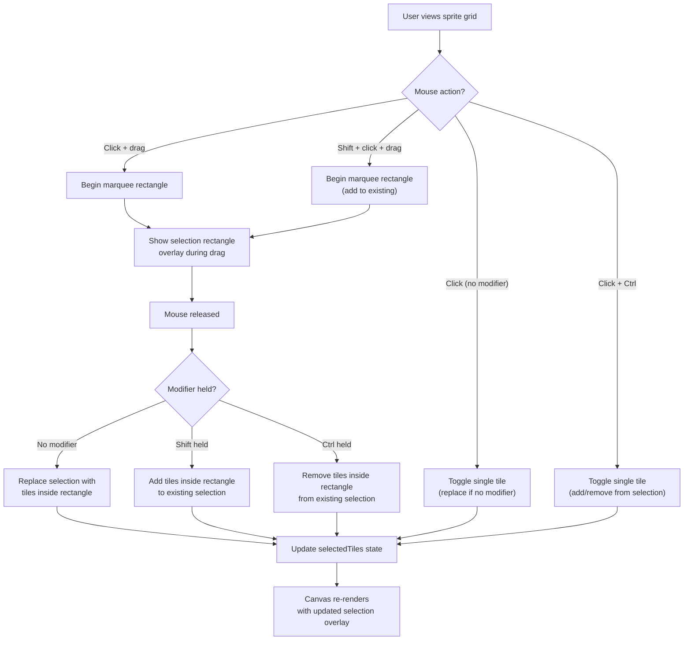
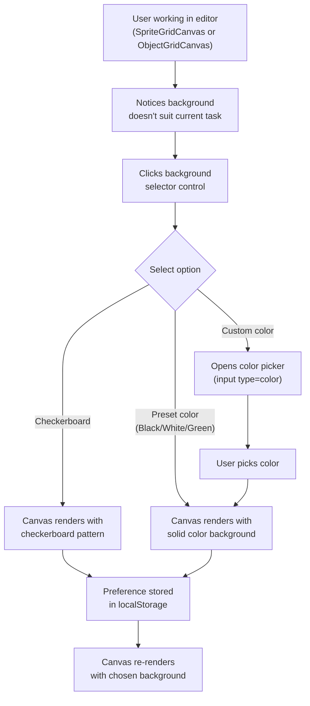
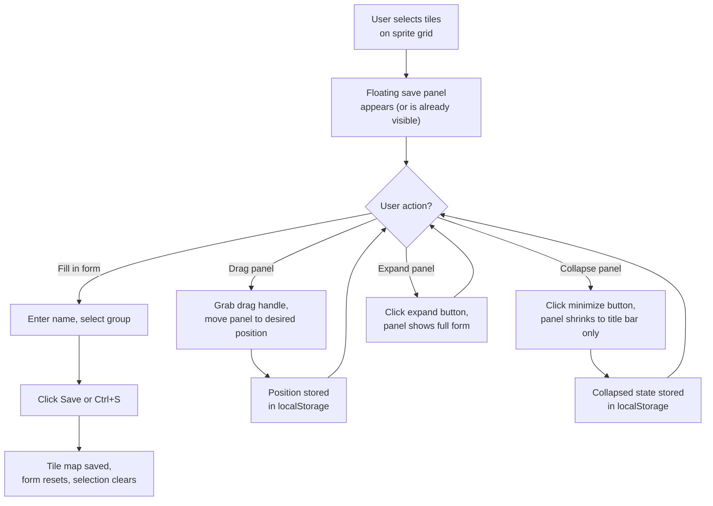
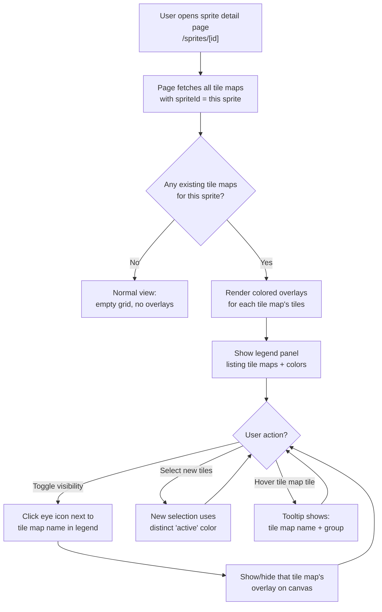

# UXRD-002: Genmap Editor UX Improvements

**Version:** 1.0
**Date:** February 18, 2026
**Status:** Draft
**Author:** UI/UX Designer Agent

---

## Overview

### One-line Summary

Four targeted UX improvements to the Genmap sprite/tile map editor: marquee rectangle selection for tiles, configurable canvas background previews, a floating draggable "Save as Tile Map" panel, and existing tile map overlay visualization with auto-colored selections.

### Background

The Genmap editor (`apps/genmap`) is a Next.js + Canvas-based internal tool for managing sprite sheets, tile maps, and game objects in the Nookstead project. Three workflow bottlenecks have been identified by users working with the tool daily:

1. **Tedious tile selection.** The `SpriteGridCanvas` component only supports single-click toggle to select or deselect individual tiles. Selecting a contiguous rectangular region of 30 tiles requires 30 individual clicks. Professional sprite editors like Aseprite and Tiled support click-and-drag marquee selection as the primary selection method.

2. **No background control.** The `ObjectGridCanvas` uses a hardcoded checkerboard background (`#e0e0e0` / `#c0c0c0`). The `SpriteGridCanvas` renders the sprite image directly with no background control. Users cannot preview how sprites look against different backgrounds (black, white, grass-green, or custom colors), making it difficult to verify transparency, identify semi-transparent pixels, or test visual contrast against expected in-game contexts.

3. **Scroll-to-save workflow.** On the sprite detail page (`/sprites/[id]`), the "Save as Tile Map" panel renders at the bottom of the document flow, only appearing when tiles are selected. Users must scroll away from the canvas to fill in the form, losing visual context of their selection. Professional editors solve this with floating tool panels that stay visible regardless of scroll position.

### Related Documents

- **Sprite Management PRD:** `docs/prd/prd-006-sprite-management.md`
- **Sprite Management Design:** `docs/design/design-007-sprite-management.md`
- **Design Doc:** To be created after UXRD approval

---

## Feature 1: Multiple Tile Selection with Mouse Drag (Marquee Select)

### Research Findings

**Industry precedents:**

- **Aseprite** uses the Rectangular Marquee tool (keyboard shortcut `M`) as the primary selection tool. Selection modes are toggled with modifier keys: Shift to add to selection, Alt to subtract, and Shift+Alt to intersect. The marching-ants animated border provides clear visual feedback for the selected area.
- **Tiled** (tilemap editor) supports rectangular selection across tile grids. Clicking and dragging selects a contiguous rectangle. Shift+click adds individual tiles or additional rectangles to the existing selection.
- **Piskel** supports lasso and rectangle selection tools with marching-ants visual feedback and a separate "selection mode" tool in the toolbar.
- **Photoshop / Figma** both use Shift to add to selection and Alt (Option on Mac) to subtract from selection, establishing a near-universal modifier key convention.

**Key UX finding:** All major editors treat drag-to-select as the default mouse behavior, with modifier keys controlling whether the drag adds to, subtracts from, or replaces the current selection. Single-click is treated as a 1x1 rectangle selection.

### User Flow



### Recommended UX Design

**Default behavior (no modifier):**
- Click: Toggle a single tile (select if unselected, deselect if selected). This preserves current behavior for backward compatibility.
- Click + drag: Draw a selection rectangle. On mouse release, all tiles within the rectangle replace the current selection.

**Modifier key behavior:**
- `Shift` + click: Add a single tile to the current selection (never deselect).
- `Shift` + drag: Add all tiles in the rectangle to the current selection (union).
- `Ctrl` (or `Cmd` on Mac) + click: Toggle a single tile without affecting the rest of the selection (symmetric difference).
- `Ctrl` + drag: Remove all tiles in the rectangle from the current selection (subtract).

**Visual feedback during drag:**
- A semi-transparent blue rectangle (`rgba(59, 130, 246, 0.25)`) overlaid on the canvas during the drag operation.
- A 1px dashed border (`#3b82f6`) on the selection rectangle for clear boundary visibility.
- The rectangle snaps to tile grid boundaries so the user can see exactly which tiles will be selected.
- Tiles that will be affected (added or removed) should show a preview highlight distinct from the drag rectangle.

**Selection rendering (existing, enhanced):**
- Selected tiles continue to use the current blue overlay (`rgba(59, 130, 246, 0.4)`).
- Hover on a selected tile continues to show the red tint indicating "will deselect" (`rgba(239, 68, 68, 0.3)`), but only in single-click (toggle) mode without drag.

**Drag threshold:**
- A 3-pixel movement threshold distinguishes a click from a drag. Movement below 3px in both axes is treated as a click; movement beyond 3px initiates the marquee rectangle.

### Component Structure

```
SpriteGridCanvas (modified)
  Props (new):
    onSelectionChange?: (tiles: TileCoord[]) => void   // replaces onCellClick for multi-select
    selectionMode?: 'toggle' | 'marquee'                // future extensibility

  Internal state (new):
    isDragging: boolean
    dragStart: { x: number; y: number } | null           // raw pixel coordinates
    dragCurrent: { x: number; y: number } | null          // raw pixel coordinates during drag
    dragStartCell: TileCoord | null                        // grid-snapped start cell
    dragCurrentCell: TileCoord | null                      // grid-snapped current cell

  New hook: useMarqueeSelection.ts
    Encapsulates: mousedown, mousemove, mouseup event logic
    Returns: isDragging, selectionRect, modifierKeys
    Input: canvasRef, tileWidth, tileHeight, imageNaturalSize
```

**New file:** `apps/genmap/src/hooks/use-marquee-selection.ts`

```typescript
// Proposed interface
interface UseMarqueeSelectionOptions {
  canvasRef: React.RefObject<HTMLCanvasElement>;
  imageSize: { width: number; height: number } | null;
  tileWidth: number;
  tileHeight: number;
  gridCols: number;
  gridRows: number;
  dragThreshold?: number; // default 3
}

interface MarqueeState {
  isDragging: boolean;
  /** Grid-snapped rectangle in tile coordinates */
  selectionRect: {
    startCol: number;
    startRow: number;
    endCol: number;
    endRow: number;
  } | null;
  /** Modifier keys held during the drag */
  modifiers: {
    shift: boolean;
    ctrl: boolean;
  };
}

function useMarqueeSelection(options: UseMarqueeSelectionOptions): {
  marquee: MarqueeState;
  handlers: {
    onMouseDown: (e: React.MouseEvent<HTMLCanvasElement>) => void;
    onMouseMove: (e: React.MouseEvent<HTMLCanvasElement>) => void;
    onMouseUp: (e: React.MouseEvent<HTMLCanvasElement>) => void;
    onMouseLeave: () => void;
  };
  /** Get all TileCoord cells within the current marquee rect */
  getTilesInRect: () => TileCoord[];
}
```

### Implementation Approach

1. **Extract coordinate mapping:** The existing `getCellFromEvent` logic in `SpriteGridCanvas` should be extracted into a shared utility function (`getCellFromMouseEvent`) since both click and drag need it.

2. **Track raw pixel positions:** On `mousedown`, record the raw pixel position (not the cell). On `mousemove`, compare distance to determine if the drag threshold has been crossed.

3. **Snap to grid during drag:** Once dragging, convert both start and current pixel positions to tile coordinates. The selection rectangle renders from `min(startCol, currentCol)` to `max(startCol, currentCol)` (and similarly for rows).

4. **Compute affected tiles on release:** On `mouseup`, enumerate all tiles within the rectangle, then apply the operation (replace, union, subtract) based on modifier keys.

5. **Render selection rectangle:** Add a new rendering layer in the `SpriteGridCanvas.render` function (between the grid lines and hover layer) that draws the marquee rectangle when `isDragging` is true.

6. **Backward compatibility:** The existing `onCellClick` prop remains functional. A new `onSelectionChange` prop provides the full selection array after any selection operation. Both props can coexist; the parent page uses whichever it needs.

### Keyboard / Mouse Interaction Map

| Input | Context | Action |
|---|---|---|
| Left click | On tile, no modifier | Toggle tile selection (existing behavior) |
| Left click | On tile, Shift held | Add tile to selection |
| Left click | On tile, Ctrl/Cmd held | Toggle tile without affecting rest of selection |
| Left click + drag | No modifier | Draw marquee rectangle, replace selection on release |
| Left click + drag | Shift held | Draw marquee rectangle, add to selection on release |
| Left click + drag | Ctrl/Cmd held | Draw marquee rectangle, subtract from selection on release |
| Mouse move | During drag | Update marquee rectangle visual |
| Mouse move | Not dragging | Hover highlight on single tile (existing) |
| Mouse leave | During drag | Cancel the drag operation, revert to pre-drag selection |
| Escape | During drag | Cancel the drag operation, revert to pre-drag selection |
| Escape | Not dragging, tiles selected | Clear all selection |

### Edge Cases and Accessibility

**Edge cases:**
- **Drag outside canvas:** If the mouse leaves the canvas during drag, cancel the drag and revert the selection to the state before the drag started. Do not commit a partial selection.
- **Tiny sprites:** For very small sprite sheets (e.g., 2x2 tiles), marquee selection still works, it just produces small rectangles. The drag threshold prevents accidental drags.
- **Canvas scaling:** The coordinate mapping must account for CSS scaling (`getBoundingClientRect` vs `naturalWidth/Height`). The existing `getCellFromEvent` already handles this; reuse that logic.
- **Zero-size drag:** A drag that starts and ends on the same tile after exceeding the pixel threshold should select exactly that one tile.

**Accessibility:**
- All selection operations are achievable without drag: Ctrl+click toggles individual tiles, Shift+click adds tiles, and Ctrl+A selects all. This satisfies WCAG 2.5.7 (Dragging Movements) which requires non-dragging alternatives.
- The selection count text ("N tiles selected") already provides a screen-reader-friendly status. It should be wrapped in an `aria-live="polite"` region so changes are announced.
- The Clear Selection button remains available for undoing all selection with a single click.

---

## Feature 2: Configurable Canvas Background

### Research Findings

**Industry precedents:**

- **Aseprite** provides configurable checked-background colors through Edit > Preferences > Background. Users can customize both colors of the checkerboard pattern. The default is the classic grey/white check.
- **Photoshop** uses a standardized grey/white checkerboard for transparency and allows users to change the canvas color via Preferences > Transparency & Gamut.
- **Figma** lets users change the canvas background color from the right sidebar when no layer is selected. Options include a color picker and an opacity slider. A toggle icon hides/shows the background entirely.
- **Piskel** displays a small background toggle button below the canvas that cycles between checkerboard, black, and white.

**Key UX finding:** Most tools provide a small set of presets (checkerboard, black, white) plus a custom color picker. The control is always accessible without navigating away from the canvas -- typically a toolbar button, a dropdown, or an inline swatch row.

### User Flow



### Recommended UX Design

**Background options (ordered in UI):**

| Option | Value | Description |
|---|---|---|
| Checkerboard (default) | `'checkerboard'` | Classic transparency indicator. Two configurable colors. |
| Black | `'#000000'` | Test visibility against dark backgrounds |
| White | `'#ffffff'` | Test visibility against light backgrounds |
| Grass Green | `'#4a7c3f'` | Common in-game ground color for Nookstead |
| Custom | User-chosen hex | Free color choice via `<input type="color">` |

**UI placement:**
- Position the background selector in the toolbar row alongside the TileSizeSelector (on the sprite detail page) or above the canvas (on the object edit page).
- Use a compact inline design: a row of small color swatches (24x24px squares with rounded corners) followed by a color picker button.
- The active swatch has a 2px ring outline using the primary color.
- For the checkerboard swatch, render a 2x2 mini checkerboard pattern inside the 24x24px square.

**Layout sketch (sprite detail page):**

```
+------------------------------------------+
|  [SpriteGridCanvas with sprite image]    |
|                                          |
+------------------------------------------+
|  Tile Size: [8] [16*] [32] [48] [64]    |
|  Background: [CB] [B] [W] [G] [?]       |
|  3 tiles selected  [Clear Selection]     |
+------------------------------------------+
```

Where: CB = checkerboard, B = black, W = white, G = green, ? = custom color picker.

**Layout sketch (object edit page):**

```
+------------------------------------------+
|  [Metadata form: name, desc, dimensions] |
+------------------------------------------+
|  Background: [CB] [B] [W] [G] [?]       |
+------------------------------------------+
|  [TilePicker] | [ObjectGridCanvas] | [Preview] |
+------------------------------------------+
```

**Persistence:**
- Store the selected background in `localStorage` under the key `genmap-canvas-background`.
- The value is a JSON object: `{ type: 'checkerboard' | 'solid', color?: string }`.
- The setting applies globally across all canvas editors (SpriteGridCanvas and ObjectGridCanvas). Users expect consistency when switching between pages.

**Checkerboard customization:**
- For the initial implementation, use fixed checkerboard colors. Customizable checkerboard colors can be added in a future iteration if requested.

### Component Structure

```
CanvasBackgroundSelector (new component)
  Props:
    value: CanvasBackground
    onChange: (bg: CanvasBackground) => void

  CanvasBackground type:
    { type: 'checkerboard' } | { type: 'solid'; color: string }

New hook: useCanvasBackground.ts
  Reads/writes localStorage
  Returns: { background: CanvasBackground, setBackground }
  Initializes with 'checkerboard' if no stored preference

Modified components:
  SpriteGridCanvas - accepts optional `background` prop
    Renders background layer before drawing sprite image
    For 'checkerboard': draws 2-color check pattern behind the image
    For 'solid': fills canvas with solid color before drawing image

  ObjectGridCanvas - accepts optional `background` prop
    Replaces hardcoded #e0e0e0/#c0c0c0 checkerboard with configurable background
    For 'checkerboard': uses current check pattern (or custom colors later)
    For 'solid': fills with solid color
```

**New files:**
- `apps/genmap/src/components/canvas-background-selector.tsx`
- `apps/genmap/src/hooks/use-canvas-background.ts`

```typescript
// Proposed type
type CanvasBackground =
  | { type: 'checkerboard' }
  | { type: 'solid'; color: string };

// Proposed hook interface
function useCanvasBackground(): {
  background: CanvasBackground;
  setBackground: (bg: CanvasBackground) => void;
};

// Proposed component interface
interface CanvasBackgroundSelectorProps {
  value: CanvasBackground;
  onChange: (bg: CanvasBackground) => void;
  className?: string;
}
```

### Implementation Approach

1. **SpriteGridCanvas background rendering:** Currently, the canvas draws the sprite image directly (`ctx.drawImage(loadedImage, 0, 0)`). To support backgrounds, add a rendering step before the image draw:
   - For checkerboard: iterate over tile-sized cells and alternate fill colors (same logic as ObjectGridCanvas currently uses).
   - For solid: `ctx.fillRect(0, 0, canvas.width, canvas.height)` with the chosen color.
   - The sprite image is then drawn on top, with transparent pixels revealing the background.

2. **ObjectGridCanvas background refactor:** Replace the hardcoded checkerboard colors in the "Layer 1: Checkerboard background" section with a configurable approach. The `background` prop determines what is drawn.

3. **Swatch rendering:** Each preset swatch is a `<button>` element with `width: 24px; height: 24px; border-radius: 4px`. The checkerboard swatch uses a CSS `linear-gradient` or a tiny inline canvas. Solid swatches use `backgroundColor`.

4. **Color picker integration:** The custom color swatch renders an `<input type="color">` visually hidden behind a styled button. Clicking the button triggers the native color picker.

5. **Global preference with hook:** The `useCanvasBackground` hook reads from localStorage on mount and writes on change. Both page components (sprite detail, object edit) call the same hook, ensuring a unified preference.

### Keyboard / Mouse Interaction Map

| Input | Context | Action |
|---|---|---|
| Left click | On a preset swatch | Set background to that preset |
| Left click | On custom color swatch | Open native color picker |
| Tab | Between swatches | Move focus to next swatch |
| Enter / Space | On focused swatch | Activate that swatch |
| Escape | Color picker open | Close color picker (browser-native) |

### Edge Cases and Accessibility

**Edge cases:**
- **PNG with no transparency:** If the sprite image has no transparent pixels, the background is invisible behind it. This is expected behavior -- the background only shows through transparent areas.
- **ObjectGridCanvas empty cells:** When no tile is placed in a cell, the background should be visible. The current checkerboard fills all cells; the new system must also fill empty cells with the chosen background.
- **ObjectPreview component:** The `ObjectPreview` component uses `ctx.clearRect` for empty cells. It should also adopt the background preference for consistency.
- **localStorage unavailable:** If localStorage is blocked (e.g., Safari private mode), fall back to checkerboard without persisting.

**Accessibility:**
- Each swatch button has a descriptive `aria-label` (e.g., "Black background", "Checkerboard background", "Custom background color").
- The active swatch receives `aria-pressed="true"`.
- Color contrast: the swatch borders must provide at least 3:1 contrast against the page background so users can distinguish them.
- The custom color picker uses the native `<input type="color">` which provides built-in accessibility.

---

## Feature 3: Floating Draggable Save Tile Map Panel

### Research Findings

**Industry precedents:**

- **Unity** distinguishes between dockable windows (`Show()`) and floating utility windows (`ShowUtility()`). Floating windows remain on top even when they lose focus, which is the desired behavior for a save panel.
- **Godot** supports detachable floating panels that users can drag to a second monitor. Panels maintain their position across sessions.
- **Tiled** uses a dockable panel system where tool panels (tileset browser, properties, etc.) can be detached and freely positioned as floating windows.
- **Figma** uses floating panels for properties, layers, and design tokens. Panels have a drag handle at the top and can be collapsed.
- **react-draggable** is the most widely used React library for draggable elements, supporting drag handles, bounds constraints, and position control without creating wrapper DOM elements.

**Key UX finding:** Professional editors universally support floating panels with these characteristics: (1) a clear drag handle, (2) a collapse/minimize toggle, (3) position persistence, and (4) the panel stays within viewport bounds.

### User Flow



### Recommended UX Design

**Panel behavior:**
- The panel uses `position: fixed` and renders in a React portal (outside the main content flow) to avoid layout interference.
- The panel appears when at least 1 tile is selected and remains visible until the selection is cleared or the save completes.
- When collapsed, only the title bar (drag handle + title + expand button) is visible. This is a thin horizontal strip approximately 36px tall.
- The panel cannot be dragged outside the viewport. Use clamping logic to keep at least 50% of the panel visible.

**Default position:**
- Bottom-right corner of the viewport, with 16px margin from the edges.
- If a stored position exists in localStorage, restore that position on mount.

**Visual design:**

```
+---------------------------------------------+
| [=] Save as Tile Map              [_] [x]   |  <-- Drag handle area
+---------------------------------------------+
|                                             |
|  Name:  [___________________________]       |
|                                             |
|  Group: [Dropdown selector________ v]       |
|                                             |
|  3 tiles selected                           |
|                                             |
|  [Save Tile Map]                            |
|                                             |
+---------------------------------------------+
```

Where:
- `[=]` is a drag grip icon (six dots or horizontal lines indicating "draggable").
- `[_]` is the collapse/minimize button.
- `[x]` is a close/dismiss button (hides the panel; it reappears when selection changes).

**Panel width:** 320px fixed width. This is wide enough for form inputs but narrow enough not to obstruct the canvas.

**Panel shadow and border:** `box-shadow: 0 4px 12px rgba(0, 0, 0, 0.15)` with a `1px border` using the design system's `border` color. The panel has `border-radius: 8px` and uses the `background` color token.

**Z-index:** The panel uses `z-index: 50`, which is above canvas elements but below modal dialogs (shadcn/ui Dialog uses `z-index: 50` by default, so the save panel should use `z-index: 40` to sit below dialogs).

**Collapsed state:**

```
+---------------------------------------------+
| [=] Save as Tile Map (3)          [+] [x]   |
+---------------------------------------------+
```

The "(3)" shows the count of selected tiles so the user knows the selection status even when collapsed.

### Component Structure

```
FloatingSavePanel (new component)
  Props:
    selectedTilesCount: number
    tileMapName: string
    onNameChange: (name: string) => void
    tileMapGroupId: string | null
    onGroupIdChange: (id: string | null) => void
    onSave: () => void
    isSaving: boolean
    isVisible: boolean

  Internal state:
    position: { x: number; y: number }
    isCollapsed: boolean
    isDragging: boolean

  Uses hook: useFloatingPanel.ts
    Handles: drag start/move/end, position clamping, localStorage persistence

Sprite detail page (modified):
  Removes the inline "Save as Tile Map" <div> block (lines 223-253)
  Renders <FloatingSavePanel> as a child, with the same state bindings
  The panel renders via a React portal to document.body
```

**New files:**
- `apps/genmap/src/components/floating-save-panel.tsx`
- `apps/genmap/src/hooks/use-floating-panel.ts`

```typescript
// Proposed hook interface
interface UseFloatingPanelOptions {
  storageKey: string;
  defaultPosition: { x: number; y: number };
  panelWidth: number;
  panelHeight: number; // estimated expanded height
}

interface FloatingPanelState {
  position: { x: number; y: number };
  isCollapsed: boolean;
  isDragging: boolean;
}

function useFloatingPanel(options: UseFloatingPanelOptions): {
  state: FloatingPanelState;
  setCollapsed: (collapsed: boolean) => void;
  dragHandlers: {
    onMouseDown: (e: React.MouseEvent) => void;
  };
};
```

### Implementation Approach

1. **React portal:** The `FloatingSavePanel` renders via `createPortal(jsx, document.body)` to escape the normal document flow. This prevents layout shifts and z-index issues with the canvas.

2. **Drag implementation (no library):** Rather than adding a dependency like `react-draggable`, implement dragging with native pointer events:
   - `onPointerDown` on the drag handle sets `isDragging = true` and records the offset between the pointer and the panel's top-left corner.
   - A global `pointermove` listener (attached to `document`) updates the panel position, clamped to viewport bounds.
   - A global `pointerup` listener sets `isDragging = false` and persists the position to localStorage.
   - Use `setPointerCapture` for reliable tracking even when the pointer leaves the panel element.

3. **Position persistence:** Store in localStorage under key `genmap-floating-panel-save`:
   ```json
   { "x": 1200, "y": 600, "collapsed": false }
   ```

4. **Position clamping:** On every position update and on window resize, clamp the panel so that at least 50% of its width and 100% of the title bar remain within the viewport.

5. **Visibility logic:** The panel is conditionally rendered based on `selectedTilesCount > 0`. When the selection becomes empty (after save or clear), the panel unmounts. On remount, it restores its last known position and collapsed state from localStorage.

6. **Window resize handling:** Add a `resize` event listener that re-clamps the panel position if the viewport shrinks and the panel would end up outside bounds.

7. **Remove inline form:** The existing inline "Save as Tile Map" div on the sprite detail page (currently at lines 223-253 of `apps/genmap/src/app/sprites/[id]/page.tsx`) is replaced by the floating panel. The same state variables (`tileMapName`, `tileMapGroupId`, `isSaving`, `handleSaveTileMap`) are passed as props.

### Keyboard / Mouse Interaction Map

| Input | Context | Action |
|---|---|---|
| Left click + drag | On drag handle area | Move panel to new position |
| Left click | On collapse/minimize button | Toggle collapsed/expanded state |
| Left click | On close button | Hide panel (reappears on next selection change) |
| Enter | Focus on Save button | Submit the form |
| Ctrl+S / Cmd+S | Anywhere on page | Save tile map (existing shortcut, unchanged) |
| Escape | Panel visible | Close/hide panel |
| Tab | Within panel | Navigate between Name input, Group selector, Save button |
| Shift+Tab | Within panel | Navigate backward |

### Edge Cases and Accessibility

**Edge cases:**
- **Small viewport:** If the viewport is smaller than the panel width (320px), the panel should become full-width with no horizontal overflow.
- **Viewport resize:** If the user resizes the browser window and the panel's stored position is now outside bounds, clamp the panel to the nearest valid position.
- **Rapid selection/deselection:** If the user rapidly selects and deselects tiles (causing the panel to mount/unmount), debounce the visibility toggle by 150ms to prevent flicker.
- **Form state on hide:** If the user closes the panel with form data filled in (name entered but not saved), the form state should be preserved. Since the parent page owns the state (`tileMapName`, `tileMapGroupId`), this happens naturally.
- **Multiple monitors:** Position values stored in localStorage are viewport-relative. If the user moves the browser to a different monitor with a different resolution, the clamp logic will adjust.
- **Touch devices:** Pointer events work on touch devices. The drag handle should have a minimum touch target of 44x44px to satisfy mobile accessibility guidelines.

**Accessibility:**
- The panel has `role="dialog"` and `aria-label="Save as Tile Map"`.
- The drag handle area has `aria-roledescription="draggable panel"`.
- The collapse button has `aria-expanded="true/false"` and `aria-label="Collapse panel" / "Expand panel"`.
- The close button has `aria-label="Close save panel"`.
- Focus management: when the panel appears, focus does not automatically move to it (to avoid disrupting canvas interaction). The user can Tab into it naturally.
- The panel must be in the tab order after the canvas and toolbar controls.
- Screen readers announce "Save as Tile Map panel, N tiles selected" when the panel becomes visible, using an `aria-live="polite"` announcement.

---

## Feature 4: Existing Tile Map Overlay with Auto-Colored Selections

### Research Findings

**Industry precedents:**

- **Tiled** (tilemap editor) displays tile layers with distinct color-coded highlights. Users can toggle layer visibility and each layer has its own color in the layer panel. Selected regions from different tilesets are visually distinguished.
- **Aseprite** uses colored cel outlines in the timeline — each layer can have a distinct user-assignable color, making it easy to see which pixels belong to which layer at a glance.
- **Photoshop** uses colored guide overlays and layer-colored borders. Slices/regions have auto-assigned hue-rotated colors so no two adjacent regions share the same color.
- **Figma** auto-assigns distinct selection colors to different users in multiplayer mode (blue, orange, purple, green) to distinguish who is selecting what.

**Key UX finding:** Auto-assigning colors from a perceptually distinct palette (hue-rotated, high-saturation) is the standard approach. The palette should cycle deterministically based on an index so colors are stable across sessions. Labels or legends tie each color to a name.

### User Flow



### Recommended UX Design

**Auto-color palette (10 colors, cycled by tile map creation order):**

| Index | Name | Hex | RGBA overlay (40% opacity) |
|---|---|---|---|
| 0 | Blue (current selection) | `#3b82f6` | `rgba(59, 130, 246, 0.4)` |
| 1 | Emerald | `#10b981` | `rgba(16, 185, 129, 0.4)` |
| 2 | Amber | `#f59e0b` | `rgba(245, 158, 11, 0.4)` |
| 3 | Rose | `#f43f5e` | `rgba(244, 63, 94, 0.4)` |
| 4 | Violet | `#8b5cf6` | `rgba(139, 92, 246, 0.4)` |
| 5 | Cyan | `#06b6d4` | `rgba(6, 182, 212, 0.4)` |
| 6 | Orange | `#f97316` | `rgba(249, 115, 22, 0.4)` |
| 7 | Pink | `#ec4899` | `rgba(236, 72, 153, 0.4)` |
| 8 | Teal | `#14b8a6` | `rgba(20, 184, 166, 0.4)` |
| 9 | Lime | `#84cc16` | `rgba(132, 204, 22, 0.4)` |

Index 0 (blue) is reserved for the **current active selection** — same color currently used. Existing tile maps start from index 1 and cycle through the palette based on their creation order (sorted by `createdAt`).

**Canvas overlay rendering order:**
1. Background layer (checkerboard / solid color — Feature 2)
2. Sprite image
3. Existing tile map overlays (one layer per tile map, rendered in creation order, oldest first)
4. Current active selection overlay (blue, index 0 — always on top of existing overlays)
5. Grid lines
6. Marquee rectangle (during drag — Feature 1)
7. Hover highlight

**Visual design for overlays:**
- Each tile map's tiles get a filled rectangle at 40% opacity using the assigned color.
- A thin 1px solid border (same color, 70% opacity) around each tile to distinguish adjacent tiles from different maps.
- If a tile belongs to multiple tile maps, the overlays stack (later maps render on top). The stacking is visible through the transparency.

**Legend panel (Tile Map Overlay Legend):**

```
+-------------------------------------------+
|  Existing Tile Maps                       |
+-------------------------------------------+
|  [eye] [■] Terrain Tiles (12 tiles)      |
|  [eye] [■] Water Edges (8 tiles)         |
|  [eye] [■] Grass Details (6 tiles)       |
+-------------------------------------------+
|  [■] Current Selection (3 tiles)          |
+-------------------------------------------+
```

Where:
- `[eye]` is a visibility toggle (show/hide that tile map's overlay)
- `[■]` is a small color swatch matching the auto-assigned color
- Tile map name is shown with tile count in parentheses
- Clicking the tile map name navigates to `/tile-maps/[id]`
- Current selection always appears at the bottom with the blue swatch

**Legend placement:**
- On desktop: positioned below the tile size selector / background selector toolbar, above the canvas.
- Collapsible via a toggle — collapsed by default when there are 0 existing tile maps, expanded by default when there are 1+ tile maps.

**Layout sketch (sprite detail page, updated):**

```
+------------------------------------------+
|  Sprite Name            [Delete Sprite]  |
|  1024 x 768 px — image/png               |
+------------------------------------------+
|  Existing Tile Maps              [v]     |
|  [eye] [■] Terrain Tiles (12)           |
|  [eye] [■] Water Edges (8)              |
|  [■] Current Selection (3)              |
+------------------------------------------+
|  [SpriteGridCanvas with overlays]        |
|                                          |
+------------------------------------------+
|  Tile Size: [8] [16*] [32] [48] [64]    |
|  Background: [CB] [B] [W] [G] [?]       |
|  3 tiles selected  [Clear Selection]     |
+------------------------------------------+
|  [FloatingSavePanel - draggable]         |
+------------------------------------------+
```

### Data Requirements

**New API endpoint needed:** `GET /api/sprites/[id]/tile-maps`

Returns all tile maps that reference this sprite, filtered by `spriteId`. Response:

```json
[
  {
    "id": "uuid",
    "name": "Terrain Tiles",
    "groupId": "uuid | null",
    "groupName": "Outdoor",
    "tileWidth": 16,
    "tileHeight": 16,
    "selectedTiles": [{ "col": 0, "row": 0 }, { "col": 1, "row": 0 }],
    "createdAt": "2026-02-15T10:00:00Z"
  }
]
```

**New DB service function:** `listTileMapsBySpriteId(db, spriteId)` — queries `tileMaps` where `spriteId` matches, ordered by `createdAt ASC` (oldest first, for stable color assignment).

**Tile size filtering:** Only tile maps with matching `tileWidth` and `tileHeight` should be displayed as overlays. If the user changes the tile size selector, the overlays update to show only tile maps with that tile size. This prevents coordinate misalignment.

### Component Structure

```
SpriteGridCanvas (modified)
  Props (new):
    existingTileMaps?: Array<{
      id: string;
      name: string;
      colorIndex: number;
      tiles: TileCoord[];
      visible: boolean;
    }>

  Render logic (new layers):
    After sprite image, before grid lines:
      For each visible existingTileMap:
        For each tile in tileMap.tiles:
          ctx.fillStyle = PALETTE[colorIndex] at 40% opacity
          ctx.fillRect(tile position)
          ctx.strokeStyle = PALETTE[colorIndex] at 70% opacity
          ctx.strokeRect(tile position) — 1px border

TileMapOverlayLegend (new component)
  Props:
    tileMaps: Array<{ id: string; name: string; colorIndex: number; tileCount: number }>
    visibility: Record<string, boolean>
    onToggleVisibility: (id: string) => void
    currentSelectionCount: number

  Renders: list of tile maps with color swatches, eye toggles, and tile counts

Sprite detail page (modified):
  Fetches tile maps on mount via GET /api/sprites/[id]/tile-maps
  Filters by current tileSize
  Assigns color indices (1-based, cycling through palette)
  Manages visibility state: Record<string, boolean> (all visible by default)
  Passes overlays to SpriteGridCanvas + legend data to TileMapOverlayLegend
```

**New files:**
- `apps/genmap/src/components/tile-map-overlay-legend.tsx`
- `apps/genmap/src/app/api/sprites/[id]/tile-maps/route.ts`

**New DB function:**
- `listTileMapsBySpriteId` in `packages/db/src/services/tile-map.ts`

```typescript
// Proposed color palette constant
const TILE_MAP_OVERLAY_COLORS = [
  '#3b82f6', // 0: Blue — reserved for current selection
  '#10b981', // 1: Emerald
  '#f59e0b', // 2: Amber
  '#f43f5e', // 3: Rose
  '#8b5cf6', // 4: Violet
  '#06b6d4', // 5: Cyan
  '#f97316', // 6: Orange
  '#ec4899', // 7: Pink
  '#14b8a6', // 8: Teal
  '#84cc16', // 9: Lime
] as const;

// Color assignment: tileMap index i gets color at index (i % 9) + 1
// (skip index 0 which is reserved for active selection)
function getOverlayColorIndex(tileMapIndex: number): number {
  return (tileMapIndex % 9) + 1;
}

// Proposed legend component interface
interface TileMapOverlayLegendProps {
  tileMaps: Array<{
    id: string;
    name: string;
    colorIndex: number;
    tileCount: number;
  }>;
  visibility: Record<string, boolean>;
  onToggleVisibility: (id: string) => void;
  currentSelectionCount: number;
  className?: string;
}
```

### Implementation Approach

1. **New API endpoint:** Create `GET /api/sprites/[id]/tile-maps` that calls a new `listTileMapsBySpriteId(db, spriteId)` function. This function queries `tileMaps` table with `WHERE sprite_id = $1 ORDER BY created_at ASC`.

2. **Sprite detail page data fetching:** On mount (alongside the existing sprite fetch), also fetch `/api/sprites/${id}/tile-maps`. Store the result in state. When `tileSize` changes, filter the list to only include tile maps with matching `tileWidth === tileSize && tileHeight === tileSize`.

3. **Color assignment:** After filtering by tile size, assign color indices sequentially: the first tile map gets index 1 (Emerald), second gets index 2 (Amber), etc. The index cycles through 1–9 for >9 tile maps.

4. **Canvas rendering:** Modify `SpriteGridCanvas.render()` to accept and render `existingTileMaps` overlays. Each overlay layer iterates over its tile coordinates and fills rectangles. Render in creation order so newer tile maps appear on top.

5. **Legend component:** A collapsible list below the sprite info, above the canvas. Each row has an eye toggle button, color swatch, tile map name (clickable link), and tile count. The "Current Selection" row is always last with the blue swatch.

6. **Visibility state:** Managed in the sprite detail page as `Record<string, boolean>`. All tile maps are visible by default. Toggling updates the record and triggers a canvas re-render.

7. **After saving a new tile map:** When `handleSaveTileMap` succeeds, re-fetch the tile maps list (`/api/sprites/${id}/tile-maps`) so the newly saved tile map immediately appears as an overlay with its own color. The selection clears as before.

### Keyboard / Mouse Interaction Map

| Input | Context | Action |
|---|---|---|
| Hover | On a tile with existing tile map overlay | Show tooltip: "Tile map: [name]" |
| Left click | On eye toggle in legend | Toggle that tile map's overlay visibility |
| Left click | On tile map name in legend | Navigate to `/tile-maps/[id]` edit page |
| Left click | On legend collapse toggle | Expand/collapse the legend panel |

### Edge Cases and Accessibility

**Edge cases:**
- **Tile size mismatch:** Tile maps created with a different tile size than the current selector value must not be shown as overlays — their coordinates wouldn't align. Filter by `tileWidth === currentTileSize && tileHeight === currentTileSize`.
- **Many tile maps (>10):** Colors cycle. Two tile maps could share a color. The legend with names disambiguates. If >10 tile maps exist for one sprite, consider grouping by tile map group in the legend.
- **Tile overlap between maps:** If two tile maps claim the same tile coordinate, both overlays render on that cell. The stacked semi-transparent colors create a blended appearance. The tooltip should show all tile map names that include this tile.
- **No existing tile maps:** Legend collapses or hides entirely. No extra rendering on canvas.
- **Deleted tile map:** If a tile map is deleted (via the tile-map edit page), returning to the sprite detail page re-fetches and the deleted map no longer appears.
- **Large sprite with many tile maps:** Rendering many overlay rectangles could impact canvas performance. Batch the fill operations by color to minimize context state changes. For >1000 overlay tiles total, consider rendering overlays into an offscreen canvas and compositing as a single image.

**Accessibility:**
- Eye toggle buttons have `aria-label="Hide [tile map name] overlay"` / `"Show [tile map name] overlay"` and `aria-pressed` reflecting visibility state.
- Color swatches have `aria-hidden="true"` since they are decorative (the tile map name provides the identifying information).
- The tooltip on canvas hover should also be announced — use an `aria-live="polite"` region that updates with the hovered tile map name.
- Each legend row is keyboard-focusable. Tab navigates between rows, Enter toggles visibility.

---

## Design System Integration

### Components from Design System

| Feature Component | Library Component | Customization Needed |
|---|---|---|
| CanvasBackgroundSelector swatches | Custom buttons (styled) | Custom -- small 24px toggle buttons |
| FloatingSavePanel container | shadcn/ui Card | Variant -- floating with shadow |
| FloatingSavePanel Name input | shadcn/ui Input | None |
| FloatingSavePanel Group selector | GroupSelector (existing) | None |
| FloatingSavePanel Save button | shadcn/ui Button | None |
| FloatingSavePanel collapse/close | shadcn/ui Button (icon variant) | Size: icon-sm |
| Marquee selection rectangle | Canvas rendering (no component) | N/A |
| TileMapOverlayLegend rows | Custom list items (styled) | Custom -- eye toggle + color swatch + link |
| TileMapOverlayLegend collapse | shadcn/ui Button (icon variant) | Size: icon-sm |
| Tooltip on canvas hover | shadcn/ui Tooltip (existing) | Positioned at cursor |

### Design Tokens

| Token Type | Token Name | Usage Context |
|---|---|---|
| Color | `--primary` / `hsl(222.2 47.4% 11.2%)` | Active swatch ring, marquee rectangle border |
| Color | `--border` / `hsl(214.3 31.8% 91.4%)` | Panel border, swatch borders |
| Color | `--background` / `hsl(0 0% 100%)` | Panel background |
| Color | `--muted` / `hsl(210 40% 96.1%)` | Panel drag handle background |
| Spacing | `gap-2` (8px) | Between swatches |
| Spacing | `p-4` (16px) | Panel inner padding |
| Shadow | `shadow-lg` | Floating panel drop shadow |
| Radius | `rounded-lg` (8px) | Panel border radius |

### Custom Components Required

- [x] `CanvasBackgroundSelector` -- No existing design system component covers a set of color swatch toggles with a custom color picker.
- [x] `FloatingSavePanel` -- No existing design system component covers a floating draggable dialog with collapse behavior.
- [x] `TileMapOverlayLegend` -- No existing design system component covers a toggle-list with color swatches and visibility controls.
- [x] `useMarqueeSelection` hook -- Canvas interaction logic with no visual component equivalent.
- [x] `useCanvasBackground` hook -- localStorage-backed preference with no existing utility.
- [x] `useFloatingPanel` hook -- Drag/position/persistence logic with no existing utility.

---

## Animation and Transitions

### Transitions

| Element | Trigger | Duration | Easing | Effect |
|---|---|---|---|---|
| Floating panel (appear) | Selection becomes non-empty | 200ms | ease-out | Fade in + scale from 0.95 to 1.0 |
| Floating panel (disappear) | Selection cleared / close clicked | 150ms | ease-in | Fade out + scale from 1.0 to 0.95 |
| Panel collapse | Click minimize | 200ms | ease-in-out | Height animates from full to title-bar only |
| Panel expand | Click expand | 200ms | ease-in-out | Height animates from title-bar to full |
| Swatch active ring | Click swatch | 150ms | ease-out | Ring opacity 0 to 1 |
| Marquee rectangle | During drag | Per frame (rAF) | None (immediate) | Rectangle redrawn each frame |

### Motion Preferences

- **Reduced Motion:** When `prefers-reduced-motion: reduce` is active:
  - Floating panel appears/disappears instantly (no fade/scale).
  - Collapse/expand uses instant visibility toggle instead of height animation.
  - Swatch ring change is instant.
  - Marquee rectangle drawing is unaffected (it is functional, not decorative).

---

## Responsive Behavior

### Breakpoints

| Breakpoint | Width | Layout Changes |
|---|---|---|
| Mobile | < 640px | Floating panel becomes bottom sheet (full-width, pinned to bottom). Background swatches wrap to second row if needed. Marquee selection works with touch (pointer events). |
| Tablet | 640px - 1024px | Floating panel has 280px width. All features work normally. |
| Desktop | > 1024px | Full layout as designed. Floating panel at 320px width. |

### Mobile-Specific Behavior

- **Touch targets:** All swatch buttons are minimum 44x44px on mobile (expand from 24px desktop size).
- **Floating panel as bottom sheet:** On viewports narrower than 640px, the panel loses its draggable behavior and becomes a fixed bottom sheet (pinned to bottom of viewport, full width, with a "swipe up" affordance). This prevents the panel from obscuring the small canvas.
- **Marquee selection with touch:** Touch-and-drag initiates marquee selection. Two-finger pinch remains available for zoom (if implemented). The 3px drag threshold applies to touch events as well.

### Desktop-Specific Behavior

- **Hover states:** Swatch buttons show a subtle ring on hover (`outline: 2px solid rgba(0,0,0,0.1)`).
- **Keyboard shortcuts:** All shortcuts listed in the interaction maps above.
- **Multi-window:** Position persistence uses viewport-relative coordinates, so the panel position is consistent within the same window but may need re-clamping if the window is resized.

---

## Content and Microcopy

### UI Text

| Element | Text | Notes |
|---|---|---|
| Background selector label | "Background:" | Inline with tile size selector |
| Checkerboard swatch tooltip | "Checkerboard (transparency)" | Shown on hover |
| Black swatch tooltip | "Black background" | Shown on hover |
| White swatch tooltip | "White background" | Shown on hover |
| Green swatch tooltip | "Grass green background" | Shown on hover |
| Custom swatch tooltip | "Custom color" | Shown on hover |
| Floating panel title | "Save as Tile Map" | Matches current heading |
| Floating panel collapsed title | "Save as Tile Map (N)" | N = selected tile count |
| Floating panel close button | (x icon, no text) | aria-label: "Close save panel" |
| Floating panel collapse button | (minus icon) / (plus icon) | aria-label: "Collapse/Expand panel" |
| Selection count (enhanced) | "N tile(s) selected" | Same as current, now in aria-live region |

### Validation Messages

| Field | Validation | Error Message | Success Message |
|---|---|---|---|
| Tile map name (in floating panel) | Required, non-empty | "Name is required" | N/A (toast on save) |
| Group selector | Optional | N/A | N/A |

---

## Resolved Items

- [x] **Select All shortcut (Ctrl+A):** **Not adding.** No Ctrl+A shortcut for canvas. Avoids conflict with browser native "Select All" in text inputs.
- [x] **Undo/Redo for selection:** **No.** Not implementing undo/redo for selection operations.
- [x] **Floating panel on tile-map edit page:** **Yes.** The tile-map edit page (`/tile-maps/[id]`) will also get a floating draggable save panel, replacing its current inline save form.
- [x] **ObjectGridCanvas marquee:** **Yes.** The ObjectGridCanvas will support marquee placement — click+drag to fill a rectangular area with the active brush tile. Uses the same `useMarqueeSelection` hook adapted for placement mode.

---

## Appendix

### Research References

- [Aseprite Docs -- Selecting](https://www.aseprite.org/docs/selecting/) -- Marquee tool behavior and modifier keys
- [Aseprite Docs -- Keyboard Shortcuts](https://aseprite.com/docs/keyboard-shortcuts/) -- Standard shortcut conventions
- [Canvas Hit Region Detection and Drag-to-Select with React](https://www.ziyili.dev/blog/canvas-click-drag-to-select) -- Implementation patterns for canvas marquee selection
- [WCAG 2.5.7 Dragging Movements](https://copyprogramming.com/howto/javascript-react-js-and-canvas-drag-and-drop) -- Accessibility requirement for drag alternatives
- [Aseprite Docs -- Transparent Color](https://www.aseprite.org/docs/transparent-color/) -- Background and transparency handling
- [Figma -- Change Canvas Background Color](https://help.figma.com/hc/en-us/articles/360041064814-Change-the-background-color-of-the-canvas) -- Background color picker UX
- [react-draggable npm](https://www.npmjs.com/package/react-draggable) -- Draggable panel library reference
- [react-rnd GitHub](https://github.com/bokuweb/react-rnd) -- Resizable + draggable panel library
- [Godot Dockable Container](https://github.com/gilzoide/godot-dockable-container) -- Docking panel UX patterns
- [Unity EditorWindow.ShowUtility](https://docs.unity3d.com/ScriptReference/EditorWindow.ShowUtility.html) -- Floating utility window pattern
- [Godot Panel Docking Proposal](https://github.com/godotengine/godot-proposals/issues/1508) -- Discussion of dockable vs floating panels

### File Reference

All files mentioned in this document use absolute paths from the repository root (`D:\git\github\nookstead\server\`):

| File | Description |
|---|---|
| `apps/genmap/src/components/sprite-grid-canvas.tsx` | Canvas component for sprite tile selection (to be modified) |
| `apps/genmap/src/components/object-grid-canvas.tsx` | Canvas component for object tile placement (to be modified) |
| `apps/genmap/src/app/sprites/[id]/page.tsx` | Sprite detail page with inline save form (to be modified) |
| `apps/genmap/src/app/tile-maps/[id]/page.tsx` | Tile map edit page using SpriteGridCanvas (may be modified) |
| `apps/genmap/src/app/objects/[id]/page.tsx` | Object edit page using ObjectGridCanvas (to be modified) |
| `apps/genmap/src/components/tile-picker.tsx` | Sidebar tile browser for object editor (unchanged) |
| `apps/genmap/src/components/object-preview.tsx` | Object preview canvas (may adopt background setting) |
| `apps/genmap/src/components/tile-size-selector.tsx` | Tile size toggle buttons (layout reference for background selector) |
| `apps/genmap/src/hooks/use-keyboard-shortcuts.ts` | Global keyboard shortcuts (to be extended) |
| `apps/genmap/src/app/api/sprites/[id]/tile-maps/route.ts` | New API endpoint for listing tile maps by sprite (to be created) |
| `packages/db/src/services/tile-map.ts` | Tile map DB service (to be extended with `listTileMapsBySpriteId`) |

### New Files to Create

| File | Purpose |
|---|---|
| `apps/genmap/src/hooks/use-marquee-selection.ts` | Marquee drag logic, modifier key tracking, tile enumeration |
| `apps/genmap/src/hooks/use-canvas-background.ts` | localStorage-backed background preference |
| `apps/genmap/src/hooks/use-floating-panel.ts` | Drag positioning, clamping, localStorage persistence |
| `apps/genmap/src/components/canvas-background-selector.tsx` | Color swatch row with custom picker |
| `apps/genmap/src/components/floating-save-panel.tsx` | Floating draggable save form panel |
| `apps/genmap/src/components/tile-map-overlay-legend.tsx` | Legend panel for existing tile map overlays with visibility toggles |
| `apps/genmap/src/app/api/sprites/[id]/tile-maps/route.ts` | API endpoint: list tile maps by sprite ID |

### DB Service Addition

| Function | File | Purpose |
|---|---|---|
| `listTileMapsBySpriteId(db, spriteId)` | `packages/db/src/services/tile-map.ts` | Query tile maps filtered by spriteId, ordered by createdAt ASC |

### Glossary

- **Marquee selection:** A rectangular selection created by clicking and dragging on a surface, selecting all items within the rectangle.
- **Tile coordinate (TileCoord):** An `{ col: number; row: number }` pair identifying a tile's position within a sprite grid.
- **Checkerboard pattern:** An alternating two-color grid pattern used to visually indicate transparency in image editors.
- **Drag threshold:** A minimum pixel distance the pointer must move before a mousedown event is treated as a drag rather than a click.
- **Position clamping:** Constraining a panel's position so it remains within the visible viewport boundaries.
- **Bottom sheet:** A mobile UI pattern where a panel slides up from the bottom of the screen, typically full-width.
- **Overlay color palette:** A set of perceptually distinct colors auto-assigned to tile map overlays so each tile map's tiles are visually distinguishable on the canvas.
- **Visibility toggle:** A per-tile-map control that shows or hides that tile map's colored overlay on the canvas without affecting the underlying data.
