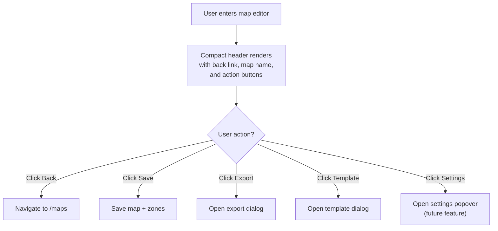
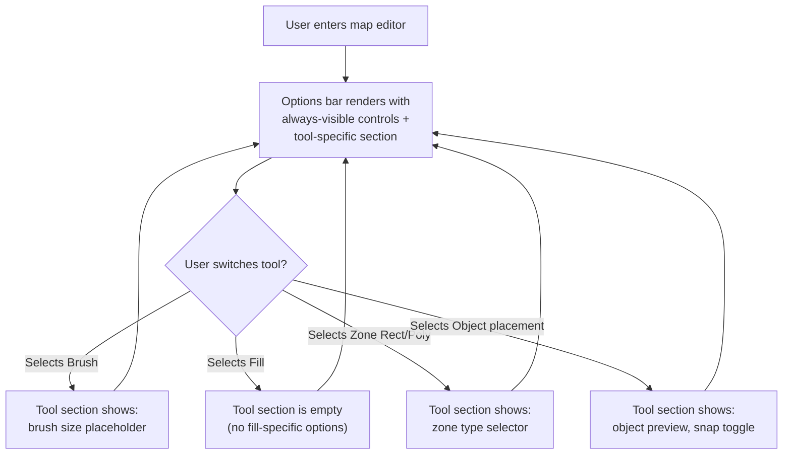
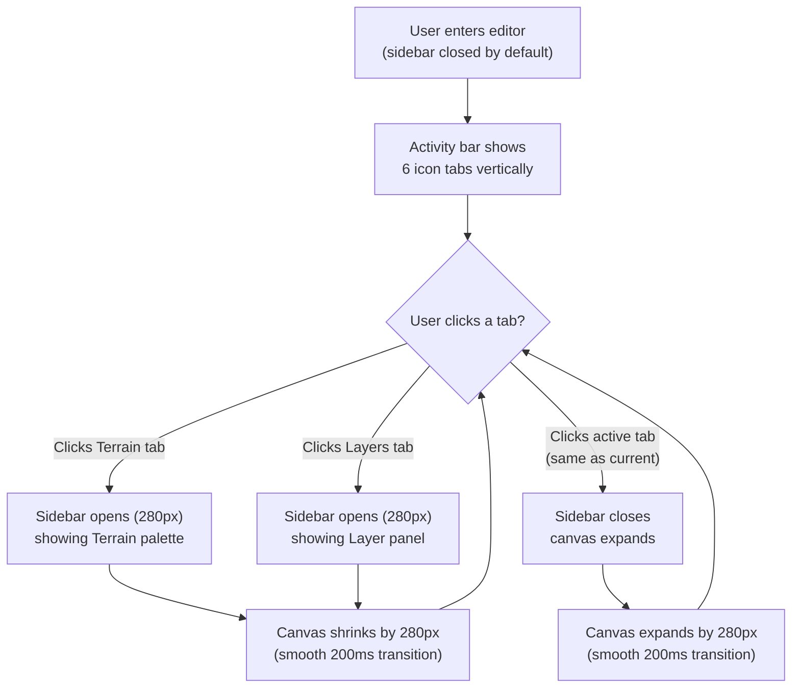
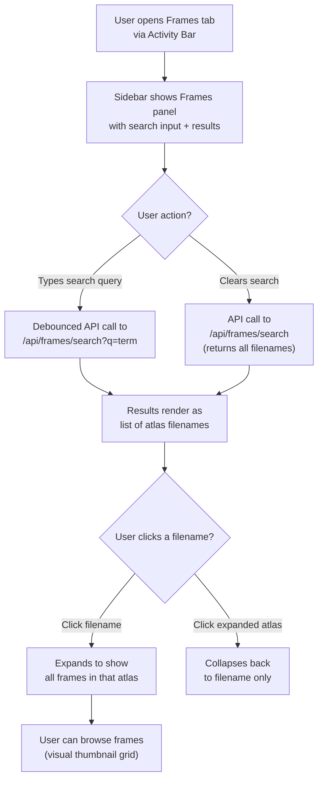
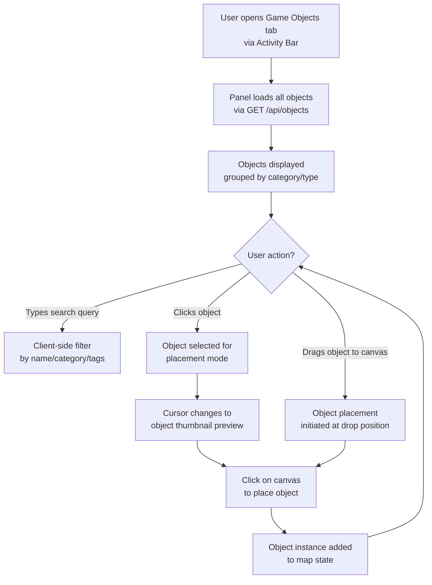
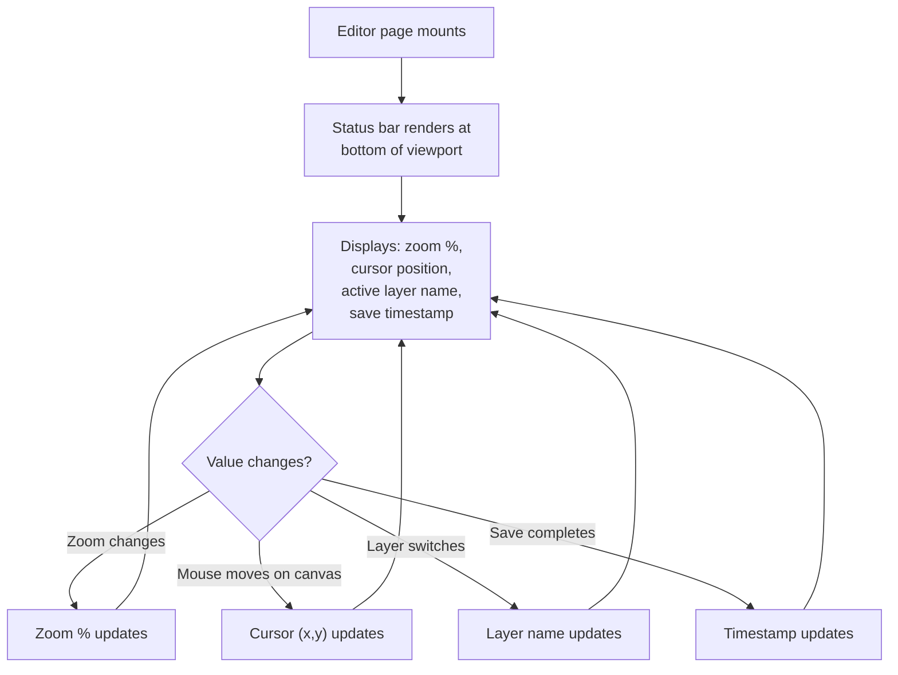

# UXRD-003: Map Editor Photoshop-Style Redesign

**Version:** 1.0
**Date:** February 19, 2026
**Status:** Draft
**Author:** UI/UX Designer Agent

---

## Overview

### One-line Summary

A full Photoshop-inspired dark-themed redesign of the Genmap map editor page (`apps/genmap/src/app/maps/[id]/page.tsx`), replacing the 3-column layout with an icon-only Activity Bar, a push-style collapsible sidebar, a context-sensitive Options Bar, a compact header, and a bottom status bar -- plus two new panels (Frames and Game Objects) for atlas frame browsing and drag-to-place object placement.

### Background

The Genmap map editor is a Next.js + Canvas-based internal tool for creating and editing game maps (tile terrain, layers, zones). The current layout uses a rigid 3-column flex layout with 200px sidebars and a center canvas. Six workflow problems have been identified by the design team:

1. **Wasted screen space.** The 3-column layout enforces permanent left and right sidebars (200px each), leaving the canvas cramped. On 1920px monitors, 400px (21%) of horizontal space is always consumed by panels, regardless of whether the user needs them.

2. **No panel collapsibility.** Unlike Photoshop, VS Code, or Figma, there is no way to hide side panels to focus entirely on the canvas. Professional editors allow single-click panel toggling with the canvas auto-expanding.

3. **Content scattered across columns.** Properties, Layers, and Zones occupy the left sidebar while Terrain is on the right. This forces users to visually switch between distant screen regions. A unified sidebar with tab switching puts everything in one predictable location.

4. **Missing Frames panel.** Users currently cannot browse atlas frames from within the map editor. They must leave the editor to search for frame data, breaking their workflow.

6. **Missing Game Objects panel.** Users cannot browse, search, or place game objects directly on the map canvas. Object placement requires a separate workflow outside the editor.

### Related Documents

- **Previous UXRD:** `docs/uxrd/uxrd-002-genmap-editor-ux-improvements.md` (editor UX improvements)
- **Map Editor Canvas:** `apps/genmap/src/components/map-editor/map-editor-canvas.tsx`
- **Map Editor Toolbar:** `apps/genmap/src/components/map-editor/map-editor-toolbar.tsx`
- **Editor State Types:** `apps/genmap/src/hooks/map-editor-types.ts`
- **Design Doc:** To be created after UXRD approval

---

## Research Findings

### Industry Analysis: Professional Editor Sidebars

**Adobe Photoshop:**
- Uses a thin icon-only toolbar on the left (40px) for tool selection, and collapsible panels on the right that push/shrink the canvas when opened.
- The Options Bar sits directly below the menu bar and changes content contextually based on the active tool (brush shows size/opacity, text shows font/size).
- Dark grey theme (`#2d2d2d` for panels, `#1e1e1e` for canvas background, `#535353` for borders).
- Status bar at the bottom displays document dimensions, zoom %, and cursor coordinates.
- Panel groups use tabs (e.g., Layers, Channels, Paths share a tab group).

**Visual Studio Code:**
- Activity Bar (48px) on the far left with icon buttons for Explorer, Search, Source Control, Extensions, etc.
- Clicking an icon opens the corresponding sidebar panel (250px-300px default), pushing the editor area.
- Clicking the same icon again collapses the sidebar, expanding the editor to fill the space.
- Dark theme is the default. The Activity Bar uses subtle icon highlights and a colored accent stripe on the active tab.
- Status bar at the bottom shows branch, encoding, line/column, language mode.

**Figma:**
- Left sidebar has a fixed-width panel for Layers and Pages. Right sidebar has Design/Prototype/Inspect tabs.
- Panels can be collapsed to a thin icon-only strip.
- The canvas auto-resizes when panels open/close via CSS flexbox.
- Dark theme available. Status bar at the bottom shows zoom %, grid spacing, and selection info.

**Tiled (Tilemap Editor):**
- Uses dockable panels (Tilesets, Properties, Layers, Objects) that can be stacked, tabbed, or detached as floating windows.
- All panels can be hidden via View menu, giving the map view full screen.
- Dark theme available via Qt styling.

### Key UX Patterns Extracted

1. **Activity Bar + Push Sidebar** is the dominant pattern across VS Code, JetBrains IDEs, and modern web-based editors. It provides fast panel switching without overlapping the canvas.
2. **Context-sensitive Options Bar** (Photoshop pattern) eliminates the need for per-tool settings panels and keeps tool parameters visible at all times.
3. **Status bar** provides persistent low-level info (zoom, cursor, save state) without cluttering the main toolbar.

---

## Feature 1: ~~Page-Scoped Dark Theme~~ (REMOVED)

> **Status:** Removed per user decision. The editor will use the existing genmap app theme (light). All other features (compact header, options bar, activity bar, sidebar, panels, status bar) proceed as specified.

**Compact typography (applies regardless of theme):**
- Body text: 12px (down from 14px default) for compact editor feel.
- Panel headings: 11px semibold, uppercase tracking, `--muted-foreground` color.
- Input fields: 12px.
- Status bar: 11px, `--muted-foreground` color.

---

## Feature 2: Compact Header

### User Flow



### Recommended UX Design

**Layout:**

```
+-------------------------------------------------------------------+
| [<-] Map Name Here               [Save] [Export] [Tmpl] [Gear]    |
+-------------------------------------------------------------------+
  36px height, bg: --card, border-bottom: 1px solid --border
```

**Specifications:**
- Height: 36px (compact, down from the current ~48px breadcrumb + title combo).
- Background: `--card` color with 1px `--border` bottom border.
- Left section: A back arrow icon button (Lucide `ArrowLeft`, 16x16) linking to `/maps`, followed by the map name as editable inline text (11px semibold). The map name has a subtle `--muted` background on hover to indicate editability.
- Right section: Action buttons in icon-only format with tooltips:
  - Export: Lucide `Upload` icon (16x16). Opens export dialog.
  - Template: Lucide `Copy` icon (16x16). Opens template dialog.
  - Settings: Lucide `Settings` icon (16x16). Reserved for future settings popover.
  - **Note:** Save is intentionally NOT in the header. Save lives exclusively in the Options Bar (Feature 3) to avoid duplication and match the Photoshop pattern where save is in the toolbar, not the title bar.
- All buttons: 28px height, ghost variant, `--muted-foreground` default, `--foreground` on hover.

**Map name inline editing:**
- Displays as plain text by default.
- On click, the text becomes an input field (same position, same width).
- On blur or Enter, dispatches `SET_NAME`.
- On Escape, reverts to the previous value.
- Debounced by 300ms (matching existing `MapPropertiesPanel` behavior).

### Component Structure

```
EditorHeader (new component)
  Props:
    mapName: string
    onNameChange: (name: string) => void
    isDirty: boolean
    onExport: () => void
    onSaveAsTemplate: () => void
```

### Keyboard / Mouse Interaction Map

| Input | Context | Action |
|---|---|---|
| Click | Back arrow | Navigate to /maps |
| Click | Map name text | Enter inline editing mode |
| Enter | Map name input focused | Commit name change |
| Escape | Map name input focused | Cancel edit, revert |
| Click | Export button | Open export dialog |
| Click | Template button | Open template dialog |

---

## Feature 3: Options Bar

### User Flow



### Recommended UX Design

**Layout:**

```
+-------------------------------------------------------------------+
| [Brush v] Size: [3]  | Undo Redo | Save [*] | -[100%]+ Fit | Grid Walk |
+-------------------------------------------------------------------+
  32px height, bg: --card, border-bottom: 1px solid --border
```

**Structure (left to right):**

1. **Tool-specific section** (left, variable width):
   - Shows the active tool name as a label (e.g., "Brush", "Fill", "Zone Rect").
   - Tool-specific controls appear next to the label. For the initial implementation:
     - Brush: "Size: [input]" -- placeholder for future brush size feature. Shows `1` as default.
     - Fill: No additional controls.
     - Rectangle: No additional controls.
     - Eraser: No additional controls.
     - Zone Rect / Zone Poly: "Zone type: [selector]" -- a compact dropdown to pre-select zone type.
     - Object placement (future): "Object: [preview thumbnail]" + "Snap: [toggle]".
   - The section uses a smooth CSS transition (`max-width` + `opacity`, 150ms ease) when tool-specific controls appear/disappear.

2. **Divider** (`1px` vertical rule, `--border` color).

3. **Undo / Redo** buttons (icon-only: Lucide `Undo2` and `Redo2`, 16x16).

4. **Divider.**

5. **Save** button (text: "Save" or "Saving...") with status dot (green/amber).

6. **Divider.**

7. **Zoom controls**: Minus button, zoom percentage (tabular-nums), Plus button, Fit button.

8. **Divider.**

9. **Toggle buttons**: Grid (Lucide `Grid3x3`), Walkability (Lucide `Footprints`). Active state uses `--accent` background.

**Compact sizing:**
- All buttons: 24px height, 6px horizontal padding.
- Font size: 11px throughout.
- Icon size: 14x14.
- The bar has 4px vertical padding, totaling 32px height.

### Component Structure

```
EditorOptionsBar (new component — replaces MapEditorToolbar)
  Props:
    state: MapEditorState
    dispatch: Dispatch<MapEditorAction>
    save: () => Promise<void>
    camera: Camera
    onCameraChange: (camera: Camera) => void
    showGrid: boolean
    onToggleGrid: () => void
    showWalkability: boolean
    onToggleWalkability: () => void
```

### Keyboard / Mouse Interaction Map

All existing keyboard shortcuts remain unchanged:

| Input | Context | Action |
|---|---|---|
| B | Editor focused, no input focused | Select Brush tool |
| F | Editor focused | Select Fill tool |
| R | Editor focused | Select Rectangle tool |
| E | Editor focused | Select Eraser tool |
| Z | Editor focused | Select Zone Rect tool |
| P | Editor focused | Select Zone Poly tool |
| G | Editor focused | Toggle grid |
| W | Editor focused | Toggle walkability |
| Ctrl+Z | Anywhere | Undo |
| Ctrl+Y / Ctrl+Shift+Z | Anywhere | Redo |
| Ctrl+S | Anywhere | Save |

---

## Feature 4: Activity Bar + Collapsible Sidebar

### Research Findings

The Activity Bar + Sidebar pattern is used by VS Code, JetBrains IDEs, and GitHub's web editor. Key characteristics:

- The Activity Bar is a thin vertical strip (36-48px wide) with icon-only buttons stacked vertically.
- Each button corresponds to a sidebar panel. Clicking opens that panel; clicking again closes it.
- Only one panel is open at a time (exclusive tabs).
- The sidebar panel pushes the main content area (not overlaid).
- CSS transitions provide smooth open/close animation.
- The active tab icon is highlighted with a colored left border or filled background.

### User Flow



### Recommended UX Design

**Activity Bar (always visible):**

```
+----+
| Tr |  <-- Terrain (Lucide: Mountain)
+----+
| Ly |  <-- Layers (Lucide: Layers)
+----+
| Pr |  <-- Properties (Lucide: SlidersHorizontal)
+----+
| Zn |  <-- Zones (Lucide: Map)
+----+
| Fr |  <-- Frames (Lucide: Frame)
+----+
| Ob |  <-- Game Objects (Lucide: Gamepad2)
+----+
```

**Specifications:**
- Width: 40px.
- Background: `--muted` (`#2d2d2d`).
- Icon size: 20x20 with 10px vertical spacing between buttons.
- Each button: 40x40px, centered icon.
- Default state: `--muted-foreground` icon color.
- Hover state: `--foreground` icon color, `--accent` background.
- Active state (panel open): `--primary` left border (2px), `--foreground` icon color, `--accent` background.
- Tooltip on hover (appears to the right): Tab name (e.g., "Terrain", "Layers").

**Sidebar panel:**
- Width: 280px when open, 0px when closed.
- Background: `--card`.
- Left border: 1px `--border`.
- Panel header: 28px height, tab name in 11px semibold uppercase, right-aligned close button (Lucide `X`, 14x14).
- Panel content: scrollable with 8px padding.
- Transition: `width 200ms ease-in-out` on the sidebar container. The canvas flexbox naturally fills remaining space.

**Full layout wireframe:**

```
+-------------------------------------------------------------------+
| [<-] Map Name Here               [Save] [Export] [Tmpl] [Gear]    |  <- Header (36px)
+-------------------------------------------------------------------+
| [Brush v] Size:[3] | Undo Redo | Save[*] | -[100%]+ Fit | Gd Wk |  <- Options Bar (32px)
+--+----------+------------------------------------------------------+
|  | TERRAIN  |                                                      |
|Tr| -------- |                                                      |
|  | Grassland|           CANVAS AREA                                |
|Ly|  grass-1 |           (flex: 1)                                  |
|  |  grass-2 |                                                      |
|Pr|  ...     |           Background: --background                   |
|  | Water    |           Auto-resizes via ResizeObserver            |
|Zn|  water-1 |                                                      |
|  |  ...     |                                                      |
|Fr| Forest   |                                                      |
|  |  ...     |                                                      |
|Ob| Stone    |                                                      |
|  |  ...     |                                                      |
|  |          |                                                      |
+--+----------+------------------------------------------------------+
| Zoom: 100% | Cursor: (12, 8) | Layer: ground | Saved 2:34 PM      |  <- Status Bar (24px)
+-------------------------------------------------------------------+
```

**Sidebar closed state:**

```
+-------------------------------------------------------------------+
| [<-] Map Name Here               [Save] [Export] [Tmpl] [Gear]    |
+-------------------------------------------------------------------+
| [Brush v] Size:[3] | Undo Redo | Save[*] | -[100%]+ Fit | Gd Wk |
+--+-----------------------------------------------------------------+
|  |                                                                 |
|Tr|                                                                 |
|  |                  CANVAS AREA                                    |
|Ly|                  (full width)                                   |
|  |                                                                 |
|Pr|                                                                 |
|  |                                                                 |
|Zn|                                                                 |
|  |                                                                 |
|Fr|                                                                 |
|  |                                                                 |
|Ob|                                                                 |
|  |                                                                 |
+--+-----------------------------------------------------------------+
| Zoom: 100% | Cursor: (12, 8) | Layer: ground | Saved 2:34 PM      |
+-------------------------------------------------------------------+
```

### Component Structure

```
ActivityBar (new component)
  Props:
    activeTab: SidebarTab | null
    onTabChange: (tab: SidebarTab | null) => void

  SidebarTab enum:
    'terrain' | 'layers' | 'properties' | 'zones' | 'frames' | 'game-objects'

EditorSidebar (new component)
  Props:
    activeTab: SidebarTab | null
    onClose: () => void
    // Pass-through props for each panel:
    state: MapEditorState
    dispatch: Dispatch<MapEditorAction>
    tilesetImages: Map<string, HTMLImageElement>
    zoneState: UseZonesReturn

  Renders:
    Conditionally renders the active panel content based on activeTab.
    When activeTab is null, the sidebar container has width: 0 and overflow: hidden.
```

### Sidebar Panel Contents

Each tab renders one of the following panels inside the sidebar:

| Tab | Panel Content | Source Component |
|---|---|---|
| Terrain | Terrain palette with 8 collapsible groups | `TerrainPalette` (existing, moved) |
| Layers | Layer list with drag reorder, visibility, opacity | `LayerPanel` (existing, moved) |
| Properties | Map name, type, dimensions, seed, metadata | `MapPropertiesPanel` (existing, moved) |
| Zones | Zone list, type selector, property editors, validate | `ZonePanel` (existing, moved) |
| Frames | Frame search and browser | `FramesPanel` (new) |
| Game Objects | Object search, type grouping, drag-to-place | `GameObjectsPanel` (new) |

### Sidebar Behavior Details

**Opening transition:**
1. User clicks an Activity Bar tab (e.g., Terrain).
2. The sidebar container transitions `width` from `0` to `280px` over 200ms with `ease-in-out`.
3. The canvas flex area shrinks correspondingly due to flexbox layout.
4. The canvas `ResizeObserver` fires, triggering a canvas re-render at the new dimensions.

**Closing transition:**
1. User clicks the currently active tab (or the panel close button).
2. The sidebar container transitions `width` from `280px` to `0` over 200ms.
3. `overflow: hidden` on the sidebar prevents content flash during closing.
4. The canvas expands back to full width.

**Tab switching (already open):**
1. User clicks a different tab while the sidebar is open.
2. The sidebar remains at 280px width.
3. The panel content cross-fades: current panel fades out (opacity 0, 100ms), new panel fades in (opacity 1, 100ms).
4. No width animation occurs -- only content changes.

**Persistence:**
- The active tab is stored in `localStorage` under key `genmap-editor-sidebar-tab`.
- On page load, if a stored tab exists, the sidebar opens to that tab automatically.
- If no stored tab exists, the sidebar starts closed.

### Keyboard / Mouse Interaction Map

| Input | Context | Action |
|---|---|---|
| Click | Activity bar icon | Toggle that panel open/closed |
| Click | Sidebar close (X) button | Close sidebar |
| 1 | Editor focused, no input | Open/toggle Terrain tab |
| 2 | Editor focused, no input | Open/toggle Layers tab |
| 3 | Editor focused, no input | Open/toggle Properties tab |
| 4 | Editor focused, no input | Open/toggle Zones tab |
| 5 | Editor focused, no input | Open/toggle Frames tab |
| 6 | Editor focused, no input | Open/toggle Game Objects tab |
| Escape | Sidebar open | Close sidebar |
| Tab | Activity bar focused | Move between Activity Bar icons |

### Edge Cases

- **Narrow viewport (< 800px):** If the sidebar (280px) + Activity Bar (40px) + minimum canvas (400px) exceeds the viewport width, the sidebar should overlay the canvas (position absolute) instead of pushing it. This provides a graceful degradation on smaller screens.
- **ResizeObserver timing:** The canvas re-render should be debounced by 50ms after the sidebar transition completes to avoid jank during animation.
- **Panel scroll position:** Each panel preserves its scroll position when the user switches between tabs and returns. Use a `Map<SidebarTab, number>` to track `scrollTop` per panel.

---

## Feature 5: Frames Panel (New)

### User Flow



### Recommended UX Design

**Panel layout:**

```
+----------------------------+
| FRAMES                 [x] |
+----------------------------+
| [Search frames...      Q]  |
+----------------------------+
| v character_idle.png (12)  |
|   [f1] [f2] [f3] [f4]     |
|   [f5] [f6] [f7] [f8]     |
|   [f9] [f10][f11][f12]     |
+----------------------------+
| > terrain_grass.png (6)    |
| > water_tiles.png (24)     |
| > building_house.png (8)   |
+----------------------------+
```

**Specifications:**
- Search input: Full width, 28px height, placeholder "Search frames...", debounced by 300ms.
- Results: Grouped by atlas filename. Each filename row shows the atlas name and frame count in parentheses.
- Collapsed atlas row: Shows `>` chevron + filename + frame count. Height: 28px.
- Expanded atlas: Shows `v` chevron + filename, followed by a grid of frame thumbnails (32x32px each, 4 columns, 4px gap).
- Frame thumbnails: Rendered via `<canvas>` elements using the atlas image and frame source coordinates. Pixelated image rendering. 1px `--border` outline. On hover: 2px `--primary` outline.
- Empty state: "No frames found" in `--muted-foreground` text.
- Loading state: Skeleton shimmer on filename rows.

**Data source:**

1. **Atlas filename list:** `GET /api/frames/search?q=term` returns `string[]` of distinct atlas filenames. Endpoint exists at `apps/genmap/src/app/api/frames/search/route.ts`.
2. **Frame details per atlas:** A new endpoint `GET /api/frames/by-filename?filename=xxx` is required. It returns all `AtlasFrame` rows for a given filename. Each frame includes:
   ```typescript
   interface AtlasFrame {
     id: string;            // UUID
     spriteId: string;      // UUID of parent sprite
     filename: string;      // Atlas filename (e.g., "terrain-autumn.png")
     frameX: number;        // Source X in atlas
     frameY: number;        // Source Y in atlas
     frameW: number;        // Frame width in pixels
     frameH: number;        // Frame height in pixels
     rotated: boolean;
     trimmed: boolean;
     sourceSizeW: number | null;
     sourceSizeH: number | null;
   }
   ```
3. **Atlas image:** The sprite's uploaded image URL is needed to render thumbnails. The `spriteId` from frame data can fetch the sprite image path via the existing `GET /api/sprites/{spriteId}` endpoint (or cached).

**Fetching strategy:** On panel mount, load all filenames. When a user expands an atlas group, lazy-fetch the frame details for that filename. Cache fetched frame data in component state to avoid re-fetching on collapse/expand.

### Component Structure

```
FramesPanel (new component)
  Props:
    (none — self-contained with internal data fetching)

  Internal state:
    searchQuery: string
    filenames: string[]
    expandedAtlases: Set<string>
    isLoading: boolean

  Calls:
    GET /api/frames/search?q={query}

  Renders:
    Search input
    List of atlas filename rows (collapsible)
    Grid of frame thumbnails within expanded rows
```

**New file:** `apps/genmap/src/components/map-editor/frames-panel.tsx`

### Keyboard / Mouse Interaction Map

| Input | Context | Action |
|---|---|---|
| Type | In search input | Filter atlas filenames (debounced 300ms) |
| Click | Atlas filename row | Toggle expand/collapse |
| Hover | Frame thumbnail | Show 2px primary outline + tooltip with frame name |
| Click | Frame thumbnail | Copy frame ID to clipboard (toast notification) |
| Escape | Search input focused | Clear search query |
| Enter | Atlas row focused | Toggle expand/collapse |

### Accessibility

- Search input has `aria-label="Search atlas frames"`.
- Atlas rows are `<button>` elements with `aria-expanded` reflecting their state.
- Frame thumbnails have `aria-label` set to the frame name/ID.
- Results list uses `role="list"` with `role="listitem"` for each atlas group.

---

## Feature 6: Game Objects Panel (New)

### User Flow



### Recommended UX Design

**Panel layout:**

```
+----------------------------+
| GAME OBJECTS           [x] |
+----------------------------+
| [Search objects...     Q]  |
+----------------------------+
| v Furniture (12)           |
|   [Chair] [Table] [Bed]   |
|   [Lamp]  [Shelf] [Desk]  |
| v Nature (8)               |
|   [Tree]  [Bush]  [Rock]  |
|   [Flower][Stump] [Log]   |
| v Buildings (4)            |
|   [House] [Shop]  [Barn]  |
|   [Well]                   |
+----------------------------+
| Selected: Chair            |
| 2x2 tiles | Collision: yes |
| [Place on Map]             |
+----------------------------+
```

**Specifications:**
- Search input: Full width, 28px height, placeholder "Search objects...", client-side filter (no API call -- objects are loaded once).
- Category groups: Objects grouped by their `category` field. Each group header shows category name and object count. Collapsible (same pattern as Frames panel).
- Object thumbnails: 48x48px preview rendered from the object's first layer frame data. 1px `--border` outline. Hover: 2px `--primary` outline. Below the thumbnail: object name in 10px text, truncated.
- Selected object details: A small info panel at the bottom of the sidebar showing the selected object's name, dimensions, collision info, and a "Place on Map" button.
- Drag-to-place: Objects can be dragged from the panel thumbnail directly onto the canvas. During drag, a ghost preview follows the cursor. On drop, the object is placed at the nearest grid-aligned position.
- Click-to-place: Alternatively, clicking an object selects it, then clicking on the canvas places it. The tool automatically switches to an "object-place" mode.

**Data source:** `GET /api/objects` returns `GameObject[]`. Endpoint exists at `apps/genmap/src/app/api/objects/route.ts`. Response schema:
```typescript
interface GameObject {
  id: string;                // UUID
  name: string;              // Display name (e.g., "Oak Tree")
  description: string | null;
  category: string | null;   // Grouping key (e.g., "Furniture", "Nature", "Buildings")
  objectType: string | null; // Sub-type within category
  layers: GameObjectLayer[]; // Frame references for rendering
  collisionZones: CollisionZone[]; // Collision/walkable zones
  tags: string[] | null;     // Searchable tags
  metadata: Record<string, unknown> | null;
  createdAt: string;         // ISO timestamp
  updatedAt: string;         // ISO timestamp
}

interface GameObjectLayer {
  frameId: string;   // UUID referencing atlas_frames.id
  spriteId: string;  // UUID referencing sprites.id
  xOffset: number;   // Pixel offset from object origin
  yOffset: number;
  layerOrder: number; // Rendering order (lower = behind)
}
```
**Grouping:** Objects are grouped by `category` field. Objects with `null` category are placed in an "Uncategorized" group. Client-side search filters by `name`, `category`, and `tags`.
**Thumbnail rendering:** The first layer's `frameId` is used to find the atlas frame coordinates, then the corresponding sprite image is used to render a 48x48 preview.

### Component Structure

```
GameObjectsPanel (new component)
  Props:
    onObjectSelect: (objectId: string) => void
    onObjectPlace: (objectId: string, gridX: number, gridY: number) => void

  Internal state:
    searchQuery: string
    objects: GameObject[]
    expandedCategories: Set<string>
    selectedObjectId: string | null
    isLoading: boolean

  Calls:
    GET /api/objects (once on mount)

  Renders:
    Search input
    Category groups with object thumbnail grids
    Selected object detail panel at bottom
```

**New file:** `apps/genmap/src/components/map-editor/game-objects-panel.tsx`

### Drag-and-Drop Behavior

1. **Drag initiation:** User presses and holds on an object thumbnail for >150ms (to distinguish from click). A drag ghost (semi-transparent copy of the thumbnail) appears attached to the cursor.
2. **Drag over canvas:** As the ghost moves over the canvas, the drop position snaps to the nearest grid cell. A preview outline (dashed, `--primary` color) shows where the object will be placed.
3. **Drop:** On mouse release over the canvas, the object is placed at the snapped position. The placement dispatches an action to the map editor state.
4. **Cancel:** If the user drags outside the canvas and releases, the drag is cancelled with no effect.
5. **HTML5 Drag API:** Use the native `draggable` attribute on thumbnails with `dragstart`, `dragover`, and `drop` events on the canvas container. The canvas component reads the object ID from the drag data transfer.

### Keyboard / Mouse Interaction Map

| Input | Context | Action |
|---|---|---|
| Type | In search input | Filter objects by name/category/tags |
| Click | Object thumbnail | Select object for placement |
| Drag | Object thumbnail | Initiate drag-to-place |
| Drop | On canvas | Place object at grid position |
| Click | Canvas (with object selected) | Place object at clicked grid position |
| Escape | Object selected / drag in progress | Cancel placement, deselect object |
| Enter | Object thumbnail focused | Select object for placement |

### Accessibility

- Search input has `aria-label="Search game objects"`.
- Object thumbnails are `<button>` elements with `aria-label` set to the object name.
- Selected object uses `aria-pressed="true"`.
- Category groups use `aria-expanded` on their header buttons.
- Drag-and-drop has a non-drag alternative: click to select + click to place (WCAG 2.5.7).

---

## Feature 7: Status Bar

### User Flow



### Recommended UX Design

**Layout:**

```
+-------------------------------------------------------------------+
| 100%  |  (12, 8)  |  Layer: ground  |  Saved 2:34 PM             |
+-------------------------------------------------------------------+
  24px height, bg: --muted, border-top: 1px solid --border
```

**Specifications:**
- Height: 24px.
- Background: `--muted`.
- Top border: 1px `--border`.
- Font size: 11px, `--muted-foreground` color, monospace for numeric values.
- Sections separated by `1px` vertical dividers (`--border` color):
  1. **Zoom:** Shows the current zoom percentage (e.g., "100%"). Clicking opens a zoom preset dropdown (25%, 50%, 75%, 100%, 150%, 200%, 400%).
  2. **Cursor position:** Shows `(x, y)` tile coordinates of the cursor on the canvas. Updates in real-time on `mousemove`. Shows `--` when the cursor is not on the canvas.
  3. **Active layer:** Shows "Layer: [name]" for the currently active layer.
  4. **Save status:** Shows "Saved [time]" after last save, "Unsaved changes" when dirty, "Saving..." during save.

### Component Structure

```
EditorStatusBar (new component)
  Props:
    zoom: number
    onZoomChange: (zoom: number) => void
    cursorPosition: { x: number; y: number } | null
    activeLayerName: string
    isDirty: boolean
    isSaving: boolean
    lastSavedAt: string | null
```

**New file:** `apps/genmap/src/components/map-editor/editor-status-bar.tsx`

### Keyboard / Mouse Interaction Map

| Input | Context | Action |
|---|---|---|
| Click | Zoom percentage text | Open zoom preset dropdown (25%, 50%, 75%, 100%, 150%, 200%, 400%) |
| Click | Zoom preset option | Set zoom to selected value via `onZoomChange` callback |
| Escape | Zoom dropdown open | Close dropdown without changing zoom |
| Click outside | Zoom dropdown open | Close dropdown without changing zoom |

### Edge Cases

- **Cursor outside canvas:** Display `--` for coordinates.
- **No layers:** Display "No layers" instead of a layer name.
- **Never saved:** Display "Not yet saved" for save status.

---

## Full Page Layout Composition

### Component Hierarchy

```
MapEditorPage (page.tsx — rewritten)
  /* uses existing genmap app theme */
  |
  +-- EditorHeader
  |     Back link, inline map name, save/export/template buttons
  |
  +-- EditorOptionsBar
  |     Tool-specific section, undo/redo, save, zoom, grid, walkability
  |
  +-- div.editor-body (flex row, flex: 1)
  |     |
  |     +-- ActivityBar (40px fixed width)
  |     |     6 icon tab buttons
  |     |
  |     +-- EditorSidebar (0-280px, CSS transition)
  |     |     |
  |     |     +-- Panel header (tab name + close)
  |     |     +-- Panel content (scrollable)
  |     |           Renders: TerrainPalette | LayerPanel | MapPropertiesPanel
  |     |                    | ZonePanel | FramesPanel | GameObjectsPanel
  |     |
  |     +-- div.canvas-area (flex: 1)
  |           MapEditorCanvas (existing, fills parent)
  |
  +-- EditorStatusBar
        Zoom, cursor, layer, save status
```

### CSS Layout

```css
/* Page root */
.editor-page {
  display: flex;
  flex-direction: column;
  height: 100vh;
  overflow: hidden;
}

/* Header: fixed height */
.editor-header {
  height: 36px;
  flex-shrink: 0;
}

/* Options bar: fixed height */
.editor-options-bar {
  height: 32px;
  flex-shrink: 0;
}

/* Body: fills remaining space */
.editor-body {
  display: flex;
  flex: 1;
  min-height: 0;  /* critical for flex children overflow */
}

/* Activity bar: fixed width */
.activity-bar {
  width: 40px;
  flex-shrink: 0;
}

/* Sidebar: animated width */
.editor-sidebar {
  width: 0;
  overflow: hidden;
  transition: width 200ms ease-in-out;
  flex-shrink: 0;
}
.editor-sidebar.open {
  width: 280px;
}

/* Canvas area: fills remaining */
.canvas-area {
  flex: 1;
  min-width: 0;  /* prevent flex overflow */
}

/* Status bar: fixed height */
.editor-status-bar {
  height: 24px;
  flex-shrink: 0;
}
```

**Total vertical space breakdown:**
- Header: 36px
- Options bar: 32px
- Canvas area: `calc(100vh - 36px - 32px - 24px)` = `100vh - 92px`
- Status bar: 24px

**Total horizontal space (sidebar open):**
- Activity bar: 40px
- Sidebar: 280px
- Canvas: `calc(100% - 40px - 280px)` = remaining

**Total horizontal space (sidebar closed):**
- Activity bar: 40px
- Canvas: `calc(100% - 40px)` = nearly full width

---

## Component Behavior Specifications

### Activity Bar Tab Button

**States:**

| State | Visual | Behavior |
|---|---|---|
| Default | Icon in `--muted-foreground` | Clickable |
| Hover | Icon in `--foreground`, bg `--accent` | Tooltip shows tab name |
| Active (panel open) | 2px `--primary` left border, icon in `--foreground`, bg `--accent` | Click closes panel |
| Focus | 2px `--ring` outline | Keyboard accessible |

### Sidebar Panel

**States:**

| State | Visual | Behavior |
|---|---|---|
| Closed | Width 0, overflow hidden | No content visible |
| Opening | Width animating 0 -> 280px | Content hidden until transition completes |
| Open | Width 280px, content scrollable | Full panel content visible |
| Closing | Width animating 280px -> 0 | Content fades out during transition |

### Options Bar Tool Label

**States:**

| State | Visual | Behavior |
|---|---|---|
| Tool active | Tool name displayed in 11px semibold | Tool-specific controls visible |
| Tool switch | Previous controls fade out (100ms), new controls fade in (100ms) | Smooth transition |

---

## Accessibility Requirements

### WCAG Compliance

- **Target Level:** WCAG 2.1 AA

### ARIA Requirements

| Component | Role | aria-label | Other ARIA attributes |
|---|---|---|---|
| Activity Bar | `navigation` | "Editor sidebar navigation" | `aria-orientation="vertical"` |
| Activity Bar button | `tab` | Tab name (e.g., "Terrain") | `aria-selected`, `aria-controls` |
| Sidebar panel | `tabpanel` | Panel name (e.g., "Terrain panel") | `aria-labelledby` |
| Options Bar | `toolbar` | "Editor options" | `aria-orientation="horizontal"` |
| Status Bar | `status` | "Editor status" | `aria-live="polite"` |
| Header back link | `link` | "Back to maps" | -- |
| Map name input | `textbox` | "Map name" | -- |
| Search input (Frames) | `searchbox` | "Search atlas frames" | `aria-autocomplete="list"` |
| Search input (Objects) | `searchbox` | "Search game objects" | `aria-autocomplete="list"` |

### Keyboard Navigation

| Key | Action |
|---|---|
| Tab | Move focus through: Header -> Options Bar -> Activity Bar -> Sidebar -> Canvas -> Status Bar |
| 1-6 | Toggle sidebar tabs (when no input is focused) |
| Escape | Close sidebar / cancel placement / close dialog |
| Arrow Up/Down | Navigate within Activity Bar icons |
| Enter/Space | Activate focused button/tab |

### Screen Reader Considerations

- Activity Bar tab changes announce "Opened [panel name]" or "Closed sidebar" via `aria-live="assertive"`.
- Status bar updates (zoom, cursor, save) use `aria-live="polite"` so they are announced without interrupting the user.
- Tool switches announce the new tool name.

### Color and Contrast

- All foreground/background combinations meet 4.5:1 minimum ratio.
- Active tab indicator (`--primary` on `--muted` background) meets 3:1 for non-text elements.
- Color is never the sole indicator of state -- icons change shape/style alongside color changes.
- Focus rings are visible on all interactive elements.

---

## Responsive Behavior

### Breakpoints

| Breakpoint | Width | Layout Changes |
|---|---|---|
| Small | < 800px | Sidebar overlays canvas (absolute position) instead of push. Activity Bar collapses to bottom horizontal strip. Status bar hidden. |
| Medium | 800px - 1200px | Sidebar pushes canvas. Sidebar width reduced to 240px. |
| Desktop | > 1200px | Full layout as designed (280px sidebar, 40px Activity Bar). |

### Small Viewport Behavior

- Activity Bar moves to a horizontal strip below the Options Bar (height: 36px, icons arranged horizontally).
- Sidebar becomes an overlay panel (position: absolute, z-index: 30) that slides in from the left over the canvas.
- A semi-transparent backdrop (rgba(0,0,0,0.3)) appears behind the overlay. Clicking the backdrop closes the sidebar.
- Status bar is hidden to preserve vertical space for the canvas.

### Desktop-Specific Behavior

- Hover states on all interactive elements.
- Full keyboard shortcut support (1-6 for tabs, B/F/R/E for tools, etc.).
- Drag-and-drop from Game Objects panel to canvas.

---

## Animation and Transitions

### Transitions

| Element | Trigger | Duration | Easing | Effect |
|---|---|---|---|---|
| Sidebar open | Tab click | 200ms | ease-in-out | Width 0 -> 280px |
| Sidebar close | Tab click / close | 200ms | ease-in-out | Width 280px -> 0 |
| Panel content switch | Different tab click | 100ms each | ease-out / ease-in | Fade out old, fade in new |
| Activity Bar hover | Mouse enter/leave | 100ms | ease | Background color change |
| Tool-specific controls | Tool change | 150ms | ease | Max-width + opacity |
| Status bar values | Data change | 0ms | none | Instant update (functional, not decorative) |

### Motion Preferences

- **Reduced Motion:** When `prefers-reduced-motion: reduce` is active:
  - Sidebar opens/closes instantly (no width animation).
  - Panel content switches instantly (no fade).
  - Activity Bar hover is instant.
  - Tool-specific controls appear/disappear instantly.

---

## Content and Microcopy

### UI Text

| Element | Text | Notes |
|---|---|---|
| Activity Bar tooltip - Terrain | "Terrain (1)" | Shortcut in parentheses |
| Activity Bar tooltip - Layers | "Layers (2)" | |
| Activity Bar tooltip - Properties | "Properties (3)" | |
| Activity Bar tooltip - Zones | "Zones (4)" | |
| Activity Bar tooltip - Frames | "Frames (5)" | |
| Activity Bar tooltip - Game Objects | "Game Objects (6)" | |
| Panel header - Terrain | "TERRAIN" | 11px uppercase |
| Panel header - Layers | "LAYERS" | |
| Panel header - Properties | "PROPERTIES" | |
| Panel header - Zones | "ZONES" | |
| Panel header - Frames | "FRAMES" | |
| Panel header - Game Objects | "GAME OBJECTS" | |
| Frames search placeholder | "Search frames..." | |
| Objects search placeholder | "Search objects..." | |
| Status bar - no cursor | "(--)" | When cursor not on canvas |
| Status bar - not saved | "Not yet saved" | Before first save |
| Status bar - saving | "Saving..." | During save |
| Status bar - saved | "Saved [time]" | e.g., "Saved 2:34 PM" |
| Status bar - dirty | "Unsaved changes" | When dirty |

### Validation Messages

| Field | Validation | Error Message | Success Message |
|---|---|---|---|
| Map name | Non-empty | (Revert to previous on Escape) | N/A |
| Frame search | Any string | N/A | N/A |
| Object search | Any string | N/A | N/A |

---

## Design System Integration

### Components from Design System

| Feature Component | Library Component | Customization Needed |
|---|---|---|
| Activity Bar buttons | Custom (styled `<button>`) | Custom -- 40x40px icon buttons with left border indicator |
| Sidebar container | Custom (styled `<div>`) | Custom -- animated width container |
| Panel headers | Custom (styled `<div>`) | Custom -- 28px compact header with close button |
| Options Bar | Custom (replaces `MapEditorToolbar`) | Custom -- 32px compact toolbar |
| Header | Custom (styled `<div>`) | Custom -- 36px compact header with inline edit |
| Status Bar | Custom (styled `<div>`) | Custom -- 24px bottom strip |
| Inline map name edit | shadcn/ui Input | Variant -- transparent bg, no border until focus |
| Save button | shadcn/ui Button (ghost) | Size: icon-only, 28px |
| Undo/Redo buttons | shadcn/ui Button (ghost) | Size: icon-only, 24px |
| Zoom controls | shadcn/ui Button (ghost) | Size: icon-only, 24px |
| Search inputs | shadcn/ui Input | Variant -- dark theme, 28px height |
| Tooltips | shadcn/ui Tooltip | Standard |
| Dialogs (export/template) | shadcn/ui Dialog | Standard |
| Frame thumbnails | Custom `<canvas>` | Custom -- 32x32 pixelated rendering |
| Object thumbnails | Custom `<canvas>` | Custom -- 48x48 pixelated rendering |

### Design Tokens

| Token Type | Token Name | Value (Editor Dark Theme) | Usage Context |
|---|---|---|---|
| Color | `--background` | `0 0% 12%` | Page background |
| Color | `--foreground` | `0 0% 85%` | Primary text |
| Color | `--card` | `0 0% 15%` | Panel backgrounds |
| Color | `--muted` | `0 0% 18%` | Activity bar, status bar |
| Color | `--muted-foreground` | `0 0% 55%` | Secondary text |
| Color | `--border` | `0 0% 22%` | All borders |
| Color | `--primary` | `210 100% 56%` | Active indicators |
| Color | `--accent` | `0 0% 20%` | Hover backgrounds |
| Color | `--ring` | `210 100% 56%` | Focus rings |
| Spacing | `40px` | -- | Activity bar width |
| Spacing | `280px` | -- | Sidebar width |
| Spacing | `36px` | -- | Header height |
| Spacing | `32px` | -- | Options bar height |
| Spacing | `24px` | -- | Status bar height |
| Duration | `200ms` | -- | Sidebar transitions |
| Duration | `100ms` | -- | Hover, fade transitions |

### Custom Components Required

- [x] `EditorHeader`: Compact header with inline name edit and icon action buttons.
- [x] `EditorOptionsBar`: Replaces `MapEditorToolbar` with compact, context-sensitive layout.
- [x] `ActivityBar`: Thin vertical icon tab strip.
- [x] `EditorSidebar`: Animated width container that renders the active panel.
- [x] `FramesPanel`: Atlas frame browser with search.
- [x] `GameObjectsPanel`: Object browser with search, category grouping, and placement.
- [x] `EditorStatusBar`: Bottom info strip with zoom, cursor, layer, save status.
- [ ] ~~Dark theme CSS~~ (removed per user decision).

---

## Implementation Notes

### Migration Strategy

The redesign replaces the entire page layout of `apps/genmap/src/app/maps/[id]/page.tsx`. The recommended approach:

1. **Phase 1 -- Layout Shell:** Create the new page layout skeleton (`EditorHeader`, `EditorOptionsBar`, Activity Bar + Sidebar + Canvas + Status Bar), and wire up existing components into the sidebar tabs. No new functionality -- just restructuring.

2. **Phase 2 -- Options Bar + Status Bar:** Implement `EditorOptionsBar` (replacing `MapEditorToolbar`) and `EditorStatusBar`. Expose cursor position from canvas to status bar.

3. **Phase 3 -- Frames Panel:** Implement `FramesPanel` with search and atlas browsing.

4. **Phase 4 -- Game Objects Panel:** Implement `GameObjectsPanel` with search, thumbnail rendering, and drag-to-place / click-to-place.

### State Management Impact

- **New state: `activeTab`** -- `SidebarTab | null`, managed in page component. Persisted to localStorage.
- **New state: `cursorPosition`** -- `{ x: number, y: number } | null`, lifted from canvas to page for status bar.
- **Existing hooks reused:** `useMapEditor`, `useZones`, `useZoneApi`, `useTilesetImages` -- unchanged.
- **New state for Frames panel:** Internal to `FramesPanel` component (search query, results, expanded atlases).
- **New state for Game Objects panel:** Internal to `GameObjectsPanel` (search, objects, expanded categories, selected object).
- **Object placement state:** May require a new `EditorTool` variant (`'object-place'`) and associated state for the selected object ID.

### Files to Create

| File | Purpose |
|---|---|
| `apps/genmap/src/components/map-editor/editor-header.tsx` | Compact header with inline name edit |
| `apps/genmap/src/components/map-editor/editor-options-bar.tsx` | Context-sensitive options bar (replaces toolbar) |
| `apps/genmap/src/components/map-editor/activity-bar.tsx` | Vertical icon tab strip |
| `apps/genmap/src/components/map-editor/editor-sidebar.tsx` | Animated sidebar container |
| `apps/genmap/src/components/map-editor/frames-panel.tsx` | Atlas frame browser |
| `apps/genmap/src/components/map-editor/game-objects-panel.tsx` | Game object browser with placement |
| `apps/genmap/src/components/map-editor/editor-status-bar.tsx` | Bottom status strip |

### Files to Modify

| File | Changes |
|---|---|
| `apps/genmap/src/app/maps/[id]/page.tsx` | Complete layout rewrite -- new component hierarchy |
| `apps/genmap/src/hooks/map-editor-types.ts` | Add `'object-place'` to `EditorTool` union (if needed) |
| `apps/genmap/src/components/map-editor/map-editor-canvas.tsx` | Expose cursor position callback, accept object placement props |

### Files Unchanged (Moved into Sidebar)

These existing components are reused inside the sidebar panels without modification:

| File | Description |
|---|---|
| `apps/genmap/src/components/map-editor/terrain-palette.tsx` | Terrain palette (moves to Terrain tab) |
| `apps/genmap/src/components/map-editor/layer-panel.tsx` | Layer management (moves to Layers tab) |
| `apps/genmap/src/components/map-editor/map-properties-panel.tsx` | Map properties (moves to Properties tab) |
| `apps/genmap/src/components/map-editor/zone-panel.tsx` | Zone management (moves to Zones tab) |

---

## Resolved Items

- [x] **Theme scope:** ~~Dark theme~~ removed per user decision. Editor uses existing genmap app theme.
- [x] **Sidebar push vs overlay:** Sidebar pushes the canvas (changes width, not overlaid) for desktop. Overlay mode only on viewports < 800px.
- [x] **Number of sidebar tabs:** 6 tabs confirmed -- Terrain, Layers, Properties, Zones, Frames, Game Objects.
- [x] **Options bar layout:** Static sections (undo/redo, save, zoom, toggles) are always visible. Tool-specific section appears/disappears based on active tool.
- [x] **Sidebar default state:** Closed by default on first visit. Persisted via localStorage thereafter.
- [x] **Keyboard shortcuts for tabs:** Number keys 1-6 toggle tabs when no input is focused.

---

## Appendix

### Research References

- [VS Code UI Architecture](https://code.visualstudio.com/docs/getstarted/userinterface) -- Activity Bar + Sidebar pattern
- [Photoshop Workspace](https://helpx.adobe.com/photoshop/using/workspace-basics.html) -- Options bar, tool panels, dark theme
- [Figma Interface Overview](https://help.figma.com/hc/en-us/articles/360039956914-Adjust-alignment-rotation-and-position) -- Panel collapsibility, dark theme
- [Tiled Tilemap Editor](https://doc.mapeditor.org/en/stable/manual/introduction/) -- Dockable panel patterns for map editors
- [WCAG 2.1 Contrast Requirements](https://www.w3.org/WAI/WCAG21/Understanding/contrast-minimum) -- 4.5:1 text, 3:1 non-text
- [shadcn/ui Theming](https://ui.shadcn.com/docs/theming) -- CSS custom property approach for theme scoping
- [CSS data-attribute theming](https://css-tricks.com/a-complete-guide-to-data-attributes/) -- Scoped theme via data attributes

### File Reference

All files mentioned in this document use paths relative to the repository root (`D:\git\github\nookstead\server\`):

| File | Description |
|---|---|
| `apps/genmap/src/app/maps/[id]/page.tsx` | Map editor page (to be rewritten) |
| `apps/genmap/src/components/map-editor/map-editor-canvas.tsx` | Canvas component (to be modified) |
| `apps/genmap/src/components/map-editor/map-editor-toolbar.tsx` | Current toolbar (to be replaced by Options Bar) |
| `apps/genmap/src/components/map-editor/terrain-palette.tsx` | Terrain palette (moved to sidebar) |
| `apps/genmap/src/components/map-editor/layer-panel.tsx` | Layer panel (moved to sidebar) |
| `apps/genmap/src/components/map-editor/map-properties-panel.tsx` | Properties panel (moved to sidebar) |
| `apps/genmap/src/components/map-editor/zone-panel.tsx` | Zone panel (moved to sidebar) |
| `apps/genmap/src/hooks/map-editor-types.ts` | Editor state types (may be extended) |
| `apps/genmap/src/hooks/use-map-editor.ts` | Editor state hook (unchanged) |
| `apps/genmap/src/app/api/frames/search/route.ts` | Frames search API (existing) |
| `apps/genmap/src/app/api/objects/route.ts` | Objects list API (existing) |

### New Files to Create

| File | Purpose |
|---|---|
| `apps/genmap/src/components/map-editor/editor-header.tsx` | Compact header |
| `apps/genmap/src/components/map-editor/editor-options-bar.tsx` | Context-sensitive options bar |
| `apps/genmap/src/components/map-editor/activity-bar.tsx` | Vertical icon tab strip |
| `apps/genmap/src/components/map-editor/editor-sidebar.tsx` | Animated sidebar container |
| `apps/genmap/src/components/map-editor/frames-panel.tsx` | Atlas frame browser |
| `apps/genmap/src/components/map-editor/game-objects-panel.tsx` | Game object browser with placement |
| `apps/genmap/src/components/map-editor/editor-status-bar.tsx` | Bottom status strip |

### Glossary

- **Activity Bar:** A thin vertical strip of icon-only buttons used to switch between sidebar panels, inspired by VS Code's Activity Bar.
- **Options Bar:** A horizontal toolbar strip below the header that shows context-sensitive controls based on the active tool, inspired by Photoshop's Options Bar.
- **Push Sidebar:** A sidebar panel that adjusts the width of the adjacent canvas area when it opens or closes, as opposed to an overlay that covers the canvas.
- **Data Theme:** A CSS scoping technique using `data-*` attributes on DOM elements to apply theme-specific custom properties without affecting the rest of the application.
- **Atlas Frame:** A single sprite frame extracted from a larger spritesheet/atlas image, identified by source coordinates and dimensions.
- **Object Placement Mode:** An editor interaction mode where clicking on the canvas places a pre-selected game object at the clicked grid position.
- **Status Bar:** A thin horizontal strip at the bottom of the editor displaying real-time status information (zoom, cursor, layer, save state).
