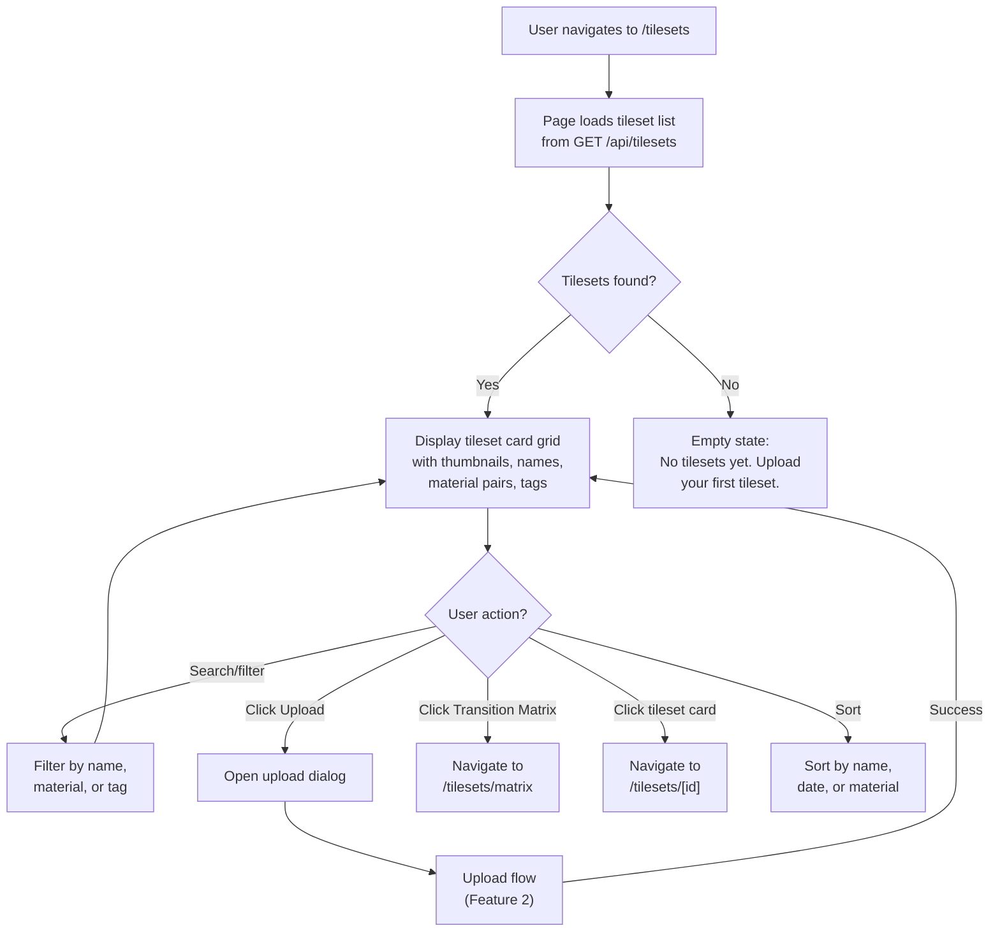
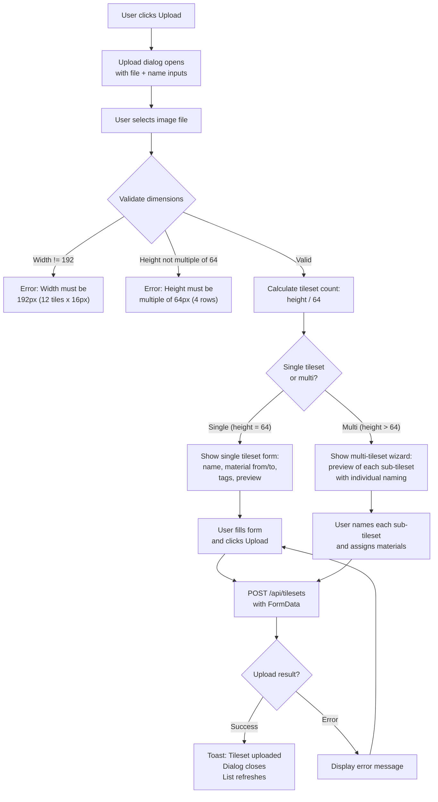
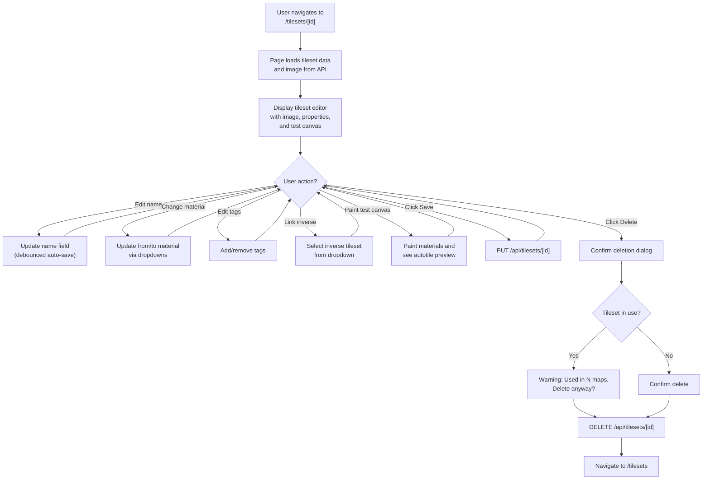
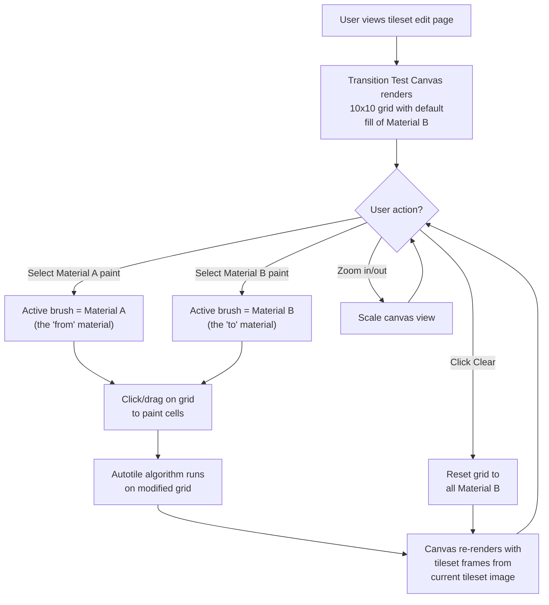
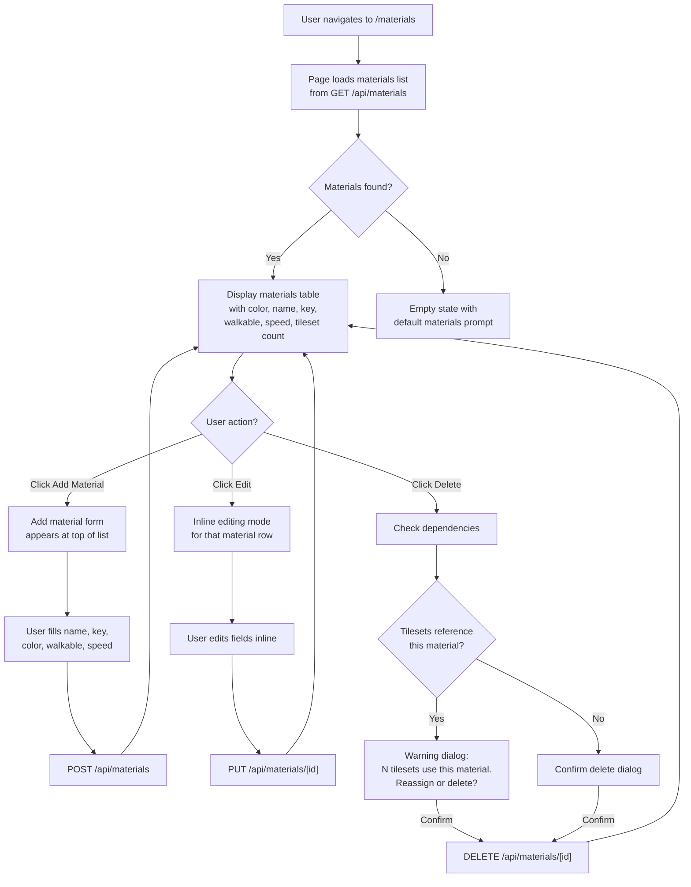
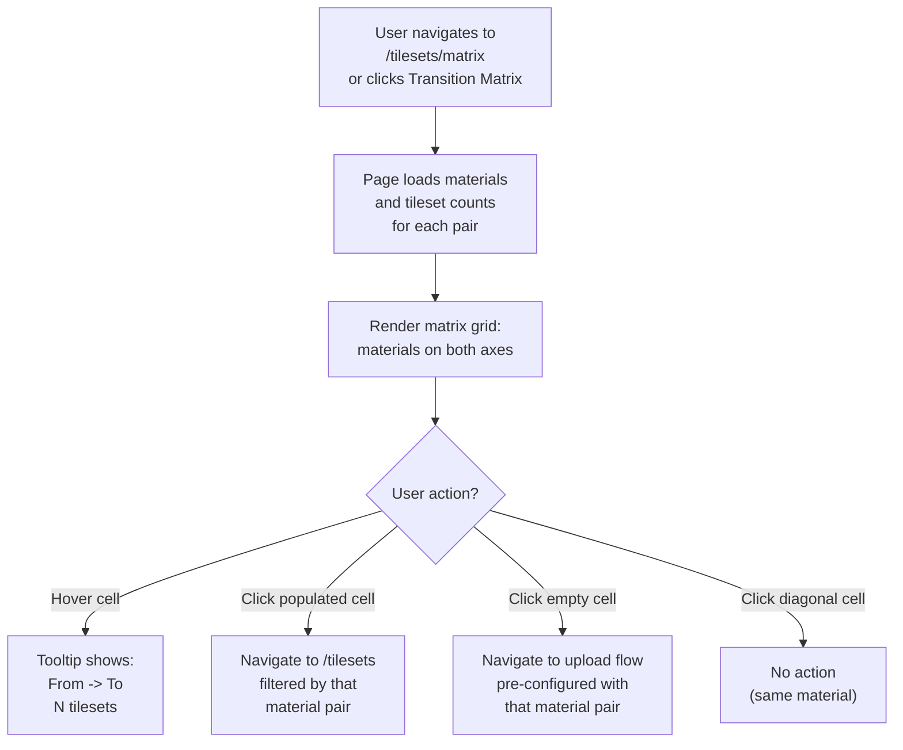
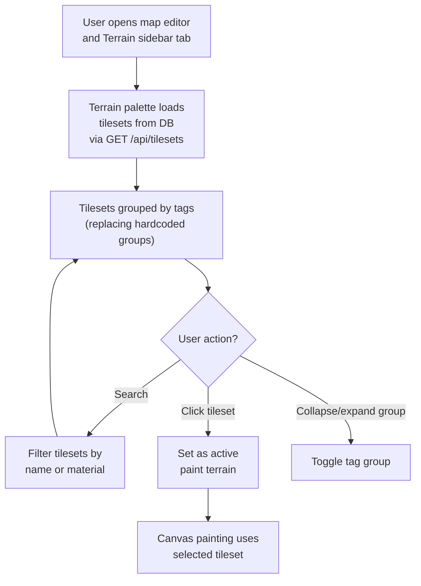

# UXRD-004: Tileset Management UI

**Version:** 1.0
**Date:** February 20, 2026
**Status:** Draft
**Author:** UI/UX Designer Agent

---

## Overview

### One-line Summary

A complete tileset management system for the Genmap editor comprising six interconnected pages -- tileset list, upload flow, tileset editor with embedded transition test canvas, materials management, transition matrix view, and map editor terrain palette integration -- enabling designers to upload, validate, tag, assign materials, preview autotile transitions, and track coverage of all material-to-material transitions.

### Background

The Genmap map editor currently uses hardcoded terrain definitions in `@nookstead/map-lib` (`packages/map-lib/src/core/terrain.ts`). There are 26 terrain types organized into 8 groups (Grassland, Water, Sand, Forest, Stone, Road, Props, Misc), each with a fixed PNG filename and manually assigned material relationships. This approach has four structural problems:

1. **No dynamic tileset management.** Adding a new terrain type requires modifying TypeScript source code (`terrain.ts`, `terrain-properties.ts`), rebuilding the map-lib package, and redeploying. There is no UI for uploading tileset images or configuring their properties.

2. **No material abstraction.** Material types (grass, water, sand, etc.) are implicit string constants embedded in `TilesetRelationship.from` and `TilesetRelationship.to` fields. There is no centralized material registry with color swatches, walkability, or speed modifiers -- those are duplicated in `terrain-properties.ts`.

3. **No transition coverage tracking.** Designers cannot see which material-to-material transitions exist and which are missing. This requires manual code inspection to identify gaps.

4. **No autotile preview.** There is no way to visually test how a tileset's 47 autotile variants render when painted onto a grid. Designers must deploy to the game client to verify transitions.

The Genmap editor already has established patterns for asset management: the Sprites list page (`/sprites`) uses a card grid with upload dialog, the Sprite detail page (`/sprites/[id]`) uses `AtlasZoneCanvas` for frame annotation, and the map editor sidebar uses `TerrainPalette` for terrain selection. This UXRD builds on those patterns.

### Related Documents

- **UXRD-003:** `docs/uxrd/uxrd-003-map-editor-photoshop-redesign.md` (Photoshop-style editor layout)
- **UXRD-002:** `docs/uxrd/uxrd-002-genmap-editor-ux-improvements.md` (editor UX improvements)
- **Existing terrain definitions:** `packages/map-lib/src/core/terrain.ts`
- **Autotile engine:** `packages/map-lib/src/core/autotile.ts`
- **Surface properties:** `packages/map-lib/src/core/terrain-properties.ts`
- **Terrain palette:** `apps/genmap/src/components/map-editor/terrain-palette.tsx`
- **Atlas zone canvas:** `apps/genmap/src/components/atlas-zone-canvas.tsx`
- **Sprite upload form:** `apps/genmap/src/components/sprite-upload-form.tsx`
- **Navigation:** `apps/genmap/src/components/navigation.tsx`
- **Design Doc:** To be created after UXRD approval

---

## Research Findings

### Industry Analysis: Tileset Management Tools

**RPG Maker (MV/MZ):**
- Tileset management via a dialog that lists tilesets with A/B/C/D/E tab pages.
- Each tileset has a name, preview image, and terrain tag table.
- Passage (walkability) and terrain tags are assigned per-tile via a grid overlay.
- No material abstraction or transition matrix concept.

**Tiled (Tilemap Editor):**
- Tilesets are imported from images with configurable tile dimensions.
- Auto-tiling uses "Wang tiles" or "terrain brushes" defined by the user.
- Wang sets have a grid of corner/edge assignments to color/terrain types.
- Terrain brush preview shows live painting in a small test area.
- No centralized material management -- terrains are per-tileset.

**LDtk (Level Designer Toolkit):**
- "Auto-Layer" rules define how tiles are placed based on IntGrid values.
- IntGrid values act as a material system (each value = a terrain type).
- Visual rule editor shows which tile patterns match which neighbor configurations.
- Preview canvas lets designers paint IntGrid values and see auto-layer results live.

**Pyxel Edit:**
- Tileset editor with grid overlay, tile index labels, and animation frame browser.
- Tile placement canvas for testing with configurable grid dimensions.
- No autotile or material transition system.

### Key UX Patterns Extracted

1. **Grid overlay on tileset images** is universal for frame identification. Frame indices or coordinates shown on hover.
2. **Live test canvas** (LDtk, Tiled) allows designers to paint two material types and see autotile results immediately. Critical for validation.
3. **Material-as-color** mapping (LDtk's IntGrid colors) provides instant visual recognition of terrain types in lists and palettes.
4. **Dimension validation on upload** with clear feedback about expected format is essential for tileset-specific constraints (12x4 grid, 16px tiles).
5. **Transition coverage matrix** (not found in existing tools) is a novel feature that enables gap analysis for material pairs.

---

## Feature 1: Tilesets List Page (`/tilesets`)

### User Flow



### Recommended UX Design

**Layout:**

```
+-------------------------------------------------------------------+
| Nookstead Genmap   [Sprites] [Objects] [Maps] [Templates] [Tiles] |
+-------------------------------------------------------------------+
|                                                                     |
|  Tileset Library                     [Transition Matrix] [Upload]  |
|                                                                     |
|  [Search tilesets...          ]  [Sort: Name v]                    |
|  [grass] [water] [sand] [stone] [road] [x clear all]              |
|                                                                     |
|  +----------+  +----------+  +----------+  +----------+            |
|  | +------+ |  | +------+ |  | +------+ |  | +------+ |            |
|  | |thumb | |  | |thumb | |  | |thumb | |  | |thumb | |            |
|  | |nail  | |  | |nail  | |  | |nail  | |  | |nail  | |            |
|  | +------+ |  | +------+ |  | +------+ |  | +------+ |            |
|  | water    |  | grass    |  | sand     |  | stone    |            |
|  | ->grass  |  | ->water  |  | ->grass  |  | ->road   |            |
|  | [grass]  |  | [water]  |  | [sand]   |  | [stone]  |            |
|  | 3 maps   |  | 7 maps   |  | 2 maps   |  | 0 maps   |            |
|  +----------+  +----------+  +----------+  +----------+            |
|                                                                     |
+-------------------------------------------------------------------+
```

**Specifications:**

- Page title: "Tileset Library" as h1, 2xl font-bold.
- Top-right actions: "Transition Matrix" button (outline variant), "Upload" button (primary variant).
- Search bar: Full width below title row, `Input` component with placeholder "Search tilesets by name, material, or tag...", debounced by 300ms.
- Tag filter chips: Horizontal row of `Badge` components below search bar. Chips represent distinct tags from the tileset collection. Active chips are `default` variant, inactive are `outline` variant. Clicking a chip toggles its filter state. "Clear all" link at the end when any filters are active.
- Sort dropdown: `Select` component aligned right of search, options: "Name (A-Z)", "Name (Z-A)", "Date Created (newest)", "Date Created (oldest)", "Material Pair".
- Card grid: Responsive `grid` layout -- 2 columns on small, 3 on md, 4 on lg, 5 on xl. Gap: 16px.

**Tileset Card:**

Each card is a clickable `Link` wrapping a `Card` component.

- Thumbnail (top): A compact 96x64px canvas rendering a representative subset of the tileset's 47 variants. Rendered using the SOLID_FRAME (center tile), 4 cardinal edge frames, and 4 corner frames arranged in a 3x3 mini-grid. Pixelated rendering. Background: checkerboard pattern.
- Tileset name: 14px font-medium, truncated with ellipsis at 1 line.
- Material pair: "From -> To" with small color swatch circles (12x12px) next to each material name. Font: 12px, `--muted-foreground` color.
- Tags: Up to 3 `Badge` components (variant: outline, size: sm). Overflow shows "+N more" text.
- Usage count: "N maps" in 11px `--muted-foreground` text.
- Hover state: Card lifts with `shadow-md` and border becomes `--primary` color (200ms transition).

**Empty state:**
- Centered vertically with illustration placeholder (Lucide `Mountain` icon at 48x48, `--muted-foreground`).
- Heading: "No tilesets yet" (18px font-semibold).
- Description: "Upload your first tileset image to start building terrain transitions." (14px `--muted-foreground`).
- Action button: "Upload Tileset" (primary variant).

### Component Structure

```
TilesetsPage (page.tsx)
  Internal state:
    searchQuery: string
    activeTagFilters: Set<string>
    sortField: 'name' | 'createdAt' | 'materialPair'
    sortDirection: 'asc' | 'desc'

  Data fetching:
    GET /api/tilesets?search={query}&tags={csv}&sort={field}&order={dir}

  Renders:
    Page header with actions
    Search input
    Tag filter chips
    Sort dropdown
    Grid of TilesetCard components
    Empty state (when no results)
    Upload dialog (Feature 2)
```

```
TilesetCard (new component)
  Props:
    tileset: {
      id: string
      name: string
      imageUrl: string
      fromMaterial: { key: string; name: string; color: string }
      toMaterial: { key: string; name: string; color: string }
      tags: string[]
      usageCount: number
      createdAt: string
    }

  Renders:
    Linked Card with thumbnail canvas, name, material pair, tags, usage count
```

### Keyboard / Mouse Interaction Map

| Input | Context | Action |
|---|---|---|
| Type | In search input | Filter tileset list (debounced 300ms) |
| Click | Tag chip | Toggle tag filter |
| Click | "Clear all" link | Remove all tag filters |
| Click | Sort dropdown | Open sort options |
| Click | Tileset card | Navigate to `/tilesets/[id]` |
| Click | "Upload" button | Open upload dialog |
| Click | "Transition Matrix" button | Navigate to `/tilesets/matrix` |
| Escape | Search input focused | Clear search query |

---

## Feature 2: Tileset Upload Flow

### User Flow



### Recommended UX Design

**Upload Dialog (single tileset):**

```
+-------------------------------------------+
|  Upload Tileset                       [x]  |
+-------------------------------------------+
|                                             |
|  Tileset Image (PNG, max 10MB)             |
|  [Choose file...]                          |
|                                             |
|  +---------------------------------------+ |
|  | Image Preview (192 x 64)              | |
|  | [12 cols x 4 rows grid overlay]       | |
|  |  Detected: 1 tileset, 48 frames       | |
|  |  Valid frames: 47/47  Empty: 1/1      | |
|  +---------------------------------------+ |
|                                             |
|  Name                                      |
|  [water_grass                    ]         |
|                                             |
|  From Material        To Material          |
|  [# Water    v]       [# Grass    v]       |
|                                             |
|  Tags                                      |
|  [nature] [transition] [+ Add tag]         |
|                                             |
|           [Cancel]  [Upload Tileset]        |
+-------------------------------------------+
```

**Specifications:**

- Dialog: `Dialog` component, max-width 600px.
- File input: Accepts `image/png` only. Max 10MB. On file select, validate dimensions immediately via `Image.onload`.
- Image preview: Full-width canvas with the tileset image rendered at actual size (or scaled to fit within 500px width). Grid overlay shows 12 columns x 4 rows per tileset. Pixelated rendering. Checkerboard background.
- Detection feedback: Below the preview, a text block in `--muted-foreground` stating: "Detected N tileset(s) in this image" where N = height / 64. Additionally: "Valid frames: X/47. Empty frames: Y/1." (Frame 0 should be empty; frames 1-47 should have non-transparent pixels.)
- Frame validation: Each frame is checked for non-transparent pixels. Valid frames get a green checkmark overlay on the preview grid. Empty frames that should have content get an amber warning overlay. The empty frame (index 0) should be transparent and gets no warning.
- Name input: Pre-populated from filename (without extension). Required field.
- Material dropdowns: Two `Select` components side by side. Each shows material options with a color swatch circle (12px) inline. Options sourced from `GET /api/materials`. If the desired material does not exist, a "Create new material..." option at the bottom opens the material creation inline form.
- Tags editor: Row of `Badge` components with remove (x) buttons. An `Input` field at the end with placeholder "Add tag". Enter to add tag. Autocomplete from existing tags via `GET /api/tilesets/tags`.
- Upload button: Disabled until file is selected, name is non-empty, and both materials are assigned.

**Multi-tileset upload wizard:**

When height > 64, the dialog expands to show a vertical list of detected sub-tilesets.

```
+-------------------------------------------+
|  Upload Tilesets (3 detected)         [x]  |
+-------------------------------------------+
|                                             |
|  Tileset Image (PNG, max 10MB)             |
|  terrain-pack.png (192x192)                |
|                                             |
|  Tileset 1 of 3                            |
|  +---------------------------------------+ |
|  | [Preview row 0-63]                    | |
|  +---------------------------------------+ |
|  Name: [water_grass        ]               |
|  From: [# Water v]  To: [# Grass v]       |
|  Tags: [nature] [+]                        |
|                                             |
|  Tileset 2 of 3                            |
|  +---------------------------------------+ |
|  | [Preview row 64-127]                  | |
|  +---------------------------------------+ |
|  Name: [grass_water        ]               |
|  From: [# Grass v]  To: [# Water v]       |
|  Tags: [nature] [+]                        |
|                                             |
|  ...                                       |
|                                             |
|  [Bulk Material Assignment]                |
|           [Cancel]  [Upload All]           |
+-------------------------------------------+
```

**Bulk material assignment wizard:**
- Accessible via "Bulk Material Assignment" button.
- Opens a sub-dialog or inline section.
- Shows a simplified form: "Apply From Material [Select] and To Material [Select] to all tilesets".
- Alternatively: "Auto-assign inverse pairs" checkbox -- if tileset N has from=A, to=B, auto-assign tileset N+1 as from=B, to=A.
- Apply button updates all sub-tileset forms at once.

**Dimension validation error states:**

| Condition | Error Message | Visual |
|---|---|---|
| Width != 192 | "Image width must be exactly 192px (12 tiles x 16px per tile). Current width: Npx." | Red `--destructive` text below file input. File input border turns red. |
| Height not multiple of 64 | "Image height must be a multiple of 64px (4 rows x 16px per tile). Current height: Npx." | Red `--destructive` text below file input. |
| Width = 192, height = 0 | "Image appears to be empty." | Red text. |

### Component Structure

```
TilesetUploadForm (new component)
  Props:
    onSuccess?: () => void
    preselectedFromMaterial?: string  // For matrix-initiated uploads
    preselectedToMaterial?: string

  Internal state:
    file: File | null
    imageElement: HTMLImageElement | null
    detectedCount: number
    frameValidation: { valid: number; empty: number; warnings: string[] }
    tilesetEntries: Array<{
      name: string
      fromMaterialId: string
      toMaterialId: string
      tags: string[]
    }>
    isUploading: boolean
    error: string | null

  Data fetching:
    GET /api/materials (for dropdowns)
    GET /api/tilesets/tags (for tag autocomplete)

  Renders:
    File input with validation
    Image preview canvas with grid overlay
    Detection feedback text
    Single form or multi-tileset list
    Material assignment dropdowns
    Tag editor
    Submit button
```

### Keyboard / Mouse Interaction Map

| Input | Context | Action |
|---|---|---|
| Click | File input | Open file browser |
| File selected | File input | Validate dimensions, show preview |
| Type | Name input | Update tileset name |
| Click | Material dropdown | Show material options |
| Enter | Tag input | Add tag |
| Backspace | Tag input (empty) | Remove last tag |
| Click | Tag (x) button | Remove that tag |
| Click | Upload button | Submit form |
| Escape | Dialog open | Close dialog |

---

## Feature 3: Tileset Edit Page (`/tilesets/[id]`)

### User Flow



### Recommended UX Design

**Layout:**

```
+-------------------------------------------------------------------+
| [<- Back to Tilesets]                                              |
|                                                                     |
| water_grass                    [Save] [Delete]                     |
+-------------------------------------------------------------------+
|                                                                     |
| +--- Tileset Image ---------+  +--- Properties ----------------+  |
| |                            |  |                                |  |
| | [192 x 64 canvas with     |  |  Name                         |  |
| |  12x4 grid overlay,       |  |  [water_grass           ]     |  |
| |  frame index labels,       |  |                                |  |
| |  hover highlight]          |  |  From Material                |  |
| |                            |  |  [# Water          v]         |  |
| +----------------------------+  |                                |  |
|                                 |  To Material                   |  |
| +--- Autotile Preview ------+  |  [# Grass          v]         |  |
| |                            |  |                                |  |
| | [8x6 grid of autotile     |  |  Inverse Tileset              |  |
| |  variants, rendered from   |  |  [grass_water       v]       |  |
| |  frames 1-47, each 16x16  |  |                                |  |
| |  scaled to 24x24]         |  |  Tags                         |  |
| |                            |  |  [nature] [transition] [+ ]   |  |
| +----------------------------+  |                                |  |
|                                 |  Validation                    |  |
|                                 |  [v] 47 frames valid           |  |
|                                 |  [v] Frame 0 is empty          |  |
|                                 |  [!] No inverse linked         |  |
|                                 +--------------------------------+  |
|                                                                     |
| +--- Transition Test Canvas ----+                                  |
| |                                |                                  |
| | [10x10 grid, 160x160 at 1x]   |                                  |
| | Two paint buttons: [A] [B]     |                                  |
| | [Clear] [Zoom -] [100%] [+]   |                                  |
| |                                |                                  |
| +--------------------------------+                                  |
|                                                                     |
+-------------------------------------------------------------------+
```

**Tileset Image Display:**

- Canvas component reusing the rendering approach from `AtlasZoneCanvas` (zoom, pan, grid overlay).
- Grid overlay: 12 columns x 4 rows, line color `rgba(255, 255, 255, 0.25)`, 1px lines.
- Frame index labels: On hover over a frame cell, show the frame index (0-47) in a tooltip or overlay label.
- Highlighted frame: Frame under cursor gets a 2px `--primary` border overlay.
- Click on a frame: Shows frame details in a popup (frame index, pixel coordinates, variant description).

**Properties Panel:**

- Name: `Input` component, required, debounced 300ms.
- From Material / To Material: `Select` components with color swatch inline. Options from `GET /api/materials`. Bottom option: "Create new material..." opens inline creation form.
- Inverse tileset: `Select` component listing tilesets that have the swapped material pair (to=current.from, from=current.to). "None" as default option. When linked, both tilesets reference each other.
- Tags: Same pattern as upload form -- inline `Badge` components with (x) remove, plus "Add tag" input.
- Validation results: List of check items using icons:
  - Green checkmark: "47 frames valid"
  - Green checkmark: "Frame 0 is empty (correct)"
  - Amber warning: "No inverse tileset linked" (if applicable)
  - Red X: "N frames appear empty" (if frames 1-47 have no pixels)

**Autotile Preview (compact grid):**

- An 8-column x 6-row grid displaying all 47 autotile variants plus the empty frame.
- Each cell: 24x24px, rendered from the tileset image using the frame coordinates (frame index -> column/row in 12x4 sheet).
- Frame index label below each cell in 9px `--muted-foreground` text.
- Hover: Cell gets 2px `--primary` border. Tooltip shows variant description (e.g., "Solid center", "T-junction open N", "L-corner NE").
- Background: Checkerboard behind each cell for transparency visibility.

### Component Structure

```
TilesetEditPage (page.tsx)
  Params: { id: string }

  Data fetching:
    GET /api/tilesets/[id]
    GET /api/materials
    GET /api/tilesets (for inverse linking dropdown)

  Internal state:
    tileset: Tileset
    isDirty: boolean
    isSaving: boolean
    validation: ValidationResult[]

  Renders:
    Page header with back link, name, save/delete buttons
    Two-column layout:
      Left: TilesetImageCanvas, AutotilePreview
      Right: Properties form
    TransitionTestCanvas (below, full width)
```

```
TilesetImageCanvas (new component)
  Props:
    imageUrl: string
    highlightedFrame: number | null
    onFrameHover: (frameIndex: number | null) => void
    onFrameClick: (frameIndex: number) => void

  Renders:
    Canvas with tileset image, 12x4 grid overlay, frame hover/selection
```

```
AutotilePreview (new component)
  Props:
    imageUrl: string
    tilesetImage: HTMLImageElement | null

  Renders:
    8x6 grid of 24x24 canvas cells, each showing one autotile variant
```

### Keyboard / Mouse Interaction Map

| Input | Context | Action |
|---|---|---|
| Click | Back link | Navigate to `/tilesets` |
| Type | Name input | Update name (debounced 300ms) |
| Click | Material dropdown | Show material options with color swatches |
| Click | Inverse tileset dropdown | Show compatible tilesets |
| Enter | Tag input | Add new tag |
| Click | Tag (x) button | Remove tag |
| Hover | Tileset image frame | Highlight frame, show index tooltip |
| Click | Tileset image frame | Show frame detail popup |
| Hover | Autotile preview cell | Show variant description tooltip |
| Ctrl+S | Anywhere | Save tileset |
| Click | Save button | Save tileset |
| Click | Delete button | Open confirmation dialog |

---

## Feature 4: Transition Test Canvas

### User Flow



### Recommended UX Design

**Layout (embedded in tileset edit page):**

```
+-------------------------------------------------------+
| TRANSITION TEST                                         |
+-------------------------------------------------------+
| Paint: [A: Water] [B: Grass]  |  [Clear]  [-] 200% [+] |
+-------------------------------------------------------+
|                                                         |
|  +---+---+---+---+---+---+---+---+---+---+             |
|  | B | B | B | B | B | B | B | B | B | B |             |
|  +---+---+---+---+---+---+---+---+---+---+             |
|  | B | B | A | A | A | B | B | B | B | B |             |
|  +---+---+---+---+---+---+---+---+---+---+             |
|  | B | A | A | A | A | A | B | B | B | B |             |
|  +---+---+---+---+---+---+---+---+---+---+             |
|  | B | A | A | A | A | A | A | B | B | B |             |
|  +---+---+---+---+---+---+---+---+---+---+             |
|  | B | B | A | A | A | A | B | B | B | B |             |
|  +---+---+---+---+---+---+---+---+---+---+             |
|  | B | B | B | A | A | B | B | B | B | B |             |
|  +---+---+---+---+---+---+---+---+---+---+             |
|  | B | B | B | B | B | B | B | B | B | B |             |
|  +---+---+---+---+---+---+---+---+---+---+             |
|  ...                                                    |
+-------------------------------------------------------+
```

**Specifications:**

- Grid dimensions: 10x10 cells. Each cell is 16x16 pixels at 1x zoom.
- Base canvas size: 160x160 pixels at 1x. Rendered into a scalable canvas container with zoom controls.
- Default zoom: 200% (320x320 CSS pixels).
- Zoom range: 100% to 600%, step 100%.
- Default state: All cells filled with Material B (the "to" material, background terrain).
- Paint brushes: Two toggle buttons labeled with material names and color swatches.
  - "A: [From Material]" -- paints the "from" material.
  - "B: [To Material]" -- paints the "to" material.
  - Active brush has `--primary` background. Inactive has `outline` variant.
  - Keyboard shortcuts: `1` for Material A, `2` for Material B (when canvas is focused).
- Click to paint: Single click paints the cell under the cursor with the active brush material.
- Drag to paint: Click and drag paints all cells the cursor passes over.
- Autotile recalculation: After each paint operation (mouseup), the autotile algorithm (`getFrame` from `@nookstead/map-lib`) runs on the entire 10x10 grid. Each cell stores a material type (A or B). The algorithm generates 8-neighbor masks for each cell and maps them to frame indices.
- Tile rendering: For cells painted as Material A, the current tileset's frame image is rendered (frame index from autotile). For cells painted as Material B, a solid color fill (material color) is used as background, or if an inverse tileset is linked, the inverse tileset's frame is rendered.
- Clear button: Resets all cells to Material B and re-runs autotile.
- Grid lines: 1px `rgba(255, 255, 255, 0.15)` between cells at all zoom levels.

**Visual feedback on seams:**
- After autotile runs, any cell where the resolved frame is ISOLATED_FRAME (47) or EMPTY_FRAME (0) when it should have neighbors gets a subtle amber outline (1px dashed `#f59e0b`) to highlight potential seam issues.

### Component Structure

```
TransitionTestCanvas (new component)
  Props:
    tilesetImage: HTMLImageElement | null
    inverseTilesetImage: HTMLImageElement | null
    fromMaterialColor: string
    toMaterialColor: string

  Internal state:
    grid: ('A' | 'B')[][]  // 10x10 grid
    frameGrid: number[][]   // 10x10 frame indices (computed)
    activeBrush: 'A' | 'B'
    zoom: number
    isPainting: boolean

  Methods:
    paintCell(row, col): void
    recalculateAutotile(): void
    clearGrid(): void

  Renders:
    Toolbar: paint buttons, clear, zoom controls
    Canvas: 10x10 grid with rendered tiles
```

### Keyboard / Mouse Interaction Map

| Input | Context | Action |
|---|---|---|
| Click | Material A button | Set active brush to A |
| Click | Material B button | Set active brush to B |
| 1 | Canvas focused | Set active brush to A |
| 2 | Canvas focused | Set active brush to B |
| Click | Grid cell | Paint cell with active brush |
| Click+Drag | Grid cells | Paint multiple cells |
| Click | Clear button | Reset grid to all Material B |
| Click | Zoom + | Increase zoom by 100% |
| Click | Zoom - | Decrease zoom by 100% |

---

## Feature 5: Materials Management Page (`/materials`)

### User Flow



### Recommended UX Design

**Layout:**

```
+-------------------------------------------------------------------+
| Nookstead Genmap   [Sprites] [Objects] [Maps] [Templates] [Tiles] |
+-------------------------------------------------------------------+
|                                                                     |
|  Materials                                       [Add Material]    |
|                                                                     |
|  +--- Material Palette (visual overview) -----+                   |
|  | [##] [##] [##] [##] [##] [##] [##] [##]    |                   |
|  |  gr   wa   sa   st   di   fo   ic   ro     |                   |
|  +---------------------------------------------+                   |
|                                                                     |
|  +-------+--------+--------+------+-------+----------+-----+       |
|  | Color | Name   | Key    | Walk | Speed | Tilesets | Act |       |
|  +-------+--------+--------+------+-------+----------+-----+       |
|  | [##]  | Grass  | grass  | [v]  | 1.0x  | 8        | [E] |       |
|  | [##]  | Water  | water  | [ ]  | 0.5x  | 5        | [E] |       |
|  | [##]  | Sand   | sand   | [v]  | 0.85x | 4        | [E] |       |
|  | [##]  | Stone  | stone  | [v]  | 1.0x  | 7        | [E] |       |
|  | ...   |        |        |      |       |          |     |       |
|  +-------+--------+--------+------+-------+----------+-----+       |
|                                                                     |
+-------------------------------------------------------------------+
```

**Material Palette (visual overview):**

- A horizontal row of 32x32px color swatches at the top.
- Each swatch shows the material's color as a filled rounded square.
- Material key abbreviated (2-3 chars) below each swatch in 9px text.
- Clicking a swatch scrolls to that material's row in the table.
- Provides instant visual overview of all materials in the system.

**Materials Table:**

- Columns: Color (swatch), Name, Key, Walkable (badge), Speed Modifier, Tileset Count, Actions.
- Color swatch: 20x20px rounded square filled with the material's color.
- Name: 14px font-medium.
- Key: 12px monospace, `--muted-foreground`.
- Walkable: `Badge` component -- green "Walkable" or red "Blocked".
- Speed: Formatted as "Nx" (e.g., "1.0x", "0.85x").
- Tileset count: Number with "tilesets" suffix. Clickable -- navigates to `/tilesets?material={key}` filtered view.
- Actions: Edit (Lucide `Pencil`, 14x14) and Delete (Lucide `Trash2`, 14x14) icon buttons.

**Add Material Form (appears above table):**

```
+-------------------------------------------------------------------+
|  +--------+--------------------+-----+------+-------+-----------+  |
|  | Color  | Name               | Key | Walk | Speed | Actions   |  |
|  | [pick] | [New material name]| auto| [v]  | [1.0] | [v] [x]  |  |
|  +--------+--------------------+-----+------+-------+-----------+  |
```

- Color: Color picker (`Input` type="color") with 20x20 preview swatch.
- Name: `Input`, required. On change, auto-generates key (lowercase, underscores for spaces, strip special chars).
- Key: Auto-generated from name. Shown as read-only `Input` with monospace text. Can be manually overridden via a small "edit" icon toggle.
- Walkable: `Checkbox` component, default checked.
- Speed: `Input` type="number", min 0, max 2, step 0.05, default 1.0.
- Actions: Confirm (checkmark) and Cancel (x) icon buttons.

**Inline Edit Mode:**

- Clicking Edit on a row replaces static text with input fields (same layout as add form).
- Confirm saves via `PUT /api/materials/[id]`.
- Cancel reverts to static display.
- Only one row can be in edit mode at a time.

**Delete Dependency Warning:**

```
+-------------------------------------------+
|  Delete Material                      [x]  |
+-------------------------------------------+
|                                             |
|  Are you sure you want to delete "Water"?  |
|                                             |
|  [!] This material is used by 5 tilesets:  |
|  - water_grass (from: Water)               |
|  - grass_water (to: Water)                 |
|  - light_sand_water (to: Water)            |
|  - deep_water_water (from: Deep Water)     |
|  - deep_water_water (to: Water)            |
|                                             |
|  These tilesets will have their material    |
|  references cleared.                        |
|                                             |
|           [Cancel]  [Delete Anyway]         |
+-------------------------------------------+
```

### Component Structure

```
MaterialsPage (page.tsx)
  Data fetching:
    GET /api/materials (with tileset counts)

  Internal state:
    materials: Material[]
    editingId: string | null
    isAdding: boolean

  Renders:
    Page header with Add button
    MaterialPalette (visual swatch row)
    MaterialsTable with inline edit/add
    Delete confirmation dialog
```

```
MaterialPalette (new component)
  Props:
    materials: Material[]
    onMaterialClick: (id: string) => void

  Renders:
    Horizontal row of color swatches with abbreviated names
```

### Keyboard / Mouse Interaction Map

| Input | Context | Action |
|---|---|---|
| Click | Add Material button | Show add form at top of table |
| Enter | In add/edit form | Save material |
| Escape | In add/edit form | Cancel editing |
| Click | Edit icon on row | Enter inline edit mode for that row |
| Click | Delete icon on row | Open delete confirmation dialog |
| Click | Tileset count | Navigate to filtered tilesets list |
| Click | Color swatch in palette | Scroll to material row in table |

---

## Feature 6: Transition Matrix View (`/tilesets/matrix`)

### User Flow



### Recommended UX Design

**Layout:**

```
+-------------------------------------------------------------------+
| [<- Back to Tilesets]                                              |
|                                                                     |
| Transition Matrix                                                  |
| Coverage: 18/42 pairs (43%)  Missing: 24 pairs                    |
|                                                                     |
|        | grass | water | sand | stone | dirt | forest | ice | road |
| -------+-------+-------+------+-------+------+--------+-----+------+
| grass  |  ---  |   2   |  1   |   0   |  1   |   0    |  0  |  0   |
| water  |   2   |  ---  |  0   |   0   |  0   |   0    |  0  |  0   |
| sand   |   1   |  1    | ---  |   0   |  0   |   0    |  0  |  0   |
| stone  |   0   |  0    |  0   |  ---  |  0   |   0    |  0  |  0   |
| dirt   |   1   |  0    |  0   |   0   | ---  |   0    |  0  |  0   |
| forest |   3   |  0    |  0   |   0   |  0   |  ---   |  0  |  0   |
| ice    |   0   |  0    |  0   |   0   |  0   |   0    | --- |  0   |
| road   |   0   |  0    |  0   |   0   |  0   |   0    |  0  | ---  |
+-------+-------+-------+------+-------+------+--------+-----+------+
```

**Specifications:**

- Page header: "Transition Matrix" as h1. Below it, a coverage summary line: "Coverage: N/M pairs (P%). Missing: X pairs." in 14px `--muted-foreground`.
- Matrix table: HTML `<table>` with sticky header row and sticky first column.
- Row/column headers: Material name with 16x16 color swatch inline. 12px font-medium. Background: `--muted`.
- Cell content: Tileset count as a number. Centered text.
- Cell colors:
  - Diagonal cells (same material): Background `--muted`, text "---", non-interactive.
  - Populated cells (count > 0): Background `hsl(142 76% 36% / 0.15)` (green tint), text in `--foreground`. Hover: background darkens to `hsl(142 76% 36% / 0.3)`.
  - Empty cells (count = 0): Background `hsl(0 84% 60% / 0.1)` (red tint), text "0" in `--muted-foreground`. Hover: background becomes `hsl(0 84% 60% / 0.2)`, cursor changes to pointer.
- Cell size: Minimum 64x40px per cell. Text centered.
- Tooltip on hover: "From [Material A] to [Material B]: N tileset(s)".
- Click populated cell: Navigate to `/tilesets?from={materialKey}&to={materialKey}`.
- Click empty cell: Navigate to `/tilesets/upload?from={materialKey}&to={materialKey}` (opens upload flow pre-configured with those materials).

**Coverage summary:**

- Total possible pairs: N materials x (N-1) unique pairs (excluding diagonal).
- Coverage percentage: pairs with count > 0 / total pairs.
- Visual indicator: A thin progress bar below the summary text, green fill for coverage percentage.

### Component Structure

```
TransitionMatrixPage (page.tsx)
  Data fetching:
    GET /api/tilesets/matrix
    Returns: { materials: Material[], matrix: { fromKey: string, toKey: string, count: number }[] }

  Internal state:
    materials: Material[]
    matrixData: Map<string, Map<string, number>>
    coverage: { total: number, covered: number, percentage: number }

  Renders:
    Page header with back link and coverage summary
    Coverage progress bar
    Matrix table
```

### Keyboard / Mouse Interaction Map

| Input | Context | Action |
|---|---|---|
| Click | Back link | Navigate to `/tilesets` |
| Hover | Matrix cell | Show tooltip with material pair and count |
| Click | Populated cell (count > 0) | Navigate to filtered tileset list |
| Click | Empty cell (count = 0) | Navigate to upload flow pre-configured for that pair |
| Tab | Matrix table | Move between interactive cells |
| Enter | Focused cell | Same as click |

---

## Feature 7: Map Editor Terrain Palette Integration

### User Flow



### Recommended UX Design

**Updated Terrain Palette layout:**

```
+----------------------------+
| TERRAIN                [x] |
+----------------------------+
| [Search terrain...     ]   |
+----------------------------+
| v Nature (8)               |
|   [##] water_grass         |
|    Water -> Grass           |
|   [##] grass_water          |
|    Grass -> Water           |
|   [##] deep_water_water    |
|    Deep Water -> Water      |
| v Stone (7)                |
|   [##] light_stone         |
|    Light Stone -> Grass    |
|   ...                      |
| v Road (2)                 |
|   ...                      |
| v Uncategorized (3)        |
|   ...                      |
+----------------------------+
```

**Specifications:**

- Search input: Full width, 28px height, placeholder "Search terrain...", debounced 300ms. Client-side filter by tileset name, material from/to names.
- Groups: Tilesets grouped by their first tag (or "Uncategorized" if no tags). Each group header shows tag name and count, collapsible (same chevron pattern as current `TerrainPalette`).
- Tileset items: Each item shows:
  - Canvas swatch (24x24) rendered from the SOLID_FRAME of the tileset image (same as current `TerrainItem`).
  - Tileset name in 12px font-medium.
  - Material pair "From -> To" in 10px `--muted-foreground` with inline 10x10 color swatch circles.
- Active state: Selected tileset has `ring-2 ring-primary bg-accent` (same pattern as current).
- Data source change: Instead of importing from `@nookstead/map-lib` TILESETS constant, fetch from `GET /api/tilesets` on panel mount. Cache results in component state.
- Tileset image loading: Load tileset images on demand (lazy load when a group is expanded). Cache loaded `HTMLImageElement` instances in a `Map<string, HTMLImageElement>`.

**Migration notes:**
- The existing `TerrainPalette` component hard-imports from `@nookstead/map-lib`: `TERRAINS`, `TILESETS`, `SOLID_FRAME`, and `TerrainType`.
- The updated version will replace these with API-sourced data.
- The `useTilesetImages` hook currently loads images from static file paths based on `TERRAIN_NAMES`. It will need to be updated to load from tileset image URLs.
- The `MapEditorState.activeTerrainKey` will continue to be a string key, but the key format may change from `terrain-NN` to UUID-based or slug-based keys depending on the DB schema.

### Component Structure

```
TerrainPalette (updated component)
  Props:
    state: MapEditorState
    dispatch: Dispatch<MapEditorAction>

  Internal state:
    tilesets: Tileset[]
    tilesetImages: Map<string, HTMLImageElement>
    searchQuery: string
    openGroups: Set<string>
    isLoading: boolean

  Data fetching:
    GET /api/tilesets (on mount)

  Renders:
    Search input
    Grouped tileset list (by first tag)
    TerrainItem for each tileset
```

### Keyboard / Mouse Interaction Map

| Input | Context | Action |
|---|---|---|
| Type | Search input | Filter tilesets (debounced 300ms) |
| Click | Group header | Toggle group expand/collapse |
| Click | Tileset item | Set as active terrain |
| Escape | Search focused | Clear search |

---

## Navigation Updates

### Updated Navigation Bar

The main navigation (`apps/genmap/src/components/navigation.tsx`) needs two new entries:

| Current | Updated |
|---|---|
| Sprites, Objects, Maps, Templates | Sprites, Objects, Maps, Templates, **Tilesets**, **Materials** |

**Implementation:**

```typescript
const navItems = [
  { href: '/sprites', label: 'Sprites' },
  { href: '/objects', label: 'Objects' },
  { href: '/maps', label: 'Maps' },
  { href: '/templates', label: 'Templates' },
  { href: '/tilesets', label: 'Tilesets' },    // NEW
  { href: '/materials', label: 'Materials' },  // NEW
];
```

**Responsive note:** On smaller screens (< 768px), if 6 nav items overflow, they should wrap to a second line or collapse into a hamburger menu. Current implementation does not handle overflow, so this is a follow-up concern.

---

## Accessibility Requirements

### WCAG Compliance

- **Target Level:** WCAG 2.1 AA

### ARIA Requirements

| Component | Role | aria-label | Other ARIA attributes |
|---|---|---|---|
| Tilesets search | `searchbox` | "Search tilesets" | -- |
| Tag filter chip | `checkbox` | Tag name | `aria-checked` |
| Tileset card | `link` | Tileset name | -- |
| Upload dialog | `dialog` | "Upload tileset" | `aria-modal="true"` |
| Material dropdown | `listbox` | "Select material" | `aria-expanded` |
| Materials table | `table` | "Materials list" | -- |
| Add material form | `form` | "Add new material" | -- |
| Transition matrix | `table` | "Material transition matrix" | -- |
| Matrix cell (interactive) | `button` | "From [A] to [B]: N tilesets" | -- |
| Matrix cell (diagonal) | `cell` | "Same material: [A]" | `aria-disabled="true"` |
| Transition test canvas | `application` | "Transition test canvas" | `aria-roledescription="paint grid"` |
| Paint brush toggle A | `radio` | "Paint material A: [name]" | `aria-checked` |
| Paint brush toggle B | `radio` | "Paint material B: [name]" | `aria-checked` |
| Terrain search (editor) | `searchbox` | "Search terrain" | -- |
| Tag editor input | `combobox` | "Add tag" | `aria-autocomplete="list"` |

### Keyboard Navigation

| Key | Context | Action |
|---|---|---|
| Tab | Tilesets page | Cycle: Search -> Tag chips -> Sort -> Cards -> Upload button |
| Enter | Focused tileset card | Navigate to tileset edit page |
| Space | Tag filter chip | Toggle filter |
| Tab | Materials page | Cycle: Add button -> Palette swatches -> Table rows -> Actions |
| Enter | Focused table row action | Activate edit/delete |
| Escape | Add/edit form | Cancel and close form |
| Tab | Transition matrix | Move between interactive cells (skip diagonal) |
| Enter | Focused matrix cell | Navigate to filtered list or upload |
| 1 / 2 | Test canvas focused | Switch paint brush |
| Arrow keys | Test canvas focused | Move highlighted cell |
| Space | Test canvas focused, cell highlighted | Paint highlighted cell |

### Screen Reader Considerations

- Tag filter changes announce "Filtered by [tag names]" or "All filters cleared" via `aria-live="polite"` region.
- Upload validation results announced via `aria-live="assertive"` when file is selected: "Image validated: N tilesets detected, X valid frames."
- Material add/edit form changes announced: "Material saved" or "Material deleted" via toast (which uses `role="alert"`).
- Transition matrix coverage announced on page load: "Coverage: N of M pairs, P percent."
- Test canvas paint actions not announced (canvas interaction is visual-only; keyboard alternative uses arrow keys + space).

### Color and Contrast

- Material color swatches always have a 1px `--border` outline to distinguish from background (important for light colors like white/yellow).
- Matrix cell colors (green/red tints) use background color only; the cell content (number) meets 4.5:1 contrast against the tinted background.
- Walkable/Blocked badges use green (#22c55e on white) and red (#ef4444 on white) which meet 4.5:1 contrast.
- Color is never the sole indicator: populated matrix cells show a number, empty cells show "0", diagonal cells show "---". Color tint is supplementary.

---

## Responsive Behavior

### Breakpoints

| Breakpoint | Width | Layout Changes |
|---|---|---|
| Small | < 640px | Tileset cards: 1 column. Materials table: stacked card layout (no table). Matrix: horizontally scrollable. Test canvas: min zoom, full width. |
| Medium | 640px - 1024px | Tileset cards: 2 columns. Materials table: abbreviated columns (hide Speed, Tilesets). Matrix: fits with smaller cells (48x36px). |
| Desktop | > 1024px | Full layout as designed. Tileset cards: 4-5 columns. Full table and matrix. |

### Small Viewport Behavior

- Tileset cards stack in a single column with full-width cards.
- Materials table converts to a card-based layout: each material is a horizontal card with swatch, name, key, and action buttons.
- Transition matrix is wrapped in a horizontally scrollable container with sticky first column and header row.
- Test canvas fills the full viewport width with a minimum zoom of 100%.
- Upload dialog becomes a full-screen modal (mobile pattern from existing shadcn/ui Dialog).

### Desktop-Specific Behavior

- Hover states on all cards, buttons, and matrix cells.
- Full keyboard shortcut support.
- Tileset edit page uses side-by-side layout (image + properties).
- Multi-column card grids.

---

## Content and Microcopy

### UI Text

| Element | Text | Notes |
|---|---|---|
| Page title - Tilesets | "Tileset Library" | Main heading |
| Page title - Materials | "Materials" | Main heading |
| Page title - Matrix | "Transition Matrix" | Main heading |
| Upload button | "Upload Tileset" | Primary action |
| Matrix button | "Transition Matrix" | Outline action |
| Search placeholder - Tilesets | "Search tilesets by name, material, or tag..." | |
| Search placeholder - Terrain | "Search terrain..." | In map editor sidebar |
| Empty state heading | "No tilesets yet" | When list is empty |
| Empty state body | "Upload your first tileset image to start building terrain transitions." | |
| Upload dialog title (single) | "Upload Tileset" | |
| Upload dialog title (multi) | "Upload Tilesets (N detected)" | N = number of sub-tilesets |
| Detection text (single) | "Detected 1 tileset in this image" | |
| Detection text (multi) | "Detected N tilesets in this image" | |
| Frame validation | "Valid frames: X/47. Empty frames: Y/1." | |
| Material pair display | "[From] -> [To]" | Arrow character: -> |
| Walkable badge - yes | "Walkable" | Green badge |
| Walkable badge - no | "Blocked" | Red badge |
| Speed display | "Nx" | e.g., "1.0x", "0.85x" |
| Coverage summary | "Coverage: N/M pairs (P%). Missing: X pairs." | |
| Matrix diagonal | "---" | Same-material cells |
| Test canvas title | "TRANSITION TEST" | 11px uppercase |
| Paint button A | "A: [Material Name]" | |
| Paint button B | "B: [Material Name]" | |
| Clear button | "Clear" | Resets test canvas |
| Delete warning - unused | "Are you sure you want to delete \"[Name]\"?" | |
| Delete warning - in use | "This material is used by N tilesets:" | Followed by list |
| Save success toast | "Tileset saved" | Via sonner toast |
| Upload success toast | "Tileset uploaded successfully" | |
| Delete success toast | "Tileset deleted" | |
| Material save toast | "Material saved" | |
| Material delete toast | "Material deleted" | |

### Validation Messages

| Field | Validation | Error Message | Success Message |
|---|---|---|---|
| Tileset image width | Must be 192px | "Image width must be exactly 192px (12 tiles x 16px). Current: Npx." | N/A |
| Tileset image height | Must be multiple of 64 | "Image height must be a multiple of 64px (4 rows x 16px). Current: Npx." | N/A |
| Tileset name | Non-empty | "Tileset name is required." | N/A |
| From material | Must be selected | "Select a From material." | N/A |
| To material | Must be selected | "Select a To material." | N/A |
| From/To same | Must differ | "From and To materials must be different." | N/A |
| Material name | Non-empty | "Material name is required." | N/A |
| Material key | Non-empty, unique | "Key is required." / "This key already exists." | N/A |
| Material speed | 0-2 range | "Speed must be between 0 and 2." | N/A |
| Material color | Valid hex | "Select a valid color." | N/A |

### Placeholder Text

| Field | Placeholder | Notes |
|---|---|---|
| Tileset name | Auto-populated from filename | Pre-filled on file select |
| Material name | "e.g., Deep Water" | In add form |
| Material key | Auto-generated from name | Read-only by default |
| Tag input | "Add tag" | In tileset forms |

---

## Animation and Transitions

### Transitions

| Element | Trigger | Duration | Easing | Effect |
|---|---|---|---|---|
| Tileset card hover | Mouse enter/leave | 200ms | ease | Shadow and border color change |
| Tag chip filter | Click | 150ms | ease-out | Background color toggle |
| Upload dialog | Open/close | 200ms | ease-in-out | Fade + scale (shadcn/ui default) |
| Material inline edit | Enter/exit edit mode | 150ms | ease | Height expand, inputs fade in |
| Matrix cell hover | Mouse enter/leave | 100ms | ease | Background color darken |
| Test canvas paint | Click | 0ms | none | Instant cell color change |
| Test canvas autotile | After paint | ~16ms | none | Rendered on next animation frame |
| Delete dialog | Open/close | 200ms | ease-in-out | Fade + scale |
| Sort change | Reorder | 200ms | ease-in-out | Cards fade and reposition |

### Motion Preferences

- **Reduced Motion:** When `prefers-reduced-motion: reduce` is active:
  - Card hover effects are instant (no shadow animation).
  - Dialog open/close is instant (no fade/scale).
  - Sort reorder is instant (no position animation).
  - All other transitions are removed.
  - Test canvas painting remains instant (already no animation).

---

## Design System Integration

### Components from Design System

| Feature Component | Library Component | Customization Needed |
|---|---|---|
| Tileset card | shadcn/ui `Card` | Hover state with shadow and border change |
| Search input | shadcn/ui `Input` | Standard with search icon |
| Tag filter chips | shadcn/ui `Badge` | Toggle behavior (not default) |
| Sort dropdown | shadcn/ui `Select` | Standard |
| Upload dialog | shadcn/ui `Dialog` | Standard with custom body |
| File input | shadcn/ui `Input` (type="file") | Standard |
| Material dropdown | shadcn/ui `Select` | Custom option renderer with color swatch |
| Tags editor | Custom | Inline badges + input, no library match |
| Color picker | HTML `Input` (type="color") + custom swatch | Custom integration |
| Materials table | HTML `<table>` | Custom, not shadcn Table (inline edit needs custom rows) |
| Add/edit form inputs | shadcn/ui `Input`, `Checkbox` | Standard |
| Delete dialog | shadcn/ui `AlertDialog` | Standard |
| Matrix table | HTML `<table>` | Custom -- color-coded cells, sticky headers |
| Coverage progress bar | shadcn/ui `Progress` | Standard |
| Transition test canvas | Custom `<canvas>` | Fully custom -- interactive paint grid |
| Toast notifications | `sonner` (existing) | Standard |
| Tooltip | shadcn/ui `Tooltip` | Standard |
| Autotile preview grid | Custom | Grid of mini canvas cells |
| Tileset image canvas | Custom (based on `AtlasZoneCanvas` patterns) | Reuse zoom/pan/grid logic |

### Design Tokens

| Token Type | Token Name | Value/Usage |
|---|---|---|
| Color | `--primary` | Active states, focus rings, hover borders |
| Color | `--destructive` | Error messages, delete buttons |
| Color | `--muted` | Table headers, empty state backgrounds |
| Color | `--muted-foreground` | Secondary text, placeholders |
| Color | `--border` | Card borders, table borders, grid lines |
| Color | `--accent` | Hover backgrounds on interactive elements |
| Color | `--card` | Card backgrounds |
| Color | `--background` | Page background |
| Spacing | 16px | Card grid gap, form field spacing |
| Spacing | 8px | Compact spacing in table cells, badge margins |
| Typography | 2xl (24px) | Page titles |
| Typography | 14px | Body text, card names |
| Typography | 12px | Secondary text, keys, material pairs |
| Typography | 11px | Compact labels (matrix, test canvas toolbar) |
| Typography | 9px | Abbreviations (palette), frame indices |
| Radius | `--radius` | Cards, badges, buttons (from shadcn defaults) |

### Custom Components Required

- [ ] `TilesetCard`: Card with canvas thumbnail, name, material pair, tags, usage count. Needed because no design system card handles canvas-rendered thumbnails with this specific content layout.
- [ ] `TilesetUploadForm`: Upload form with dimension validation, multi-tileset detection, material assignment. Too complex and domain-specific for a generic form component.
- [ ] `TilesetImageCanvas`: Canvas displaying tileset image with 12x4 grid overlay and frame hover interaction. Reuses patterns from `AtlasZoneCanvas` but with different grid logic.
- [ ] `AutotilePreview`: Grid of mini canvas cells showing all 47 autotile variants. Novel component with no design system equivalent.
- [ ] `TransitionTestCanvas`: Interactive 10x10 paint grid with autotile calculation and tile rendering. Fully custom interactive canvas.
- [ ] `MaterialPalette`: Horizontal color swatch row for visual material overview. Simple but specific to this domain.
- [ ] `TagEditor`: Inline tag management with badges, remove buttons, and autocomplete input. Reusable across tileset and other forms.

---

## API Endpoints Required

The following new API endpoints are needed to support the tileset management UI. These will be implemented as Next.js App Router API routes in `apps/genmap/src/app/api/`.

| Method | Path | Purpose |
|---|---|---|
| GET | `/api/tilesets` | List tilesets with optional search, tag filter, material filter, sort |
| POST | `/api/tilesets` | Upload tileset image + metadata (FormData) |
| GET | `/api/tilesets/[id]` | Get single tileset with full details |
| PUT | `/api/tilesets/[id]` | Update tileset metadata (name, materials, tags, inverse link) |
| DELETE | `/api/tilesets/[id]` | Delete tileset (with usage check) |
| GET | `/api/tilesets/tags` | Get distinct tags across all tilesets |
| GET | `/api/tilesets/matrix` | Get transition matrix data (material pairs with counts) |
| GET | `/api/materials` | List all materials (with tileset counts) |
| POST | `/api/materials` | Create new material |
| PUT | `/api/materials/[id]` | Update material |
| DELETE | `/api/materials/[id]` | Delete material (with dependency check) |

---

## Data Model Summary

The following database tables are implied by the UI design. Final schema definition belongs in the Design Doc.

**`materials` table:**
- `id` (UUID, PK)
- `name` (string, unique)
- `key` (string, unique, slug-formatted)
- `color` (string, hex color)
- `walkable` (boolean)
- `speed_modifier` (float, 0-2)
- `created_at`, `updated_at` (timestamps)

**`tilesets` table:**
- `id` (UUID, PK)
- `name` (string)
- `image_url` (string, S3 URL)
- `image_width` (int, always 192)
- `image_height` (int, multiple of 64)
- `from_material_id` (UUID, FK -> materials)
- `to_material_id` (UUID, FK -> materials)
- `inverse_tileset_id` (UUID, nullable, FK -> tilesets, self-referential)
- `tags` (string[], array)
- `created_at`, `updated_at` (timestamps)

---

## Resolved Items

- [x] **Navigation placement:** Tilesets and Materials get separate top-level nav items.
- [x] **Tileset image format:** 12 columns x 4 rows per sub-tileset, 16px tile size, width=192px, height=multiple of 64px.
- [x] **Material data source:** New `materials` table in database, not hardcoded.
- [x] **Test canvas dimensions:** 10x10 grid (160x160px at 1x).
- [x] **Matrix click behavior:** Populated cells navigate to filtered list, empty cells navigate to upload flow with pre-selected materials.
- [x] **Terrain palette migration:** Fetch from API instead of hardcoded constants, grouped by first tag.

## Undetermined Items

- [ ] **Tileset versioning:** Should tilesets support version history (re-upload with same name)? Current design assumes immutable uploads with separate edit page.
- [ ] **Material merge:** If two materials are effectively duplicates, should there be a merge UI? Current design only supports delete with dependency warnings.
- [ ] **Batch tag operations:** Should the tilesets list page support batch tag assignment to multiple tilesets at once? Current design only supports per-tileset tagging.
- [ ] **Map editor backward compatibility:** How to handle maps that reference old `terrain-NN` keys when switching to DB-sourced tilesets? Requires a migration strategy for existing map data.

_Discuss with stakeholders until this section is empty, then delete after confirmation._

---

## Appendix

### File Reference

All files mentioned in this document use absolute paths from the repository root (`D:\git\github\nookstead\server\`):

| File | Description |
|---|---|
| `apps/genmap/src/components/navigation.tsx` | Top navigation bar (to be updated with new items) |
| `apps/genmap/src/components/sprite-upload-form.tsx` | Existing upload form pattern to follow |
| `apps/genmap/src/components/atlas-zone-canvas.tsx` | Canvas with zoom/pan/grid -- pattern for TilesetImageCanvas |
| `apps/genmap/src/components/map-editor/terrain-palette.tsx` | Current terrain palette (to be updated for API data) |
| `apps/genmap/src/app/(app)/sprites/page.tsx` | Sprites list page (card grid pattern to follow) |
| `apps/genmap/src/app/(editor)/maps/[id]/page.tsx` | Map editor page (consumes terrain palette) |
| `packages/map-lib/src/core/terrain.ts` | Current hardcoded terrain definitions (to be replaced) |
| `packages/map-lib/src/core/autotile.ts` | Autotile algorithm (used by test canvas) |
| `packages/map-lib/src/core/terrain-properties.ts` | Surface properties (migrating to materials table) |

### New Files to Create

| File | Purpose |
|---|---|
| `apps/genmap/src/app/(app)/tilesets/page.tsx` | Tilesets list page |
| `apps/genmap/src/app/(app)/tilesets/[id]/page.tsx` | Tileset edit page |
| `apps/genmap/src/app/(app)/tilesets/matrix/page.tsx` | Transition matrix page |
| `apps/genmap/src/app/(app)/materials/page.tsx` | Materials management page |
| `apps/genmap/src/components/tileset-card.tsx` | Tileset card component |
| `apps/genmap/src/components/tileset-upload-form.tsx` | Tileset upload form with validation |
| `apps/genmap/src/components/tileset-image-canvas.tsx` | Canvas with tileset grid overlay |
| `apps/genmap/src/components/autotile-preview.tsx` | 47-variant autotile preview grid |
| `apps/genmap/src/components/transition-test-canvas.tsx` | Interactive paint+autotile test |
| `apps/genmap/src/components/material-palette.tsx` | Visual swatch row for materials |
| `apps/genmap/src/components/tag-editor.tsx` | Reusable tag editor with autocomplete |
| `apps/genmap/src/app/api/tilesets/route.ts` | Tilesets list + create API |
| `apps/genmap/src/app/api/tilesets/[id]/route.ts` | Tileset CRUD API |
| `apps/genmap/src/app/api/tilesets/tags/route.ts` | Tileset tags API |
| `apps/genmap/src/app/api/tilesets/matrix/route.ts` | Transition matrix API |
| `apps/genmap/src/app/api/materials/route.ts` | Materials list + create API |
| `apps/genmap/src/app/api/materials/[id]/route.ts` | Material CRUD API |
| `apps/genmap/src/hooks/use-tilesets.ts` | Data fetching hook for tilesets |
| `apps/genmap/src/hooks/use-materials.ts` | Data fetching hook for materials |

### Existing Files to Modify

| File | Changes |
|---|---|
| `apps/genmap/src/components/navigation.tsx` | Add "Tilesets" and "Materials" nav items |
| `apps/genmap/src/components/map-editor/terrain-palette.tsx` | Replace hardcoded terrain imports with API data fetching |
| `apps/genmap/src/components/map-editor/use-tileset-images.ts` | Update to load images from API URLs instead of static paths |

### Glossary

- **Tileset:** A sprite sheet image containing 48 frames (12 columns x 4 rows) of 16x16 pixel tiles representing autotile variants for a terrain transition between two materials.
- **Autotile:** An algorithm that automatically selects the correct tile frame based on neighboring cell types, producing smooth terrain transitions. This project uses the Blob-47 variant with 8-neighbor bitmask and diagonal gating.
- **Material:** A terrain surface type (e.g., grass, water, sand) with associated properties (color, walkability, speed modifier). Materials are the endpoints of tileset transitions.
- **Transition:** The visual blending between two materials at their boundary. A tileset defines how material A transitions into material B.
- **Inverse Tileset:** A paired tileset that represents the same transition in reverse (material B transitioning into material A).
- **Transition Matrix:** A grid showing all possible material pairs (from x to) and how many tilesets exist for each pair. Used for coverage analysis.
- **SOLID_FRAME:** Frame index 1 in a tileset, representing the fully surrounded center tile (all 8 neighbors present). Used as the representative thumbnail.
- **ISOLATED_FRAME:** Frame index 47, representing a single isolated tile with no matching neighbors.
- **Blob-47:** The specific autotile algorithm producing 47 unique tile configurations from 8-neighbor masks with diagonal gating.
